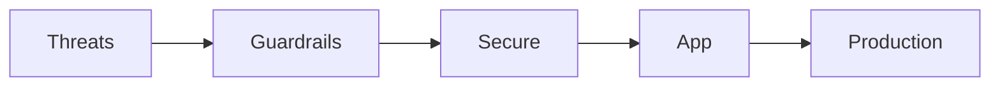

# AI Security & Guardrails

> Threat modeling, guardrails, secure tools, app security, and production safety.

**Prerequisites:** [Prompt Engineering](../prompt-engineering/README.md) · [AI Agents](../ai-agents/README.md)  
**Unlocks:** [AI Deployment](../ai-deployment/README.md)

Start with a section hub below (or expand the topic in the left sidebar).

---

## Sections

| # | Section | What you will learn | Hub |
|---|---------|---------------------|-----|
| 1 | **Threats** | Security section | [threats/](threats/README.md) |
| 2 | **Guardrails** | Security section | [guardrails/](guardrails/README.md) |
| 3 | **Secure Tools** | Security section | [secure-tools/](secure-tools/README.md) |
| 4 | **App Security** | Security section | [app-security/](app-security/README.md) |
| 5 | **Production** | Security section | [production/](production/README.md) |

---

## Hierarchy

### Threats

| # | Topic |
|---|-------|
| 1 | [LLM Threat Model](threats/01-llm-threat-model.md) |
| 2 | [Prompt Injection and Jailbreaks](threats/02-prompt-injection-and-jailbreaks.md) |
| 3 | [Introduction to AI Safety](threats/03-introduction-to-ai-safety.md) |

### Guardrails

| # | Topic |
|---|-------|
| 1 | [Guardrail Layers](guardrails/01-guardrail-layers.md) |
| 2 | [Guardrails and Content Filtering](guardrails/02-guardrails-and-content-filtering.md) |

### Secure Tools

| # | Topic |
|---|-------|
| 1 | [Secure Tool Use](secure-tools/01-secure-tool-use.md) |
| 2 | [Safe Tool Use](secure-tools/02-safe-tool-use.md) |

### App Security

| # | Topic |
|---|-------|
| 1 | [Authentication and Authorization for AI](app-security/01-authentication-authorization-for-ai.md) |
| 2 | [Security for AI Backends](app-security/02-security-for-ai-backends.md) |

### Production

| # | Topic |
|---|-------|
| 1 | [Production AI Safety Checklist](production/01-production-ai-safety-checklist.md) |
| 2 | [Red Teaming](production/02-red-teaming.md) |
| 3 | [Monitoring Abuse](production/03-monitoring-abuse.md) |

---

## Definition

**AI security & guardrails** protect LLM systems against injection, misuse, data leakage, and unsafe tool actions.

---

## Related topics

- [Domains overview](../README.md)
- [Master Index](../../meta/indexes/MASTER-INDEX.md)
