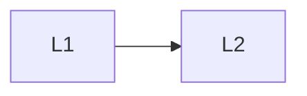

# App Security

> Section of the **ai-security-guardrails** handbook.

## Lessons

| # | Lesson |
|---|--------|
| 1 | [Authentication and Authorization for AI](01-authentication-authorization-for-ai.md) |
| 2 | [Security for AI Backends](02-security-for-ai-backends.md) |

**Topic hub:** [../README.md](../README.md)
