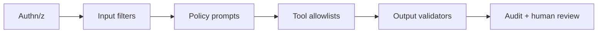

# Guardrail Layers

> Defense in depth for generative systems.

## Definition

Effective guardrails stack: authentication/authz, input validation/filters, prompt/policy constraints, tool allowlists, output validation (schemas, PII, policy), rate limits, and human review for high risk.

## Why it matters

A single model-based moderator is not enough. Combine deterministic checks with model judges where needed.

## How it works

## Key principles

1. **Deterministic first** — Schemas, allowlists, regex/PII.
2. **Fail closed on side effects** — Block when unsure.
3. **Log refusals** — Tune without opening holes.

## Common applications

| Application | Description |
|-------------|-------------|
| Chat | PII redaction |
| RAG | Citation required |
| Agents | Approval for writes |

## Common mistakes

- Only a system prompt saying 'be safe'
- Output filter after irreversible tool call

## Further reading

- [Secure tool use](secure-tool-use.md)
- [AI Safety](../ai-safety/README.md)
