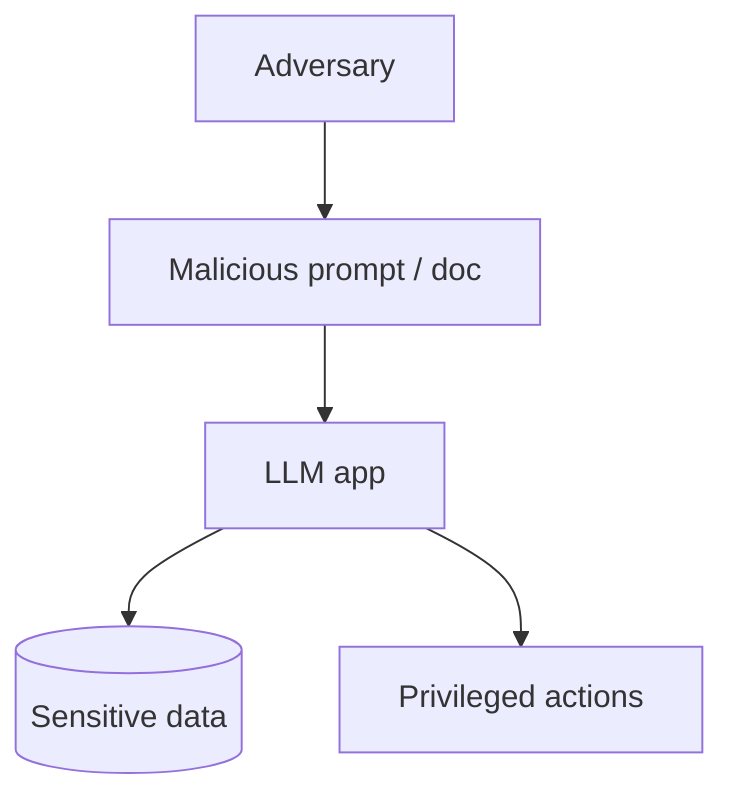

# Threat Model for LLM Apps

> Who attacks what — and what you must protect.

## Definition

LLM apps expand the attack surface: untrusted text becomes instructions; tools become privileged actuators; retrieved docs can carry indirect injection. Threat modeling lists assets (data, credentials, actions), adversaries, and controls.

## Why it matters

Without a threat model, teams bolt on a toxicity filter and miss the real risks (account takeover via tools, data exfil via prompts).

## How it works

## Key principles

1. **Untrusted content is code** — Treat docs/uploads as hostile.
2. **Separate instructions vs data** — Hard boundaries in prompts + parsers.
3. **Least privilege tools** — Per-user authz always.

## Common applications

| Application | Description |
|-------------|-------------|
| Support bots | KB poisoning |
| Agents | Confused deputy tools |
| RAG | Indirect injection in PDFs |

## Common mistakes

- Trusting 'the model will refuse'
- Shared tool credentials across tenants

## Further reading

- [AI Safety](../ai-safety/README.md)
- [Guardrail layers](guardrail-layers.md)
