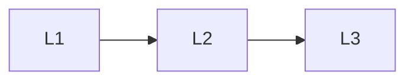

# Production

> Section of the **ai-security-guardrails** handbook.

## Lessons

| # | Lesson |
|---|--------|
| 1 | [Production AI Safety Checklist](01-production-ai-safety-checklist.md) |
| 2 | [Red Teaming](02-red-teaming.md) |
| 3 | [Monitoring Abuse](03-monitoring-abuse.md) |

**Topic hub:** [../README.md](../README.md)
