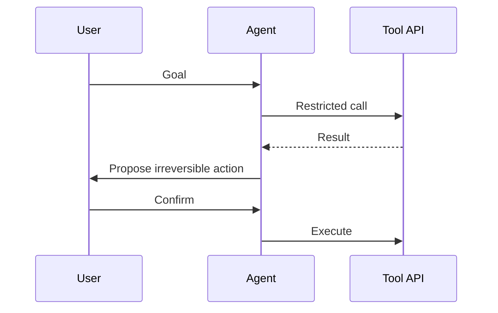

# Secure Tool Use

> How to let models call tools without handing over the kingdom.

## Definition

Tools should be typed, authenticated as the user, allowlisted, rate-limited, and preferably idempotent. High-impact actions require confirmation or out-of-band approval. Arguments must be validated like any public API.

## Why it matters

Most catastrophic LLM incidents will be tool incidents.

## How it works

## Key principles

1. **User-scoped credentials** — Never god-mode API keys in the agent.
2. **Confirm irreversible acts** — Delete/pay/email externally.
3. **Argument validation** — JSON schema + server checks.

## Common applications

| Application | Description |
|-------------|-------------|
| MCP tools | Careful server exposure |
| Browser tools | Domain allowlists |
| DB tools | Read-only roles by default |

## Common mistakes

- Exposing raw SQL/shell tools broadly
- Trusting model-chosen URLs without SSRF controls

## Further reading

- [MCP](../mcp/README.md)
- [AI Agents](../ai-agents/README.md)
