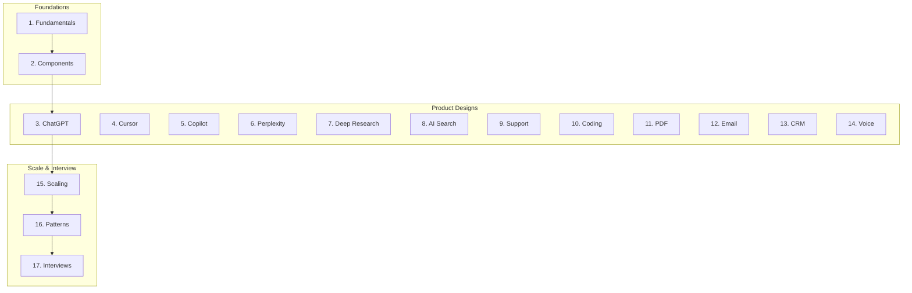

# Phase 11: AI System Design

> The largest interview preparation module — end-to-end architecture for ChatGPT-class, Copilot-class, and enterprise AI systems.
> **Prerequisites:** [Phase 10 Evaluation](../ai-evaluation/README.md) · [Phase 7 RAG](../rag/README.md) · [Phase 8 Agents](../ai-agents/README.md)

---

## Module Overview

**Unlocks:** [Phase 12 Production AI](../ai-deployment/README.md)

---

## Documents (17 Sections)

| # | Topic | Document |
|---|-------|----------|
| 1 | Fundamentals | [ai-system-design-fundamentals.md](ai-system-design-fundamentals.md) |
| 2 | Common Components | [common-ai-components.md](common-ai-components.md) |
| 3 | ChatGPT-like | [design-chatgpt-like-system.md](design-chatgpt-like-system.md) |
| 4 | Cursor-like | [design-cursor-like-system.md](design-cursor-like-system.md) |
| 5 | GitHub Copilot | [design-github-copilot.md](design-github-copilot.md) |
| 6 | Perplexity | [design-perplexity-ai-search.md](design-perplexity-ai-search.md) |
| 7 | Deep Research | [design-deep-research-system.md](design-deep-research-system.md) |
| 8 | AI Search Engine | [design-ai-search-engine.md](design-ai-search-engine.md) |
| 9 | Customer Support | [design-ai-customer-support.md](design-ai-customer-support.md) |
| 10 | Coding Assistant | [design-ai-coding-assistant.md](design-ai-coding-assistant.md) |
| 11 | PDF Chat | [design-ai-pdf-chat.md](design-ai-pdf-chat.md) |
| 12 | Email Assistant | [design-ai-email-assistant.md](design-ai-email-assistant.md) |
| 13 | CRM Assistant | [design-ai-crm-assistant.md](design-ai-crm-assistant.md) |
| 14 | Voice Agent | [design-ai-voice-agent.md](design-ai-voice-agent.md) |
| 15 | Scaling | [scaling-ai-systems.md](scaling-ai-systems.md) |
| 16 | Patterns | [ai-architecture-patterns.md](ai-architecture-patterns.md) |
| 17 | Interviews | [ai-system-design-interviews.md](ai-system-design-interviews.md) |

**Comparisons:** [ai-system-design-comparison-guides.md](ai-system-design-comparison-guides.md)

---

## Cheat Sheets

- [System Design Interview](../../cheat-sheets/ai-system-design-interview-cheat-sheet.md)
- [Capacity Estimation](../../cheat-sheets/ai-capacity-estimation-cheat-sheet.md)
- [Latency Budget](../../cheat-sheets/ai-latency-budget-cheat-sheet.md)
- [Architecture Selection](../../cheat-sheets/ai-architecture-selection-cheat-sheet.md)

---

## Learning Path

1. Fundamentals + components (1–2)
2. Pick 2–3 product designs relevant to your domain (3–14)
3. Scaling + patterns (15–16)
4. Practice interviews (17)

---

## See Also

- [Master Index](../../meta/indexes/MASTER-INDEX.md)
- [Production AI (Phase 12)](../ai-deployment/README.md)
