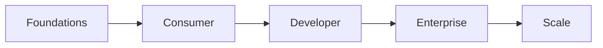

# AI System Design

> Interview-ready designs for consumer, developer, and enterprise AI products.

**Prerequisites:** [LLM Application Development](../llm-application-development/README.md) · [RAG](../rag/README.md)  
**Unlocks:** [AI Deployment](../ai-deployment/README.md) · [MLOps & LLMOps](../mlops-llmops/README.md)

Start with a section hub below (or expand the topic in the left sidebar).

---

## Sections

| # | Section | What you will learn | Hub |
|---|---------|---------------------|-----|
| 1 | **Foundations** | Components and patterns | [foundations/](foundations/README.md) |
| 2 | **Consumer Products** | Chat, search, research | [consumer-products/](consumer-products/README.md) |
| 3 | **Developer Tools** | IDE, copilots, PDF | [developer-tools/](developer-tools/README.md) |
| 4 | **Enterprise Assistants** | Support, email, CRM, voice | [enterprise-assistants/](enterprise-assistants/README.md) |
| 5 | **Scale & Interviews** | Scaling and interview craft | [scale-and-interviews/](scale-and-interviews/README.md) |

```mermaid
flowchart LR
  S1[Foundations] --> S2[Consumer] --> S3[Developer] --> S4[Enterprise] --> S5[Scale]
```

---

## Hierarchy

### Foundations

| # | Topic |
|---|-------|
| 1 | [Ai System Design Fundamentals](foundations/01-ai-system-design-fundamentals.md) |
| 2 | [Common Ai Components](foundations/02-common-ai-components.md) |
| 3 | [Ai Architecture Patterns](foundations/03-ai-architecture-patterns.md) |

### Consumer Products

| # | Topic |
|---|-------|
| 1 | [Design Chatgpt Like System](consumer-products/01-design-chatgpt-like-system.md) |
| 2 | [Design Perplexity Ai Search](consumer-products/02-design-perplexity-ai-search.md) |
| 3 | [Design Ai Search Engine](consumer-products/03-design-ai-search-engine.md) |
| 4 | [Design Deep Research System](consumer-products/04-design-deep-research-system.md) |

### Developer Tools

| # | Topic |
|---|-------|
| 1 | [Design Cursor Like System](developer-tools/01-design-cursor-like-system.md) |
| 2 | [Design Github Copilot](developer-tools/02-design-github-copilot.md) |
| 3 | [Design Ai Coding Assistant](developer-tools/03-design-ai-coding-assistant.md) |
| 4 | [Design Ai Pdf Chat](developer-tools/04-design-ai-pdf-chat.md) |

### Enterprise Assistants

| # | Topic |
|---|-------|
| 1 | [Design Ai Customer Support](enterprise-assistants/01-design-ai-customer-support.md) |
| 2 | [Design Ai Email Assistant](enterprise-assistants/02-design-ai-email-assistant.md) |
| 3 | [Design Ai Crm Assistant](enterprise-assistants/03-design-ai-crm-assistant.md) |
| 4 | [Design Ai Voice Agent](enterprise-assistants/04-design-ai-voice-agent.md) |

### Scale & Interviews

| # | Topic |
|---|-------|
| 1 | [Scaling Ai Systems](scale-and-interviews/01-scaling-ai-systems.md) |
| 2 | [Ai System Design Interviews](scale-and-interviews/02-ai-system-design-interviews.md) |
| 3 | [Ai System Design Comparison Guides](scale-and-interviews/03-ai-system-design-comparison-guides.md) |

---

## Definition

**AI system design** is end-to-end architecture for LLM products: components, tradeoffs, scale, and interview communication.

---

## Related topics

- [Domains overview](../README.md)
- [Master Index](../../meta/indexes/MASTER-INDEX.md)
