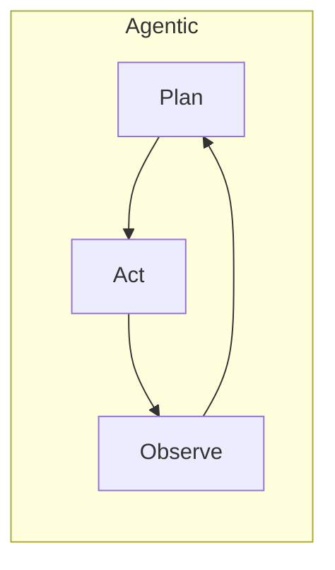

# AI Architecture Patterns

## Overview

Section **16**.

| Pattern | AI use case |
|---------|-------------|
| **Request-response** | Sync chat, completions |
| **Event-driven** | Index on upload; async eval |
| **Pipeline** | Ingest → chunk → embed → index |
| **Agentic** | Tool loop with state machine |
| **Pub/Sub** | Fan-out notifications; multi-agent |
| **Microservices** | Separate retrieval, inference, agents |
| **Modular monolith** | FastAPI modules; start here |
| **CQRS** | Write indexing vs read query paths |

## Selection Guide

- **MVP** → modular monolith + queue
- **Team scale** → extract retrieval service
- **High throughput ingest** → event-driven pipeline

## Tradeoffs

Microservices add network latency — avoid premature split.

## Navigation

- [System Design Interviews](ai-system-design-interviews.md)

---

## Changelog

| Version | Date | Changes |
|---------|------|---------|
| 1.0 | 2026-07-13 | Initial publication |
