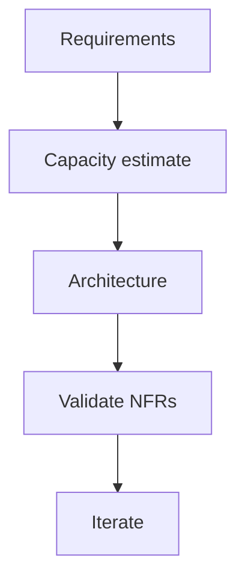

# AI System Design Fundamentals

## Overview

Section **1** — the largest interview preparation module in the playbook.

> AI system design is the discipline of architecting end-to-end LLM applications with explicit tradeoffs for latency, cost, reliability, and quality.

## AI System Design Principles

1. **Separate concerns** — API, orchestration, retrieval, inference, storage
2. **Budget latency early** — LLM calls dominate; parallelize retrieval
3. **Budget cost per request** — tokens × price × steps
4. **Design for failure** — provider outages, timeouts, hallucinations
5. **Observability by default** — trace every LLM/RAG/agent step
6. **Evaluate continuously** — golden sets gate deploys



## Requirements Gathering

| Type | Examples |
|------|----------|
| **Functional** | Chat, search, tool use, streaming |
| **Non-functional** | p95 latency, availability, cost/request |
| **Constraints** | Data residency, no training on user data |
| **Assumptions** | 10K DAU, avg 5 turns/session |

## Capacity Estimation

```
Peak QPS = DAU × sessions/day × turns/session / 86400 × peak_factor
LLM tokens/day = requests × (input_tokens + output_tokens)
Embed QPS = index_updates/day + query_embed_rate
```

Example: 100K DAU, 3 sessions, 8 turns, peak 3× → ~28 QPS average, ~85 peak.

## Latency Budgeting

| Component | Typical budget (chat) |
|-----------|----------------------|
| API + auth | 20–50 ms |
| Retrieval | 100–300 ms |
| LLM TTFT | 200–800 ms |
| Tool calls | 200–2000 ms each |
| **E2E target** | < 3s p95 simple; < 10s agent |

## Cost Budgeting

`cost/request = Σ(model_tokens × price) + embed + vector_search + tools + infra_amortized`

Set alerts at 2× expected; route cheap model for classification.

## Architecture Patterns

- **RAG pipeline** — retrieve → generate
- **Agent loop** — plan → tool → observe
- **Router** — classify intent → specialist model/path
- **Multi-model** — small model filters, large model answers

## Build vs Buy

| Build | Buy (API/SaaS) |
|-------|----------------|
| Custom RAG/agents | Foundation models |
| Orchestration | Vector DB managed |
| Eval harness | Auth (Clerk, Auth0) |

## Vendor Selection

- Model: quality, latency, price, data policy
- Vector DB: scale, hybrid search, ops burden
- Observability: LLM-native tracing

## Scalability Principles

- Stateless API tier; horizontal scale
- Async workers for indexing, eval, long agents
- Cache embeddings and frequent queries

## Availability & Fault Tolerance

- Multi-provider fallback for LLM
- Circuit breakers on tools
- Graceful degradation (cached answers, shorter context)

## Interview Preparation

**Q: Design a chat system for 1M users.**

> Estimate QPS, latency budget per layer, conversation store (Postgres), Redis session cache, streaming SSE, rate limits, multi-region read replicas, eval on deploy.

## Navigation

- [Common AI Components](common-ai-components.md)

---

## Changelog

| Version | Date | Changes |
|---------|------|---------|
| 1.0 | 2026-07-13 | Initial publication |
