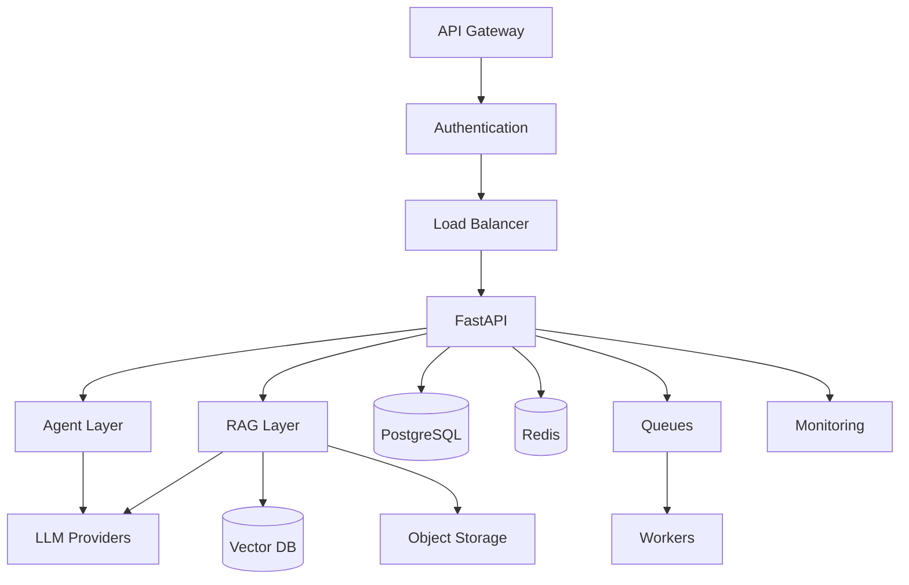

# Common AI System Components

## Overview

Section **2** of Phase 11 — the reference stack for production AI applications.

## Component Responsibilities

| Component | Responsibility | Why it exists |
|-----------|----------------|---------------|
| **API Gateway** | Routing, TLS termination, global rate limits | Single edge; DDoS protection |
| **Authentication** | JWT/OAuth, tenant ID | Identity for ACL and billing |
| **Load Balancer** | Distribute to API replicas | Horizontal scale |
| **FastAPI** | HTTP/SSE, validation, orchestration | Async Python AI services |
| **Agent Layer** | Tool loop, state, planning | Multi-step tasks |
| **RAG Layer** | Embed, retrieve, rerank, assemble | Grounded answers |
| **Vector DB** | ANN search, metadata filters | Semantic retrieval |
| **PostgreSQL** | Users, conversations, metadata | ACID, relational data |
| **Redis** | Session, cache, rate limit counters | Sub-ms reads |
| **Queues** | Index jobs, async agents, eval | Decouple burst load |
| **Object Storage** | PDFs, uploads, index snapshots | Cheap blob storage |
| **Monitoring** | Metrics, traces, alerts | Operate in production |
| **LLM Providers** | Inference API | Core intelligence |

## Request Lifecycle

1. Client → Gateway → Auth → LB → FastAPI
2. Load session from Redis; ACL check
3. Route: chat / RAG / agent path
4. Optional retrieval → context assembly
5. LLM call (stream or complete)
6. Persist turn to Postgres; update cache
7. Emit metrics/trace

## Tradeoffs

| Choice | Pro | Con |
|--------|-----|-----|
| Monolith FastAPI | Simple ops | Scale all layers together |
| Separate retrieval service | Independent scale | Network hop |
| Sync indexing | Consistency | Slow uploads |

## Failure Handling

- LLM timeout → retry once → fallback message
- Vector DB slow → cache hit or keyword fallback
- Queue backlog → scale workers

## Navigation

- [Design: ChatGPT-like System](design-chatgpt-like-system.md)

---

## Changelog

| Version | Date | Changes |
|---------|------|---------|
| 1.0 | 2026-07-13 | Phase 11 Section 2 |
