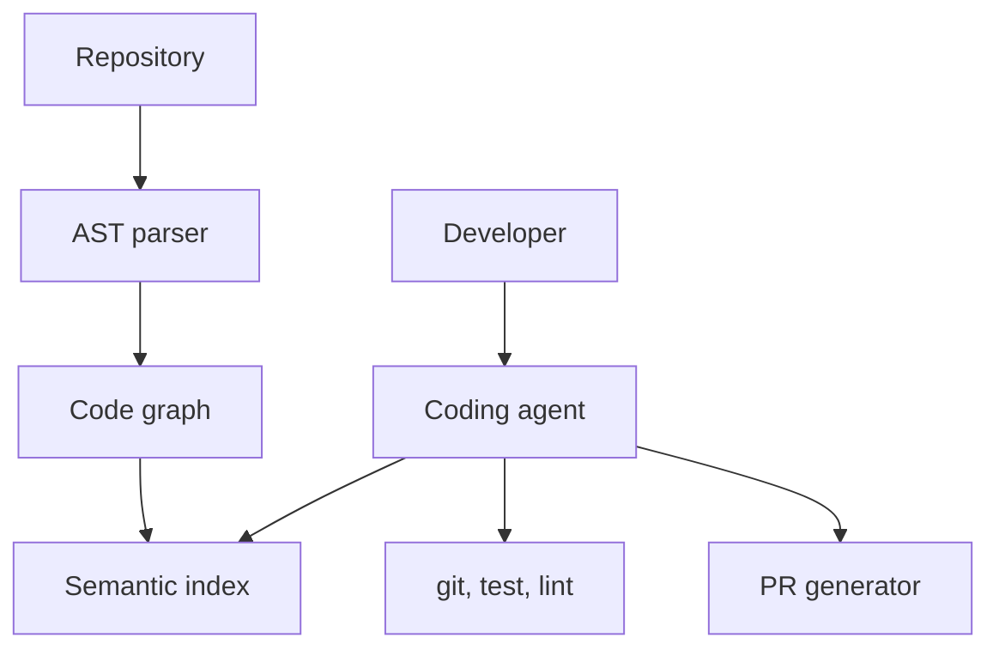

# Design: AI Coding Assistant

## Problem Statement

General-purpose coding assistant beyond inline complete — refactor, review, generate PRs across repos.

## Architecture

## Capabilities

| Feature | Approach |
|---------|----------|
| **AST parsing** | tree-sitter per language |
| **Code graph** | defs, refs, call graph |
| **Semantic search** | embed functions/classes |
| **Refactoring** | symbol-aware edits |
| **Multi-file** | graph neighborhood retrieval |
| **Code review** | diff + policy rules + LLM |
| **PR generation** | branch, commits, description template |

## Evaluation

- Unit test pass rate on generated code
- Human accept rate on diffs

## Navigation

- [AI PDF Chat](design-ai-pdf-chat.md)

---

## Changelog

| Version | Date | Changes |
|---------|------|---------|
| 1.0 | 2026-07-13 | Phase 11 Section 10 |
