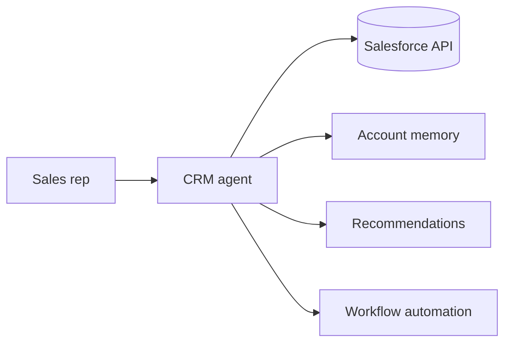

# Design: AI CRM Assistant

## Problem Statement

Help sales teams with account intelligence, next-best-action, and automated CRM updates.

## Architecture

## Components

- **Customer profiles** — aggregate emails, calls, deals
- **Memory** — long-term account narrative
- **Opportunity tracking** — stage suggestions, risk flags
- **Recommendations** — similar won deals, talk tracks
- **Workflow** — log calls, update fields via tools (HITL)

## Evaluation

- Forecast accuracy proxy; rep time saved

## Navigation

- [Voice Agent](design-ai-voice-agent.md)

---

## Changelog

| Version | Date | Changes |
|---------|------|---------|
| 1.0 | 2026-07-13 | Phase 11 Section 13 |
