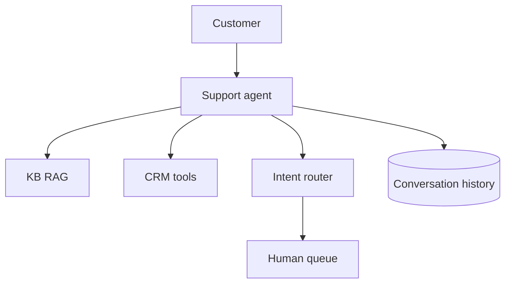

# Design: AI Customer Support

## Problem Statement

Resolve tier-1 support with KB grounding, CRM tools, and human escalation.

## Functional Requirements

- Chat/email channel
- Ticket create/update via tools
- Order lookup, refund policy Q&A
- Escalate to human with summary

## Architecture

## Components

- **Ticket routing** — intent classifier → queue
- **Memory** — customer profile + past tickets
- **Tool calling** — read-only default; write with approval
- **Evaluation** — resolution rate, CSAT, escalation rate

## Security

- Tenant isolation; PII redaction in logs

## Navigation

- [AI Coding Assistant](design-ai-coding-assistant.md)

---

## Changelog

| Version | Date | Changes |
|---------|------|---------|
| 1.0 | 2026-07-13 | Initial publication |
