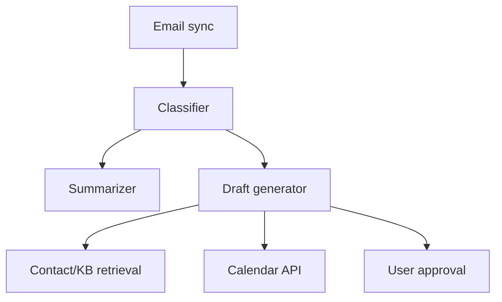

# Design: AI Email Assistant

## Problem Statement

Triage inbox, draft replies, schedule meetings — with user approval before send.

## Architecture

## Components

- **Ingestion** — Gmail/Outlook webhooks; incremental sync
- **Classification** — urgent, FYI, action required
- **Draft generation** — tone matching from sent history
- **Calendar** — propose slots via tool call

## Security

- OAuth scopes minimal; never auto-send without confirm

## Navigation

- [CRM Assistant](design-ai-crm-assistant.md)

---

## Changelog

| Version | Date | Changes |
|---------|------|---------|
| 1.0 | 2026-07-13 | Phase 11 Section 12 |
