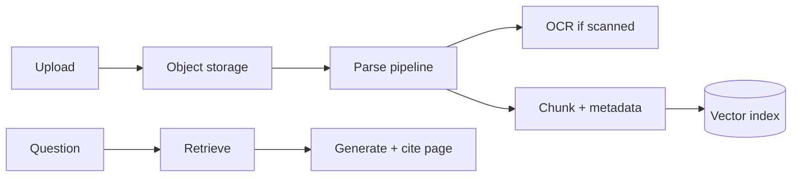

# Design: AI PDF Chat

## Problem Statement

Chat with uploaded PDFs including scanned docs, tables, and 500+ page files.

## Architecture

## Components

- **PDF ingestion** — PyMuPDF, unstructured.io
- **OCR** — Tesseract / cloud OCR for scans
- **Tables** — extract as markdown/CSV chunks
- **Images** — caption via vision model; separate index
- **Citations** — page + bounding box in metadata
- **Long docs** — hierarchical summarize + retrieve

## Tradeoffs

| Page-level chunks | Semantic chunks |
|-------------------|-------------------|
| Precise cites | Better semantics |

## Navigation

- [Email Assistant](design-ai-email-assistant.md)

---

## Changelog

| Version | Date | Changes |
|---------|------|---------|
| 1.0 | 2026-07-13 | Phase 11 Section 11 |
