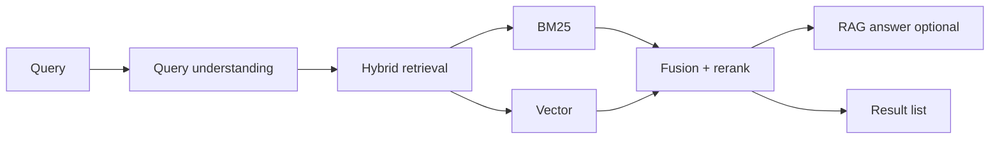

# Design: AI Search Engine

## Problem Statement

Search internal corpus + optional web with ranked results and generative answers.

## Architecture

## Query Understanding

- Intent: navigational vs informational
- Entity extraction for filters
- Query rewriting for typos/synonyms

## User Feedback

- Click logs → reranker training
- Thumbs on answers → eval dataset

## Tradeoffs

| Generative answer | Snippets only |
|-------------------|---------------|
| Better UX | Lower hallucination risk |

## Navigation

- [Customer Support](design-ai-customer-support.md)

---

## Changelog

| Version | Date | Changes |
|---------|------|---------|
| 1.0 | 2026-07-13 | Initial publication |
