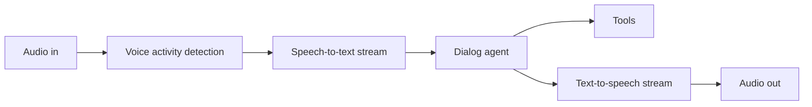

# Design: AI Voice Agent

## Problem Statement

Real-time spoken conversation with <500ms perceived latency and barge-in support.

## Architecture

## Components

| Component | Role |
|-----------|------|
| **VAD** | Detect speech start/end; reduce STT cost |
| **Streaming STT** | Partial transcripts |
| **Agent** | Short responses; tool calls |
| **Streaming TTS** | Start speak before full text |
| **Interruptions** | Stop TTS on user speak; cancel LLM |

## Latency Optimization

- Pipeline overlap: STT partial → LLM → TTS chunk
- Edge deployment for media
- Smaller models for dialog routing

## Tradeoffs

| Full duplex WebRTC | Turn-based |
|--------------------|------------|
| Natural | Simpler |

## Navigation

- [Scaling AI Systems](scaling-ai-systems.md)

---

## Changelog

| Version | Date | Changes |
|---------|------|---------|
| 1.0 | 2026-07-13 | Phase 11 Section 14 |
