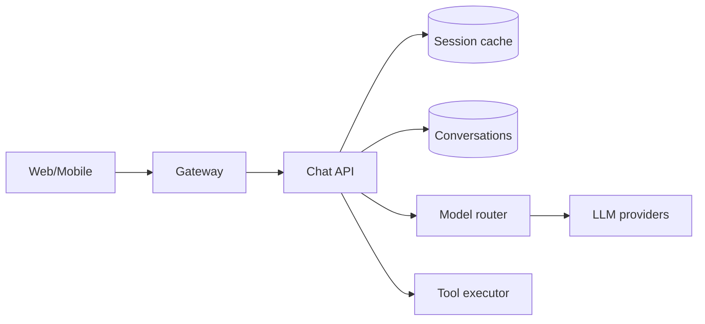

# Design: ChatGPT-like System

## Problem Statement

Build a multi-turn conversational AI serving millions of users with streaming, tools, memory, and cost controls.

## Functional Requirements

- Multi-turn chat with history
- Streaming token delivery
- Tool/function calling
- File upload (optional)
- User accounts and conversation list

## Non-Functional Requirements

| NFR | Target |
|-----|--------|
| p95 TTFT | < 800 ms |
| Availability | 99.9% |
| Concurrent streams | 100K+ |

## Assumptions & Constraints

- LLM via external API; no self-hosted GPU initially
- Conversations stored 90 days; GDPR delete

## High-Level Architecture

## Component Responsibilities

- **Conversation manager** — thread ID, turn ordering, token budget trim
- **Context manager** — sliding window + summarization for long chats
- **Model router** — cheap model for simple; frontier for complex
- **Tool layer** — web browse, code, plugins with sandbox

## Request Lifecycle

1. POST `/chat` with `conversation_id`, `message`
2. Load history (Redis → Postgres fallback)
3. Trim/summarize to fit context window
4. Stream SSE from LLM; persist assistant turn on complete
5. If tool call: execute → append result → continue generation

## Scaling Strategy

- Stateless API pods; sticky optional for stream
- Redis cluster for hot sessions
- Postgres sharding by `user_id` at scale

## Cost Optimization

- Prompt caching (provider feature)
- Summarize old turns vs full history
- Rate limits by tier

## Failure Handling

- Provider 503 → failover model
- Stream disconnect → client resume with `last_event_id`

## Tradeoffs

| Decision | Why |
|----------|-----|
| Server-side history | Multi-device sync; audit |
| SSE vs WebSocket | SSE simpler for one-way stream |

## Interview Questions

- How handle 128K context with 500-turn chat? → Summarize + retrieve own history
- How prevent abuse? → Rate limit + moderation classifier

## Navigation

- [Design: Cursor-like System](design-cursor-like-system.md)

---

## Changelog

| Version | Date | Changes |
|---------|------|---------|
| 1.0 | 2026-07-13 | Initial publication |
