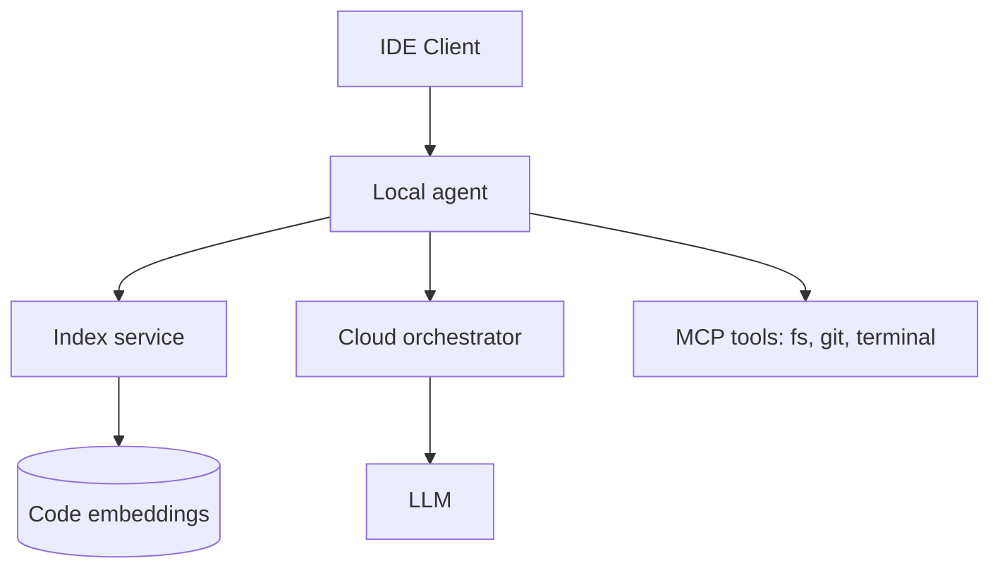

# Design: Cursor-like AI Coding Assistant

## Problem Statement

IDE-embedded assistant with full repository awareness, agentic edits, and low-latency completions.

## Functional Requirements

- Chat with codebase context
- Inline completions
- Multi-file edit with diffs
- Terminal/tool execution (sandboxed)
- Background repo indexing

## Non-Functional Requirements

| NFR | Target |
|-----|--------|
| Completion p95 | < 300 ms |
| Index freshness | < 5 min after save |
| Privacy | Local-first options |

## Architecture

## Key Components

| Layer | Role |
|-------|------|
| **Repository parser** | AST, symbols, imports |
| **Semantic index** | Chunk by function/class; embed |
| **Context retrieval** | Query → relevant files + symbols |
| **Agent workflow** | Plan → read → edit → verify |
| **Diff engine** | Apply patches; user accept/reject |

## Background Indexing

- File watcher → debounce → chunk → embed queue
- Incremental updates on git checkout
- `.cursorignore` / `.gitignore` respect

## Multi-File Reasoning

- Build dependency graph from imports
- Include related tests + types in context
- Cap files by relevance score

## Security

- Sandboxed terminal; path allow list
- No auto-run without user approval for destructive ops

## Tradeoffs

| Local index | Cloud index |
|-------------|-------------|
| Privacy | Cross-machine sync |
| Limited RAM | Scale embed workers |

## Interview Questions

- How index 1M LOC monorepo? → Incremental, hierarchical, retrieve not full scan

## Navigation

- [GitHub Copilot Design](design-github-copilot.md)

---

## Changelog

| Version | Date | Changes |
|---------|------|---------|
| 1.0 | 2026-07-13 | Phase 11 Section 4 |
