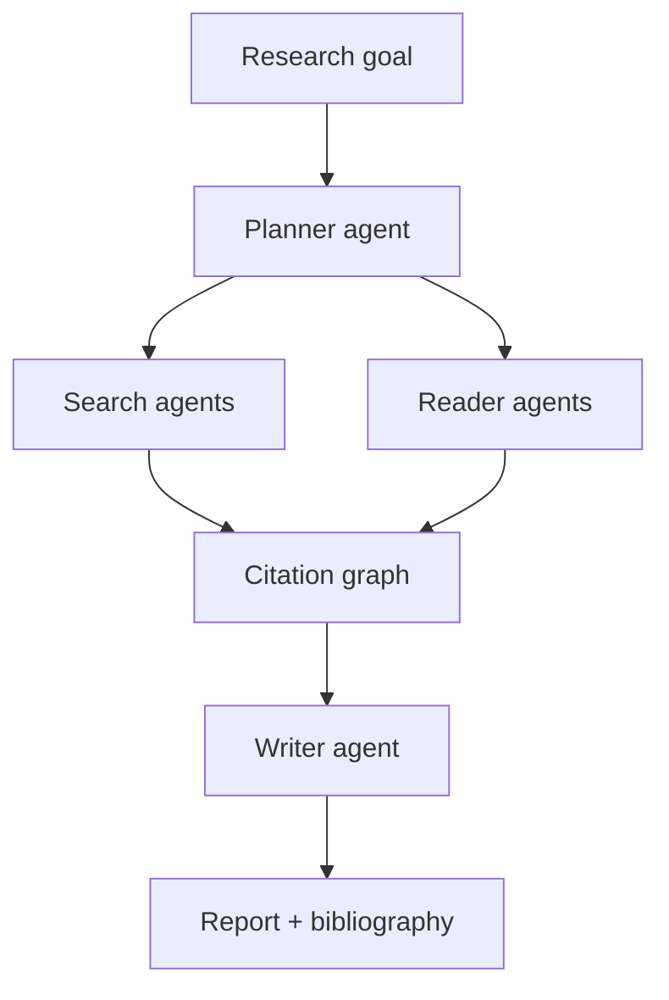

# Design: Deep Research System

## Problem Statement

Produce long-form researched reports with verifiable citations from web and docs — minutes to hours runtime.

## Architecture

## Components

- **Research planning** — outline, sub-questions, stopping criteria
- **Web crawling** — rate-limited fetch, extract main content
- **Multi-agent** — parallel sub-topic researchers
- **Citation graph** — claim → source nodes; detect unsupported edges
- **Long-running tasks** — job queue; progress UI; email on complete
- **Memory** — scratchpad + structured notes per section
- **Evaluation** — faithfulness, coverage rubric

## Scaling

- Worker pool for fetch + embed
- Checkpoint each section

## Cost

- Cap searches per report; use smaller models for summarize steps

## Navigation

- [AI Search Engine](design-ai-search-engine.md)

---

## Changelog

| Version | Date | Changes |
|---------|------|---------|
| 1.0 | 2026-07-13 | Phase 11 Section 7 |
