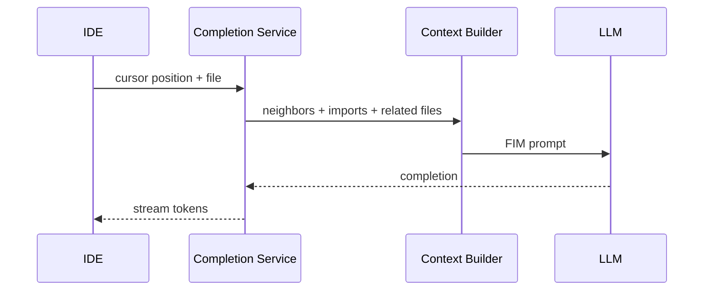

# Design: GitHub Copilot

## Problem Statement

Sub-300ms inline code completions in the IDE with relevant local and repository context.

## Functional Requirements

- Ghost text completions on keystroke
- Multi-line suggestions
- Language-aware context
- Accept/reject/next suggestion

## Non-Functional Requirements

| NFR | Target |
|-----|--------|
| p95 latency | < 200–400 ms |
| Relevance | Contextual to cursor position |

## Architecture

## Completion Pipeline

1. **Trigger** — debounce keystroke; cancel in-flight
2. **Context** — prefix/suffix (FIM), surrounding functions, related open tabs
3. **Prompt assembly** — language, filepath, repo metadata (not full repo)
4. **Inference** — small fast model; low max tokens
5. **Post-filter** — syntax check, blocklist patterns

## Latency Optimization

- Edge POP near user
- KV cache / prompt prefix caching
- Speculative decoding (provider-side)
- Aggressive debounce and cancellation

## Privacy

- Telemetry opt-out; no retention options
- Enterprise: no training on customer code
- PII scrub in logs

## Caching

- Hash(prefix + filepath) → cache recent completions
- Invalidate on file change

## Tradeoffs

| More context | Better quality | Higher latency + cost |

## Interview Questions

- Why FIM not chat? → Lower latency; cursor-local task

## Navigation

- [Perplexity Design](design-perplexity-ai-search.md)

---

## Changelog

| Version | Date | Changes |
|---------|------|---------|
| 1.0 | 2026-07-13 | Initial publication |
