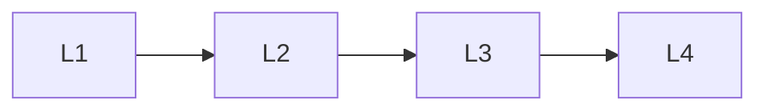

# Developer Tools

> Section of the **ai-system-design** handbook.

## Lessons

| # | Lesson |
|---|--------|
| 1 | [Design Cursor Like System](01-design-cursor-like-system.md) |
| 2 | [Design Github Copilot](02-design-github-copilot.md) |
| 3 | [Design Ai Coding Assistant](03-design-ai-coding-assistant.md) |
| 4 | [Design Ai Pdf Chat](04-design-ai-pdf-chat.md) |

**Topic hub:** [../README.md](../README.md)
