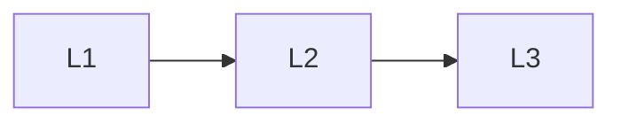

# Foundations

> Section of the **ai-system-design** handbook.

## Lessons

| # | Lesson |
|---|--------|
| 1 | [Ai System Design Fundamentals](01-ai-system-design-fundamentals.md) |
| 2 | [Common Ai Components](02-common-ai-components.md) |
| 3 | [Ai Architecture Patterns](03-ai-architecture-patterns.md) |

**Topic hub:** [../README.md](../README.md)
