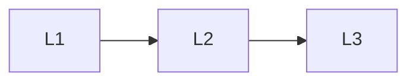

# Scale & Interviews

> Section of the **ai-system-design** handbook.

## Lessons

| # | Lesson |
|---|--------|
| 1 | [Scaling Ai Systems](01-scaling-ai-systems.md) |
| 2 | [Ai System Design Interviews](02-ai-system-design-interviews.md) |
| 3 | [Ai System Design Comparison Guides](03-ai-system-design-comparison-guides.md) |

**Topic hub:** [../README.md](../README.md)
