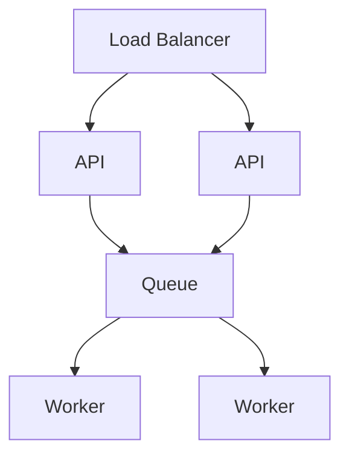

# Scaling AI Systems

## Overview

Section **15** of Phase 11.

## Strategies

| Strategy | Applies to |
|----------|------------|
| **Horizontal** | Stateless API, workers |
| **Vertical** | GPU inference nodes |
| **Queue-backed** | Indexing, agents, eval |
| **Multi-region** | Read replicas; LLM nearest POP |
| **Caching** | Embeddings, completions, retrieval |
| **Rate limiting** | Per user, per tier, global |

## Bottlenecks

1. LLM provider rate limits → queue + backoff
2. Vector DB QPS → replicas, cache hot queries
3. Large context → trim, summarize, retrieve

## Stateless APIs

Session in Redis; no local disk state →任意 scale pods.

## Interview Questions

**Q: 10× traffic spike?** Scale API pods, queue non-sync work, enable aggressive cache, negotiate provider quota.

## Navigation

- [Architecture Patterns](ai-architecture-patterns.md)

---

## Changelog

| Version | Date | Changes |
|---------|------|---------|
| 1.0 | 2026-07-13 | Phase 11 Section 15 |
