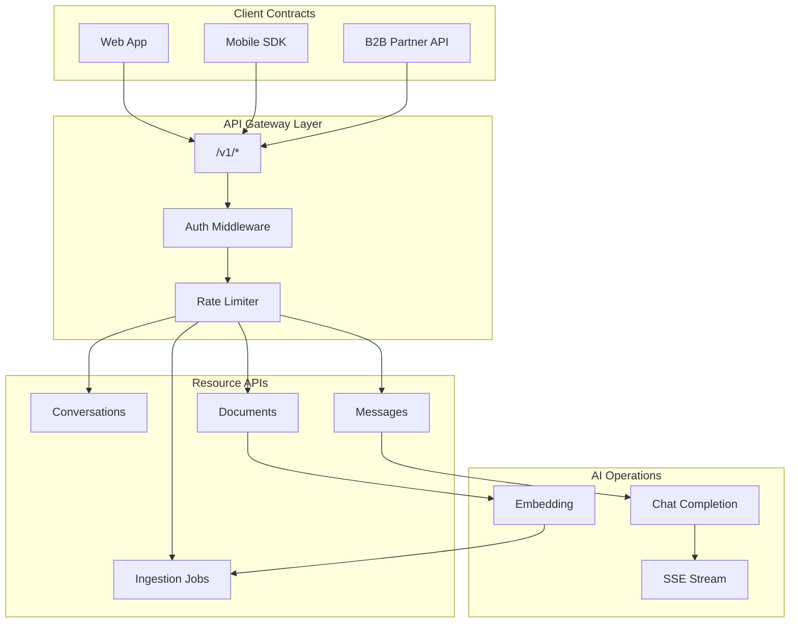
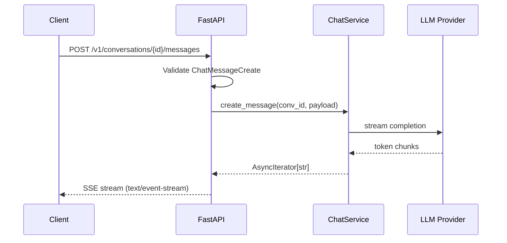
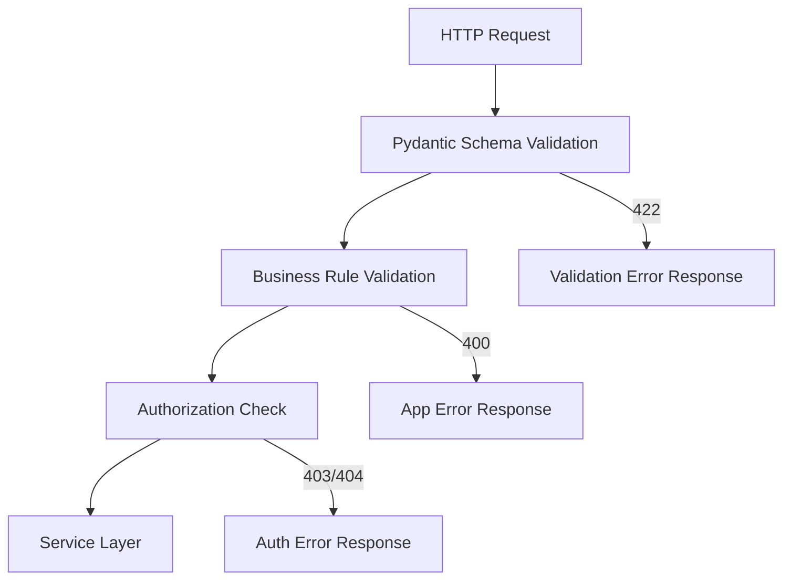

# API Design for AI

> How to design REST APIs that scale for LLM-powered products — from resource naming and versioning to streaming completions, idempotent jobs, and consistent error envelopes.

## Table of Contents

- [Why API Design Matters for AI Products](#why-api-design-matters-for-ai-products)
- [REST Design Principles](#rest-design-principles)
- [Resource Naming Conventions](#resource-naming-conventions)
- [API Versioning](#api-versioning)
- [Pagination](#pagination)
- [Filtering and Sorting](#filtering-and-sorting)
- [Idempotency](#idempotency)
- [Batch Operations](#batch-operations)
- [Error Responses](#error-responses)
- [Response Envelopes](#response-envelopes)
- [Request Validation](#request-validation)
- [Standard Response Models](#standard-response-models)
- [Streaming APIs](#streaming-apis)
- [AI-Specific Design Guidelines](#ai-specific-design-guidelines)
- [Production Considerations](#production-considerations)
- [Security Considerations](#security-considerations)
- [Common Mistakes](#common-mistakes)
- [Interview Preparation](#interview-preparation)
- [Navigation](#navigation)

---

## Why API Design Matters for AI Products

AI applications expose APIs that look like CRUD services but behave differently: responses are non-deterministic, latency is measured in seconds, token usage has direct cost, and clients expect streaming. Poor API design surfaces as broken mobile apps, runaway LLM bills, and integration nightmares for B2B customers.

| AI Product Surface | API Design Decision |
|--------------------|---------------------|
| Chat UI with typing indicator | Streaming endpoint (`text/event-stream`) |
| Document library for RAG | Paginated list + async ingestion status |
| Agent tool registry | Versioned, schema-validated resource models |
| Enterprise B2B integration | Stable `/v1/` contracts, idempotent writes |
| Usage-based billing | Batch endpoints + idempotency keys on paid ops |

> **Production Standard:** HTTP transport fundamentals live in [HTTP Fundamentals for AI](http-fundamentals-for-ai.md). This document focuses on **design decisions** — how to shape endpoints, payloads, and contracts for AI workloads. Implementation depth is in [FastAPI Complete Guide](../fastapi/fastapi-complete-guide.md) and [Backend Architecture for AI](../backend-engineering/backend-architecture-for-ai.md).



---

## REST Design Principles

REST is not dogma — it is a set of constraints that make APIs predictable. For AI apps, the goal is **resource-oriented URLs** with **HTTP semantics** that clients can reason about without reading your source code.

### Core Constraints (Applied to AI)

| Principle | AI Application Interpretation |
|-----------|------------------------------|
| **Resources are nouns** | `/conversations`, `/documents`, `/agents` — not `/generateText` |
| **HTTP methods express intent** | `POST` to create a message; `GET` to list conversations |
| **Stateless requests** | Session/conversation state stored server-side, keyed by ID |
| **Uniform interface** | Same error envelope, pagination shape, and auth on every endpoint |
| **Hypermedia (optional)** | `links.next` in paginated responses; `Location` on `201 Created` |

### When REST Breaks Down for AI

Some AI operations are inherently **RPC-style** (remote procedure calls). That is acceptable when named clearly and versioned:

| Pattern | Example | When to Use |
|---------|---------|-------------|
| Resource CRUD | `POST /v1/conversations/{id}/messages` | Persistent entities with IDs |
| Action sub-resource | `POST /v1/documents/{id}/reindex` | One-off operation on a resource |
| RPC-style endpoint | `POST /v1/completions` | OpenAI-compatible proxy; legacy clients |
| Async job | `POST /v1/ingestion-jobs` → `202 Accepted` | Long-running embedding pipelines |

Prefer resource-oriented designs. Use RPC endpoints only when matching an external standard or when no natural resource exists.



---

## Resource Naming Conventions

Consistent naming reduces client bugs and makes OpenAPI documentation scannable.

### Rules

1. **Use plural nouns** — `/conversations`, not `/conversation`
2. **Use kebab-case for multi-word resources** — `/prompt-templates`, not `/promptTemplates`
3. **Nest for ownership, not depth** — max 2–3 levels: `/conversations/{id}/messages`
4. **Avoid verbs in paths** — use HTTP methods; exceptions for non-CRUD actions (`/reindex`)
5. **Use UUIDs or opaque IDs in paths** — `/documents/{doc_id}`, not `/documents/{filename}`

### AI Resource Model Example

| Resource | Path | Notes |
|----------|------|-------|
| Conversation | `/v1/conversations` | Container for chat history |
| Message | `/v1/conversations/{conv_id}/messages` | User/assistant turns |
| Document | `/v1/documents` | RAG source files |
| Ingestion job | `/v1/ingestion-jobs` | Async processing status |
| Agent | `/v1/agents` | Agent configuration |
| Tool | `/v1/agents/{agent_id}/tools` | Callable tool definitions |
| Embedding | `/v1/embeddings` | RPC-style; matches provider convention |

### Anti-Patterns

| Bad | Good | Why |
|-----|------|-----|
| `/getConversationHistory` | `GET /v1/conversations/{id}/messages` | Verbs belong in HTTP methods |
| `/v1/chat/sendMessage` | `POST /v1/conversations/{id}/messages` | Nested resources express ownership |
| `/v1/user_123/docs` | `GET /v1/documents` (scoped by auth) | User ID belongs in token, not URL |
| `/v1/llm/ask` | `POST /v1/conversations/{id}/messages` | Vague RPC names do not scale |

### FastAPI Router Organization

```python
from fastapi import APIRouter

conversations_router = APIRouter(prefix="/v1/conversations", tags=["conversations"])
messages_router = APIRouter(prefix="/v1/conversations/{conversation_id}/messages", tags=["messages"])
documents_router = APIRouter(prefix="/v1/documents", tags=["documents"])

# app.include_router(conversations_router)
# app.include_router(messages_router)
# app.include_router(documents_router)
```

---

## API Versioning

Version from day one. AI APIs evolve fast — new models, tool schemas, and streaming formats — but your customers need stable contracts.

### Versioning Strategies

| Strategy | Example | Pros | Cons |
|----------|---------|------|------|
| **URL path** | `/v1/conversations` | Explicit, easy to route | URL pollution over time |
| **Header** | `Accept: application/vnd.myapp.v1+json` | Clean URLs | Harder to test, easy to miss |
| **Query param** | `?version=1` | Simple | Feels non-standard for REST |

**Recommendation for AI apps:** URL path versioning (`/v1/`) for public APIs. It is the industry default (OpenAI, Anthropic, Stripe) and works cleanly with API gateways and OpenAPI docs.

### Deprecation Policy

```http
HTTP/1.1 200 OK
Sunset: Sat, 01 Jan 2028 00:00:00 GMT
Deprecation: true
Link: </v2/conversations>; rel="successor-version"
```

### FastAPI Version Mounting

```python
from fastapi import FastAPI

app = FastAPI(title="AI Assistant API")

v1 = FastAPI(title="AI Assistant API v1", version="1.0.0")
v2 = FastAPI(title="AI Assistant API v2", version="2.0.0")

@v1.post("/conversations")
async def create_conversation_v1():
    ...

@v2.post("/conversations")
async def create_conversation_v2():
  # v2: returns additional metadata field
    ...

app.mount("/v1", v1)
app.mount("/v2", v2)
```

For router-based versioning (preferred in larger apps), see [FastAPI Complete Guide](../fastapi/fastapi-complete-guide.md).

---

## Pagination

Never return unbounded lists. AI apps accumulate conversations, documents, and audit logs quickly.

### Offset Pagination

```
GET /v1/documents?limit=20&offset=40
```

| Pros | Cons |
|------|------|
| Simple to implement | Slow on large offsets (`OFFSET 100000`) |
| Jump to page N | Inconsistent if data changes during paging |

### Cursor Pagination (Recommended)

```
GET /v1/documents?limit=20&cursor=eyJpZCI6ImFiYyJ9
```

| Pros | Cons |
|------|------|
| Stable under concurrent writes | Cannot jump to arbitrary page |
| Efficient with indexed sort key | Slightly more complex |

### Standard Paginated Response

```python
from datetime import datetime
from typing import Generic, TypeVar
from pydantic import BaseModel, Field

T = TypeVar("T")


class PaginationMeta(BaseModel):
    limit: int = Field(..., ge=1, le=100)
    has_more: bool
    next_cursor: str | None = None
    total_count: int | None = None  # optional; expensive on large tables


class PaginatedResponse(BaseModel, Generic[T]):
    data: list[T]
    pagination: PaginationMeta
```

### FastAPI Cursor Pagination

```python
import base64
import json
from uuid import UUID

from fastapi import APIRouter, Depends, Query
from sqlalchemy.ext.asyncio import AsyncSession

router = APIRouter()


def encode_cursor(last_id: UUID, created_at: datetime) -> str:
    payload = {"id": str(last_id), "created_at": created_at.isoformat()}
    return base64.urlsafe_b64encode(json.dumps(payload).encode()).decode()


def decode_cursor(cursor: str) -> tuple[UUID, datetime]:
    payload = json.loads(base64.urlsafe_b64decode(cursor))
    return UUID(payload["id"]), datetime.fromisoformat(payload["created_at"])


@router.get("/documents", response_model=PaginatedResponse[DocumentRead])
async def list_documents(
    limit: int = Query(20, ge=1, le=100),
    cursor: str | None = None,
    user_id: str = Depends(get_current_user_id),
    db: AsyncSession = Depends(get_db),
):
    query = select(Document).where(Document.user_id == user_id).order_by(
        Document.created_at.desc(), Document.id.desc()
    )
    if cursor:
        last_id, last_created = decode_cursor(cursor)
        query = query.where(
            (Document.created_at < last_created)
            | ((Document.created_at == last_created) & (Document.id < last_id))
        )
    query = query.limit(limit + 1)
    rows = (await db.execute(query)).scalars().all()

    has_more = len(rows) > limit
    items = rows[:limit]
    next_cursor = None
    if has_more and items:
        last = items[-1]
        next_cursor = encode_cursor(last.id, last.created_at)

    return PaginatedResponse(
        data=[DocumentRead.model_validate(d) for d in items],
        pagination=PaginationMeta(limit=limit, has_more=has_more, next_cursor=next_cursor),
    )
```

---

## Filtering and Sorting

List endpoints need query parameters for discovery without custom endpoints per filter combination.

### Naming Conventions

| Parameter | Example | Purpose |
|-----------|---------|---------|
| `filter[field]` or `field` | `?status=ready&source=upload` | Equality filters |
| `q` | `?q=quarterly+report` | Full-text search |
| `sort` | `?sort=-created_at,name` | Sort field; `-` prefix = descending |
| `fields` | `?fields=id,title,status` | Sparse fieldsets (optional) |
| `include` | `?include=messages` | Expand related resources (use sparingly) |

### AI-Specific Filters

| Resource | Useful Filters |
|----------|----------------|
| Documents | `status` (pending, processing, ready, failed), `mime_type`, `collection_id` |
| Conversations | `agent_id`, `updated_after`, `archived` |
| Messages | `role` (user, assistant, tool), `created_after` |
| Ingestion jobs | `status`, `document_id` |

### FastAPI Filter Dependency

```python
from datetime import datetime
from enum import StrEnum

from fastapi import Query
from pydantic import BaseModel, Field


class DocumentStatus(StrEnum):
    PENDING = "pending"
    PROCESSING = "processing"
    READY = "ready"
    FAILED = "failed"


class DocumentFilters(BaseModel):
    status: DocumentStatus | None = None
    q: str | None = Field(None, max_length=200)
    sort: str = Field("created_at", pattern=r"^-?(created_at|title|status)$")


def get_document_filters(
    status: DocumentStatus | None = None,
    q: str | None = Query(None, max_length=200),
    sort: str = Query("created_at", pattern=r"^-?(created_at|title|status)$"),
) -> DocumentFilters:
    return DocumentFilters(status=status, q=q, sort=sort)
```

### Sorting Safety

- **Allowlist sort fields** — never pass user input directly to `ORDER BY`
- **Always include a tiebreaker** — e.g., `created_at DESC, id DESC` for stable cursors
- **Index filtered + sorted columns** — or pagination degrades under load

---

## Idempotency

AI operations cost money. Duplicate `POST` requests from network retries must not trigger duplicate LLM calls or double charges.

### When Idempotency Is Required

| Operation | Idempotent? | Mechanism |
|-----------|-------------|-----------|
| `GET` list/read | Yes (by HTTP) | None needed |
| `POST` create message (paid) | No | `Idempotency-Key` header |
| `POST` document upload | No | `Idempotency-Key` or dedupe hash |
| `DELETE` resource | Yes (by HTTP) | None needed |
| `PUT` replace config | Yes (by HTTP) | None needed |

### Idempotency-Key Pattern

```http
POST /v1/conversations/abc/messages HTTP/1.1
Idempotency-Key: 7c9e6679-7425-40de-944b-e07fc1f90ae7
Content-Type: application/json

{"content": "Summarize the uploaded report"}
```

### FastAPI Idempotency Middleware

```python
import hashlib
from fastapi import Header, HTTPException, Request, status
from redis.asyncio import Redis


async def check_idempotency(
    request: Request,
    idempotency_key: str | None = Header(None, alias="Idempotency-Key"),
    redis: Redis = Depends(get_redis),
) -> None:
    if request.method != "POST" or not idempotency_key:
        return

    cache_key = f"idempotency:{idempotency_key}"
    cached = await redis.get(cache_key)
    if cached:
        # Return cached response — typically handled in route wrapper
        request.state.idempotent_hit = True
        request.state.idempotent_response = cached
        return

    request.state.idempotency_cache_key = cache_key


@router.post("/conversations/{conversation_id}/messages")
async def create_message(
    request: Request,
    conversation_id: UUID,
    payload: MessageCreate,
    service: ChatService = Depends(get_chat_service),
    _: None = Depends(check_idempotency),
):
    if getattr(request.state, "idempotent_hit", False):
        return JSONResponse(
            content=json.loads(request.state.idempotent_response),
            status_code=200,
        )

    result = await service.create_message(conversation_id, payload)
    response_body = result.model_dump(mode="json")

    if cache_key := getattr(request.state, "idempotency_cache_key", None):
        await redis.setex(cache_key, 86400, json.dumps(response_body))

    return result
```

Store idempotency records for **24–72 hours**. Key by `(user_id, idempotency_key)` for multi-tenant safety.

---

## Batch Operations

Batch endpoints reduce round-trips for bulk ingestion, embedding, and evaluation — common in AI pipelines.

### Design Patterns

| Pattern | Endpoint | Response |
|---------|----------|----------|
| **Synchronous batch** | `POST /v1/embeddings/batch` | `200` with array of results |
| **Async batch job** | `POST /v1/ingestion-jobs/batch` | `202` with job ID |
| **Bulk delete** | `DELETE /v1/documents` with body | `200` with per-item status |

### Batch Request/Response Models

```python
from pydantic import BaseModel, Field


class BatchEmbeddingRequest(BaseModel):
    texts: list[str] = Field(..., min_length=1, max_length=100)
    model: str = "text-embedding-3-small"


class BatchItemResult(BaseModel):
    index: int
    status: str  # "success" | "error"
    data: dict | None = None
    error: dict | None = None


class BatchEmbeddingResponse(BaseModel):
    results: list[BatchItemResult]
    succeeded: int
    failed: int
```

### FastAPI Batch Endpoint

```python
@router.post("/embeddings/batch", response_model=BatchEmbeddingResponse)
async def batch_embed(
    payload: BatchEmbeddingRequest,
    service: EmbeddingService = Depends(get_embedding_service),
):
    results: list[BatchItemResult] = []
    for i, text in enumerate(payload.texts):
        try:
            vector = await service.embed(text, model=payload.model)
            results.append(BatchItemResult(index=i, status="success", data={"embedding": vector}))
        except EmbeddingError as exc:
            results.append(
                BatchItemResult(
                    index=i,
                    status="error",
                    error={"code": exc.code, "message": str(exc)},
                )
            )
    succeeded = sum(1 for r in results if r.status == "success")
    return BatchEmbeddingResponse(results=results, succeeded=succeeded, failed=len(results) - succeeded)
```

### Batch Limits

- Cap batch size (e.g., 100 items) — return `413` or `400` when exceeded
- Apply per-item timeouts — one bad document must not fail the entire batch
- Consider async jobs for batches exceeding 30 seconds

---

## Error Responses

Clients — especially SDKs and agent tools — need machine-readable errors to decide whether to retry, fix input, or escalate.

### Error Response Structure

```json
{
  "error": {
    "code": "DOCUMENT_TOO_LARGE",
    "message": "Document exceeds the 50 MB upload limit.",
    "details": {
      "max_size_bytes": 52428800,
      "received_size_bytes": 67108864
    },
    "request_id": "req_8f3a2b1c",
    "doc_url": "https://docs.example.com/errors/DOCUMENT_TOO_LARGE"
  }
}
```

### Error Code Conventions

| Code Pattern | Example | HTTP Status |
|--------------|---------|-------------|
| `VALIDATION_ERROR` | Missing required field | 422 |
| `RESOURCE_NOT_FOUND` | Unknown conversation ID | 404 |
| `RATE_LIMIT_EXCEEDED` | Too many requests | 429 |
| `MODEL_OVERLOADED` | LLM provider 503 | 503 |
| `INSUFFICIENT_CREDITS` | Billing limit hit | 402 or 429 |
| `IDEMPOTENCY_CONFLICT` | Same key, different body | 409 |

### Global Exception Handler

```python
from fastapi import Request
from fastapi.responses import JSONResponse


class AppError(Exception):
    def __init__(self, code: str, message: str, status_code: int = 400, details: dict | None = None):
        self.code = code
        self.message = message
        self.status_code = status_code
        self.details = details or {}


@app.exception_handler(AppError)
async def app_error_handler(request: Request, exc: AppError):
    return JSONResponse(
        status_code=exc.status_code,
        content={
            "error": {
                "code": exc.code,
                "message": exc.message,
                "details": exc.details,
                "request_id": getattr(request.state, "request_id", None),
            }
        },
    )
```

Do not leak stack traces, provider API keys, or internal model names in production error messages.

---

## Response Envelopes

Two schools of thought: **raw resources** (Stripe/OpenAI style) vs **wrapped envelopes** (`{data: ...}`). Pick one and apply it consistently.

### Raw Resource (Recommended for Most AI APIs)

```json
{
  "id": "conv_abc",
  "title": "Q3 Report Analysis",
  "created_at": "2026-07-13T10:00:00Z"
}
```

### Wrapped Envelope

```json
{
  "data": {
    "id": "conv_abc",
    "title": "Q3 Report Analysis"
  },
  "meta": {
    "request_id": "req_8f3a2b1c"
  }
}
```

### When to Wrap

| Use raw | Use envelope |
|---------|--------------|
| Single-resource CRUD | Paginated lists (`data` + `pagination`) |
| OpenAI-compatible proxies | Multi-status batch results |
| Public SDK generation | Internal admin APIs with debug meta |

### List + Single Consistency

```python
class SingleResponse(BaseModel, Generic[T]):
    data: T


class ListResponse(BaseModel, Generic[T]):
    data: list[T]
    pagination: PaginationMeta
```

If you use envelopes for lists, use them for single resources too — mixed styles confuse SDK generators.

---

## Request Validation

Pydantic is the validation backbone in FastAPI. For AI APIs, validation is also your **prompt injection first line of defense** — constrain what clients can send.

### Validation Layers



### AI-Specific Validation Rules

```python
from pydantic import BaseModel, Field, field_validator


class MessageCreate(BaseModel):
    content: str = Field(..., min_length=1, max_length=32_000)
    role: Literal["user", "system"] = "user"
    attachments: list[UUID] = Field(default_factory=list, max_length=10)

    @field_validator("content")
    @classmethod
    def strip_and_reject_empty(cls, v: str) -> str:
        stripped = v.strip()
        if not stripped:
            raise ValueError("content cannot be blank")
        return stripped


class ChatCompletionRequest(BaseModel):
    model: str = Field(..., pattern=r"^[a-z0-9.-]+$")
    temperature: float = Field(0.7, ge=0.0, le=2.0)
    max_tokens: int = Field(1024, ge=1, le=16_384)
    stream: bool = False
```

### Custom Validators vs Service Logic

| Layer | Validates |
|-------|-----------|
| **Pydantic** | Types, ranges, regex, required fields |
| **Service** | Business rules (user owns conversation, model allowed for tier) |
| **Repository** | Database constraints (unique, foreign key) |

Return `422` for schema violations (FastAPI default). Return `400` with `AppError` for semantic violations ("model not available on free tier").

---

## Standard Response Models

Define shared models once. Reference them in OpenAPI for SDK consistency.

### Base Model with Timestamps

```python
from datetime import datetime
from uuid import UUID

from pydantic import BaseModel, ConfigDict


class ResourceBase(BaseModel):
    model_config = ConfigDict(from_attributes=True)

    id: UUID
    created_at: datetime
    updated_at: datetime


class ConversationRead(ResourceBase):
    title: str
    agent_id: UUID | None
    message_count: int


class MessageRead(ResourceBase):
    conversation_id: UUID
    role: str
    content: str
    token_count: int | None = None


class DocumentRead(ResourceBase):
    title: str
    status: DocumentStatus
    mime_type: str
    chunk_count: int | None = None
```

### Response Model Configuration

```python
@router.get("/conversations/{id}", response_model=ConversationRead)
async def get_conversation(id: UUID, ...):
    ...
```

`response_model` strips undeclared fields — preventing accidental leakage of internal columns (e.g., `system_prompt`, `internal_notes`).

### Partial Updates with PATCH

```python
class ConversationUpdate(BaseModel):
    title: str | None = Field(None, min_length=1, max_length=200)
    archived: bool | None = None

    model_config = ConfigDict(extra="forbid")  # reject unknown fields
```

---

## Streaming APIs

Streaming is the default UX for chat. Design streaming endpoints with the same rigor as REST resources.

### Streaming Protocol Choices

| Protocol | Content-Type | Best For |
|----------|--------------|----------|
| **SSE** | `text/event-stream` | Chat tokens, job progress |
| **Chunked JSON** | `application/json` | NDJSON event streams |
| **WebSocket** | Upgrade header | Bidirectional agent chat |

### SSE Event Schema

```
event: token
data: {"delta": "Hello"}

event: token
data: {"delta": " world"}

event: done
data: {"message_id": "msg_abc", "usage": {"prompt_tokens": 42, "completion_tokens": 8}}
```

### FastAPI Streaming Endpoint

```python
import json
from collections.abc import AsyncIterator

from fastapi import Request
from fastapi.responses import StreamingResponse


async def sse_event_generator(
    conversation_id: UUID,
    payload: MessageCreate,
    service: ChatService,
    request: Request,
) -> AsyncIterator[str]:
    try:
        async for chunk in service.stream_completion(conversation_id, payload):
            if await request.is_disconnected():
                await service.cancel(conversation_id)
                break
            yield f"event: token\ndata: {json.dumps({'delta': chunk})}\n\n"
        usage = await service.get_last_usage(conversation_id)
        yield f"event: done\ndata: {json.dumps({'usage': usage})}\n\n"
    except AppError as exc:
        yield f"event: error\ndata: {json.dumps({'code': exc.code, 'message': exc.message})}\n\n"


@router.post("/conversations/{conversation_id}/messages/stream")
async def stream_message(
    conversation_id: UUID,
    payload: MessageCreate,
    request: Request,
    service: ChatService = Depends(get_chat_service),
):
    return StreamingResponse(
        sse_event_generator(conversation_id, payload, service, request),
        media_type="text/event-stream",
        headers={
            "Cache-Control": "no-cache",
            "Connection": "keep-alive",
            "X-Accel-Buffering": "no",  # disable nginx buffering
        },
    )
```

### Streaming API Design Checklist

- [ ] Support `stream: true` on JSON endpoints as an alternative content negotiation path
- [ ] Emit a terminal `done` or `error` event — clients need a clear stream end
- [ ] Cancel upstream LLM call on client disconnect
- [ ] Disable reverse-proxy buffering (`X-Accel-Buffering: no`)
- [ ] Include `usage` metadata in the final event for billing
- [ ] Document event types in OpenAPI (use `text/event-stream` description field)

---

## AI-Specific Design Guidelines

### 1. Separate Control Plane from Data Plane

| Control Plane | Data Plane |
|---------------|------------|
| Agent config, tool schemas | Chat messages, streaming tokens |
| API keys, rate limits | Document bytes, embeddings |
| `/v1/agents`, `/v1/api-keys` | `/v1/conversations/*/messages` |

### 2. Model Endpoints vs Application Endpoints

Expose **application-level** endpoints to users (`/v1/conversations/.../messages`). Keep **model-level** endpoints (`/v1/completions`) internal or for power users — they couple clients to provider semantics.

### 3. Async by Default for Heavy Work

```
POST /v1/documents        → 202 Accepted + job ID (large files)
POST /v1/documents/quick  → 201 Created (small text paste, < 1s)
GET  /v1/ingestion-jobs/{id}  → status polling or webhook
```

### 4. Expose Usage Metadata

Every paid operation should return token counts, model ID, and latency — in the response body or `X-Usage-*` headers.

### 5. Design for Agent Tool Calling

Tool definitions should match your API's OpenAPI schema. If agents call your API, resource names and error codes must be deterministic.

### 6. Webhook Contracts

For async jobs, document webhook payload shape alongside the REST API:

```json
{
  "event": "ingestion.completed",
  "data": {"job_id": "job_abc", "document_id": "doc_xyz", "chunk_count": 42},
  "timestamp": "2026-07-13T10:05:00Z"
}
```

---

## Production Considerations

| Concern | Practice |
|---------|----------|
| **OpenAPI docs** | Auto-generate from Pydantic; publish at `/docs` (auth-gated in prod) |
| **Contract testing** | Validate responses against OpenAPI schema in CI |
| **Rate limiting** | Per-user and per-IP; return `429` with `Retry-After` |
| **Timeouts** | Client timeout < gateway timeout < LLM timeout |
| **Request IDs** | Accept `X-Request-ID` or generate; echo in responses |
| **Health checks** | `GET /health` (liveness), `GET /ready` (dependencies) |
| **CORS** | Explicit allowlist; never `*` with credentials |
| **Compression** | Enable gzip for JSON; disable for SSE streams |

```python
@app.middleware("http")
async def request_id_middleware(request: Request, call_next):
    request_id = request.headers.get("X-Request-ID", str(uuid4()))
    request.state.request_id = request_id
    response = await call_next(request)
    response.headers["X-Request-ID"] = request_id
    return response
```

---

## Security Considerations

API design and security overlap. Key principles:

1. **Authenticate every endpoint** — including health-adjacent metadata endpoints that leak version info
2. **Authorize at the resource level** — user A cannot read user B's conversations (return `404`, not `403`, to prevent enumeration)
3. **Never expose LLM provider keys** — backend proxy pattern only
4. **Validate upload size and type** — before reading full body into memory
5. **Rate limit expensive endpoints** — streaming chat, batch embed, document upload
6. **Sign webhooks** — HMAC-SHA256 with timestamp tolerance

Full auth patterns: [Authentication and Authorization for AI](../security/authentication-authorization-for-ai.md).

---

## Common Mistakes

| Mistake | Impact | Fix |
|---------|--------|-----|
| Unbounded `GET /documents` | OOM, timeouts | Cursor pagination with max `limit` |
| Inconsistent error shapes | SDK cannot parse errors | Single `AppError` handler |
| No API versioning | Breaking changes strand clients | `/v1/` from day one |
| RPC verbs in URLs | Unmaintainable surface | Resource-oriented paths |
| Missing idempotency on paid `POST` | Double LLM charges | `Idempotency-Key` header |
| `200 OK` with error in body | Retry logic breaks | Proper HTTP status codes |
| Streaming without disconnect handling | Wasted tokens | `request.is_disconnected()` |
| Exposing internal fields in responses | Data leaks | `response_model` on every route |
| Offset pagination at scale | Slow queries | Cursor pagination |
| No batch size limits | Single request melts GPU | Cap + async jobs |

---

## Interview Preparation

### Conceptual Questions

**Q: How do you design a paginated list endpoint for a RAG document library?**

> **Strong answer:** Cursor-based pagination on `(created_at, id)` for stable ordering under concurrent uploads. Query params: `limit` (max 100), `cursor`, `status`, `q` for search. Response: `{data: [...], pagination: {has_more, next_cursor}}`. Index `(user_id, created_at DESC)`. Never expose other users' documents — scope by auth, not URL.

**Q: When would you use idempotency keys in an AI API?**

> **Strong answer:** Any non-idempotent `POST` that incurs cost: chat messages, document ingestion, embedding batch. Client sends `Idempotency-Key` UUID. Server caches response for 24–72h keyed by `(user_id, key)`. On replay, return cached response with `200`. Return `409` if same key arrives with different body.

**Q: How do you version an AI API without breaking streaming clients?**

> **Strong answer:** URL path versioning (`/v1/`, `/v2/`). Maintain v1 for a defined sunset period with `Sunset` and `Deprecation` headers. v2 can add fields to JSON events but should not rename SSE event types without a new stream endpoint. Document migration guides. Run contract tests per version in CI.

**Q: What belongs in a standard error response?**

> **Strong answer:** Machine-readable `code`, human-readable `message`, optional `details` object, `request_id` for support correlation. Map to correct HTTP status. Never include stack traces or provider secrets. For LLM failures, map provider errors to your codes (`MODEL_OVERLOADED` → 503).

### System Design Prompt

**Design the REST API for an AI writing assistant with documents, chat, and team sharing.**

> **Discussion points:**
> - Resources: `/v1/workspaces`, `/v1/documents`, `/v1/conversations`, `/v1/messages`
> - Streaming `POST .../messages` with SSE; `stream: false` fallback
> - Cursor pagination, filter by `status` and `q`
> - Idempotency on message create and document upload
> - Batch `POST /v1/documents/batch` for enterprise import
> - Consistent error envelope, `/v1/` versioning
> - Team RBAC: workspace membership check on every resource
> - Usage metadata in responses for billing

### Coding Exercise

**Implement a FastAPI endpoint with cursor pagination, filtering, and a consistent error envelope.**

> **Evaluation criteria:** Pydantic models for filters and paginated response, allowlisted sort fields, `AppError` exception handler, `response_model` usage, proper status codes.

---

## Navigation

### Prerequisites

- [HTTP Fundamentals for AI](http-fundamentals-for-ai.md) — methods, status codes, headers, basic REST
- [Backend Fundamentals for AI](../backend-engineering/backend-fundamentals-for-ai.md) — request lifecycle, middleware
- [Software Engineering for AI](../foundations/software-engineering-for-ai.md) — service layer, project structure

### Related Topics

- [FastAPI Foundation](../fastapi/fastapi-foundation.md) — routers, DI, streaming basics
- [FastAPI Complete Guide](../fastapi/fastapi-complete-guide.md) — advanced FastAPI patterns for AI apps
- [Backend Architecture for AI](../backend-engineering/backend-architecture-for-ai.md) — layered architecture for API services
- [Authentication and Authorization for AI](../security/authentication-authorization-for-ai.md) — securing AI endpoints

### Next Topics

- [Authentication and Authorization for AI](../security/authentication-authorization-for-ai.md)
- [Databases for AI Applications](../databases/databases-for-ai-applications.md)
- [LLM Engineering](../llm-engineering/README.md)

### Future Reading

- [AI Application Architecture](../ai-application-architecture/README.md)
- [Observability](../observability/README.md)
- [Performance Optimization](../performance-optimization/README.md)

---

## See Also

- [APIs Index](README.md)
- [Master Index](../../meta/indexes/MASTER-INDEX.md)
- [Learning Roadmap](../../meta/roadmap.md)

## Changelog

| Version | Date | Changes |
|---------|------|---------|
| 1.0 | 2026-07-13 | Initial version |
