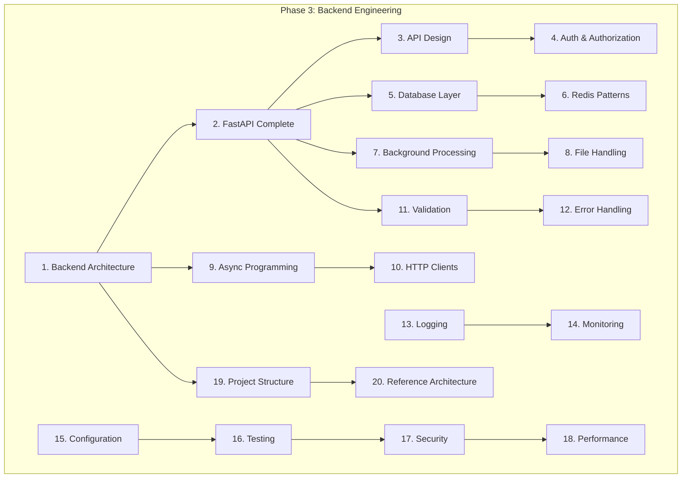

# Phase 3: Backend Engineering for AI Applications

> Production-oriented backend reference for building ChatGPT-like apps, RAG systems, agents, and AI SaaS products.
> **Prerequisite:** [Phase 2 Foundations](../foundations/README.md)

---

## Module Overview

Phase 3 teaches everything an AI engineer needs to build production-ready backend services.
Content spans multiple domains but forms one connected learning path.

---

## Learning Path (20 Topics)

| # | Topic | Document | Domain |
|---|-------|----------|--------|
| 1 | Backend Architecture | [backend-architecture-for-ai.md](backend-architecture-for-ai.md) | backend-engineering |
| 2 | FastAPI Complete Guide | [fastapi-complete-guide.md](../fastapi/fastapi-complete-guide.md) | fastapi |
| 3 | API Design | [api-design-for-ai.md](../apis/api-design-for-ai.md) | apis |
| 4 | Authentication & Authorization | [authentication-authorization-for-ai.md](../security/authentication-authorization-for-ai.md) | security |
| 5a | SQLAlchemy | [sqlalchemy-for-ai-applications.md](../databases/postgresql/sqlalchemy-for-ai-applications.md) | databases/postgresql |
| 5b | Alembic Migrations | [alembic-migrations-for-ai.md](../databases/postgresql/alembic-migrations-for-ai.md) | databases/postgresql |
| 5c | PostgreSQL (Phase 2) | [postgresql-for-ai.md](../databases/postgresql/postgresql-for-ai.md) | databases/postgresql |
| 6 | Redis Backend Patterns | [redis-backend-patterns-for-ai.md](../databases/redis/redis-backend-patterns-for-ai.md) | databases/redis |
| 7 | Background Processing | [background-processing-for-ai.md](background-processing-for-ai.md) | backend-engineering |
| 8 | File Handling | [file-handling-for-ai.md](file-handling-for-ai.md) | backend-engineering |
| 9 | Async Programming | [async-programming-for-ai-backends.md](async-programming-for-ai-backends.md) | backend-engineering |
| 10 | HTTP Clients | [http-clients-for-ai-backends.md](http-clients-for-ai-backends.md) | backend-engineering |
| 11 | Validation | [validation-for-ai-apis.md](validation-for-ai-apis.md) | backend-engineering |
| 12 | Error Handling | [error-handling-for-ai-backends.md](error-handling-for-ai-backends.md) | backend-engineering |
| 13 | Logging | [backend-logging-for-ai.md](../logging/backend-logging-for-ai.md) | logging |
| 14 | Monitoring | [monitoring-foundation-for-ai-backends.md](../monitoring/monitoring-foundation-for-ai-backends.md) | monitoring |
| 15 | Configuration | [configuration-management-for-backends.md](configuration-management-for-backends.md) | backend-engineering |
| 16 | Testing | [testing-backend-for-ai.md](testing-backend-for-ai.md) | backend-engineering |
| 17 | Security | [security-for-ai-backends.md](../security/security-for-ai-backends.md) | security |
| 18 | Performance | [backend-performance-for-ai.md](../performance-optimization/backend-performance-for-ai.md) | performance-optimization |
| 19 | Project Structure | [production-project-structure-for-ai.md](production-project-structure-for-ai.md) | backend-engineering |
| 20 | Reference Architecture | [ai-backend-reference-architecture.md](ai-backend-reference-architecture.md) | backend-engineering |

**Foundation (Phase 2):** [Backend Fundamentals](backend-fundamentals-for-ai.md) · [FastAPI Foundation](../fastapi/fastapi-foundation.md)

**Troubleshooting:** [Backend Engineering Mistakes](backend-engineering-mistakes.md)

---

## Documents in This Domain

| Document | Status | Description |
|----------|--------|-------------|
| [Backend Fundamentals for AI](backend-fundamentals-for-ai.md) | Published | Phase 2 foundation — start here if new |
| [Backend Architecture for AI](backend-architecture-for-ai.md) | Published | Clean, hexagonal, layered architecture |
| [Production Project Structure](production-project-structure-for-ai.md) | Published | Canonical folder layout |
| [AI Backend Reference Architecture](ai-backend-reference-architecture.md) | Published | Chat, RAG, agent, SaaS patterns |
| [Background Processing for AI](background-processing-for-ai.md) | Published | Celery, ARQ, worker queues |
| [Async Programming for AI Backends](async-programming-for-ai-backends.md) | Published | asyncio depth for AI workloads |
| [File Handling for AI](file-handling-for-ai.md) | Published | Uploads, multimodal, RAG ingestion |
| [HTTP Clients for AI Backends](http-clients-for-ai-backends.md) | Published | httpx, retries, LLM API calls |
| [Validation for AI APIs](validation-for-ai-apis.md) | Published | Pydantic v2 patterns |
| [Error Handling for AI Backends](error-handling-for-ai-backends.md) | Published | Exceptions, fallbacks, degradation |
| [Configuration Management](configuration-management-for-backends.md) | Published | Settings, secrets, feature flags |
| [Testing Backend for AI](testing-backend-for-ai.md) | Published | pytest, API tests, mocks |
| [Backend Engineering Mistakes](backend-engineering-mistakes.md) | Published | 12 production failure patterns |

---

## Code Examples

| Example | Location | Related Topic |
|---------|----------|---------------|
| FastAPI starter | [examples/fastapi/example-fastapi-starter/](../../examples/fastapi/example-fastapi-starter/) | FastAPI |
| JWT authentication | [examples/fastapi/example-jwt-auth.py](../../examples/fastapi/example-jwt-auth.py) | Auth |
| API key authentication | [examples/fastapi/example-api-key-auth.py](../../examples/fastapi/example-api-key-auth.py) | Auth |
| PostgreSQL + SQLAlchemy | [examples/postgresql/example-sqlalchemy-async/](../../examples/postgresql/example-sqlalchemy-async/) | Database |
| Redis integration | [examples/redis/example-redis-caching.py](../../examples/redis/example-redis-caching.py) | Redis |
| Health endpoint | [examples/fastapi/example-health-endpoint.py](../../examples/fastapi/example-health-endpoint.py) | Monitoring |
| WebSocket API | [examples/fastapi/example-websocket-chat.py](../../examples/fastapi/example-websocket-chat.py) | FastAPI |
| File upload API | [examples/fastapi/example-file-upload.py](../../examples/fastapi/example-file-upload.py) | File Handling |
| Testing setup | [examples/fastapi/example-testing-setup/](../../examples/fastapi/example-testing-setup/) | Testing |

---

## Backend Templates

Reusable scaffolds in [`meta/templates/backend/`](../../meta/templates/backend/):

| Template | Use For |
|----------|---------|
| `fastapi-application.md` | New FastAPI project scaffold |
| `api-endpoint.md` | Single API endpoint |
| `repository.md` | Data access layer |
| `service.md` | Business logic layer |
| `database-model.md` | SQLAlchemy model |
| `api-response.md` | Standard response envelope |
| `authentication-module.md` | Auth module structure |
| `middleware.md` | Custom middleware |
| `background-task.md` | Background job pattern |
| `test-file.md` | Backend test file |

---

## Phase 3 Completion Checklist

- [ ] Read all 20 topics in learning path order
- [ ] Scaffold a project using [production project structure](production-project-structure-for-ai.md)
- [ ] Implement JWT or API key auth on at least one endpoint
- [ ] Add PostgreSQL with SQLAlchemy async + Alembic migration
- [ ] Add Redis caching or rate limiting
- [ ] Write pytest suite with dependency overrides
- [ ] Add `/health` and `/ready` endpoints
- [ ] Review [backend engineering mistakes](backend-engineering-mistakes.md) against your code

**Unlocked after Phase 3:** [LLM Engineering](../llm-engineering/README.md) (Phase 4)

---

## See Also

- [Phase 2 Foundations](../foundations/README.md)
- [Backend Templates](../../meta/templates/backend/)
- [Master Index](../../meta/indexes/MASTER-INDEX.md)
- [Cheat Sheets](../../cheat-sheets/)
