# AI Backend Reference Architecture

> Phase 3 reference architectures for production AI backends — chat, RAG, agents, and multi-tenant SaaS — with component diagrams, data flows, and operational guidance.

## Table of Contents

- [Overview](#overview)
- [Shared Platform Architecture](#shared-platform-architecture)
- [Component Reference](#component-reference)
- [Architecture 1: AI Chat Application](#architecture-1-ai-chat-application)
- [Architecture 2: RAG Backend](#architecture-2-rag-backend)
- [Architecture 3: AI Agent Backend](#architecture-3-ai-agent-backend)
- [Architecture 4: AI SaaS Backend](#architecture-4-ai-saas-backend)
- [Cross-Cutting Concerns](#cross-cutting-concerns)
- [Production Considerations](#production-considerations)
- [Architecture Decision Guide](#architecture-decision-guide)
- [Common Mistakes](#common-mistakes)
- [Interview Preparation](#interview-preparation)
- [Navigation](#navigation)

---

## Overview

Every AI product shares a common backbone: clients talk to a FastAPI service, which authenticates requests, runs business logic, persists state, caches hot data, calls LLM APIs, stores files, and emits telemetry.

This document provides **four reference architectures** — increasing in complexity — with Mermaid diagrams showing the full path from client to monitoring. It assumes familiarity with:

- [Backend Architecture for AI](backend-architecture-for-ai.md) — layered design principles
- [Production Project Structure for AI](production-project-structure-for-ai.md) — where code lives in the repo

> **Production Standard:** Pick the simplest architecture that meets requirements. Add workers, vector stores, and agent state machines only when synchronous request handling fails.

---

## Shared Platform Architecture

All four architectures share this platform skeleton:

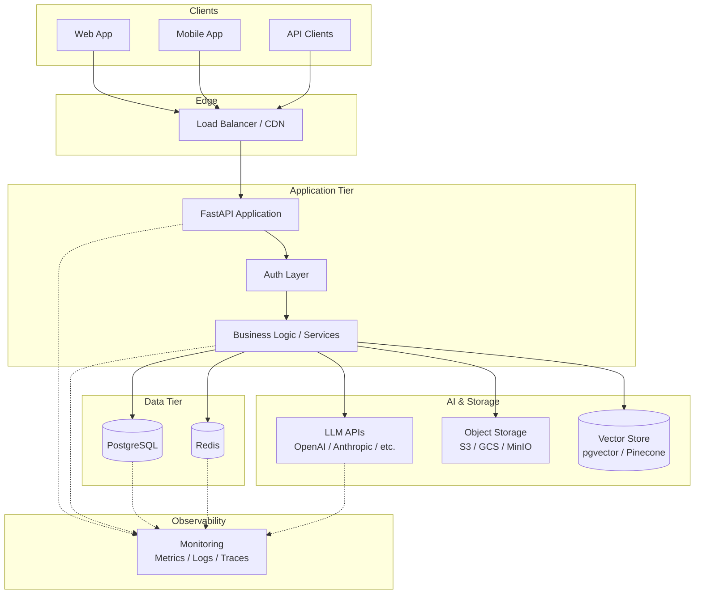

### Request Flow (Universal)

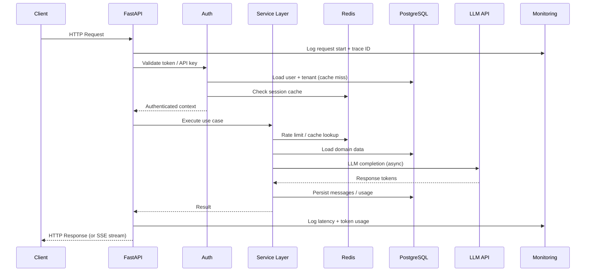

---

## Component Reference

Every component in the diagrams is explained below. Map each to folders in [Production Project Structure for AI](production-project-structure-for-ai.md).

### Client

**Role:** Initiates HTTP/WebSocket requests — web apps, mobile clients, server-side SDKs, third-party integrations.

**Backend contract:** Versioned REST (`/v1/`), SSE for streaming, WebSockets for agent events. See [API Design for AI](../apis/api-design-for-ai.md).

**Production notes:** Clients should handle 429 (rate limit), 503 (retry with backoff), and streaming disconnects gracefully.

---

### FastAPI (Application Server)

**Role:** ASGI HTTP/WebSocket server — routing, validation, middleware, dependency injection, OpenAPI docs.

**Owns:** Transport concerns only. Delegates all business logic to services.

**Production notes:** Run behind Uvicorn/Gunicorn with multiple workers. Use lifespan for connection pool warmup. See [FastAPI Complete Guide](../fastapi/fastapi-complete-guide.md).

| Concern | Implementation |
|---------|----------------|
| Validation | Pydantic schemas in `schemas/` |
| Versioning | `api/v1/`, `api/v2/` routers |
| Streaming | `StreamingResponse` wrapping service generators |
| Health | `/health` (process) + `/ready` (dependencies) |

---

### Auth Layer

**Role:** Authenticate and authorize every request before business logic executes.

**Mechanisms:** JWT bearer tokens, API keys, OAuth2/OIDC for SaaS, scoped tenant context.

```python
# Flow: token → user → tenant → permissions
async def get_auth_context(token: str) -> AuthContext:
    payload = decode_jwt(token)
    user = await user_repo.get(payload["sub"])
    return AuthContext(user=user, tenant_id=user.tenant_id, roles=user.roles)
```

Cross-reference: [Authentication and Authorization for AI](../security/authentication-authorization-for-ai.md), [Backend Engineering Mistakes](backend-engineering-mistakes.md#11-weak-auth).

---

### Business Logic (Service Layer)

**Role:** Orchestrates use cases — chat turns, RAG retrieval, agent tool loops, billing metering.

**Does not:** Parse HTTP directly, issue raw SQL, or import framework types into domain logic.

| Service | Responsibility |
|---------|----------------|
| `ChatService` | Session history, context window, streaming |
| `RAGService` | Retrieve → assemble → generate |
| `AgentService` | Tool selection, state machine, durable steps |
| `IngestionService` | Parse, chunk, embed, index |
| `BillingService` | Token metering, quota enforcement |

Cross-reference: [Backend Architecture for AI](backend-architecture-for-ai.md#service-layer).

---

### PostgreSQL (Primary Database)

**Role:** System of record — users, tenants, conversations, documents, agent runs, billing events, metadata.

**AI-specific usage:**

| Data | Storage Pattern |
|------|-----------------|
| Chat messages | Relational rows with `session_id`, `tenant_id` |
| Document metadata | Status tracking for ingestion pipeline |
| Embeddings (small scale) | `pgvector` column alongside metadata |
| Agent state | JSONB columns for step history |
| Usage metering | Append-only `usage_events` table |

Cross-reference: [PostgreSQL for AI](../databases/postgresql/postgresql-for-ai.md), [SQLAlchemy for AI Applications](../databases/postgresql/sqlalchemy-for-ai-applications.md).

---

### Redis (Cache and Coordination)

**Role:** Low-latency ephemeral state — sessions, rate limits, response cache, pub/sub, job queues.

| Pattern | Redis Structure | TTL |
|---------|-----------------|-----|
| Session cache | `HASH session:{id}` | 24h |
| Rate limiting | `INCR rate:{tenant}:{endpoint}` | 60s window |
| LLM response cache | `STRING cache:{hash}` | 1h (careful with PII) |
| Embedding cache | `STRING emb:{content_hash}` | 7d |
| Job queue | Streams or Celery broker | N/A |
| Distributed locks | `SET lock:{resource} NX EX` | Task duration |

Cross-reference: [Redis for AI](../databases/redis/redis-for-ai.md), [Redis Backend Patterns for AI](../databases/redis/redis-backend-patterns-for-ai.md).

---

### LLM APIs (External Model Providers)

**Role:** Text generation, embeddings, function/tool calling, vision, audio transcription.

**Integration pattern:** Abstract behind a port; implement adapters per provider.

```python
class LLMClient(ABC):
    @abstractmethod
    async def complete(self, messages: list[Message], **kwargs) -> LLMResponse: ...

    @abstractmethod
    async def stream(self, messages: list[Message], **kwargs) -> AsyncIterator[str]: ...

    @abstractmethod
    async def embed(self, texts: list[str]) -> list[list[float]]: ...
```

**Production notes:** Timeouts, retries with exponential backoff, circuit breakers, token budgeting in the service layer. See [Async Programming for AI Backends](async-programming-for-ai-backends.md).

---

### Object Storage (S3 / GCS / MinIO)

**Role:** Durable blob storage for uploaded documents, generated files, audio/video for multimodal pipelines.

**Flow:** Client uploads → pre-signed URL or API proxy → storage → worker processes → metadata in PostgreSQL.

Cross-reference: [File Handling for AI](file-handling-for-ai.md).

---

### Vector Store

**Role:** Similarity search over document embeddings for RAG.

| Option | When to Use |
|--------|-------------|
| pgvector (in PostgreSQL) | < 10M vectors, simpler ops |
| Pinecone / Weaviate / Qdrant | Dedicated scale, hybrid search |
| Redis Vector | Small datasets, already on Redis |

Access via `VectorRepository` — never raw SDK calls from routes.

---

### Monitoring (Metrics, Logs, Traces)

**Role:** Observability across all components — request latency, error rates, token usage, queue depth, DB pool saturation.

| Signal | What to Capture |
|--------|-----------------|
| **Metrics** | p50/p95 latency, tokens/request, cache hit rate, queue lag |
| **Logs** | Structured JSON with `request_id`, `tenant_id`, `model`, token counts |
| **Traces** | Span per service call, LLM API, DB query, Redis op |

**AI-specific:** Log token usage per tenant for billing. Never log prompts containing PII in production info level.

Cross-reference: [Logging and Error Handling](../logging/logging-and-error-handling.md), [Observability](../observability/README.md).

---

## Architecture 1: AI Chat Application

A conversational AI product — single-model chat with session history and streaming.

### Component Diagram

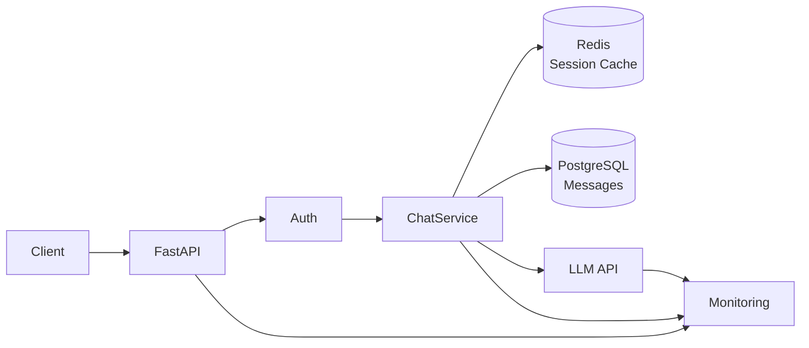

### Detailed Flow

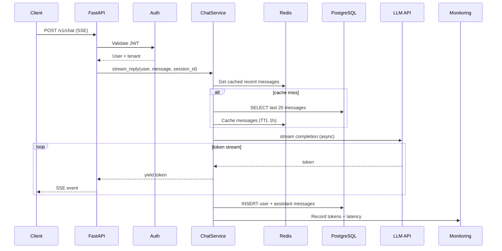

### Component Responsibilities

| Component | Chat-Specific Role |
|-----------|-------------------|
| **FastAPI** | `POST /v1/chat` with `StreamingResponse`; WebSocket optional |
| **Auth** | Per-user session ownership — user A cannot read user B's sessions |
| **ChatService** | Context window trimming, system prompt injection, model routing |
| **Redis** | Hot session cache; rate limit per user |
| **PostgreSQL** | `conversations`, `messages` tables with indexes on `session_id` |
| **LLM API** | Streaming completion; fallback model on primary failure |
| **Monitoring** | Tokens per user, stream duration, time-to-first-token |

### When This Architecture Is Enough

- Single LLM provider, no document retrieval
- Session history fits in context window with trimming
- No tool calling or multi-step reasoning

### Scaling Path

Add RAG ([Architecture 2](#architecture-2-rag-backend)) when users need document-grounded answers. Add agents ([Architecture 3](#architecture-3-ai-agent-backend)) when tool use is required.

---

## Architecture 2: RAG Backend

Retrieval-augmented generation — users upload documents, backend indexes them, chat answers cite sources.

### Component Diagram

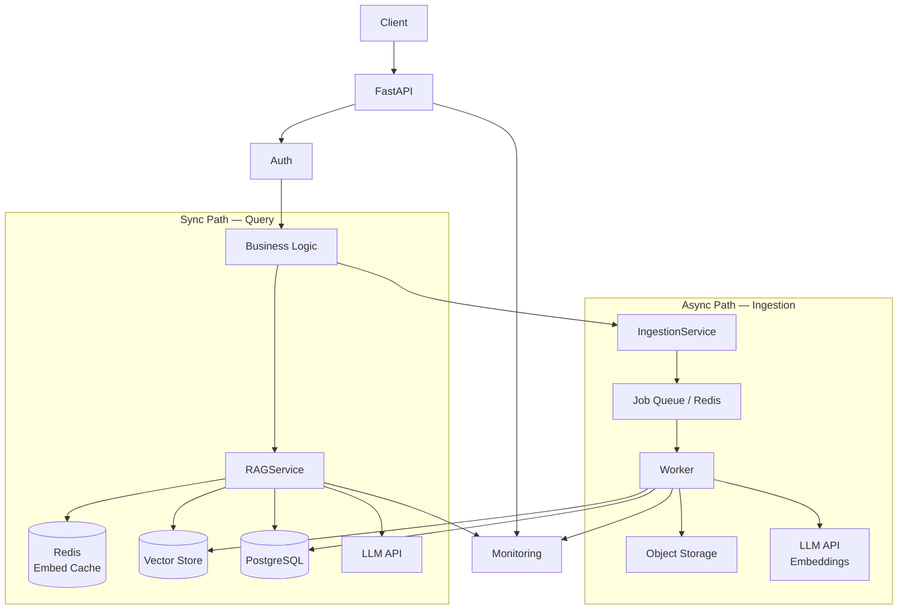

### Query Flow (Synchronous)

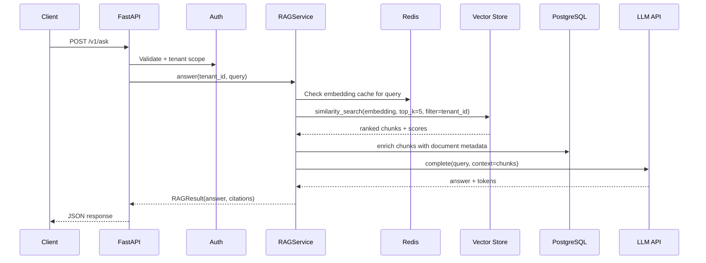

### Ingestion Flow (Asynchronous)

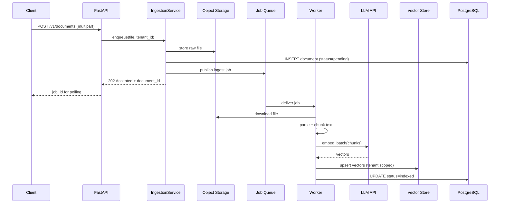

### Component Responsibilities

| Component | RAG-Specific Role |
|-----------|-------------------|
| **FastAPI** | Upload endpoint returns 202; status polling endpoint |
| **Auth** | Tenant-scoped document access — critical for multi-tenant RAG |
| **RAGService** | Retrieve → rerank → assemble context → generate with citations |
| **IngestionService** | Validate file type/size, enqueue job, track status |
| **Worker** | CPU-heavy parsing, embedding batches, vector upsert |
| **Redis** | Job queue broker; embedding cache; ingest progress |
| **PostgreSQL** | Document metadata, chunk references, ingestion status |
| **Object Storage** | Raw PDFs, images, audio — source of truth for files |
| **Vector Store** | Embedding index with `tenant_id` metadata filter |
| **LLM API** | Embeddings for ingest; completion for query |
| **Monitoring** | Ingest lag, retrieval latency, chunk count per query |

### Production Checklist

- [ ] Tenant isolation on every vector query (`filter={"tenant_id": ...}`)
- [ ] File size and type validation before storage — [File Handling for AI](file-handling-for-ai.md)
- [ ] Idempotent ingestion (re-run safe on same `document_id`)
- [ ] Dead letter queue for failed ingest jobs
- [ ] Indexes on `documents.tenant_id`, `documents.status` — [Backend Engineering Mistakes](backend-engineering-mistakes.md#3-missing-indexes)

---

## Architecture 3: AI Agent Backend

Tool-using agents — multi-step reasoning, external API calls, durable execution, real-time status.

### Component Diagram

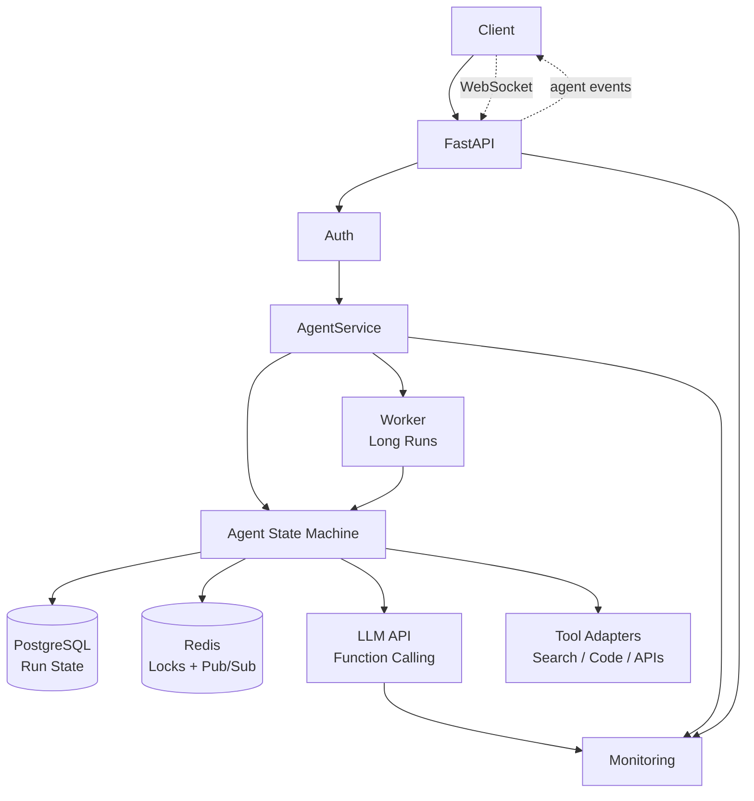

### Agent Execution Flow

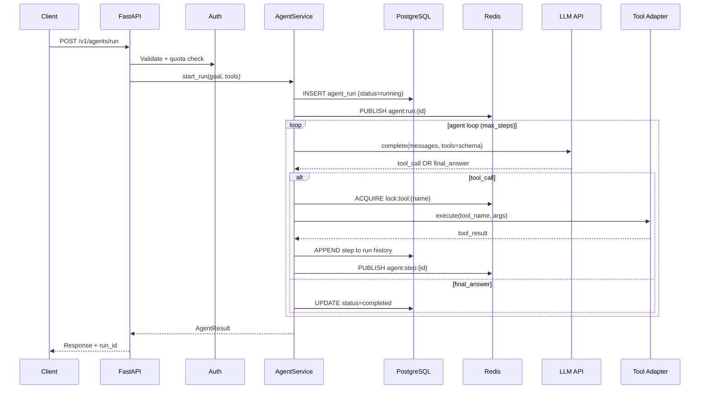

### WebSocket Event Stream

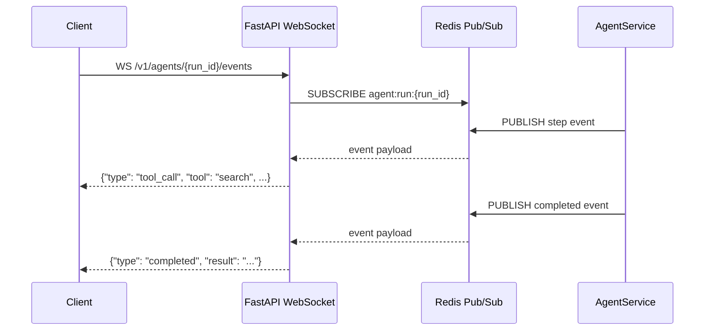

### Component Responsibilities

| Component | Agent-Specific Role |
|-----------|---------------------|
| **FastAPI** | REST for run initiation; WebSocket for live events |
| **Auth** | Tool permission scoping — which tools each role/tenant may invoke |
| **AgentService** | Run lifecycle, step loop, timeout enforcement, cost caps |
| **State Machine** | Durable step history in PostgreSQL JSONB; resume after crash |
| **Redis** | Distributed locks for tool execution; pub/sub for WebSocket fan-out |
| **LLM API** | Function/tool calling with structured outputs |
| **Tool Adapters** | Isolated wrappers for search, code execution, CRM APIs |
| **Worker** | Runs exceeding HTTP timeout (minutes-long agent tasks) |
| **Monitoring** | Steps per run, tool failure rate, run duration, cost per run |

### Agent Design Principles

1. **Durable state** — every step persisted before the next LLM call
2. **Idempotent tools** — safe to retry on transient failure
3. **Budgets** — max steps, max tokens, max wall time per run
4. **Human-in-the-loop** — optional approval gate for destructive tools

Cross-reference: [AI Agents](../ai-agents/README.md), [Background Processing for AI](background-processing-for-ai.md).

---

## Architecture 4: AI SaaS Backend

Multi-tenant platform — chat, RAG, agents, billing, admin, and tenant isolation at every layer.

### Component Diagram

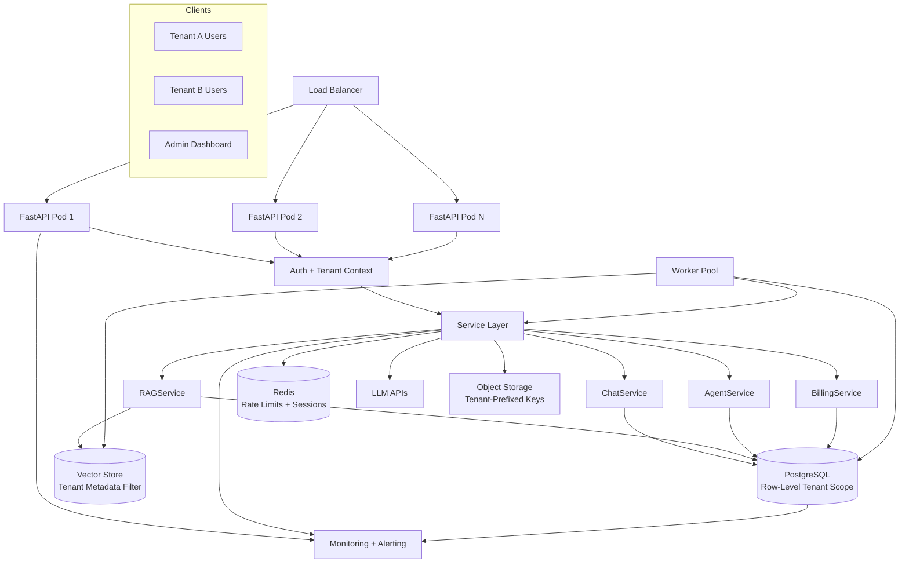

### Multi-Tenant Request Flow

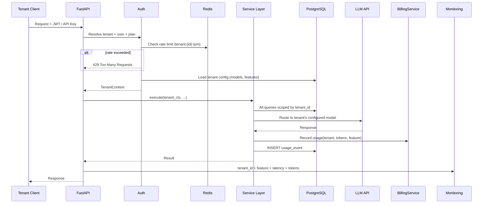

### SaaS-Specific Components

| Component | SaaS Role |
|-----------|-----------|
| **Auth** | JWT with `tenant_id` claim; API keys per tenant; RBAC (admin, member, viewer) |
| **TenantContext** | Threaded through every service method — never optional |
| **BillingService** | Meter tokens, documents, agent runs; enforce plan quotas |
| **Rate Limiting** | Per-tenant RPM/TPM in Redis; plan-tier limits |
| **PostgreSQL** | `tenant_id` on every table; composite indexes `(tenant_id, ...)` |
| **Vector Store** | Mandatory metadata filter on `tenant_id` for every search |
| **Object Storage** | Key prefix `tenants/{tenant_id}/documents/` |
| **Admin API** | Separate router with elevated auth for tenant management |
| **Monitoring** | Per-tenant dashboards; anomaly alerts on usage spikes |

### Data Isolation Strategies

| Strategy | Isolation Level | Complexity |
|----------|-----------------|------------|
| Shared DB, `tenant_id` column | Logical | Low — default for most SaaS |
| Schema per tenant | Stronger logical | Medium |
| Database per tenant | Physical | High — enterprise/regulated |

> **Production Standard:** Logical isolation with `tenant_id` on every query is sufficient for most AI SaaS. Test isolation with integration tests that attempt cross-tenant access.

Cross-reference: [Authentication and Authorization for AI](../security/authentication-authorization-for-ai.md).

---

## Cross-Cutting Concerns

Concerns that apply to all four architectures:

### Error Handling

Map domain exceptions to HTTP responses in a single exception handler. Never leak stack traces or internal IDs in production.

See [Backend Engineering Mistakes](backend-engineering-mistakes.md#12-improper-error-handling).

### Async Discipline

All I/O in the async path must be non-blocking. CPU work goes to `asyncio.to_thread` or workers.

See [Async Programming for AI Backends](async-programming-for-ai-backends.md), [Backend Engineering Mistakes](backend-engineering-mistakes.md#1-blocking-async).

### Configuration

Environment-based settings via Pydantic. No hardcoded API keys or connection strings.

See [Configuration and Secrets](../foundations/configuration-and-secrets.md).

### Health and Readiness

```
GET /health  → process alive
GET /ready   → PostgreSQL + Redis + LLM API reachable
```

---

## Production Considerations

| Concern | Chat | RAG | Agent | SaaS |
|---------|------|-----|-------|------|
| Stateless API pods | Yes | Yes | Yes | Yes |
| Workers required | No | Yes (ingest) | Yes (long runs) | Yes |
| Vector store | No | Yes | Optional | Yes |
| Object storage | No | Yes | Optional | Yes |
| WebSockets | Optional | No | Yes | Yes |
| Per-tenant billing | Optional | Yes | Yes | Required |
| Redis | Sessions | Cache + queue | Locks + pub/sub | Rate limits |

### Deployment Topology

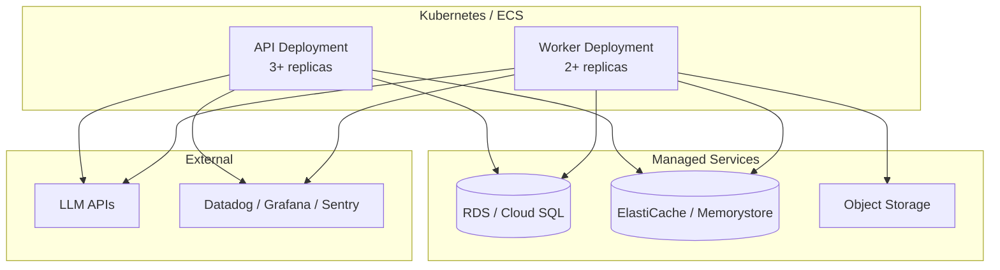

---

## Architecture Decision Guide

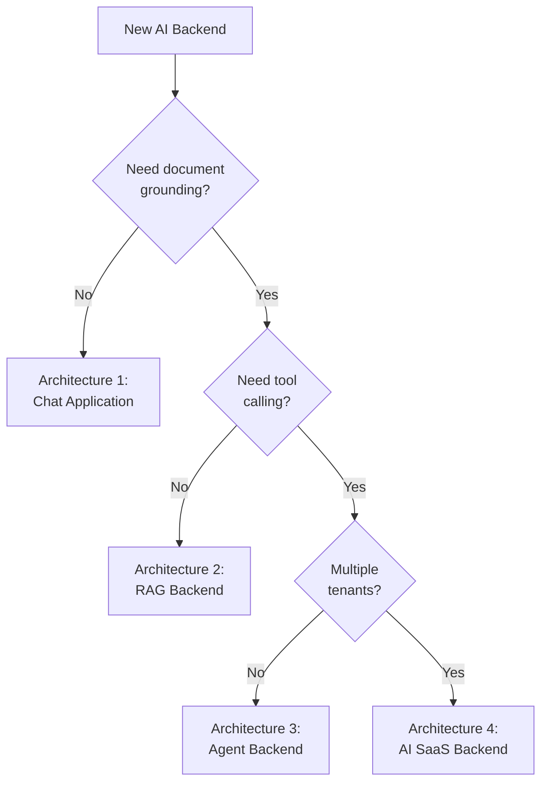

| Requirement | Minimum Architecture |
|-------------|---------------------|
| Simple chatbot | Architecture 1 |
| Document Q&A | Architecture 2 |
| Autonomous workflows | Architecture 3 |
| B2B platform with billing | Architecture 4 |

---

## Common Mistakes

| Mistake | Impact | Reference |
|---------|--------|-----------|
| Skipping tenant scoping in RAG | Data leak across customers | [Weak Auth](backend-engineering-mistakes.md#11-weak-auth) |
| Synchronous document ingestion | Upload timeouts | [Background Processing](background-processing-for-ai.md) |
| Agent state only in memory | Lost runs on deploy | Architecture 3 state machine |
| No usage metering | Unbounded LLM costs | SaaS BillingService |
| Monitoring only API layer | Blind to worker/LLM failures | Component Reference above |

---

## Interview Preparation

**Q1: Design the backend for a document Q&A product with 1000 tenants.**

> **Strong answer:** Architecture 4 simplified — FastAPI stateless pods, tenant-scoped PostgreSQL and vector store, async ingestion workers, S3 for files, Redis for rate limits and embedding cache, RAGService for query path. Explain tenant isolation at DB and vector layers.

**Q2: How does the RAG query path differ from the ingestion path?**

> **Strong answer:** Query is synchronous (retrieve → generate, < 10s). Ingestion is async (upload → queue → worker → embed → index). Different latency budgets, different failure handling. Ingest returns 202 with job ID.

**Q3: Where would you add caching in a chat architecture?**

> **Strong answer:** Redis for session message history (avoid DB on every turn), optional LLM response cache for identical queries (careful with PII), embedding cache for RAG. Explain TTL and invalidation.

**Q4: How do you monitor an agent backend?**

> **Strong answer:** Metrics on steps per run, tool success rate, run duration, token cost. Traces spanning AgentService → LLM → each tool. Alerts on stuck runs (no step progress > N minutes). Dead letter for failed runs.

---

## Navigation

### Prerequisites

- [Backend Architecture for AI](backend-architecture-for-ai.md) — layered design, ports and adapters
- [Production Project Structure for AI](production-project-structure-for-ai.md) — folder layout for these architectures
- [Backend Fundamentals for AI](backend-fundamentals-for-ai.md) — HTTP, streaming, middleware

### Related Topics

- [Databases for AI Applications](../databases/databases-for-ai-applications.md) — store selection
- [Background Processing for AI](background-processing-for-ai.md) — workers for RAG and agents
- [File Handling for AI](file-handling-for-ai.md) — upload and storage patterns
- [Authentication and Authorization for AI](../security/authentication-authorization-for-ai.md) — SaaS auth depth

### Next Topics

- [Backend Engineering Mistakes](backend-engineering-mistakes.md) — troubleshoot production failures
- [RAG](../rag/README.md) — retrieval pipeline depth
- [AI Agents](../ai-agents/README.md) — agent pattern catalog

### Future Reading

- [AI Application Architecture](../ai-application-architecture/README.md) — full-stack view
- [Distributed Systems](../distributed-systems/README.md) — scaling workers and agents
- [Cloud Deployment](../cloud-deployment/README.md) — infrastructure provisioning

---

## See Also

- [Production Project Structure for AI](production-project-structure-for-ai.md)
- [Backend Architecture for AI](backend-architecture-for-ai.md)
- [Backend Engineering Mistakes](backend-engineering-mistakes.md)

## Changelog

| Version | Date | Changes |
|---------|------|---------|
| 1.0 | 2026-07-13 | Initial Phase 3 release |
