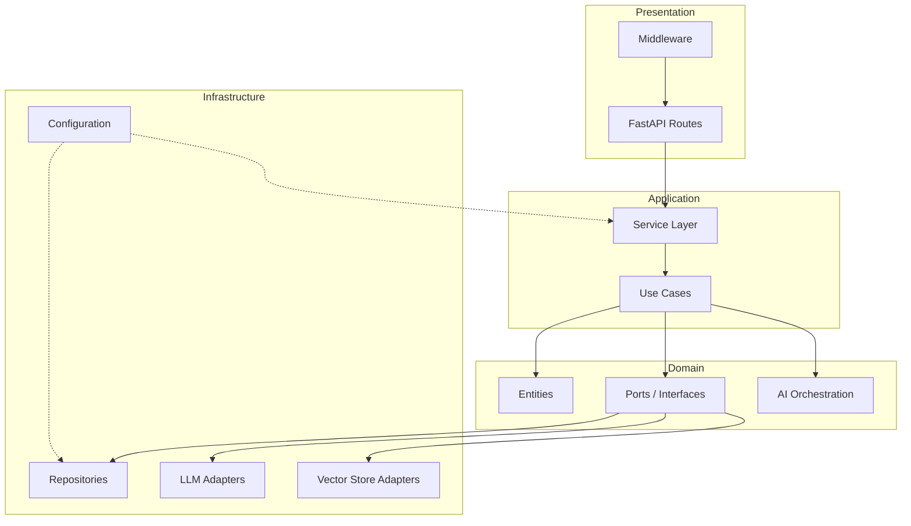
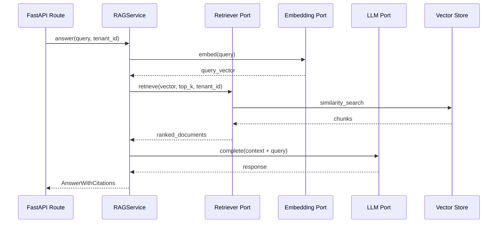
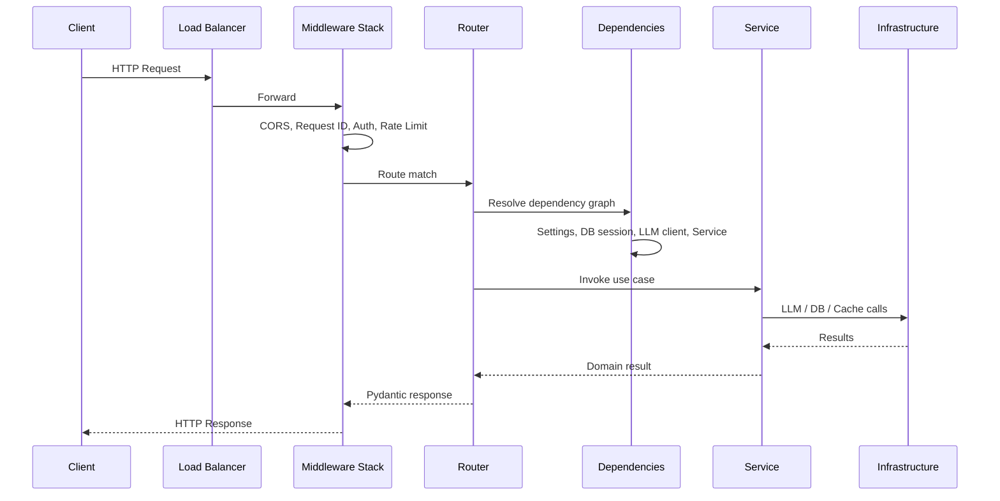
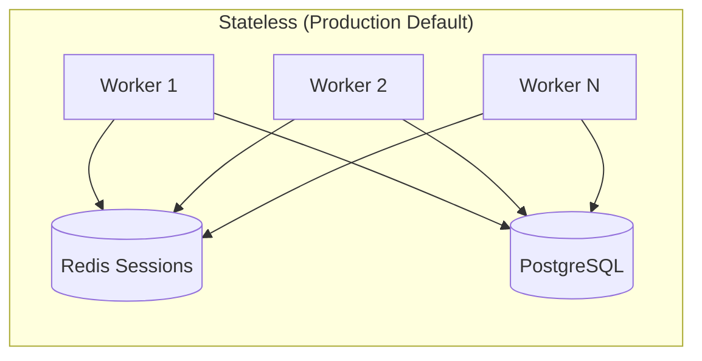
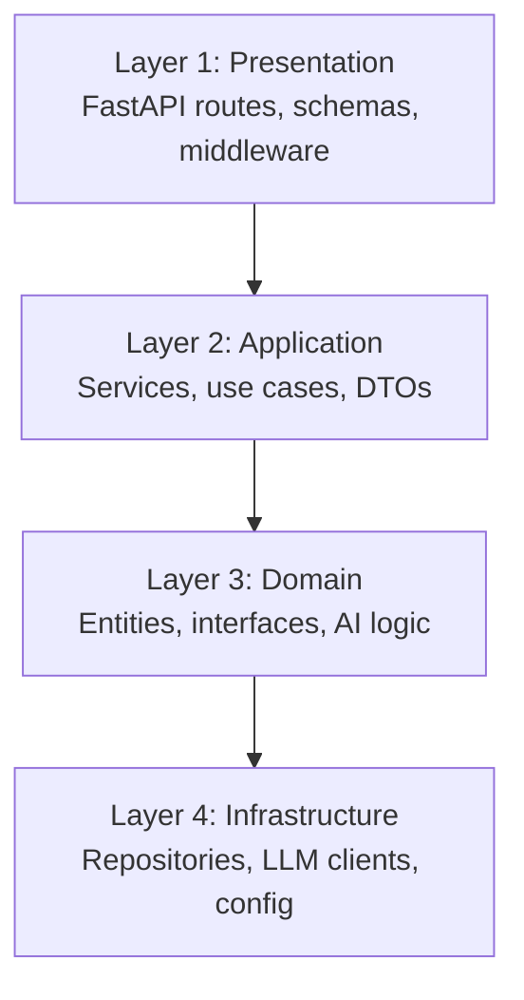
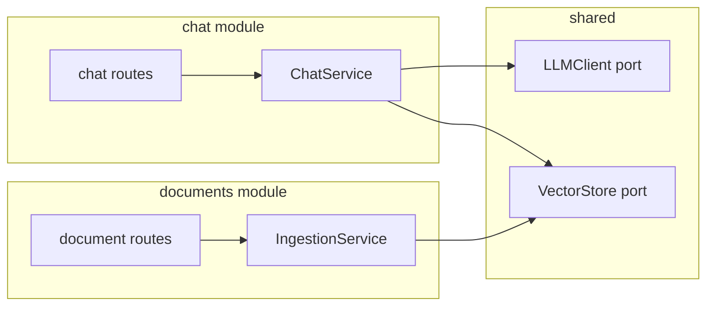
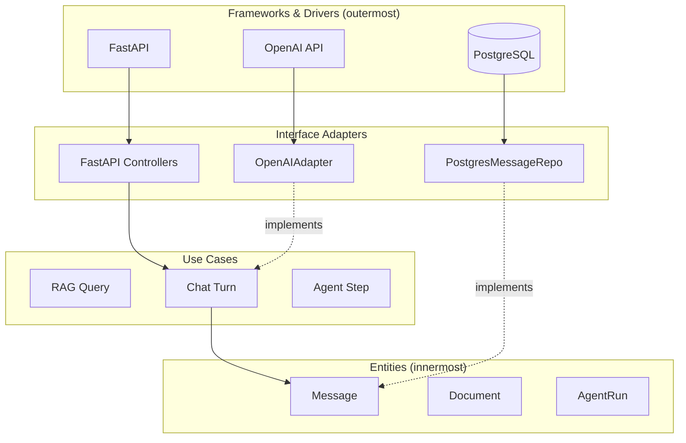
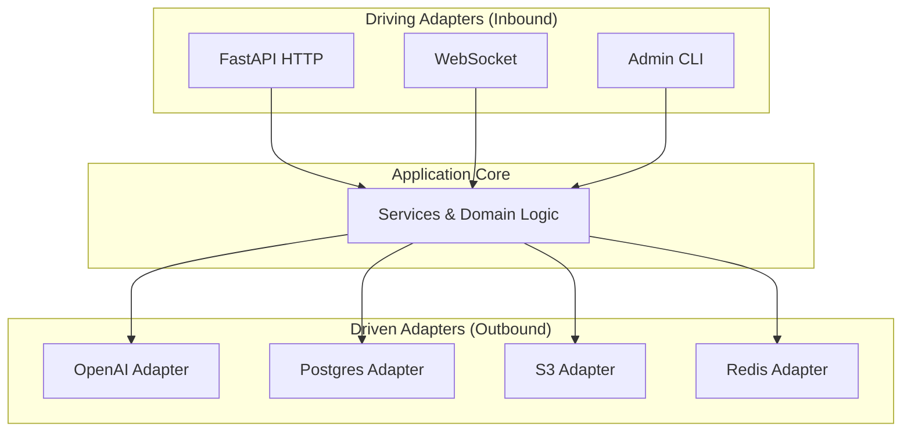
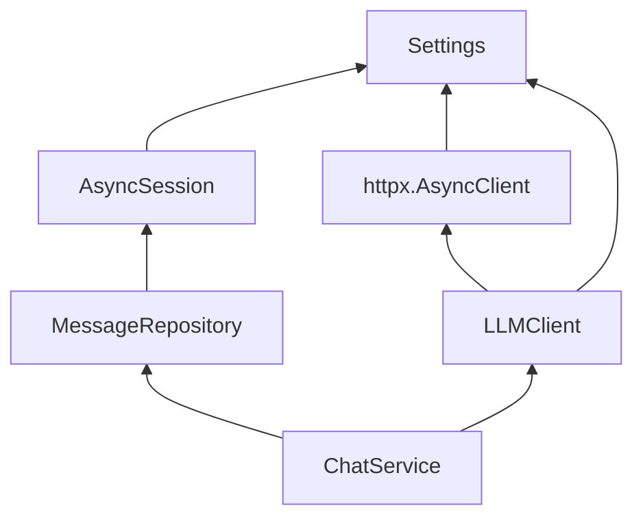
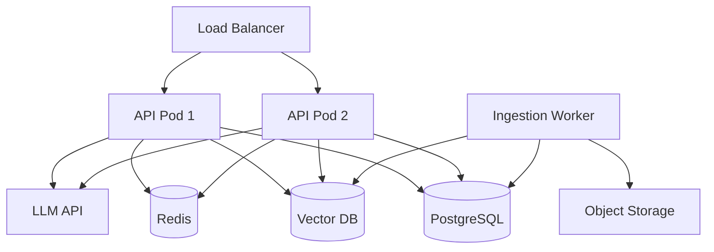

# Backend Architecture for AI

> Phase 3 reference for structuring production AI backends — from request lifecycle through clean architecture, ports and adapters, and configuration discipline.

## Table of Contents

- [Overview](#overview)
- [Why Backend Architecture Matters for AI](#why-backend-architecture-matters-for-ai)
- [AI Use Cases and Architectural Demands](#ai-use-cases-and-architectural-demands)
- [Backend Responsibilities](#backend-responsibilities)
- [Request Lifecycle](#request-lifecycle)
- [Stateless vs Stateful Design](#stateless-vs-stateful-design)
- [Layered Architecture](#layered-architecture)
- [Modular Design](#modular-design)
- [Clean Architecture](#clean-architecture)
- [Hexagonal Architecture (Ports and Adapters)](#hexagonal-architecture-ports-and-adapters)
- [Repository Pattern](#repository-pattern)
- [Service Layer](#service-layer)
- [Dependency Injection](#dependency-injection)
- [Configuration Layer](#configuration-layer)
- [Production Considerations](#production-considerations)
- [Best Practices](#best-practices)
- [Performance](#performance)
- [Security](#security)
- [Common Mistakes](#common-mistakes)
- [Interview Preparation](#interview-preparation)
- [Navigation](#navigation)

---

## Overview

Backend architecture defines **how responsibilities are divided** across your AI service — what the HTTP layer owns, where RAG logic lives, how external systems are abstracted, and how the system scales under load.

This document is a **Phase 3 deep dive**. It assumes you have read:

- [Backend Fundamentals for AI](backend-fundamentals-for-ai.md) — HTTP lifecycle, middleware, async, streaming
- [Software Engineering for AI](../foundations/software-engineering-for-ai.md) — SOLID, layered structure, DI concepts

Here we connect those foundations into a **coherent architectural model** for chat, RAG, and agent backends — with production patterns you can apply on day one.



---

## Why Backend Architecture Matters for AI

AI backends differ from CRUD APIs in three ways that make architecture non-optional:

| AI Characteristic | Architectural Consequence |
|-------------------|--------------------------|
| **Non-deterministic outputs** | Logic must be testable without asserting exact strings |
| **Multiple external dependencies** | LLM, vector DB, cache, object storage — each needs a port |
| **Long-running, streaming operations** | Request lifecycle and state management need explicit design |
| **Rapid provider/model changes** | Swap implementations without rewriting business logic |
| **Cost-sensitive operations** | Service layer is the right place for budgets, caching, routing |

> **Production Standard:** Architecture is not ceremony. It is how you ship RAG improvements without breaking chat, add a new LLM provider in one afternoon, and onboard engineers who have never seen your codebase.

Without structure, AI codebases converge on **600-line route handlers** that embed prompts, SQL, embedding calls, and retry logic — untestable, unswappable, and terrifying to deploy.

---

## AI Use Cases and Architectural Demands

### Chat Applications

Chat backends need session management, message history, streaming, and model routing. Architecture separates:

- **Transport** — SSE/WebSocket, auth, rate limits
- **Conversation service** — turn assembly, context window management
- **LLM port** — provider-agnostic completion interface

```python
# services/conversation_service.py
class ConversationService:
    def __init__(
        self,
        message_repo: MessageRepository,
        llm: LLMClient,
        context_builder: ContextBuilder,
    ) -> None:
        self._messages = message_repo
        self._llm = llm
        self._context = context_builder

    async def reply(self, session_id: str, user_text: str) -> AsyncIterator[str]:
        history = await self._messages.get_recent(session_id, limit=20)
        prompt = self._context.build(history, user_text)
        async for token in self._llm.stream(prompt):
            yield token
        await self._messages.append(session_id, role="user", content=user_text)
```

### RAG Applications

RAG introduces a retrieval pipeline that must be independently testable and evolvable:



### Agent Applications

Agents add **tool execution loops**, state machines, and often durable execution. The service layer owns the loop; infrastructure owns individual tools:

| Component | Layer | Responsibility |
|-----------|-------|----------------|
| Agent orchestrator | Domain/Service | Plan → act → observe loop |
| Tool registry | Domain | Tool schemas, permissions |
| Tool implementations | Infrastructure | HTTP calls, DB queries, code execution |
| Run state | Repository | Persist steps, checkpoints |
| API | Presentation | Start run, stream events, cancel |

```python
# domain/agents/agent_runner.py
class AgentRunner:
    def __init__(
        self,
        llm: LLMClient,
        tools: ToolRegistry,
        run_repo: AgentRunRepository,
    ) -> None:
        self._llm = llm
        self._tools = tools
        self._runs = run_repo

    async def execute(self, run_id: str, goal: str) -> None:
        state = await self._runs.load(run_id)
        while not state.is_complete and state.step_count < state.max_steps:
            action = await self._llm.plan(state.messages, self._tools.schemas())
            if action.type == "tool_call":
                result = await self._tools.execute(action.tool, action.args)
                state = state.with_observation(result)
            else:
                state = state.complete(action.content)
            await self._runs.save(state)
```

---

## Backend Responsibilities

A well-architected AI backend owns these concerns explicitly:

| Responsibility | Owner Layer | Examples |
|----------------|-------------|----------|
| **Protocol handling** | Presentation | HTTP, WebSocket, SSE framing |
| **Authentication / authorization** | Middleware + Dependencies | JWT, API keys, tenant scoping |
| **Input validation** | Presentation (Pydantic) | Prompt length, file type, tool args |
| **Orchestration** | Service | RAG pipeline, agent loop, model routing |
| **Business rules** | Domain | Context limits, citation requirements, safety filters |
| **Data access** | Repository | Messages, documents, embeddings metadata |
| **External integration** | Infrastructure adapters | OpenAI, Pinecone, S3, Redis |
| **Cross-cutting config** | Configuration layer | API keys, model defaults, feature flags |
| **Observability** | Middleware + Services | Request IDs, token usage, retrieval metrics |

What the backend should **not** own:

- Frontend rendering and UX state
- Model training or fine-tuning pipelines (usually separate services)
- Heavy batch ingestion at request time (use job queues)

---

## Request Lifecycle

Understanding the full lifecycle prevents architectural leaks — like database sessions opened in middleware or LLM calls in Pydantic validators.



### Lifecycle Phases

1. **Ingress** — TLS termination, load balancing, connection limits
2. **Middleware** — Cross-cutting concerns that wrap every request
3. **Routing** — URL → handler; version prefix (`/v1/`)
4. **Dependency resolution** — FastAPI builds the object graph via `Depends()`
5. **Validation** — Pydantic parses and validates request body/query/path
6. **Handler** — Thin: delegates to service, maps exceptions to HTTP
7. **Service execution** — Business logic, orchestration, retries
8. **Infrastructure calls** — Async I/O to external systems
9. **Response serialization** — `response_model` strips internal fields
10. **Cleanup** — `yield` dependencies close sessions; lifespan handles process shutdown

### Thin Handler Pattern

```python
# api/v1/chat.py — presentation layer only
@router.post("/chat", response_model=ChatResponse)
async def chat(
    body: ChatRequest,
    service: ChatService = Depends(get_chat_service),
    user: User = Depends(get_current_user),
) -> ChatResponse:
    try:
        return await service.reply(user.id, body)
    except LLMUnavailableError as exc:
        raise HTTPException(status_code=503, detail="LLM provider unavailable") from exc
```

---

## Stateless vs Stateful Design

### Stateless Services (Default)

**Stateless** means any worker can handle any request. Session data lives in external stores (PostgreSQL, Redis), not in process memory.

| Benefit | AI Application Impact |
|---------|----------------------|
| Horizontal scaling | Add Uvicorn workers behind load balancer |
| Rolling deploys | No sticky sessions required |
| Fault tolerance | Worker crash does not lose conversation history |
| Testability | No hidden global state |

```python
# Stateless: conversation state in Redis/PostgreSQL
class ChatService:
    async def reply(self, session_id: str, message: str) -> str:
        history = await self._session_store.get_messages(session_id)
        response = await self._llm.complete(history + [message])
        await self._session_store.append(session_id, message, response)
        return response
```

### When Stateful Is Acceptable

| Pattern | Use Case | Mitigation |
|---------|----------|------------|
| In-memory agent run cache | Sub-second tool loop within single request | Scope to request; don't share across workers |
| WebSocket connection state | Real-time agent event stream | Sticky sessions or Redis pub/sub bridge |
| Local embedding model | On-device inference | Dedicated model-serving pods, not mixed with API |
| Background task queue in-process | Dev/small deployments | Migrate to Celery/ARQ for production |



> **Rule:** If you need affinity (WebSockets, long agent runs), design for it explicitly — do not accidentally introduce state through global variables or module-level caches.

---

## Layered Architecture

Layered architecture is the most practical starting point for AI backends. Each layer has a single direction of dependency: **downward only**.



### Layer Contracts

| Layer | Imports From | Exposes To |
|-------|-------------|------------|
| Presentation | Application, Domain DTOs | HTTP clients |
| Application | Domain | Presentation |
| Domain | Nothing external | Application |
| Infrastructure | Domain interfaces | DI composition root |

### Directory Layout

```
ai-backend/
├── app/
│   ├── api/                    # Layer 1: Presentation
│   │   └── v1/
│   │       ├── chat.py
│   │       └── documents.py
│   ├── schemas/                # Layer 1: Request/response contracts
│   ├── services/               # Layer 2: Application
│   ├── domain/                 # Layer 3: Core logic
│   │   ├── entities/
│   │   ├── ports/
│   │   ├── rag/
│   │   └── agents/
│   ├── infrastructure/         # Layer 4: Adapters
│   │   ├── repositories/
│   │   ├── llm/
│   │   └── vector/
│   ├── config.py
│   └── dependencies.py         # Composition root
```

---

## Modular Design

Modularity means **cohesive modules with explicit boundaries**, not just folders. For AI apps, organize by **capability** (chat, documents, agents), not by technical type alone.

### Module Boundary Rules

1. **Public API per module** — export only what other modules need
2. **No cross-module repository access** — go through services
3. **Shared kernel** — common types, exceptions, base ports in `domain/shared/`
4. **Feature flags** — enable modules independently in multi-tenant SaaS

```python
# domain/ports/__init__.py — explicit public surface
from domain.ports.llm import LLMClient, LLMResponse
from domain.ports.vector_store import VectorStore, SearchResult
from domain.ports.embedding import EmbeddingClient

__all__ = ["LLMClient", "LLMResponse", "VectorStore", "SearchResult", "EmbeddingClient"]
```

### Chat + RAG Module Interaction



---

## Clean Architecture

Clean Architecture (Uncle Bob) centers on the **dependency rule**: source code dependencies point inward. The domain knows nothing about FastAPI, PostgreSQL, or OpenAI.

### The Dependency Rule Applied to AI



### Domain Entity Example

```python
# domain/entities/message.py
from dataclasses import dataclass
from datetime import datetime
from enum import Enum


class Role(str, Enum):
    USER = "user"
    ASSISTANT = "assistant"
    SYSTEM = "system"


@dataclass(frozen=True)
class Message:
    id: str
    session_id: str
    role: Role
    content: str
    created_at: datetime
    token_count: int | None = None

    def exceeds_context(self, limit: int) -> bool:
        return self.token_count is not None and self.token_count > limit
```

### Port Definition

```python
# domain/ports/llm.py
from abc import ABC, abstractmethod
from collections.abc import AsyncIterator
from dataclasses import dataclass


@dataclass
class CompletionRequest:
    messages: list[dict[str, str]]
    model: str
    temperature: float = 0.7
    max_tokens: int | None = None


@dataclass
class CompletionResult:
    content: str
    input_tokens: int
    output_tokens: int
    model: str


class LLMClient(ABC):
    @abstractmethod
    async def complete(self, request: CompletionRequest) -> CompletionResult:
        ...

    @abstractmethod
    async def stream(self, request: CompletionRequest) -> AsyncIterator[str]:
        ...
```

---

## Hexagonal Architecture (Ports and Adapters)

Hexagonal architecture (Alistair Cockburn) is closely related to Clean Architecture. The metaphor: your **application core** is a hexagon surrounded by **adapters** that talk to the outside world.

| Concept | AI Backend Mapping |
|---------|-------------------|
| **Port** | Interface: `LLMClient`, `VectorStore`, `DocumentRepository` |
| **Driving adapter** | Inbound: FastAPI routes, CLI, message consumers |
| **Driven adapter** | Outbound: OpenAI client, Pinecone client, S3 uploader |
| **Application core** | Services that orchestrate ports |



### Adapter Implementation

```python
# infrastructure/llm/openai_adapter.py
from openai import AsyncOpenAI

from domain.ports.llm import CompletionRequest, CompletionResult, LLMClient


class OpenAIAdapter(LLMClient):
    def __init__(self, client: AsyncOpenAI, default_model: str) -> None:
        self._client = client
        self._default_model = default_model

    async def complete(self, request: CompletionRequest) -> CompletionResult:
        response = await self._client.chat.completions.create(
            model=request.model or self._default_model,
            messages=request.messages,
            temperature=request.temperature,
            max_tokens=request.max_tokens,
        )
        choice = response.choices[0]
        usage = response.usage
        return CompletionResult(
            content=choice.message.content or "",
            input_tokens=usage.prompt_tokens if usage else 0,
            output_tokens=usage.completion_tokens if usage else 0,
            model=response.model,
        )
```

> **When to choose hexagonal explicitly:** When you have three or more external systems and need to swap or mock them frequently — which describes nearly every production RAG system.

---

## Repository Pattern

Repositories abstract **persistence** so services speak in domain terms (`Message`, `Document`) rather than SQL or ORM rows.

### Repository Interface

```python
# domain/ports/message_repository.py
from abc import ABC, abstractmethod

from domain.entities.message import Message


class MessageRepository(ABC):
    @abstractmethod
    async def get_recent(self, session_id: str, limit: int) -> list[Message]:
        ...

    @abstractmethod
    async def append(self, message: Message) -> None:
        ...

    @abstractmethod
    async def delete_session(self, session_id: str) -> None:
        ...
```

### PostgreSQL Implementation

```python
# infrastructure/repositories/postgres_message_repo.py
from sqlalchemy import select
from sqlalchemy.ext.asyncio import AsyncSession

from domain.entities.message import Message, Role
from domain.ports.message_repository import MessageRepository
from infrastructure.models import MessageORM


class PostgresMessageRepository(MessageRepository):
    def __init__(self, session: AsyncSession) -> None:
        self._session = session

    async def get_recent(self, session_id: str, limit: int) -> list[Message]:
        stmt = (
            select(MessageORM)
            .where(MessageORM.session_id == session_id)
            .order_by(MessageORM.created_at.desc())
            .limit(limit)
        )
        rows = (await self._session.execute(stmt)).scalars().all()
        return [self._to_entity(row) for row in reversed(rows)]

    async def append(self, message: Message) -> None:
        self._session.add(
            MessageORM(
                id=message.id,
                session_id=message.session_id,
                role=message.role.value,
                content=message.content,
                token_count=message.token_count,
            )
        )
        await self._session.commit()

    @staticmethod
    def _to_entity(row: MessageORM) -> Message:
        return Message(
            id=row.id,
            session_id=row.session_id,
            role=Role(row.role),
            content=row.content,
            created_at=row.created_at,
            token_count=row.token_count,
        )
```

### AI-Specific Repository Types

| Repository | Backing Store | Purpose |
|------------|--------------|---------|
| `MessageRepository` | PostgreSQL | Chat history |
| `DocumentRepository` | PostgreSQL | Document metadata, tenant scoping |
| `VectorStore` (port) | Pinecone/pgvector | Semantic search |
| `EmbeddingCacheRepository` | Redis | Avoid re-embedding identical chunks |
| `AgentRunRepository` | PostgreSQL | Agent checkpoints and audit trail |

---

## Service Layer

The service layer is where **use cases live**. It coordinates repositories and ports without knowing HTTP or SQL details.

### Service Design Principles

1. **One service per use case cluster** — `ChatService`, `RAGService`, `IngestionService`
2. **Accept domain types or validated DTOs** — not raw dicts
3. **Return domain results** — map to response schemas in the route
4. **Own retry and fallback policy** — not the route handler
5. **Emit domain events or metrics** — token usage, retrieval latency

### RAG Service Example

```python
# services/rag_service.py
from dataclasses import dataclass

from domain.ports.embedding import EmbeddingClient
from domain.ports.llm import CompletionRequest, LLMClient
from domain.ports.vector_store import VectorStore


@dataclass
class RAGAnswer:
    content: str
    citations: list[dict[str, str]]
    input_tokens: int
    output_tokens: int


class RAGService:
    def __init__(
        self,
        embedder: EmbeddingClient,
        vector_store: VectorStore,
        llm: LLMClient,
        system_prompt: str,
    ) -> None:
        self._embedder = embedder
        self._vector_store = vector_store
        self._llm = llm
        self._system_prompt = system_prompt

    async def answer(self, query: str, tenant_id: str, top_k: int = 5) -> RAGAnswer:
        query_vector = await self._embedder.embed(query)
        chunks = await self._vector_store.search(
            vector=query_vector,
            top_k=top_k,
            filter={"tenant_id": tenant_id},
        )
        context = "\n\n".join(c.text for c in chunks)
        messages = [
            {"role": "system", "content": self._system_prompt},
            {"role": "user", "content": f"Context:\n{context}\n\nQuestion: {query}"},
        ]
        result = await self._llm.complete(
            CompletionRequest(messages=messages, model="gpt-4o-mini")
        )
        citations = [
            {"document_id": c.document_id, "snippet": c.text[:200]}
            for c in chunks
        ]
        return RAGAnswer(
            content=result.content,
            citations=citations,
            input_tokens=result.input_tokens,
            output_tokens=result.output_tokens,
        )
```

### Service vs Route Responsibilities

| Concern | Route | Service |
|---------|-------|---------|
| HTTP status codes | ✓ | Maps exceptions only |
| Pydantic validation | ✓ | Receives validated input |
| Prompt assembly | ✗ | ✓ |
| Retrieval logic | ✗ | ✓ |
| Token accounting | ✗ | ✓ |
| Streaming protocol (SSE framing) | ✓ | Yields tokens/content |

---

## Dependency Injection

Dependency injection (DI) wires implementations to interfaces at runtime. FastAPI's `Depends()` is the composition mechanism; your **composition root** (`dependencies.py`) is where architecture becomes executable.

### Dependency Layers



### Composition Root

```python
# dependencies.py
from collections.abc import AsyncIterator
from functools import lru_cache

from fastapi import Depends, Request
from sqlalchemy.ext.asyncio import AsyncSession, async_sessionmaker

from app.config import Settings
from domain.ports.llm import LLMClient
from domain.ports.message_repository import MessageRepository
from infrastructure.llm.openai_adapter import OpenAIAdapter
from infrastructure.repositories.postgres_message_repo import PostgresMessageRepository
from services.chat_service import ChatService


@lru_cache
def get_settings() -> Settings:
    return Settings()


async def get_db_session(request: Request) -> AsyncIterator[AsyncSession]:
    factory: async_sessionmaker[AsyncSession] = request.app.state.session_factory
    async with factory() as session:
        yield session


def get_llm_client(request: Request, settings: Settings = Depends(get_settings)) -> LLMClient:
    return OpenAIAdapter(request.app.state.openai_client, settings.default_model)


def get_message_repo(session: AsyncSession = Depends(get_db_session)) -> MessageRepository:
    return PostgresMessageRepository(session)


def get_chat_service(
    repo: MessageRepository = Depends(get_message_repo),
    llm: LLMClient = Depends(get_llm_client),
) -> ChatService:
    return ChatService(message_repo=repo, llm=llm)
```

### Testing with Overrides

```python
# tests/conftest.py
class FakeLLM(LLMClient):
    async def complete(self, request: CompletionRequest) -> CompletionResult:
        return CompletionResult(content="test reply", input_tokens=10, output_tokens=5, model="fake")

    async def stream(self, request: CompletionRequest):
        yield "test "
        yield "stream"


@pytest.fixture
def client(app):
    app.dependency_overrides[get_llm_client] = lambda: FakeLLM()
    with TestClient(app) as c:
        yield c
    app.dependency_overrides.clear()
```

---

## Configuration Layer

Configuration is a **first-class architectural layer**, not scattered `os.getenv()` calls. Use Pydantic Settings for validation, typing, and environment separation.

```python
# config.py
from functools import lru_cache

from pydantic import Field, SecretStr
from pydantic_settings import BaseSettings, SettingsConfigDict


class Settings(BaseSettings):
    model_config = SettingsConfigDict(env_file=".env", env_file_encoding="utf-8")

    app_name: str = "ai-backend"
    environment: str = Field("development", pattern="^(development|staging|production)$")
    debug: bool = False

    database_url: str
    redis_url: str = "redis://localhost:6379/0"

    openai_api_key: SecretStr
    default_model: str = "gpt-4o-mini"
    embedding_model: str = "text-embedding-3-small"

    max_prompt_tokens: int = 8000
    retrieval_top_k: int = 5
    llm_timeout_seconds: float = 120.0

    cors_origins: list[str] = ["http://localhost:3000"]


@lru_cache
def get_settings() -> Settings:
    return Settings()
```

### Configuration Best Practices

| Practice | Rationale |
|----------|-----------|
| Validate at startup | Fail fast on missing `DATABASE_URL` |
| `SecretStr` for API keys | Prevents accidental logging of secrets |
| Environment-specific files | `.env.staging`, `.env.production` via deployment |
| Feature flags as settings | `enable_agent_v2: bool = False` |
| No config in domain layer | Domain receives values via constructor injection |

See [Configuration and Secrets](../foundations/configuration-and-secrets.md).

---

## Production Considerations

| Area | Architectural Decision |
|------|----------------------|
| **Composition root** | Single `dependencies.py` + lifespan wiring |
| **Idempotency** | Service layer accepts idempotency keys for costly operations |
| **Graceful degradation** | Fallback models wired via DI, not if/else in routes |
| **Multi-tenancy** | Tenant ID in dependencies; repositories enforce scoping |
| **Event-driven ingestion** | Document module publishes events; search index updates async |
| **Observability** | Services emit structured logs with `tenant_id`, `model`, `latency_ms` |
| **Health checks** | `/health` (liveness) + `/ready` (DB, LLM, vector store reachable) |

### Deployment Topology



---

## Best Practices

1. **Routes are adapters** — validate, delegate, map errors; nothing else
2. **Services are use cases** — one clear entry point per operation
3. **Domain defines ports** — infrastructure implements them
4. **No framework imports in domain** — `domain/` must not import `fastapi` or `sqlalchemy`
5. **Version your prompts** — `domain/prompts/v2/rag_system.txt`, not inline strings
6. **Explicit module boundaries** — chat module does not import document ORM models directly
7. **Cache at the right layer** — embedding cache in infrastructure; response cache in service
8. **Document ADRs** — record why you chose pgvector over Pinecone
9. **Test services with fakes** — real DB only in repository integration tests
10. **Keep agent loops in services** — routes only start/stream/cancel runs

---

## Performance

Architecture directly affects latency and cost:

| Pattern | Performance Impact |
|---------|-------------------|
| Shared `httpx.AsyncClient` in lifespan | Avoids TCP handshake per LLM call |
| Repository batch queries | N+1 queries kill chat history endpoints |
| Embedding cache (Redis) | 10–100x savings on repeated chunk embeddings |
| Async all the way | Blocking calls in `async def` stall all requests |
| Connection pool sizing | `pool_size ≥ concurrent_requests / workers` |
| Retrieval pre-filtering | Tenant/metadata filters before vector search |
| Streaming | Improves TTFB; does not reduce total generation time |

```python
# Anti-pattern: new client per request
async def bad_llm_call():
    async with httpx.AsyncClient() as client:  # socket churn
        return await client.post(...)

# Correct: lifespan-scoped client injected via DI
async def good_llm_call(client: httpx.AsyncClient):
    return await client.post(...)
```

---

## Security

| Threat | Architectural Defense |
|--------|----------------------|
| Prompt injection via documents | Sanitize at ingestion service; validate at query service |
| Cross-tenant data leak | Tenant ID in repository queries — never optional |
| API key exposure | `SecretStr`, never log settings dumps in production |
| Oversized prompts | Validate in Pydantic; enforce token limits in service |
| Unauthorized tool execution | Tool registry checks permissions in domain layer |
| IDOR on sessions | Auth dependency resolves `user_id`; repo scopes by owner |

```python
# services/chat_service.py — tenant scoping in service, not route
async def reply(self, user_id: str, session_id: str, message: str) -> str:
    session = await self._sessions.get(session_id)
    if session.owner_id != user_id:
        raise PermissionDeniedError(session_id)
    ...
```

---

## Common Mistakes

| Mistake | Symptom | Fix |
|---------|---------|-----|
| LLM calls in route handlers | Untestable, provider lock-in | Service + `LLMClient` port |
| Domain imports FastAPI | Circular deps, untestable domain | Move schemas to `schemas/` |
| God service (1000+ lines) | Hard to change RAG without breaking chat | Split by use case |
| Repository returns ORM models | Domain coupled to SQLAlchemy | Map to entities in repository |
| Global mutable settings | Race conditions, untestable overrides | `lru_cache` + DI |
| Stateful in-memory sessions | Lost sessions on deploy | Redis or PostgreSQL |
| Config read inside loops | Hidden I/O, untestable | Inject settings once |
| Skipping interfaces for "just Postgres" | Painful migration to read replicas | Repository port from day one |
| Agent logic in WebSocket handler | Cannot reuse for REST or jobs | `AgentRunner` service |
| No composition root | Wiring scattered across routes | Central `dependencies.py` |

---

## Interview Preparation

### Frequently Asked Questions

**Q1: How would you architect a production RAG backend?**

> **Strong answer:** Describe layered/hexagonal structure: FastAPI routes → `RAGService` → ports for embedding, vector store, and LLM. Repositories for document metadata in PostgreSQL. Explain tenant scoping, ingestion as async worker, and DI for swappable providers. Mention streaming for chat UX.

**Q2: Explain the difference between clean architecture and hexagonal architecture.**

> **Strong answer:** Both enforce dependency inversion. Clean Architecture names concentric layers (entities, use cases, adapters). Hexagonal emphasizes ports (interfaces) and adapters (implementations) with driving vs driven sides. For AI backends, the practical difference is minimal — both mean domain defines `LLMClient`, infrastructure implements it.

**Q3: When should an AI backend be stateless vs stateful?**

> **Strong answer:** Default stateless with external session store for horizontal scaling. Stateful only for WebSocket affinity, in-request agent loops, or local model inference. Explain sticky sessions vs Redis pub/sub for WebSocket fan-out.

**Q4: Where does prompt engineering live in the architecture?**

> **Strong answer:** Prompt templates in domain layer (`domain/prompts/`). Assembly logic in services (`ContextBuilder`, `PromptBuilder`). Never in routes. Version prompts like code; test assembly with unit tests.

**Q5: How do you test a service that calls an LLM?**

> **Strong answer:** Fake `LLMClient` via `dependency_overrides`. Assert service calls retriever with correct `top_k`, passes assembled context to LLM, returns citations. Evaluate output quality separately with eval pipeline — not unit tests.

### System Design Scenario

**Design the backend architecture for a multi-tenant AI assistant with chat, document upload (RAG), and tool-using agents.**

> **Discussion points:** Module boundaries (chat, documents, agents), shared ports (LLM, vector store), per-tenant data isolation in repositories, ingestion worker, `AgentRunner` service with durable state, SSE for chat streaming, WebSocket for agent events, Redis for sessions and rate limits, configuration layer with feature flags, DI composition root, stateless API pods behind load balancer.

---

## Navigation

### Prerequisites

- [Backend Fundamentals for AI](backend-fundamentals-for-ai.md) — request lifecycle, middleware, async, streaming overview
- [Software Engineering for AI](../foundations/software-engineering-for-ai.md) — SOLID, layered structure, repository and service patterns
- [FastAPI Foundation](../fastapi/fastapi-foundation.md) — FastAPI project layout and DI mechanics

### Related Topics

- [Software Engineering for AI](../foundations/software-engineering-for-ai.md) — engineering principles underlying this architecture
- [FastAPI Complete Guide](../fastapi/fastapi-complete-guide.md) — framework-level patterns that implement this architecture
- [Architecture Patterns Foundation](../software-architecture/architecture-patterns-foundation.md) — broader pattern catalog
- [Configuration and Secrets](../foundations/configuration-and-secrets.md) — secure configuration management

### Next Topics

- [Production Project Structure for AI](production-project-structure-for-ai.md) — canonical folder layout implementing this architecture
- [AI Backend Reference Architecture](ai-backend-reference-architecture.md) — runtime component diagrams for chat, RAG, agents, SaaS
- [FastAPI Complete Guide](../fastapi/fastapi-complete-guide.md) — production FastAPI patterns for AI APIs
- [AI Application Architecture](../ai-application-architecture/README.md) — end-to-end system design
- [RAG](../rag/README.md) — retrieval pipeline depth

### Future Reading

- [Design Patterns](../design-patterns/README.md) — creational and behavioral patterns for AI services
- [Distributed Systems](../distributed-systems/README.md) — scaling agents and ingestion pipelines
- [Observability](../observability/README.md) — tracing across service and adapter boundaries
- [Security](../security/README.md) — auth, tenant isolation, prompt injection defenses

---

## See Also

- [Example: Layered Architecture](../../examples/python/example-layered-architecture.py)
- [Backend Fundamentals for AI](backend-fundamentals-for-ai.md)
- [Software Engineering for AI](../foundations/software-engineering-for-ai.md)

## Changelog

| Version | Date | Changes |
|---------|------|---------|
| 1.0 | 2026-07-13 | Initial Phase 3 release |
