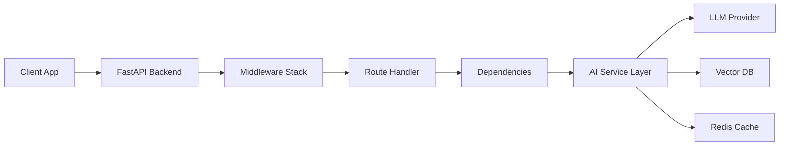
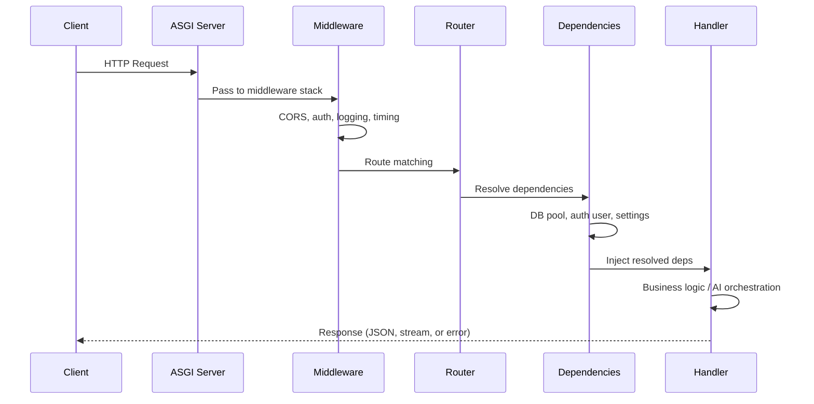
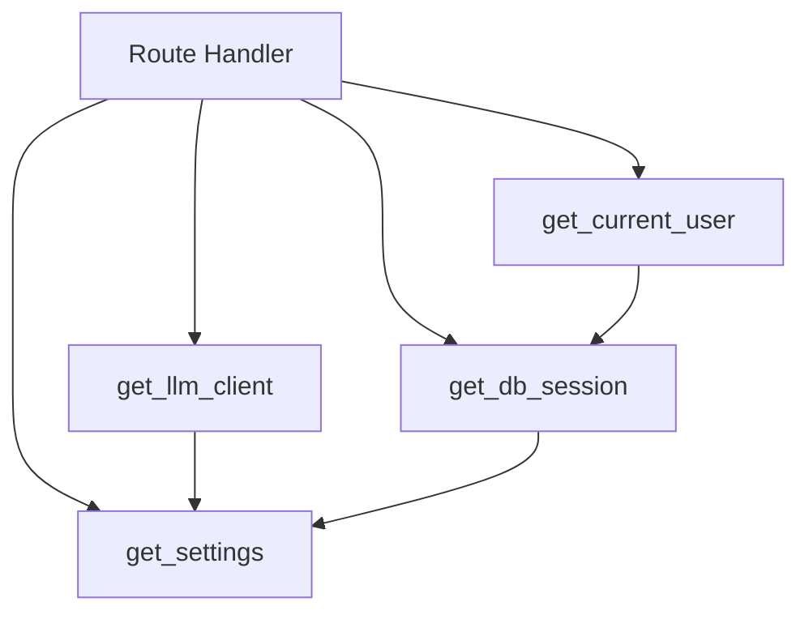
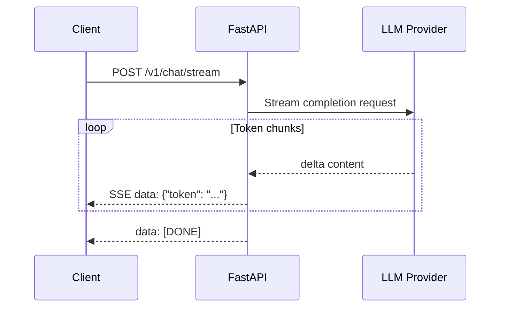

# Backend Fundamentals for AI

> The backend patterns every AI engineer needs before building production APIs — from request lifecycle to streaming LLM responses.

## Table of Contents

- [Why Backend Fundamentals Matter for AI](#why-backend-fundamentals-matter-for-ai)
- [FastAPI Overview](#fastapi-overview)
- [Request Lifecycle](#request-lifecycle)
- [Middleware](#middleware)
- [Dependency Injection](#dependency-injection)
- [Background Tasks](#background-tasks)
- [Async Endpoints](#async-endpoints)
- [File Uploads](#file-uploads)
- [Streaming APIs](#streaming-apis)
- [WebSockets](#websockets)
- [API Documentation](#api-documentation)
- [Production Considerations](#production-considerations)
- [Common Mistakes](#common-mistakes)
- [Interview Preparation](#interview-preparation)
- [Navigation](#navigation)

---

## Why Backend Fundamentals Matter for AI

AI applications are not notebooks with HTTP wrappers. They are backend services that accept user input, orchestrate model calls, manage state, stream tokens, handle failures, and expose documented APIs to clients.

| AI Product Need | Backend Capability Required |
|-----------------|----------------------------|
| Chat with streaming tokens | Streaming HTTP responses (SSE or chunked) |
| Document upload for RAG | Multipart file upload + validation |
| Long-running ingestion | Background tasks or job queues |
| Real-time agent updates | WebSockets or SSE |
| Multi-tenant SaaS | Auth middleware + dependency injection |
| Client SDK generation | OpenAPI documentation |

> **Production Standard:** Master HTTP and backend fundamentals first. Framework-specific depth comes in [FastAPI Foundation](../fastapi/fastapi-foundation.md); architectural discipline comes from [Software Engineering for AI](../foundations/software-engineering-for-ai.md).



---

## FastAPI Overview

[FastAPI](https://fastapi.tiangolo.com/) is the dominant Python framework for AI backends. It is built on **Starlette** (ASGI web toolkit) and **Pydantic** (data validation), giving you type-safe request/response models and automatic OpenAPI docs.

### Why FastAPI for AI Apps

| Feature | AI Engineering Benefit |
|---------|----------------------|
| Native `async`/`await` | Non-blocking LLM API calls |
| Pydantic models | Validate prompts, configs, tool schemas |
| Automatic OpenAPI | Frontend and SDK generation |
| Dependency injection | Swap LLM providers, DB connections in tests |
| Streaming support | Token-by-token chat responses |
| WebSocket support | Real-time agent status updates |

### Minimal AI-Ready Application

```python
from fastapi import FastAPI
from pydantic import BaseModel, Field

app = FastAPI(
    title="AI Assistant API",
    version="1.0.0",
    description="Foundation-level chat API for AI engineering playbook.",
)


class ChatRequest(BaseModel):
    message: str = Field(..., min_length=1, max_length=8000)
    session_id: str | None = None


class ChatResponse(BaseModel):
    reply: str
    session_id: str


@app.get("/health")
async def health() -> dict[str, str]:
    return {"status": "ok"}


@app.post("/v1/chat", response_model=ChatResponse)
async def chat(request: ChatRequest) -> ChatResponse:
    # In production: delegate to a service layer, not inline LLM calls
    reply = f"Echo: {request.message}"
    return ChatResponse(reply=reply, session_id=request.session_id or "new")
```

Run with an ASGI server:

```bash
uvicorn main:app --host 0.0.0.0 --port 8000 --reload
```

For deeper FastAPI patterns (lifespan, routers, testing), see [FastAPI Foundation](../fastapi/fastapi-foundation.md).

---

## Request Lifecycle

Understanding the request lifecycle prevents bugs in auth, logging, and error handling — especially when LLM calls add seconds of latency.



### Lifecycle Phases

1. **ASGI server** (Uvicorn, Hypercorn) receives the connection and parses HTTP.
2. **Middleware** runs outer-to-inner on the way in, inner-to-outer on the way out.
3. **Router** matches path and HTTP method to a handler function.
4. **Dependencies** resolve in declaration order (settings → DB session → current user).
5. **Handler** executes — ideally a thin layer calling a service.
6. **Response** serializes via Pydantic `response_model` or a `StreamingResponse`.
7. **Exception handlers** convert errors to consistent JSON bodies.

### Thin Route Handlers

```python
from fastapi import APIRouter, Depends

from app.services.chat import ChatService
from app.dependencies import get_chat_service

router = APIRouter(prefix="/v1", tags=["chat"])


@router.post("/chat")
async def chat(
    request: ChatRequest,
    service: ChatService = Depends(get_chat_service),
) -> ChatResponse:
    return await service.generate_reply(request)
```

This aligns with layered architecture described in [Software Engineering for AI](../foundations/software-engineering-for-ai.md). HTTP semantics (status codes, headers, content negotiation) are covered in [HTTP Fundamentals for AI](../apis/http-fundamentals-for-ai.md).

---

## Middleware

Middleware wraps every request. Use it for cross-cutting concerns — never for business logic.

### Common Middleware for AI Backends

| Middleware | Purpose |
|-----------|---------|
| CORS | Allow browser clients to call your API |
| Request ID | Correlate logs across LLM calls and DB queries |
| Auth validation | Verify JWT or API key before handlers run |
| Rate limiting | Protect expensive LLM endpoints |
| Timing / metrics | Measure p50/p99 latency per route |

### Custom Request-ID Middleware

```python
import time
import uuid
from starlette.middleware.base import BaseHTTPMiddleware
from starlette.requests import Request


class RequestContextMiddleware(BaseHTTPMiddleware):
    async def dispatch(self, request: Request, call_next):
        request_id = request.headers.get("X-Request-ID", str(uuid.uuid4()))
        request.state.request_id = request_id
        start = time.perf_counter()

        response = await call_next(request)

        duration_ms = (time.perf_counter() - start) * 1000
        response.headers["X-Request-ID"] = request_id
        response.headers["X-Response-Time-Ms"] = f"{duration_ms:.1f}"
        return response
```

Register middleware in order — first added runs last on the way in:

```python
from fastapi.middleware.cors import CORSMiddleware

app.add_middleware(
    CORSMiddleware,
    allow_origins=["https://app.example.com"],
    allow_methods=["GET", "POST"],
    allow_headers=["*"],
)
app.add_middleware(RequestContextMiddleware)
```

> **Production Standard:** Log `request_id` on every LLM call, retrieval query, and error. Without it, debugging production AI failures is guesswork.

---

## Dependency Injection

FastAPI's `Depends()` is its superpower. Dependencies are reusable, testable, and composable — critical when AI apps have many external integrations.



### Settings and LLM Client Dependencies

```python
from functools import lru_cache
from typing import Annotated

from fastapi import Depends
from pydantic_settings import BaseSettings


class Settings(BaseSettings):
    openai_api_key: str
    model_name: str = "gpt-4o-mini"
    max_tokens: int = 2048

    model_config = {"env_file": ".env"}


@lru_cache
def get_settings() -> Settings:
    return Settings()


def get_llm_client(
    settings: Annotated[Settings, Depends(get_settings)],
) -> "LLMClient":
    return OpenAILLMClient(api_key=settings.openai_api_key, model=settings.model_name)
```

### Database Session with Cleanup

```python
from collections.abc import AsyncGenerator

from sqlalchemy.ext.asyncio import AsyncSession


async def get_db_session() -> AsyncGenerator[AsyncSession, None]:
    async with async_session_factory() as session:
        try:
            yield session
            await session.commit()
        except Exception:
            await session.rollback()
            raise
```

### Why DI Matters for AI

- **Testing:** Override `get_llm_client` with a fake that returns deterministic responses.
- **Multi-provider:** Swap OpenAI, Anthropic, or local models without changing routes.
- **Per-request context:** Inject user tier to select model (`gpt-4o` vs `gpt-4o-mini`).
- **Resource management:** Ensure DB connections and HTTP clients close properly.

---

## Background Tasks

Not every AI operation should block the HTTP response. Use background tasks for fire-and-forget work that the client does not need immediately.

### When to Use Background Tasks vs Job Queues

| Scenario | Background Tasks | Celery / ARQ / Temporal |
|----------|-----------------|-------------------------|
| Send analytics event | ✅ | Overkill |
| Email notification after chat | ✅ | ✅ for reliability |
| Embed 5-page PDF | ⚠️ Risky if slow | ✅ |
| Reindex 10,000 documents | ❌ | ✅ Required |
| Survive server restart | ❌ | ✅ |

### FastAPI BackgroundTasks Example

```python
from fastapi import BackgroundTasks


async def log_conversation(session_id: str, prompt: str, reply: str) -> None:
    # Persist to analytics store — must be fast and fault-tolerant
    await analytics_repo.record(session_id, prompt, reply)


@app.post("/v1/chat")
async def chat(
    request: ChatRequest,
    background_tasks: BackgroundTasks,
    service: ChatService = Depends(get_chat_service),
) -> ChatResponse:
    response = await service.generate_reply(request)
    background_tasks.add_task(
        log_conversation,
        response.session_id,
        request.message,
        response.reply,
    )
    return response
```

> **Production Standard:** Background tasks run in the same process. If the worker crashes mid-task, work is lost. For ingestion pipelines and embedding jobs, use a durable queue.

---

## Async Endpoints

AI backends spend most of their time waiting — on LLM APIs, vector DB queries, and object storage. Async endpoints prevent thread pool exhaustion under concurrent load.

### Sync vs Async Decision Guide

| Operation | Use |
|-----------|-----|
| `await openai_client.chat.completions.create(...)` | `async def` |
| `await httpx.AsyncClient().get(...)` | `async def` |
| CPU-heavy PDF parsing | `def` + worker process |
| Blocking SDK with no async support | `run_in_executor` or sync `def` |

### Correct Async LLM Call

```python
import httpx
from openai import AsyncOpenAI


class OpenAILLMClient:
    def __init__(self, api_key: str, model: str) -> None:
        self._client = AsyncOpenAI(api_key=api_key, http_client=httpx.AsyncClient(timeout=60.0))
        self._model = model

    async def complete(self, prompt: str) -> str:
        response = await self._client.chat.completions.create(
            model=self._model,
            messages=[{"role": "user", "content": prompt}],
        )
        return response.choices[0].message.content or ""
```

### Anti-Pattern: Blocking Inside Async

```python
# ❌ Blocks the event loop — kills concurrency
@app.post("/chat")
async def chat(request: ChatRequest) -> ChatResponse:
    import time
    time.sleep(5)  # Never do this
    return ChatResponse(reply="...", session_id="1")


# ✅ Use async sleep or, better, await the actual I/O
@app.post("/chat")
async def chat(request: ChatRequest) -> ChatResponse:
    await asyncio.sleep(0)  # placeholder; real code awaits I/O
    return ChatResponse(reply="...", session_id="1")
```

Async fundamentals in Python are covered in [Python for AI Engineering](../python-engineering/python-for-ai-engineering.md).

---

## File Uploads

RAG pipelines start with file uploads. Handle them safely: validate type and size, scan if required, store in object storage, and process asynchronously.

```python
from fastapi import File, UploadFile, HTTPException, status


ALLOWED_TYPES = {"application/pdf", "text/plain", "text/markdown"}
MAX_BYTES = 10 * 1024 * 1024  # 10 MB


@app.post("/v1/documents/upload", status_code=status.HTTP_202_ACCEPTED)
async def upload_document(
    file: UploadFile = File(...),
    background_tasks: BackgroundTasks = None,
    ingestion_service: IngestionService = Depends(get_ingestion_service),
) -> dict[str, str]:
    if file.content_type not in ALLOWED_TYPES:
        raise HTTPException(status_code=400, detail="Unsupported file type")

    contents = await file.read()
    if len(contents) > MAX_BYTES:
        raise HTTPException(status_code=413, detail="File too large")

    doc_id = await ingestion_service.stage_upload(file.filename, contents)
    background_tasks.add_task(ingestion_service.process_document, doc_id)

    return {"document_id": doc_id, "status": "processing"}
```

### Upload Production Checklist

- Validate MIME type and magic bytes (do not trust client-provided type alone).
- Enforce per-user and global size limits.
- Store files in S3/GCS, not local disk, in production.
- Return `202 Accepted` with a job ID for long ingestion.
- Never pass raw file bytes directly into an LLM prompt.

---

## Streaming APIs

Streaming is essential for chat UX. Users see tokens appear immediately instead of staring at a spinner for 10+ seconds.



### Server-Sent Events (SSE) Pattern

```python
import json
from collections.abc import AsyncGenerator

from fastapi.responses import StreamingResponse


async def token_stream(prompt: str) -> AsyncGenerator[str, None]:
    async for chunk in llm_client.stream(prompt):
        payload = json.dumps({"token": chunk})
        yield f"data: {payload}\n\n"
    yield "data: [DONE]\n\n"


@app.post("/v1/chat/stream")
async def chat_stream(request: ChatRequest) -> StreamingResponse:
    return StreamingResponse(
        token_stream(request.message),
        media_type="text/event-stream",
        headers={
            "Cache-Control": "no-cache",
            "Connection": "keep-alive",
            "X-Accel-Buffering": "no",  # Disable nginx buffering
        },
    )
```

### Streaming Considerations

- Set `X-Accel-Buffering: no` behind nginx or tokens batch instead of stream.
- Implement client disconnect detection to stop billing LLM tokens.
- Use heartbeat comments (`: ping\n\n`) for long gaps between tokens.
- Log total tokens and latency when the stream completes, not per chunk in hot paths.

---

## WebSockets

Use WebSockets when the server must push multiple messages to the client — agent step updates, tool call results, or collaborative editing.

```python
from fastapi import WebSocket, WebSocketDisconnect


@app.websocket("/ws/agent/{session_id}")
async def agent_ws(websocket: WebSocket, session_id: str) -> None:
    await websocket.accept()
    try:
        while True:
            user_message = await websocket.receive_json()
            await websocket.send_json({"type": "status", "message": "thinking"})

            async for event in agent_service.run(session_id, user_message["text"]):
                await websocket.send_json(event)

            await websocket.send_json({"type": "done"})
    except WebSocketDisconnect:
        await agent_service.cleanup_session(session_id)
```

### WebSocket vs SSE

| Factor | SSE | WebSocket |
|--------|-----|-----------|
| Direction | Server → client | Bidirectional |
| Browser support | Excellent | Excellent |
| Load balancer friendliness | Good | Requires sticky sessions or pub/sub |
| Best for | Token streaming chat | Agent orchestration with tool callbacks |
| Reconnection | Built-in `EventSource` retry | Manual |

---

## API Documentation

FastAPI auto-generates **OpenAPI** (Swagger) docs at `/docs` and ReDoc at `/redoc`. For AI APIs, good documentation is a product feature — it drives frontend integration and external developer adoption.

### Improving Generated Docs

```python
from fastapi import FastAPI

app = FastAPI(
    title="RAG Assistant API",
    version="1.0.0",
    openapi_tags=[
        {"name": "chat", "description": "Synchronous and streaming chat endpoints"},
        {"name": "documents", "description": "Upload and manage knowledge base files"},
        {"name": "health", "description": "Liveness and readiness probes"},
    ],
)


@router.post(
    "/chat",
    summary="Generate a chat completion",
    response_description="Assistant reply with session metadata",
    responses={
        429: {"description": "Rate limit exceeded"},
        503: {"description": "LLM provider unavailable"},
    },
)
async def chat(request: ChatRequest) -> ChatResponse:
    ...
```

### Documentation Production Checklist

- Add `description` and `example` fields to Pydantic models.
- Document error response schemas consistently.
- Disable `/docs` in production or protect behind auth.
- Export OpenAPI spec in CI for client SDK generation.
- Version your API (`/v1/`) and document deprecation policy.

---

## Production Considerations

| Area | Foundation Practice |
|------|-------------------|
| **Health checks** | `/health` (liveness) + `/ready` (DB, LLM reachable) |
| **Timeouts** | Set on all external calls; LLM default 60–120s |
| **Graceful shutdown** | ASGI lifespan closes DB pools and HTTP clients |
| **Error responses** | Consistent JSON: `{"error": {"code": "...", "message": "..."}}` |
| **Secrets** | Environment variables via Pydantic Settings |
| **CORS** | Restrict origins in production |
| **Request limits** | Body size, rate limits, max tokens |
| **Observability** | Structured logs with `request_id`, trace LLM latency |
| **Deployment** | Uvicorn behind nginx/ALB; multiple workers for CPU-bound sync code |

```python
from contextlib import asynccontextmanager


@asynccontextmanager
async def lifespan(app: FastAPI):
    await db_pool.connect()
    yield
    await db_pool.disconnect()
    await httpx_client.aclose()


app = FastAPI(lifespan=lifespan)
```

---

## Common Mistakes

| Mistake | Impact | Fix |
|---------|--------|-----|
| LLM calls directly in route handlers | Untestable, tangled code | Service layer + DI |
| Blocking I/O inside `async def` | Event loop stalls, timeouts cascade | `AsyncOpenAI`, `httpx.AsyncClient` |
| Using background tasks for heavy ingestion | Lost jobs, OOM kills | Durable job queue |
| No request timeouts on LLM calls | Hung connections, resource leaks | Explicit `timeout=` on clients |
| Streaming without disconnect handling | Wasted tokens and cost | Monitor `request.is_disconnected()` |
| Trusting uploaded file MIME types | Malware, prompt injection via files | Magic-byte validation + sandboxed parsing |
| Exposing `/docs` publicly | Attack surface, schema leakage | Disable or auth-gate in production |
| Missing health/readiness endpoints | Bad deploys reach production | Separate liveness and readiness |

---

## Interview Preparation

### Frequently Asked Questions

**Q1: Walk through what happens when a FastAPI request hits your AI chat endpoint.**

> **Strong answer:** Describe ASGI server → middleware (CORS, auth, logging) → router match → dependency resolution (settings, DB, LLM client) → thin handler calling service → async LLM call → Pydantic response serialization. Mention where you would add streaming and error handling.

**Q2: When would you use streaming vs a standard JSON response for an LLM endpoint?**

> **Strong answer:** Streaming for interactive chat UX (SSE or chunked transfer). JSON for batch/offline use, structured outputs, or when the client needs the complete response for parsing. Mention disconnect handling and cost implications.

**Q3: How do you structure dependencies in an AI backend?**

> **Strong answer:** Layer dependencies: settings (cached) → infrastructure clients (LLM, vector DB) → per-request resources (DB session, user context) → services. Explain test overrides via `app.dependency_overrides`.

**Q4: Background tasks vs Celery — how do you decide?**

> **Strong answer:** Background tasks for fast, best-effort side effects in the same process. Celery/ARQ for durable, retryable, long-running work like document ingestion. Mention failure modes if the process dies.

### Real-World Scenario

**Scenario:** Your chat API works in development but times out in production under 50 concurrent users. Logs show all requests finishing eventually but clients disconnect.

> **Discussion points:** Check for blocking calls in async handlers. Verify connection pool sizes. Check reverse proxy timeouts (nginx default 60s). Consider streaming to keep connections alive. Review worker count and event loop saturation.

---

## Navigation

### Prerequisites

- [Software Engineering for AI](../foundations/software-engineering-for-ai.md) — layered architecture and DI concepts
- [HTTP Fundamentals for AI](../apis/http-fundamentals-for-ai.md) — methods, status codes, headers
- [Python for AI Engineering](../python-engineering/python-for-ai-engineering.md) — async/await and type hints

### Related Topics

- [FastAPI Foundation](../fastapi/fastapi-foundation.md) — deeper FastAPI patterns for AI apps
- [Software Engineering for AI](../foundations/software-engineering-for-ai.md) — service layer and project structure

### Next Topics

- [FastAPI Foundation](../fastapi/fastapi-foundation.md) — routers, testing, lifespan, AI-specific patterns
- [HTTP Fundamentals for AI](../apis/http-fundamentals-for-ai.md) — authentication, caching, API design

### Future Reading

- [FastAPI domain](../fastapi/README.md) — advanced FastAPI guides (coming soon)
- [AI Application Architecture](../ai-application-architecture/README.md)
- [Observability](../observability/README.md) — logging, tracing, metrics for AI services
- [Model Serving](../model-serving/README.md)

---

## See Also

- [FastAPI Official Documentation](https://fastapi.tiangolo.com/)
- [Starlette Documentation](https://www.starlette.io/)
- [Uvicorn Deployment Guide](https://www.uvicorn.org/deployment/)

## Changelog

| Version | Date | Changes |
|---------|------|---------|
| 1.0 | 2026-07-13 | Initial foundation release |
