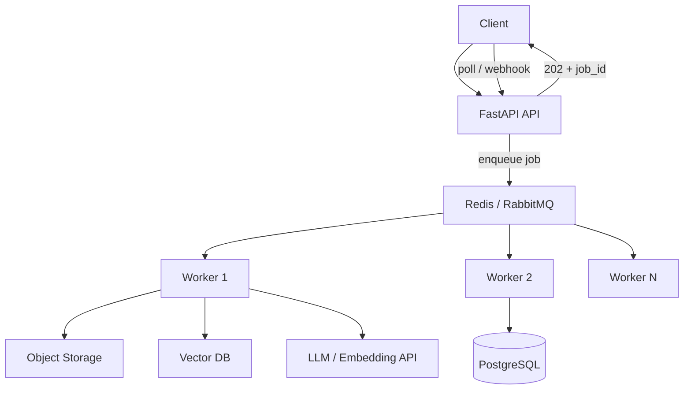
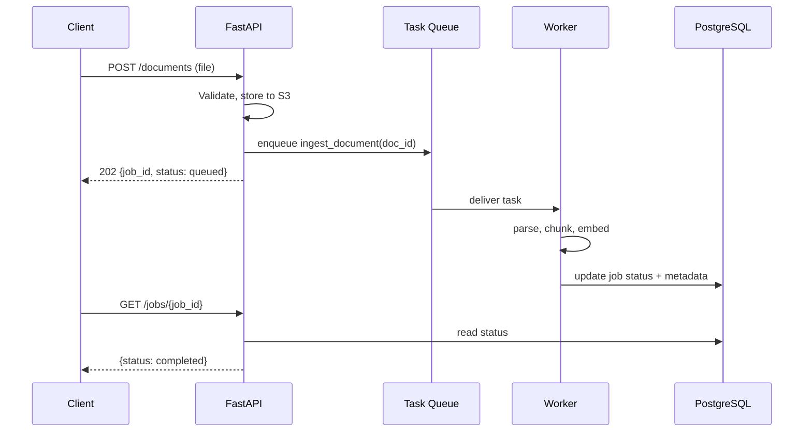
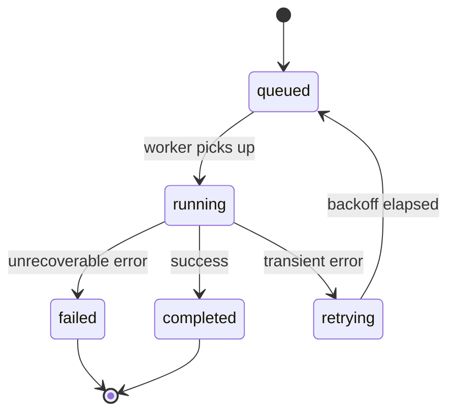
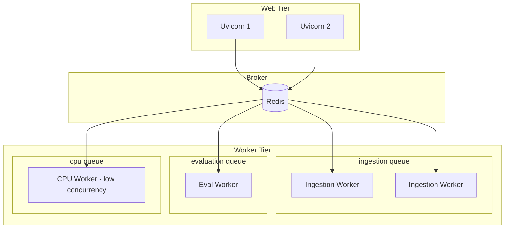

# Background Processing for AI

> How to move long-running AI work off the request path — task queues, worker pools, retries, and production patterns for ingestion, embedding, reporting, and evaluation jobs.

## Table of Contents

- [Why Background Processing Matters for AI](#why-background-processing-matters-for-ai)
- [Request Path vs Background Path](#request-path-vs-background-path)
- [Choosing the Right Tool](#choosing-the-right-tool)
- [FastAPI BackgroundTasks Recap](#fastapi-backgroundtasks-recap)
- [Task Queue Fundamentals](#task-queue-fundamentals)
- [Celery Overview](#celery-overview)
- [Redis as a Message Broker](#redis-as-a-message-broker)
- [ARQ: Async Redis Queues](#arq-async-redis-queues)
- [Worker Architecture](#worker-architecture)
- [Long-Running AI Task Patterns](#long-running-ai-task-patterns)
- [Document Ingestion Pipeline](#document-ingestion-pipeline)
- [Embedding Generation Jobs](#embedding-generation-jobs)
- [Report Generation Jobs](#report-generation-jobs)
- [AI Evaluation Jobs](#ai-evaluation-jobs)
- [Retries, Idempotency, and Dead Letters](#retries-idempotency-and-dead-letters)
- [Monitoring and Observability](#monitoring-and-observability)
- [Production Considerations](#production-considerations)
- [Common Mistakes](#common-mistakes)
- [Interview Preparation](#interview-preparation)
- [Navigation](#navigation)

---

## Why Background Processing Matters for AI

AI workloads routinely exceed HTTP timeout budgets. Embedding a 200-page PDF, running a batch evaluation over 5,000 prompts, or generating a multi-section report can take minutes — not milliseconds. Blocking the API thread for that duration wastes connection pools, triggers proxy timeouts, and delivers a poor user experience.

| AI Workload | Typical Duration | Run in Request? | Background Job? |
|-------------|-----------------|-----------------|-----------------|
| Chat completion (streaming) | 2–30s | ✅ Stream on request | ❌ |
| Single PDF ingestion | 30s–5min | ❌ | ✅ |
| Batch embedding (10k chunks) | 5–30min | ❌ | ✅ |
| Nightly eval suite | 10–60min | ❌ | ✅ |
| Analytics logging | <100ms | ✅ BackgroundTasks | Optional |

> **Production Standard:** Accept the upload or trigger the job synchronously, return `202 Accepted` with a `job_id`, and let workers handle the heavy lifting. Poll or push status updates to the client.



---

## Request Path vs Background Path

The **request path** handles authentication, validation, enqueueing, and immediate responses. The **background path** handles parsing, chunking, embedding, evaluation, and any work that can fail and retry without the user holding an open HTTP connection.



Separation keeps your API responsive and lets you scale workers independently of web server replicas.

---

## Choosing the Right Tool

| Tool | Model | Best For | Trade-offs |
|------|-------|----------|------------|
| **FastAPI BackgroundTasks** | In-process, fire-and-forget | Analytics, email, fast side effects | Lost on crash, no retries |
| **ARQ** | Async Redis queue | Async Python workers, FastAPI ecosystem | Smaller ecosystem than Celery |
| **Celery** | Distributed task queue | Mature, complex workflows, many integrations | Heavier ops, sync-first |
| **RQ (Redis Queue)** | Simple Redis queue | Small teams, straightforward jobs | Limited workflow features |
| **Temporal / Prefect** | Durable workflow engines | Multi-step pipelines with compensation | Higher learning curve |

For most AI backends starting out: **ARQ** if your workers are fully async; **Celery** if you need mature scheduling, chains, and a large plugin ecosystem.

---

## FastAPI BackgroundTasks Recap

[Backend Fundamentals](backend-fundamentals-for-ai.md) covers `BackgroundTasks` for lightweight side effects. Use them only when losing the task on process restart is acceptable.

```python
from fastapi import BackgroundTasks, FastAPI

app = FastAPI()


async def record_token_usage(session_id: str, tokens: int) -> None:
    await usage_repo.increment(session_id, tokens)


@app.post("/v1/chat")
async def chat(
    request: ChatRequest,
    background_tasks: BackgroundTasks,
    service: ChatService = Depends(get_chat_service),
) -> ChatResponse:
    response = await service.generate_reply(request)
    background_tasks.add_task(record_token_usage, response.session_id, response.total_tokens)
    return response
```

**Do not** use `BackgroundTasks` for document ingestion, batch embedding, or evaluation runs.

---

## Task Queue Fundamentals

Every durable queue shares the same concepts:

| Concept | Description |
|---------|-------------|
| **Broker** | Message transport (Redis, RabbitMQ, SQS) |
| **Worker** | Process that pulls and executes tasks |
| **Task** | Serializable function call + arguments |
| **Result backend** | Optional store for task return values |
| **Retry policy** | Re-queue on transient failure |
| **Visibility timeout** | How long a task is hidden while being processed |
| **Dead letter queue** | Parking lot for permanently failed tasks |

### Job State Machine



Persist job status in PostgreSQL (source of truth) even when the broker tracks delivery. Clients query your DB, not the broker directly.

---

## Celery Overview

[Celery](https://docs.celeryq.dev/) is the most widely deployed Python task queue. It supports Redis and RabbitMQ brokers, periodic tasks (beat), task chains, chords, and routing to dedicated queues.

### Project Layout

```
app/
├── api/
│   └── routes/documents.py      # enqueue only
├── tasks/
│   ├── celery_app.py            # Celery instance
│   ├── ingestion.py             # ingest_document task
│   └── evaluation.py            # run_eval_suite task
└── workers/
    └── Dockerfile               # separate image optional
```

### Celery Application Setup

```python
# app/tasks/celery_app.py
from celery import Celery

celery_app = Celery(
    "ai_platform",
    broker="redis://redis:6379/0",
    backend="redis://redis:6379/1",
    include=["app.tasks.ingestion", "app.tasks.evaluation"],
)

celery_app.conf.update(
    task_serializer="json",
    accept_content=["json"],
    result_serializer="json",
    timezone="UTC",
    task_acks_late=True,           # ack after completion, not before
    task_reject_on_worker_lost=True,
    worker_prefetch_multiplier=1,  # fair distribution for long AI tasks
    task_default_queue="default",
    task_routes={
        "app.tasks.ingestion.*": {"queue": "ingestion"},
        "app.tasks.evaluation.*": {"queue": "evaluation"},
    },
)
```

### Defining a Task

```python
# app/tasks/ingestion.py
from app.tasks.celery_app import celery_app
from app.services.ingestion import IngestionService


@celery_app.task(
    bind=True,
    name="ingest_document",
    max_retries=3,
    default_retry_delay=60,
    autoretry_for=(ConnectionError, TimeoutError),
    retry_backoff=True,
    retry_jitter=True,
)
def ingest_document(self, document_id: str) -> dict:
    service = IngestionService()
    try:
        result = service.run_sync(document_id)  # sync inside Celery worker
        return {"document_id": document_id, "chunks": result.chunk_count}
    except PermanentIngestionError as exc:
        service.mark_failed(document_id, str(exc))
        raise
```

### Enqueueing from FastAPI

```python
from app.tasks.ingestion import ingest_document


@app.post("/v1/documents", status_code=status.HTTP_202_ACCEPTED)
async def upload_document(
    file: UploadFile = File(...),
    user: User = Depends(get_current_user),
    storage: StorageService = Depends(get_storage_service),
) -> JobResponse:
    doc_id = str(uuid.uuid4())
    await storage.put_object(f"uploads/{doc_id}", file)
    await job_repo.create(job_id=doc_id, user_id=user.id, status="queued")

    ingest_document.apply_async(args=[doc_id], queue="ingestion")

    return JobResponse(job_id=doc_id, status="queued")
```

Run workers separately:

```bash
celery -A app.tasks.celery_app worker -Q ingestion,evaluation -c 4 --loglevel=info
celery -A app.tasks.celery_app beat --loglevel=info   # periodic tasks
```

---

## Redis as a Message Broker

Redis is a popular Celery broker for AI backends because teams already run Redis for caching and rate limiting. See [Redis for AI](../databases/redis/redis-for-ai.md) for caching patterns; here Redis acts as the **message transport**.

| Setting | Recommendation for AI Jobs |
|---------|---------------------------|
| `task_acks_late=True` | Prevent task loss if worker dies mid-embedding |
| `worker_prefetch_multiplier=1` | Long tasks should not hoard messages |
| Separate Redis DB indexes | Broker DB 0, result backend DB 1, cache DB 2 |
| Memory limits | Large task payloads → store IDs in Redis, blobs in S3 |
| Persistence (AOF/RDB) | Reduces message loss on Redis restart |

> **Production Standard:** Pass **references** (document IDs, S3 keys) in task messages — not file bytes or embedding vectors. Large payloads bloat Redis memory and slow serialization.

---

## ARQ: Async Redis Queues

[ARQ](https://arq-docs.helpmanual.io/) runs async Python functions as Redis-backed jobs — a natural fit when your workers already use `httpx`, `AsyncOpenAI`, and `asyncpg`.

```python
# app/tasks/arq_worker.py
from arq import create_pool
from arq.connections import RedisSettings

from app.services.ingestion import IngestionService


async def ingest_document(ctx: dict, document_id: str) -> dict:
    service = IngestionService()
    result = await service.run(document_id)
    return {"document_id": document_id, "chunks": result.chunk_count}


class WorkerSettings:
    functions = [ingest_document]
    redis_settings = RedisSettings(host="redis", port=6379, database=3)
    max_jobs = 10
    job_timeout = 600  # 10 minutes for large PDFs
    retry_jobs = True
    max_tries = 3
```

Enqueue from FastAPI:

```python
from arq import create_pool
from arq.connections import RedisSettings


@app.on_event("startup")
async def startup() -> None:
    app.state.arq_pool = await create_pool(RedisSettings(host="redis", database=3))


@app.post("/v1/documents", status_code=status.HTTP_202_ACCEPTED)
async def upload_document(file: UploadFile, request: Request) -> JobResponse:
    doc_id = await stage_upload(file)
    await request.app.state.arq_pool.enqueue_job("ingest_document", doc_id)
    return JobResponse(job_id=doc_id, status="queued")
```

Run the worker:

```bash
arq app.tasks.arq_worker.WorkerSettings
```

---

## Worker Architecture

Scale web servers and workers independently. AI ingestion workers are often **I/O-bound** (LLM APIs, vector DB) or **CPU-bound** (PDF parsing) — size pools accordingly.



### Queue Routing Strategy

| Queue | Concurrency | Workload |
|-------|-------------|----------|
| `ingestion` | Medium (4–8) | PDF parse + embed API calls |
| `evaluation` | Low (2–4) | LLM-heavy eval suites |
| `cpu` | Low (1–2) | OCR, audio transcoding |
| `default` | Medium | Reports, notifications |

Run dedicated worker processes per queue so a flooded ingestion backlog does not starve evaluation jobs.

### Worker Deployment Checklist

- Separate Docker image or entrypoint from the API container
- Set memory limits — embedding batches can spike RAM
- Configure graceful shutdown (finish in-flight task before SIGTERM)
- Use health checks that verify broker connectivity
- Pin worker count to CPU cores for CPU-bound parsers

---

## Long-Running AI Task Patterns

### Chunked Progress Updates

Long jobs should report incremental progress so clients show meaningful UI.

```python
async def ingest_document(document_id: str) -> None:
    await job_repo.update(document_id, status="running", progress=0)

    pages = await parser.extract_pages(document_id)
    total = len(pages)

    for i, page in enumerate(pages):
        chunks = chunker.split(page.text)
        embeddings = await embed_client.embed_batch(chunks)
        await vector_repo.upsert(document_id, chunks, embeddings)

        progress = int((i + 1) / total * 100)
        await job_repo.update(document_id, progress=progress)

    await job_repo.update(document_id, status="completed", progress=100)
```

### Cancellation

Support user-initiated cancellation by checking a flag between chunks:

```python
for batch in chunk_batches(text, size=50):
    if await job_repo.is_cancelled(document_id):
        await job_repo.update(document_id, status="cancelled")
        return
    await process_batch(batch)
```

### Rate Limit Awareness

Workers share the same provider rate limits as the API. Implement token buckets or semaphores (Redis-based) across workers to avoid 429 storms.

---

## Document Ingestion Pipeline

The canonical background job in RAG systems: accept a file, parse it, chunk text, embed, and index.


```python
@celery_app.task(name="ingest_document", bind=True, max_retries=3)
def ingest_document(self, document_id: str) -> None:
    pipeline = IngestionPipeline(
        storage=S3Storage(),
        parser=PdfParser(),
        chunker=RecursiveCharacterChunker(size=512, overlap=64),
        embedder=OpenAIEmbedder(model="text-embedding-3-small"),
        vector_store=QdrantStore(),
    )
    pipeline.run(document_id)
```

Key decisions:

- **Idempotency:** Re-running ingestion for the same `document_id` should replace vectors, not duplicate them.
- **Versioning:** Store `content_hash` to skip re-processing unchanged files.
- **Isolation:** Parse in a sandboxed subprocess if accepting arbitrary uploads.

See [File Handling for AI](file-handling-for-ai.md) for upload and storage patterns.

---

## Embedding Generation Jobs

Embedding jobs are often batched for throughput and cost efficiency.

```python
@celery_app.task(name="embed_chunks", queue="ingestion")
def embed_chunks(document_id: str, chunk_ids: list[str]) -> int:
    chunks = chunk_repo.get_by_ids(chunk_ids)
    texts = [c.text for c in chunks]

    # Batch API calls — typically 100-500 texts per request
    vectors = []
    for batch in batched(texts, n=128):
        vectors.extend(embed_client.embed_sync(batch))

    vector_repo.upsert_batch(document_id, chunk_ids, vectors)
    return len(vectors)
```

| Pattern | When to Use |
|---------|-------------|
| Inline embed during ingestion | Simple pipelines, small documents |
| Separate embed task | Re-embed on model change without re-parsing |
| Scheduled re-embedding | Embedding model upgrades across corpus |

---

## Report Generation Jobs

Report generation combines retrieval, multiple LLM calls, and document assembly — easily 2–10 minutes per report.

```python
@celery_app.task(name="generate_report", queue="default", time_limit=900)
def generate_report(report_id: str, template_id: str, params: dict) -> None:
    report_repo.mark_running(report_id)

    sections = template_repo.get_sections(template_id)
    rendered = []

    for section in sections:
        context = retriever.fetch(params["query"], top_k=10)
        content = llm_client.complete_sync(section.prompt, context=context)
        rendered.append({"title": section.title, "body": content})

    pdf_bytes = pdf_builder.build(rendered)
    storage.put(f"reports/{report_id}.pdf", pdf_bytes)
    report_repo.mark_completed(report_id, url=storage.url(f"reports/{report_id}.pdf"))
```

Notify the user via webhook or email when the report is ready — do not hold the HTTP connection.

---

## AI Evaluation Jobs

Offline evaluation suites belong entirely in background workers. They run hundreds or thousands of LLM calls against golden datasets.

```python
@celery_app.task(name="run_eval_suite", queue="evaluation")
def run_eval_suite(suite_id: str, run_id: str) -> None:
    suite = eval_repo.get_suite(suite_id)
    cases = suite.test_cases

    results = []
    for case in cases:
        prediction = rag_service.answer(case.input)
        score = scorer.evaluate(prediction, case.expected)
        results.append({"case_id": case.id, "score": score})
        eval_repo.append_result(run_id, case.id, score)

    eval_repo.finalize_run(run_id, aggregate=mean(r["score"] for r in results))
```

Schedule nightly eval runs with Celery Beat:

```python
celery_app.conf.beat_schedule = {
    "nightly-rag-eval": {
        "task": "run_eval_suite",
        "schedule": crontab(hour=2, minute=0),
        "args": ["rag-regression-v1", "auto"],
    },
}
```

See [AI Evaluation](../ai-evaluation/README.md) for metrics and harness design.

---

## Retries, Idempotency, and Dead Letters

### Retry Policy Guidelines

| Error Type | Action |
|------------|--------|
| `429` / `503` from LLM API | Retry with exponential backoff + jitter |
| Network timeout | Retry (max 3–5) |
| Invalid PDF / corrupt file | Fail permanently, no retry |
| OOM during parse | Retry on different worker with lower concurrency |
| Duplicate task delivery | Idempotent handler |

### Idempotency Keys

```python
def ingest_document(document_id: str) -> None:
    lock_key = f"ingest:lock:{document_id}"
    if not redis.set(lock_key, "1", nx=True, ex=3600):
        logger.info("ingestion_already_running", document_id=document_id)
        return

    try:
        # delete old vectors before re-indexing
        vector_repo.delete_by_document(document_id)
        run_pipeline(document_id)
    finally:
        redis.delete(lock_key)
```

### Dead Letter Handling

After max retries, move the job to a failed state and alert:

```python
@celery_app.task(bind=True)
def ingest_document(self, document_id: str) -> None:
    try:
        run_pipeline(document_id)
    except MaxRetriesExceededError:
        job_repo.mark_failed(document_id, reason="max_retries_exceeded")
        alerting.send(f"Ingestion failed permanently: {document_id}")
        raise
```

---

## Monitoring and Observability

| Signal | What to Track |
|--------|---------------|
| Queue depth | Backlog growth → scale workers |
| Task duration p99 | Detect slow embeddings or API degradation |
| Retry rate | Provider instability or bad input data |
| Failure rate by task type | Pinpoint brittle pipeline stages |
| Worker memory | OOM risk during large PDF jobs |

```python
import structlog

logger = structlog.get_logger()


@celery_app.task(bind=True)
def ingest_document(self, document_id: str) -> None:
    log = logger.bind(task_id=self.request.id, document_id=document_id)
    log.info("ingestion_started")
    start = time.perf_counter()
    try:
        run_pipeline(document_id)
        log.info("ingestion_completed", duration_s=time.perf_counter() - start)
    except Exception:
        log.exception("ingestion_failed", duration_s=time.perf_counter() - start)
        raise
```

Integrate with Flower (Celery monitoring), Prometheus exporters, or your APM of choice. Correlate `task_id` with `request_id` from the originating API call.

---

## Production Considerations

| Area | Practice |
|------|----------|
| **Payload size** | Pass IDs and S3 keys only |
| **Timeouts** | Set `time_limit` and `soft_time_limit` on long AI tasks |
| **Concurrency** | Lower prefetch for long tasks; match CPU workers to cores |
| **Graceful shutdown** | Drain workers on deploy; use `task_acks_late` |
| **Secrets** | Workers load same env config as API; no secrets in task args |
| **Horizontal scaling** | Add workers when queue depth sustains high |
| **Priority** | Separate queues over priority levels when possible |
| **Scheduled jobs** | Celery Beat or external scheduler (Kubernetes CronJob) |

```python
# Separate queues prevent eval jobs from starving ingestion
celery_app.conf.task_routes = {
    "ingest_*": {"queue": "ingestion"},
    "run_eval_*": {"queue": "evaluation"},
    "transcode_*": {"queue": "cpu"},
}
```

---

## Common Mistakes

| Mistake | Impact | Fix |
|---------|--------|-----|
| Heavy work in `BackgroundTasks` | Lost jobs, OOM, timeouts | Durable queue |
| Passing file bytes in task messages | Redis memory blow-up | Store in S3, pass key |
| No job status in PostgreSQL | Clients poll broker incorrectly | DB as status source of truth |
| Unbounded worker concurrency | Rate limit bans, OOM | Queue-specific concurrency limits |
| Missing idempotency | Duplicate vectors on retry | Delete-then-insert or upsert by ID |
| Same queue for all task types | Eval backlog blocks ingestion | Route to dedicated queues |
| No `time_limit` on LLM tasks | Zombie workers | Hard and soft time limits |
| Ignoring graceful shutdown | Corrupt partial indexes | `acks_late` + drain on deploy |

---

## Interview Preparation

### Frequently Asked Questions

**Q1: When would you use FastAPI BackgroundTasks vs Celery?**

> **Strong answer:** BackgroundTasks for fast, best-effort side effects in the same process — logging, analytics, sending a quick email. Celery (or ARQ) when work must survive restarts, retry on failure, run for minutes, or scale on separate workers. Give the ingestion example: 202 Accepted + job ID + worker pipeline.

**Q2: How do you design a document ingestion pipeline for RAG?**

> **Strong answer:** Upload to object storage → enqueue job with document ID → worker parses, chunks, embeds, upserts to vector DB → update job status in PostgreSQL. Mention idempotency, progress reporting, cancellation, and not blocking HTTP.

**Q3: How do you handle retries for LLM API failures in workers?**

> **Strong answer:** Distinguish transient (429, 503, timeout) from permanent (400, invalid file). Use exponential backoff with jitter, cap max retries, and dead-letter permanently failed jobs. Coordinate rate limits across workers with Redis semaphores.

**Q4: How do you scale workers for AI workloads?**

> **Strong answer:** Separate web and worker tiers. Route queues by workload type (ingestion, eval, CPU). Set prefetch to 1 for long tasks. Scale ingestion workers on queue depth. Pin CPU-bound parsers to low concurrency. Monitor p99 task duration and failure rates.

### Real-World Scenario

**Scenario:** Users upload PDFs and sometimes see "processing" for hours. Queue depth is 10,000 and ingestion workers show 90% CPU.

> **Discussion points:** Check if PDF parsing is CPU-bound on I/O-scaled workers. Consider a dedicated `cpu` queue with fewer concurrency. Verify tasks are not re-queued infinitely on bad files. Add dead-letter handling. Consider splitting parse and embed into separate tasks for better parallelism.

---

## Navigation

### Prerequisites

- [Backend Fundamentals for AI](backend-fundamentals-for-ai.md) — FastAPI, BackgroundTasks overview
- [Python for AI Engineering](../python-engineering/python-for-ai-engineering.md) — async and concurrency basics
- [Redis for AI](../databases/redis/redis-for-ai.md) — Redis as cache and broker

### Related Topics

- [File Handling for AI](file-handling-for-ai.md) — uploads and storage before ingestion jobs
- [Async Programming for AI Backends](async-programming-for-ai-backends.md) — async workers with ARQ
- [RAG](../rag/README.md) — retrieval pipelines fed by ingestion jobs

### Next Topics

- [Async Programming for AI Backends](async-programming-for-ai-backends.md) — event loop and non-blocking I/O
- [File Handling for AI](file-handling-for-ai.md) — streaming uploads and multimodal files

### Future Reading

- [AI Evaluation](../ai-evaluation/README.md) — eval harnesses and metrics
- [Observability](../observability/README.md) — tracing background jobs
- [Data Engineering](../data-engineering/README.md) — large-scale pipeline patterns

---

## See Also

- [Celery Documentation](https://docs.celeryq.dev/)
- [ARQ Documentation](https://arq-docs.helpmanual.io/)
- [Redis for AI](../databases/redis/redis-for-ai.md)

## Changelog

| Version | Date | Changes |
|---------|------|---------|
| 1.0 | 2026-07-13 | Initial Phase 3 release |
