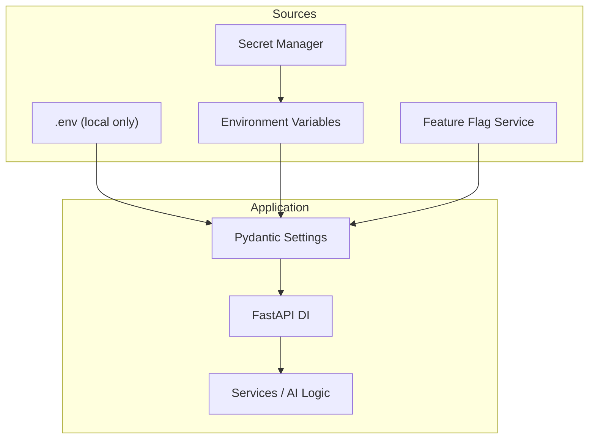
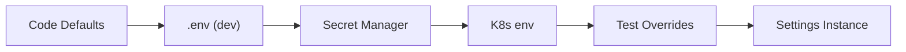
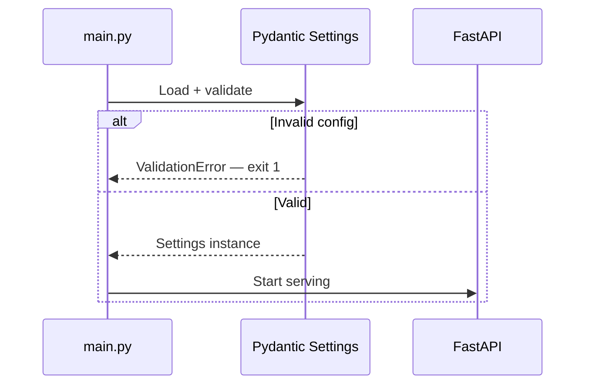

# Configuration Management for Backends

> reference for wiring configuration into production AI backends — typed settings, environment separation, secrets, feature flags, and safe runtime overrides.

## Table of Contents

- [Overview](#overview)
- [Configuration vs Secrets](#configuration-vs-secrets)
- [Project Layout for Configuration](#project-layout-for-configuration)
- [Environment Variables and .env Files](#environment-variables-and-env-files)
- [Pydantic Settings Classes](#pydantic-settings-classes)
- [Settings Hierarchy and Precedence](#settings-hierarchy-and-precedence)
- [Environment Separation](#environment-separation)
- [Secrets in Backend Services](#secrets-in-backend-services)
- [FastAPI Integration](#fastapi-integration)
- [Feature Flags](#feature-flags)
- [Runtime Configuration](#runtime-configuration)
- [AI-Specific Configuration](#ai-specific-configuration)
- [Validation and Fail-Fast](#validation-and-fail-fast)
- [Testing Configuration](#testing-configuration)
- [Best Practices](#best-practices)
- [Production Considerations](#production-considerations)
- [Common Mistakes](#common-mistakes)
- [Interview Preparation](#interview-preparation)
- [Navigation](#navigation)

---

## Overview

Configuration management is how your AI backend **learns where it runs, which models to call, and which features are enabled** — without code changes or redeploys for every toggle.

Earlier modules covered the foundations in [Configuration and Secrets](../foundations/configuration-and-secrets.md).
This document is a **deep dive**: how settings classes integrate with FastAPI, how environments stay isolated, and how feature flags control AI behavior in production.



> **Production Standard:** One typed `Settings` class, loaded once at startup, injected everywhere. Secrets never touch logs, Git, or Docker image layers. Behavior differences are env vars — not `if production:` branches in business logic.

---

## Configuration vs Secrets

| Category | Examples | Handling |
|----------|----------|----------|
| **Configuration** | `LOG_LEVEL`, `LLM_MODEL`, `RETRIEVAL_TOP_K` | Env vars, ConfigMaps |
| **Secrets** | `OPENAI_API_KEY`, `DATABASE_URL` password | `SecretStr`, secret manager |
| **Feature flags** | `ENABLE_RERANKING`, `ENABLE_AGENT_TOOLS` | Env or flag service |
| **Runtime toggles** | Maintenance mode, rate limit multiplier | Redis / admin API |

Both load through the same `Settings` abstraction — secrets get stricter types and redaction.

See [Configuration and Secrets](../foundations/configuration-and-secrets.md) for hierarchy, rotation, and secure storage patterns.

---

## Project Layout for Configuration

```
app/
  config/
    __init__.py          # get_settings() singleton
    settings.py          # Pydantic Settings models
    feature_flags.py     # Flag resolution helpers
  main.py                # lifespan loads settings
.env.example             # Documented template (committed)
.env                     # Local only (gitignored)
```

Keep configuration **out of service modules**.
Services receive settings via constructor or dependency injection — they do not read `os.environ`.

---

## Environment Variables and .env Files

### .env for Local Development Only

```bash
# .env.example — commit this
APP_ENV=development
LOG_LEVEL=debug
JSON_LOGS=false
LLM_PROVIDER=openai
LLM_MODEL=gpt-4o-mini
OPENAI_API_KEY=sk-your-dev-key-here
DATABASE_URL=postgresql+asyncpg://localhost:5432/ai_dev
REDIS_URL=redis://localhost:6379/0
```

```bash
# .env — gitignored, never committed
APP_ENV=development
OPENAI_API_KEY=sk-proj-actual-dev-key
```

### dotenv Rules

| Rule | Rationale |
|------|-----------|
| `override=False` in production code | CI secrets must not be overwritten by local files |
| `.env.example` always updated | Onboarding and CI documentation |
| No `.env` in Docker images | Secrets belong at runtime injection |
| Validate on load | Missing key fails at startup, not first LLM call |

```python
from pydantic_settings import BaseSettings, SettingsConfigDict


class Settings(BaseSettings):
    model_config = SettingsConfigDict(
        env_file=".env",
        env_file_encoding="utf-8",
        extra="ignore",
    )
```

In cloud deployments, **omit `env_file`** or gate it on `APP_ENV == "development"`:

```python
model_config = SettingsConfigDict(
    env_file=".env" if os.getenv("APP_ENV", "development") == "development" else None,
    extra="ignore",
)
```

---

## Pydantic Settings Classes

### Base Settings Model

```python
# app/config/settings.py
from functools import lru_cache
from typing import Literal

from pydantic import Field, SecretStr, field_validator
from pydantic_settings import BaseSettings, SettingsConfigDict


class Settings(BaseSettings):
    model_config = SettingsConfigDict(
        env_file=".env",
        env_file_encoding="utf-8",
        extra="ignore",
    )

    # Application
    app_env: Literal["development", "staging", "production"] = "development"
    app_name: str = "ai-backend"
    debug: bool = False

    # Logging — see Backend Logging for AI
    log_level: str = "info"
    json_logs: bool = True

    # Database
    database_url: SecretStr
    redis_url: SecretStr = SecretStr("redis://localhost:6379/0")

    # LLM
    llm_provider: Literal["openai", "anthropic"] = "openai"
    llm_model: str = "gpt-4o-mini"
    llm_timeout_seconds: int = Field(default=60, ge=5, le=300)
    openai_api_key: SecretStr | None = None
    anthropic_api_key: SecretStr | None = None

    # RAG
    embedding_model: str = "text-embedding-3-small"
    retrieval_top_k: int = Field(default=5, ge=1, le=50)

    # Observability — see Monitoring Foundation
    otel_exporter_endpoint: str | None = None
    metrics_enabled: bool = True
    trace_sample_rate: float = Field(default=1.0, ge=0.0, le=1.0)

    # Feature flags
    enable_reranking: bool = False
    enable_agent_tools: bool = False
    enable_premium_model: bool = False

    @field_validator("debug", mode="before")
    @classmethod
    def infer_debug(cls, v, info):
        if v is not None:
            return v
        return info.data.get("app_env") == "development"

    @property
    def is_production(self) -> bool:
        return self.app_env == "production"
```

### Singleton Access

```python
# app/config/__init__.py
from functools import lru_cache

from app.config.settings import Settings


@lru_cache
def get_settings() -> Settings:
    return Settings()
```

`@lru_cache` ensures settings load **once per process**.
Clear cache in tests with `get_settings.cache_clear()`.

### Nested Settings (Optional)

For larger backends, split into nested models:

```python
class LLMSettings(BaseModel):
    provider: Literal["openai", "anthropic"] = "openai"
    model: str = "gpt-4o-mini"
    timeout_seconds: int = 60


class Settings(BaseSettings):
  llm: LLMSettings = Field(default_factory=LLMSettings)
```

Use flat settings for small services; nest when configuration groups grow.

---

## Settings Hierarchy and Precedence

| Priority | Source | Backend Usage |
|----------|--------|---------------|
| 1 | CLI / test overrides | `Settings(_env_file=None, llm_model="mock")` |
| 2 | Process environment | Kubernetes, ECS, CI |
| 3 | Secret manager → env | Injected at deploy |
| 4 | `.env` file | Local dev only |
| 5 | Code defaults | Safe non-secret fallbacks |



**Twelve-Factor:** The same container image runs in every environment; only injected configuration changes.

---

## Environment Separation

### Three-Environment Model

| Environment | `APP_ENV` | Secret Source | LLM Keys |
|-------------|-----------|---------------|----------|
| Development | `development` | `.env` / personal keys | Dev project, low limits |
| Staging | `staging` | Staging secret manager | Separate billing account |
| Production | `production` | Production secret manager | Rotation policy, audit |

### Isolation Checklist

| Resource | Dev | Staging | Production |
|----------|-----|---------|------------|
| PostgreSQL | Local / shared dev | Staging cluster | Production cluster |
| Vector index | `docs_dev` | `docs_staging` | `docs_prod` |
| OpenAI project | Dev | Staging | Production |
| Redis DB index | `0` | `1` | `2` |

Never share production API keys with development machines.

### Environment-Specific Behavior

Encode differences in settings — not scattered `if` statements:

```python
@property
def effective_log_level(self) -> str:
    if self.is_production:
        return "info"
    return self.log_level

@property
def json_logs_enabled(self) -> bool:
    return self.is_production or self.json_logs
```

### Guard Rails

```python
def validate_production_safety(self) -> None:
    if self.is_production and self.debug:
        raise ValueError("debug=True is forbidden in production")
    if self.is_production and not self.json_logs:
        raise ValueError("JSON logs required in production")
```

Call in lifespan before serving traffic.

---

## Secrets in Backend Services

### SecretStr Everywhere

```python
openai_api_key: SecretStr

# Usage — only at the boundary where needed
key = settings.openai_api_key.get_secret_value()
```

Never `str(settings.openai_api_key)` in logs — Pydantic redacts `SecretStr` in repr, but explicit dumps can leak.

### Safe Logging

```python
def settings_safe_dict(settings: Settings) -> dict:
    data = settings.model_dump()
    for field_name, value in data.items():
        if isinstance(getattr(settings, field_name), SecretStr):
            data[field_name] = "***"
    return data
```

### Dual-Key Rotation

```python
openai_api_key: SecretStr
openai_api_key_previous: SecretStr | None = None

def openai_keys_for_retry(self) -> list[str]:
    keys = [self.openai_api_key.get_secret_value()]
    if self.openai_api_key_previous:
        keys.append(self.openai_api_key_previous.get_secret_value())
    return keys
```

### Docker and Kubernetes

| Anti-Pattern | Correct Pattern |
|--------------|-----------------|
| `ENV OPENAI_API_KEY=sk-...` in Dockerfile | Secret ref at pod runtime |
| Secrets in `docker-compose.yml` committed | `.env` gitignored + example file |
| ConfigMap for API keys | Secret object / external secret operator |

---

## FastAPI Integration

### Lifespan Loading

```python
from contextlib import asynccontextmanager
from fastapi import FastAPI

from app.config import get_settings
from app.logging.setup import configure_logging


@asynccontextmanager
async def lifespan(app: FastAPI):
    settings = get_settings()
    settings.validate_production_safety()
    configure_logging(
        log_level=settings.effective_log_level,
        json_format=settings.json_logs_enabled,
    )
    app.state.settings = settings
    yield


app = FastAPI(lifespan=lifespan)
```

### Dependency Injection

```python
from fastapi import Depends

from app.config import Settings, get_settings


def get_llm_service(
    settings: Settings = Depends(get_settings),
) -> LLMService:
    return LLMService(settings=settings)
```

### Testing Overrides

```python
from app.main import app
from app.config import get_settings

def test_chat_endpoint():
    app.dependency_overrides[get_settings] = lambda: Settings(
        openai_api_key=SecretStr("test-key"),
        llm_model="mock",
        database_url=SecretStr("sqlite+aiosqlite://"),
    )
    ...
    app.dependency_overrides.clear()
```

See [Backend Fundamentals for AI](backend-fundamentals-for-ai.md) for DI patterns and [Testing Fundamentals](../foundations/testing-fundamentals.md) for pytest overrides.

---

## Feature Flags

Feature flags decouple **deployment** from **release** — ship code dark, enable when ready.

### Static Flags (Environment Variables)

Simplest form — boolean env vars in `Settings`:

```python
enable_reranking: bool = False
enable_agent_tools: bool = False
llm_fallback_model: str = "gpt-4o-mini"
```

```python
def resolve_model(settings: Settings, requested: str | None = None) -> str:
    if settings.enable_premium_model and settings.is_production:
        return requested or "gpt-4o"
    return settings.llm_fallback_model
```

| Pros | Cons |
|------|------|
| No external dependency | Requires redeploy or pod restart to change |
| Typed, validated | No per-tenant granularity |
| Git-auditable defaults | No percentage rollouts |

### Dynamic Flags (Flag Service)

For per-tenant or percentage rollouts, integrate LaunchDarkly, Unleash, or Flagsmith:

```python
# app/config/feature_flags.py
class FeatureFlagClient(Protocol):
    def is_enabled(self, flag: str, context: dict | None = None) -> bool: ...


class SettingsFeatureFlags:
    def __init__(self, settings: Settings, client: FeatureFlagClient | None = None):
        self._settings = settings
        self._client = client

    def reranking_enabled(self, tenant_id: str) -> bool:
        if self._client:
            return self._client.is_enabled("reranking", {"tenant_id": tenant_id})
        return self._settings.enable_reranking
```

### AI Feature Flag Examples

| Flag | Controls |
|------|----------|
| `enable_reranking` | Cross-encoder reranker stage |
| `enable_agent_tools` | Function-calling agent mode |
| `enable_streaming` | SSE token streaming |
| `enable_premium_model` | GPT-4o vs mini routing |
| `enable_hybrid_search` | BM25 + vector retrieval |
| `maintenance_mode` | Read-only / graceful degradation |

### Flag Hygiene

- Name flags positively: `enable_x`, not `disable_x`.
- Remove stale flags after full rollout.
- Log flag evaluations at DEBUG — include `flag`, `result`, `tenant_id`.
- Default to safe/off in production for expensive features.

---

## Runtime Configuration

Some values must change **without redeploying** — rate limit multipliers, model routing during incidents, maintenance mode.

### Patterns

| Pattern | Use Case | Storage |
|---------|----------|---------|
| Env vars only | Rarely changed values | K8s env, restart to apply |
| Redis-backed config | Ops toggles | Redis hash, TTL optional |
| Admin API | Emergency controls | Auth-protected endpoint |
| Flag service | Product rollouts | LaunchDarkly / Unleash |

### Redis Runtime Config Example

```python
class RuntimeConfig:
    def __init__(self, redis: Redis, prefix: str = "config:"):
        self._redis = redis
        self._prefix = prefix

    async def get_maintenance_mode(self) -> bool:
        val = await self._redis.get(f"{self._prefix}maintenance_mode")
        return val == b"true"

    async def set_maintenance_mode(self, enabled: bool) -> None:
        await self._redis.set(f"{self._prefix}maintenance_mode", str(enabled).lower())
```

### Precedence: Runtime vs Settings

```python
async def is_serving_chat(settings: Settings, runtime: RuntimeConfig) -> bool:
    if await runtime.get_maintenance_mode():
        return False
    return True
```

Document precedence: **runtime overrides static settings** for operational controls only — not secrets.

### Audit Runtime Changes

Log and audit every runtime config change — see [Backend Logging for AI](../logging/backend-logging-for-ai.md):

```python
audit("maintenance_mode_changed", actor=admin_id, resource="runtime_config", outcome="enabled")
```

---

## AI-Specific Configuration

| Setting | Type | Notes |
|---------|------|-------|
| `LLM_PROVIDER` | enum | `openai`, `anthropic`, `azure` |
| `LLM_MODEL` | string | Roll back via env without code deploy |
| `LLM_TIMEOUT_SECONDS` | int | Provider tail latency |
| `EMBEDDING_MODEL` | string | Must match index dimensions |
| `RETRIEVAL_TOP_K` | int | Quality/latency tradeoff |
| `MAX_CONTEXT_TOKENS` | int | Truncation threshold |
| `PROMPT_VERSION` | string | Logged for quality debugging |
| `VECTOR_DB_URL` | secret | Environment-isolated |

### Provider Factory from Settings

```python
def build_llm_client(settings: Settings) -> LLMClient:
    if settings.llm_provider == "openai":
        if not settings.openai_api_key:
            raise ValueError("OPENAI_API_KEY required when LLM_PROVIDER=openai")
        return OpenAIClient(
            api_key=settings.openai_api_key.get_secret_value(),
            model=settings.llm_model,
            timeout=settings.llm_timeout_seconds,
        )
    raise ValueError(f"Unsupported provider: {settings.llm_provider}")
```

Keep factory in infrastructure layer — see [Backend Architecture for AI](backend-architecture-for-ai.md).

---

## Validation and Fail-Fast

### Cross-Field Validation

```python
from pydantic import model_validator


class Settings(BaseSettings):
    llm_provider: Literal["openai", "anthropic"] = "openai"
    openai_api_key: SecretStr | None = None
    anthropic_api_key: SecretStr | None = None

    @model_validator(mode="after")
    def validate_provider_keys(self) -> "Settings":
        if self.llm_provider == "openai" and not self.openai_api_key:
            raise ValueError("OPENAI_API_KEY required for openai provider")
        if self.llm_provider == "anthropic" and not self.anthropic_api_key:
            raise ValueError("ANTHROPIC_API_KEY required for anthropic provider")
        return self
```

### Startup Failure Is Preferred

A process that **fails to start** with a clear config error is better than one that serves 500s on every LLM call.



---

## Testing Configuration

| Test Type | Approach |
|-----------|----------|
| Unit | Construct `Settings(...)` with explicit values |
| API integration | `dependency_overrides[get_settings]` |
| CI | Env vars from pipeline secrets — never `.env` file |
| Validation | `pytest.raises(ValidationError)` for bad combos |

```python
def test_openai_requires_key():
    with pytest.raises(ValidationError):
        Settings(llm_provider="openai", openai_api_key=None)
```

Never depend on a developer's local `.env` in CI.

---

## Best Practices

| Practice | Benefit |
|----------|---------|
| Single `Settings` class | One source of truth |
| `SecretStr` for credentials | Redaction by default |
| `@lru_cache` on `get_settings()` | Load once per process |
| `.env.example` committed | Documented onboarding |
| Fail-fast validation | No runtime surprise failures |
| DI, not `os.environ` in services | Testable, consistent |
| Feature flags for AI rollouts | Safe model/pipeline changes |
| Environment-isolated keys | No accidental prod billing |
| Audit runtime config changes | Security and compliance |
| `validate_production_safety()` | Block debug mode in prod |

---

## Production Considerations

- **Immutable deploys** — config changes via new env injection, not editing files on servers.
- **Secret rotation** — dual-key window; see [Configuration and Secrets](../foundations/configuration-and-secrets.md).
- **Config drift** — compare staging and production settings periodically.
- **12-factor** — no environment-specific code branches; env vars only.
- **Observability config** — `OTEL_EXPORTER_ENDPOINT`, `METRICS_ENABLED` in same Settings class.
- **Multi-service** — shared naming convention for env vars across API and workers.
- **Documentation** — every env var in `.env.example` with comment.
- **Helm/K8s** — values.yaml for non-secrets; ExternalSecrets for credentials.

---

## Common Mistakes

| Mistake | Impact | Fix |
|---------|--------|-----|
| `os.environ["KEY"]` in services | Untestable, inconsistent | Settings + DI |
| Committing `.env` | Credential leak | `.gitignore`, secret scanning |
| `override=True` on dotenv | CI secrets overwritten | `override=False` |
| Secrets in Dockerfile | Visible in image layers | Runtime injection |
| No cross-field validation | Runtime LLM failures | `@model_validator` |
| Feature flag forever | Dead code paths | Remove after rollout |
| Production `debug=True` | Stack traces exposed | `validate_production_safety()` |
| Different settings in worker | API/worker behavior drift | Shared `Settings` module |
| Logging settings dump | Keys in aggregator | `settings_safe_dict()` |
| Runtime config without audit | Untracked ops changes | Audit log on change |

---

## Interview Preparation

### Frequently Asked Questions

**Q1: How do you structure configuration in a production AI backend?**

> **Strong answer:** Single Pydantic Settings class with `SecretStr` for credentials, loaded once via `@lru_cache`. `.env` for local dev only; production gets env vars from secret manager via orchestrator. Settings injected through FastAPI DI. Cross-field validation at startup. Feature flags for model and pipeline toggles. Never read `os.environ` in business logic.

**Q2: How do feature flags differ from environment variables?**

> **Strong answer:** Env vars are static per deploy — change requires pod restart. Feature flags enable dynamic per-tenant or percentage rollouts without redeploy. Static booleans in Settings work for simple cases; flag services (Unleash, LaunchDarkly) for product experimentation. Both should default safe in production.

**Q3: How do you test code that depends on configuration?**

> **Strong answer:** Construct Settings directly in unit tests. Use FastAPI `dependency_overrides` for integration tests. `monkeypatch.setenv` when testing loading behavior. Never rely on developer `.env` in CI. Clear `get_settings.cache_clear()` between tests.

**Q4: What configuration is specific to AI backends vs generic APIs?**

> **Strong answer:** LLM provider and model selection, embedding model, retrieval parameters, token limits, prompt version, vector DB URLs, feature flags for reranking/agents/streaming, observability sampling for high-volume inference. All environment-specific so you can roll back a bad model deploy by changing `LLM_MODEL` without code changes.

### Real-World Scenario

**Scenario:** A new reranker model causes quality improvement in staging but doubles p99 latency. Product wants it enabled for enterprise tenants only.

> **Discussion points:** Dynamic feature flag with `tenant_tier` context; static `ENABLE_RERANKING` insufficient; runtime flag service; monitor `rerank_latency_seconds` per tier; keep env-var fallback default `false`; audit flag changes; document rollback via flag disable without redeploy.

---

## Navigation

### Prerequisites

- [Configuration and Secrets](../foundations/configuration-and-secrets.md) foundations (required)
- [Software Engineering for AI](../foundations/software-engineering-for-ai.md) — configuration management overview
- [Backend Fundamentals for AI](backend-fundamentals-for-ai.md) — DI and lifespan

### Related Topics

- [Backend Architecture for AI](backend-architecture-for-ai.md) — configuration layer in clean architecture
- [Backend Logging for AI](../logging/backend-logging-for-ai.md) — `LOG_LEVEL`, `JSON_LOGS` from settings
- [Monitoring Foundation for AI Backends](../monitoring/monitoring-foundation-for-ai-backends.md) — observability settings
- [Testing Fundamentals](../foundations/testing-fundamentals.md) — settings overrides in pytest

### Next Topics

- [Backend Architecture for AI](backend-architecture-for-ai.md)
- [Security Domain](../security/README.md)
- [CICD Domain](../cicd/README.md)

### Future Reading

- [Cloud Deployment](../cloud-deployment/README.md) — platform-specific secret wiring
- [Docker Domain](../docker/README.md) — avoiding secrets in images

---

## See Also

- [Backend Engineering Domain README](README.md)
- [Configuration and Secrets](../foundations/configuration-and-secrets.md)
- [Master Index](../../meta/indexes/MASTER-INDEX.md)

## Changelog

| Version | Date | Changes |
|---------|------|---------|
| 1.0 | 2026-07-13 | Initial release |
