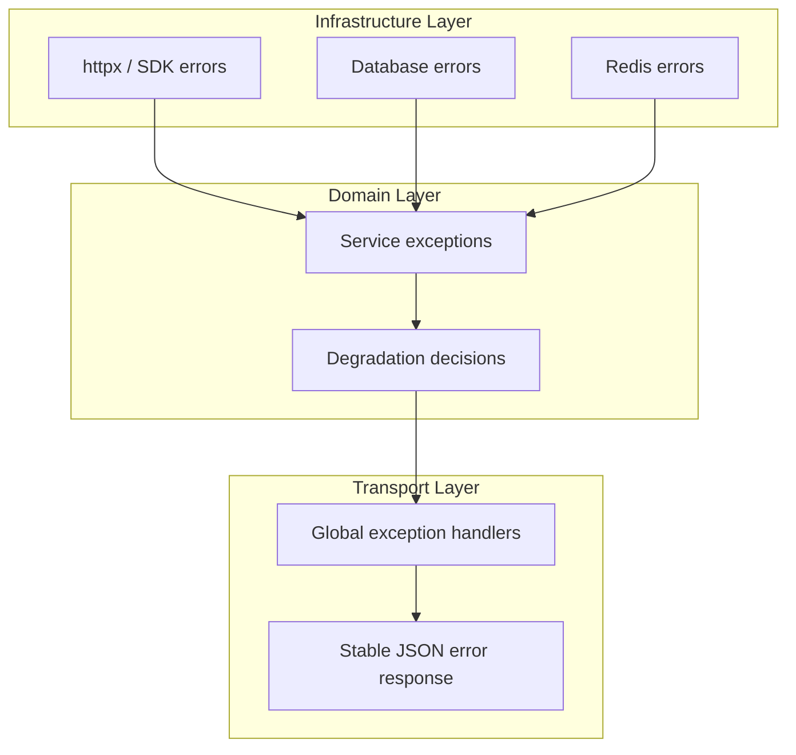
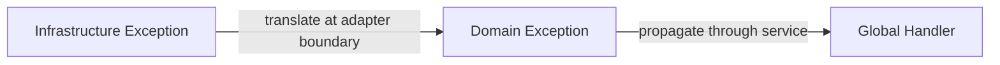
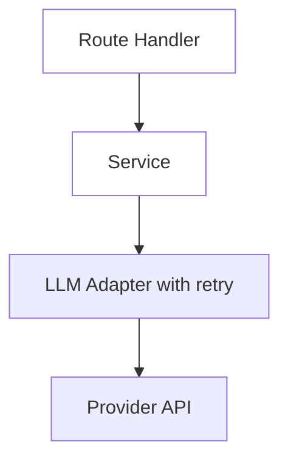

# Error Handling for AI Backends

> Phase 3 reference for resilient AI backends — typed exception hierarchies, FastAPI global handlers, validation error shaping, retry boundaries, fallback strategies, and graceful degradation when models and dependencies fail.

## Table of Contents

- [Overview](#overview)
- [Why Error Handling Differs in AI Systems](#why-error-handling-differs-in-ai-systems)
- [Exception Hierarchy Design](#exception-hierarchy-design)
- [Infrastructure vs Domain Exceptions](#infrastructure-vs-domain-exceptions)
- [Global Exception Handlers](#global-exception-handlers)
- [Validation Error Handling](#validation-error-handling)
- [HTTP Status Code Mapping](#http-status-code-mapping)
- [Retries at the Right Layer](#retries-at-the-right-layer)
- [Fallback Strategies](#fallback-strategies)
- [Graceful Degradation](#graceful-degradation)
- [Circuit Breaker Pattern](#circuit-breaker-pattern)
- [FastAPI Integration](#fastapi-integration)
- [Logging and Observability](#logging-and-observability)
- [Production Considerations](#production-considerations)
- [Common Mistakes](#common-mistakes)
- [Interview Preparation](#interview-preparation)
- [Navigation](#navigation)

---

## Overview

AI backends fail in **layers**: validation rejects bad input, retrieval returns empty results, the LLM provider times out, tool calls raise network errors, and structured output parsing fails. Production systems need a deliberate error architecture — typed exceptions, consistent HTTP responses, retry policies at infrastructure boundaries, and degradation paths that preserve user value when components fail.

This document is a **Phase 3 deep dive**. It assumes you have read:

- [Logging and Error Handling](../logging/logging-and-error-handling.md) — logging strategy, retries, graceful failures
- [FastAPI Complete Guide](../fastapi/fastapi-complete-guide.md) — exception handling section
- [HTTP Clients for AI Backends](http-clients-for-ai-backends.md) — retry and timeout patterns

Foundation covered observability and logging. Here we focus on **backend error architecture** — how exceptions flow from infrastructure through services to HTTP responses.



---

## Why Error Handling Differs in AI Systems

| Traditional API Failure | AI Backend Failure |
|------------------------|-------------------|
| Deterministic 404 | Empty retrieval — answer may hallucinate |
| DB constraint violation | Provider 429 after 40s of streaming |
| Auth token expired | Model returns invalid JSON for tool call |
| Single failure point | Multi-step pipeline — partial success possible |

AI errors are often **probabilistic and expensive**. A retry on an LLM call costs money and latency. A fallback to a smaller model may be acceptable; a fallback to no auth is not.

> **Production Standard:** Catch and translate at layer boundaries. Log once with `request_id` at the boundary. Return safe, stable error JSON to clients. Degrade features — not security.

See [Logging and Error Handling](../logging/logging-and-error-handling.md#exception-handling-philosophy) for the full logging companion to this document.

---

## Exception Hierarchy Design

Design a **small, typed hierarchy** — not a flat sea of `Exception` catches.

```python
# app/core/exceptions.py
class AppError(Exception):
    """Base for all application errors mapped to HTTP responses."""

    def __init__(
        self,
        code: str,
        message: str,
        status_code: int = 400,
        details: list[dict] | None = None,
    ):
        self.code = code
        self.message = message
        self.status_code = status_code
        self.details = details or []
        super().__init__(message)


# --- Client / validation errors (4xx) ---

class NotFoundError(AppError):
    def __init__(self, resource: str, resource_id: str):
        super().__init__(
            code="NOT_FOUND",
            message=f"{resource} '{resource_id}' not found",
            status_code=404,
        )


class AuthorizationError(AppError):
    def __init__(self, message: str = "Not authorized"):
        super().__init__(code="FORBIDDEN", message=message, status_code=403)


class RateLimitExceededError(AppError):
    def __init__(self, retry_after: int | None = None):
        super().__init__(
            code="RATE_LIMIT_EXCEEDED",
            message="Too many requests",
            status_code=429,
            details=[{"retry_after": retry_after}] if retry_after else [],
        )


class ValidationError(AppError):
    def __init__(self, message: str, details: list[dict] | None = None):
        super().__init__(
            code="VALIDATION_ERROR",
            message=message,
            status_code=422,
            details=details,
        )


# --- Infrastructure / provider errors (5xx) ---

class ProviderError(AppError):
    def __init__(self, provider: str, message: str = "Provider error"):
        super().__init__(
            code="PROVIDER_ERROR",
            message=message,
            status_code=502,
            details=[{"provider": provider}],
        )


class LLMUnavailableError(AppError):
    def __init__(self, provider: str):
        super().__init__(
            code="LLM_UNAVAILABLE",
            message=f"Language model provider '{provider}' is unavailable",
            status_code=503,
        )


class ServiceUnavailableError(AppError):
    def __init__(self, component: str):
        super().__init__(
            code="SERVICE_UNAVAILABLE",
            message=f"Component '{component}' is temporarily unavailable",
            status_code=503,
        )
```

### Hierarchy Principles

| Principle | Rationale |
|-----------|-----------|
| Few base classes | Easy to handle globally |
| `code` field for machines | Clients branch on stable codes |
| `message` safe for users | No stack traces, no internal paths |
| `status_code` on exception | Handler doesn't guess HTTP mapping |
| `details` for structured extras | Retry-after, field errors, provider name |

---

## Infrastructure vs Domain Exceptions

**Infrastructure exceptions** come from libraries — `httpx.TimeoutException`, `sqlalchemy.exc.IntegrityError`, `openai.RateLimitError`. **Domain exceptions** express business meaning — `DocumentNotFoundError`, `LLMUnavailableError`.



### Translation at the Adapter Boundary

```python
# app/adapters/llm.py
import httpx
from openai import APIConnectionError, RateLimitError, APIStatusError

from app.core.exceptions import LLMUnavailableError, ProviderError, RateLimitExceededError


class LLMAdapter:
    async def complete(self, messages: list[dict]) -> str:
        try:
            response = await self._client.chat.completions.create(
                model=self._model, messages=messages
            )
            return response.choices[0].message.content or ""
        except RateLimitError as exc:
            raise RateLimitExceededError() from exc
        except APIConnectionError as exc:
            raise LLMUnavailableError(provider="openai") from exc
        except APIStatusError as exc:
            if exc.status_code >= 500:
                raise ProviderError(provider="openai", message="Provider returned server error") from exc
            raise ProviderError(provider="openai", message=str(exc)) from exc
        except httpx.TimeoutException as exc:
            raise LLMUnavailableError(provider="openai") from exc
```

Services catch **domain exceptions** only — they never import `httpx` or `openai` error types.

```python
# app/services/chat_service.py
from app.core.exceptions import LLMUnavailableError, NotFoundError


class ChatService:
    async def reply(self, user_id: str, request: ChatRequest) -> ChatResponse:
        conversation = await self._repo.get_conversation(request.conversation_id)
        if not conversation or conversation.user_id != user_id:
            raise NotFoundError("conversation", request.conversation_id)

        try:
            content = await self._llm.complete(request.messages)
        except LLMUnavailableError:
            return await self._fallback_reply(request)  # graceful degradation

        return ChatResponse(id="...", content=content, model=request.model)
```

---

## Global Exception Handlers

Register handlers in `create_app()` — one place for consistent error JSON.

```python
# app/core/error_handlers.py
import logging

from fastapi import FastAPI, Request
from fastapi.exceptions import RequestValidationError
from fastapi.responses import JSONResponse
from starlette.exceptions import HTTPException as StarletteHTTPException

from app.core.exceptions import AppError
from app.schemas.errors import ErrorResponse

logger = logging.getLogger(__name__)


def _request_id(request: Request) -> str | None:
    return getattr(request.state, "request_id", None)


def register_exception_handlers(app: FastAPI) -> None:
    @app.exception_handler(AppError)
    async def app_error_handler(request: Request, exc: AppError) -> JSONResponse:
        logger.warning(
            "app_error",
            extra={
                "error_code": exc.code,
                "status_code": exc.status_code,
                "request_id": _request_id(request),
            },
        )
        return JSONResponse(
            status_code=exc.status_code,
            content=ErrorResponse(
                error=exc.code,
                message=exc.message,
                details=exc.details,
                request_id=_request_id(request),
            ).model_dump(),
        )

    @app.exception_handler(RequestValidationError)
    async def validation_error_handler(
        request: Request, exc: RequestValidationError
    ) -> JSONResponse:
        details = [
            {
                "field": ".".join(str(loc) for loc in err["loc"]),
                "message": err["msg"],
                "type": err["type"],
            }
            for err in exc.errors()
        ]
        logger.info(
            "validation_error",
            extra={"request_id": _request_id(request), "error_count": len(details)},
        )
        return JSONResponse(
            status_code=422,
            content=ErrorResponse(
                error="REQUEST_VALIDATION_ERROR",
                message="Request validation failed",
                details=details,
                request_id=_request_id(request),
            ).model_dump(),
        )

    @app.exception_handler(StarletteHTTPException)
    async def http_exception_handler(
        request: Request, exc: StarletteHTTPException
    ) -> JSONResponse:
        return JSONResponse(
            status_code=exc.status_code,
            content=ErrorResponse(
                error="HTTP_ERROR",
                message=str(exc.detail),
                request_id=_request_id(request),
            ).model_dump(),
        )

    @app.exception_handler(Exception)
    async def unhandled_error_handler(request: Request, exc: Exception) -> JSONResponse:
        logger.exception(
            "unhandled_error",
            extra={"request_id": _request_id(request)},
        )
        return JSONResponse(
            status_code=500,
            content=ErrorResponse(
                error="INTERNAL_ERROR",
                message="An unexpected error occurred",
                request_id=_request_id(request),
            ).model_dump(),
        )
```

```python
# app/main.py
from app.core.error_handlers import register_exception_handlers

app = FastAPI(lifespan=lifespan)
register_exception_handlers(app)
```

See [FastAPI Complete Guide — Exception Handling](../fastapi/fastapi-complete-guide.md#exception-handling) for the foundation patterns this extends.

---

## Validation Error Handling

Two validation layers exist: **Pydantic request validation** (automatic 422) and **domain validation** in services.

### Pydantic 422 (Automatic)

FastAPI raises `RequestValidationError` before your handler runs. The global handler above shapes it into stable JSON.

### Domain Validation (Explicit)

```python
# In service layer — business rules Pydantic can't express alone
async def ingest_document(self, tenant_id: str, request: DocumentIngestRequest) -> Document:
    if await self._quota.exceeded(tenant_id):
        raise ValidationError(
            message="Document quota exceeded for tenant",
            details=[{"field": "tenant_id", "message": "Quota limit reached"}],
        )
```

### Validation vs HTTPException

| Use | When |
|-----|------|
| Pydantic `Field` constraints | Structural validation — types, lengths, ranges |
| `@field_validator` | Format and cross-field on input model |
| `ValidationError` (domain) | Business rules needing DB or auth context |
| `HTTPException` | Simple one-off cases in routes (prefer `AppError`) |

See [Validation for AI APIs](validation-for-ai-apis.md) for schema design.

---

## HTTP Status Code Mapping

| Status | Meaning | AI Backend Use Case |
|--------|---------|---------------------|
| 400 | Bad request | Malformed agent tool call |
| 401 | Unauthenticated | Missing API key |
| 403 | Forbidden | Cross-tenant document access |
| 404 | Not found | Conversation, collection, model |
| 409 | Conflict | Duplicate document upload |
| 422 | Validation failed | Pydantic or domain validation |
| 429 | Rate limited | Tenant or provider rate limit |
| 502 | Bad gateway | Provider returned error |
| 503 | Unavailable | LLM down, circuit open |
| 504 | Gateway timeout | Upstream timeout |

```python
# Stable mapping — clients know what to retry
RETRYABLE_STATUS_CODES = {429, 502, 503, 504}
```

Clients should retry on 429/502/503/504 with backoff — not on 400/401/403/404/422.

---

## Retries at the Right Layer

Retries belong at the **infrastructure adapter** — not in route handlers, not wrapping entire service methods.



| Layer | Retry? | Why |
|-------|--------|-----|
| HTTP adapter | Yes | Transient network/provider errors |
| Service orchestration | No* | Risk of duplicate side effects |
| Route handler | No | Duplicates adapter retries |
| Global handler | No | Too late — response already failed |

*Exception: idempotent read-only operations at service level.

```python
# Retry stays in adapter — see HTTP Clients doc
from app.http.retry import request_with_retry

class SearchAdapter:
    async def search(self, query: str) -> list[dict]:
        response = await request_with_retry(self._client, "GET", url, ...)
        return response.json()["results"]
```

See [HTTP Clients for AI Backends — Retries](http-clients-for-ai-backends.md#retries-and-backoff) and [Logging and Error Handling — Retries](../logging/logging-and-error-handling.md#retries-and-backoff).

---

## Fallback Strategies

When primary path fails, fallbacks preserve **partial value** without hiding errors from operators.

### Model Fallback Chain

```python
# app/services/llm_router.py
import logging

from app.core.exceptions import LLMUnavailableError, ProviderError

logger = logging.getLogger(__name__)

FALLBACK_MODELS = ["gpt-4o", "gpt-4o-mini", "gpt-3.5-turbo"]


class LLMRouter:
    async def complete_with_fallback(self, messages: list[dict], model: str) -> tuple[str, str]:
        models_to_try = [model] + [m for m in FALLBACK_MODELS if m != model]
        last_error: Exception | None = None

        for candidate in models_to_try:
            try:
                content = await self._adapter.complete(messages, model=candidate)
                if candidate != model:
                    logger.warning(
                        "model_fallback_used",
                        extra={"requested_model": model, "actual_model": candidate},
                    )
                return content, candidate
            except (LLMUnavailableError, ProviderError) as exc:
                last_error = exc
                continue

        raise LLMUnavailableError(provider="all") from last_error
```

### Retrieval Fallback

```python
async def retrieve_context(self, query: str, collection_id: str) -> list[Chunk]:
    try:
        return await self._vector_store.search(query, collection_id, top_k=5)
    except ServiceUnavailableError:
        logger.warning("retrieval_fallback", extra={"strategy": "keyword_search"})
        return await self._keyword_fallback(query, collection_id)
```

### Cached Response Fallback

```python
async def get_answer(self, cache_key: str, compute_fn) -> str:
    cached = await self._cache.get(cache_key)
    if cached:
        return cached
    try:
        result = await compute_fn()
        await self._cache.set(cache_key, result, ttl=3600)
        return result
    except LLMUnavailableError:
        stale = await self._cache.get_stale(cache_key)
        if stale:
            logger.warning("serving_stale_cache", extra={"cache_key": cache_key})
            return stale
        raise
```

---

## Graceful Degradation

Degradation **reduces features** while keeping the core experience alive.

| Component Failure | Degradation Strategy | User Experience |
|-------------------|---------------------|-----------------|
| Vector DB down | Keyword search or no context | Answer without citations |
| Reranker timeout | Skip reranking | Slightly worse relevance |
| Primary LLM down | Fallback model | Shorter or simpler answers |
| Tool API timeout | Skip tool, inform user | "Could not fetch live data" |
| Streaming broken | Return full JSON response | Higher latency, same content |

```python
# app/services/rag_service.py
class RAGService:
    async def answer(self, request: RAGQueryRequest) -> RAGQueryResponse:
        chunks: list[Chunk] = []
        retrieval_degraded = False

        try:
            chunks = await self._retriever.search(request.query, request.collection_id)
        except ServiceUnavailableError:
            retrieval_degraded = True
            logger.warning("retrieval_degraded", extra={"collection_id": request.collection_id})

        context = self._format_chunks(chunks) if chunks else ""
        prompt = self._build_prompt(request.query, context, degraded=retrieval_degraded)

        content, model = await self._llm.complete_with_fallback(
            [{"role": "user", "content": prompt}], request.model
        )

        return RAGQueryResponse(
            answer=content,
            citations=[self._to_citation(c) for c in chunks],
            model=model,
            metadata={"retrieval_degraded": retrieval_degraded},
        )
```

### What NOT to Degrade

- **Authentication and authorization** — fail closed
- **Tenant isolation** — never cross boundaries
- **PII redaction** — never skip for speed
- **Billing metering** — log even if response is degraded

---

## Circuit Breaker Pattern

After sustained failures, stop calling the failing dependency for a cooldown period.

```python
# app/core/circuit_breaker.py
import time
from enum import Enum


class CircuitState(str, Enum):
    CLOSED = "closed"       # normal operation
    OPEN = "open"           # failing fast
    HALF_OPEN = "half_open" # probing recovery


class CircuitBreaker:
    def __init__(self, failure_threshold: int = 5, recovery_timeout: float = 60.0):
        self._failure_threshold = failure_threshold
        self._recovery_timeout = recovery_timeout
        self._failure_count = 0
        self._last_failure_time: float = 0.0
        self._state = CircuitState.CLOSED

    @property
    def state(self) -> CircuitState:
        if self._state == CircuitState.OPEN:
            if time.monotonic() - self._last_failure_time >= self._recovery_timeout:
                self._state = CircuitState.HALF_OPEN
        return self._state

    def record_success(self) -> None:
        self._failure_count = 0
        self._state = CircuitState.CLOSED

    def record_failure(self) -> None:
        self._failure_count += 1
        self._last_failure_time = time.monotonic()
        if self._failure_count >= self._failure_threshold:
            self._state = CircuitState.OPEN

    def allow_request(self) -> bool:
        return self.state != CircuitState.OPEN
```

```python
# In adapter
async def complete(self, messages: list[dict]) -> str:
    if not self._circuit.allow_request():
        raise LLMUnavailableError(provider="openai")

    try:
        result = await self._raw_complete(messages)
        self._circuit.record_success()
        return result
    except (ProviderError, LLMUnavailableError):
        self._circuit.record_failure()
        raise
```

---

## FastAPI Integration

### Route-Level: When to Use try/except

Prefer global handlers. Use route `try/except` only for **translating a specific, localized exception** that should not propagate.

```python
@router.post("/webhooks/provider")
async def provider_webhook(request: Request, service: WebhookService = Depends()):
    body = await request.body()
    try:
        event = service.verify_and_parse(body, request.headers)
    except SignatureError:
        raise AuthorizationError("Invalid webhook signature")
    await service.process(event)
    return {"status": "ok"}
```

### Streaming Error Handling

Streaming responses need mid-stream error handling:

```python
from collections.abc import AsyncIterator

from fastapi.responses import StreamingResponse


async def safe_stream(generator: AsyncIterator[str]) -> AsyncIterator[str]:
    try:
        async for chunk in generator:
            yield chunk
    except LLMUnavailableError:
        yield 'data: {"error": "LLM_UNAVAILABLE"}\n\n'
    except Exception:
        logger.exception("stream_error")
        yield 'data: {"error": "STREAM_INTERRUPTED"}\n\n'


@router.post("/chat/stream")
async def stream_chat(...) -> StreamingResponse:
    return StreamingResponse(
        safe_stream(service.stream_reply(body)),
        media_type="text/event-stream",
    )
```

### Background Task Errors

`BackgroundTasks` exceptions are logged but not returned to the client — use job queues for durable work. See [Background Processing for AI](background-processing-for-ai.md).

---

## Logging and Observability

Log **once** at the exception boundary with structured fields:

```python
logger.warning(
    "app_error",
    extra={
        "error_code": exc.code,
        "status_code": exc.status_code,
        "request_id": request_id,
        "operation": "chat.reply",
        "tenant_id": tenant_id,
    },
)
```

For unhandled exceptions, use `logger.exception()` to capture the stack trace.

| Signal | What to Alert On |
|--------|------------------|
| Error rate by `error_code` | Spike in `LLM_UNAVAILABLE` |
| Circuit breaker state | Open > 5 minutes |
| Degradation frequency | `retrieval_degraded` > threshold |
| Retry count | Sustained `http_retry` warnings |

See [Logging and Error Handling](../logging/logging-and-error-handling.md) for full logging standards.

---

## Production Considerations

- **Fail closed on auth** — never degrade into unauthenticated access.
- **Idempotency keys** — required before retrying POST operations with side effects.
- **Error message hygiene** — no stack traces, file paths, or API keys in client responses.
- **Provider error sanitization** — map provider bodies to safe messages.
- **Multi-step pipelines** — decide per-step whether to fail, skip, or fallback.
- **Test error paths** — unit test exception translation; integration test 422/503 responses.
- **SLO-based alerting** — alert on error rate SLO breach, not individual LLM timeouts.
- **Chaos testing** — periodically inject provider failures to verify degradation paths.

---

## Common Mistakes

| Mistake | Impact | Fix |
|---------|--------|-----|
| Catching `Exception` in every function | Swallowed bugs, duplicate logs | Catch at boundaries only |
| Retrying in route handlers | Double retries, non-idempotent duplicates | Retry in adapter layer |
| Generic 500 for all errors | Clients can't retry correctly | Map to 429/502/503/422 |
| Returning provider error bodies to clients | Information leak | Sanitize in adapter |
| No degradation plan | Total outage when one component fails | Define per-component fallbacks |
| Logging and re-raising without `from exc` | Lost root cause chain | `raise DomainError(...) from exc` |
| Degrading auth on provider failure | Security hole | Fail closed |
| Alerting on every LLM timeout | Alert fatigue | SLO-based alerts |

---

## Interview Preparation

### Frequently Asked Questions

**Q1: How do you structure exception handling in a FastAPI AI backend?**

> **Strong answer:** Typed `AppError` hierarchy with `code`, `message`, `status_code`. Infrastructure exceptions translated to domain exceptions at adapter boundaries. Global handlers registered for `AppError`, `RequestValidationError`, and catch-all `Exception`. Services decide degradation. Routes stay thin. Log once at boundary with `request_id`.

**Q2: Where should retries happen in the stack?**

> **Strong answer:** At the infrastructure adapter layer — HTTP client, LLM SDK wrapper. Use exponential backoff with jitter for 429/5xx/timeouts. Not in route handlers. Not wrapping entire multi-step service methods unless idempotent. Log retry attempts. Cap attempts. Consider circuit breaker after sustained failures.

**Q3: How do you handle errors in a RAG pipeline without exposing internals?**

> **Strong answer:** Each stage has defined failure behavior. Retrieval failure → degrade to no context or keyword fallback, log warning, flag in response metadata. LLM failure → model fallback chain, then 503. Validation failure on LLM JSON → retry or fallback to unstructured. Client sees safe error codes; operators see full context in logs with `request_id`.

**Q4: What is graceful degradation vs a fallback?**

> **Strong answer:** Fallback is a specific alternate path — different model, cached response, keyword search. Graceful degradation is the overall design principle — reducing features while maintaining core value. Example: citations disappear but chat still works. Auth and tenant isolation never degrade.

### Real-World Scenario

**Scenario:** Users report empty chat responses. Logs show `LLM_UNAVAILABLE` errors clustered around the same time, but some users got answers.

> **Discussion points:** Check if model fallback chain worked for some requests. Look for `retrieval_degraded` without LLM errors — different root cause. Verify circuit breaker didn't stay open too long. Check if empty responses are a bug (missing error handling) vs intentional degradation. Trace `request_id` for failed vs successful requests. Review whether streaming errors are swallowed mid-stream.

---

## Navigation

### Prerequisites

- [Logging and Error Handling](../logging/logging-and-error-handling.md) — logging, retries, graceful failures
- [FastAPI Complete Guide](../fastapi/fastapi-complete-guide.md) — exception handling basics
- [HTTP Clients for AI Backends](http-clients-for-ai-backends.md) — retry and timeout patterns

### Related Topics

- [Validation for AI APIs](validation-for-ai-apis.md) — validation error schemas
- [Backend Architecture for AI](backend-architecture-for-ai.md) — layer boundaries
- [Async Programming for AI Backends](async-programming-for-ai-backends.md) — async error propagation

### Next Topics

- [Background Processing for AI](background-processing-for-ai.md) — durable error recovery in workers
- [Production Incidents](../production-incidents/README.md) — incident response workflows

### Future Reading

- [Observability](../observability/README.md) — error metrics and tracing
- [AI Safety](../ai-safety/README.md) — safe failure modes

---

## See Also

- [FastAPI Handling Errors](https://fastapi.tiangolo.com/tutorial/handling-errors/)
- [FastAPI Complete Guide](../fastapi/fastapi-complete-guide.md)
- [Logging and Error Handling](../logging/logging-and-error-handling.md)
- [HTTP Clients for AI Backends](http-clients-for-ai-backends.md)

## Changelog

| Version | Date | Changes |
|---------|------|---------|
| 1.0 | 2026-07-13 | Initial Phase 3 release |
