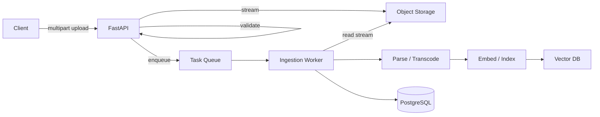
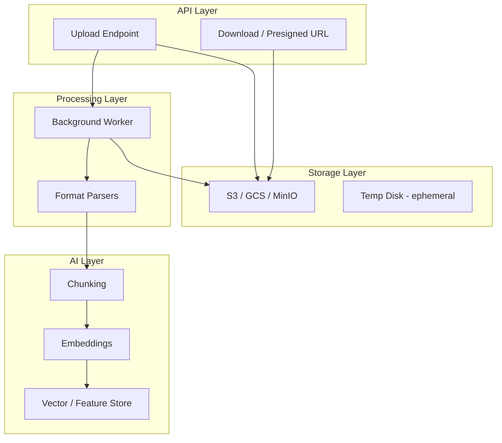
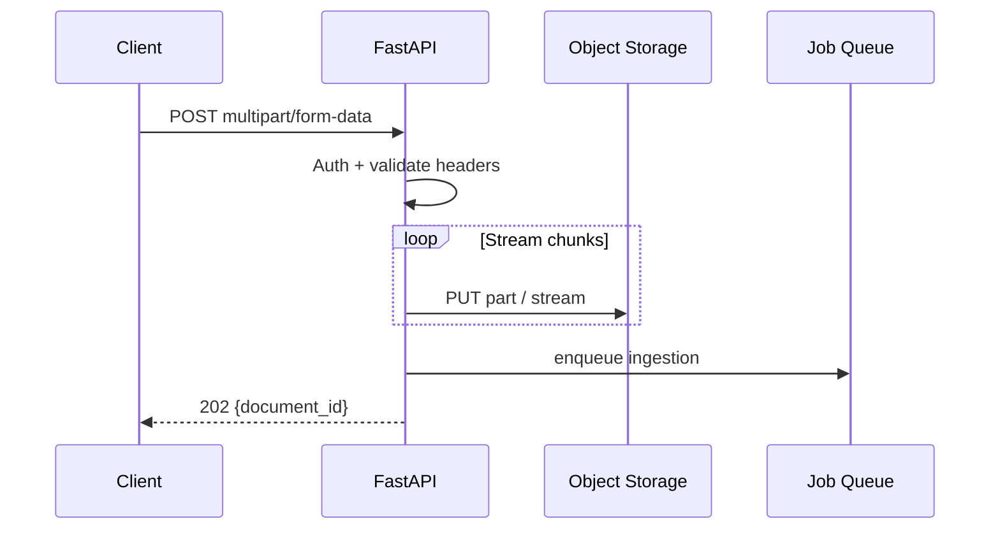
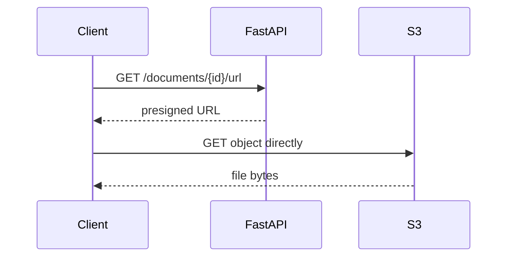
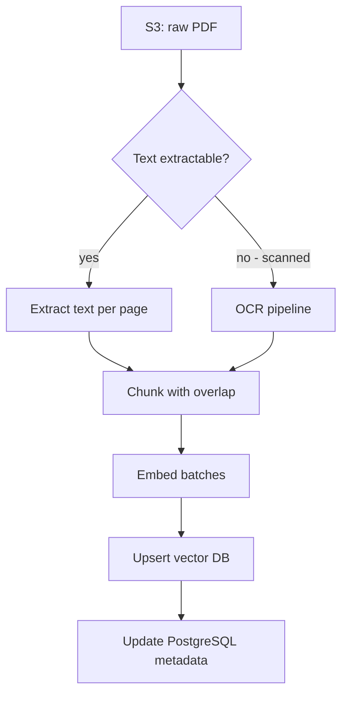
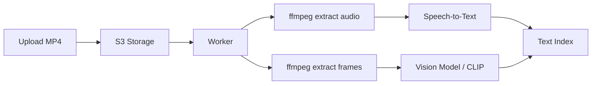

# File Handling for AI

> Upload, store, stream, and process files safely in AI applications — from RAG document ingestion to multimodal image, audio, and video pipelines.

## Table of Contents

- [Why File Handling Matters for AI](#why-file-handling-matters-for-ai)
- [File Handling Architecture](#file-handling-architecture)
- [Upload Fundamentals](#upload-fundamentals)
- [Validation and Security](#validation-and-security)
- [Object Storage Patterns](#object-storage-patterns)
- [Temporary Storage](#temporary-storage)
- [Streaming Uploads and Downloads](#streaming-uploads-and-downloads)
- [Large File Strategies](#large-file-strategies)
- [PDF Handling for RAG](#pdf-handling-for-rag)
- [Image Handling for Multimodal AI](#image-handling-for-multimodal-ai)
- [Audio Handling](#audio-handling)
- [Video Handling](#video-handling)
- [RAG Ingestion Pipeline Integration](#rag-ingestion-pipeline-integration)
- [Multimodal API Patterns](#multimodal-api-patterns)
- [Production Considerations](#production-considerations)
- [Common Mistakes](#common-mistakes)
- [Interview Preparation](#interview-preparation)
- [Navigation](#navigation)

---

## Why File Handling Matters for AI

AI products consume files as first-class inputs. RAG systems ingest PDFs and spreadsheets. Multimodal chat accepts images. Meeting assistants transcribe audio. Video pipelines extract frames for vision models. Mishandled files cause security incidents, runaway storage costs, OOM crashes, and silent ingestion failures.

| AI Feature | File Types | Primary Risk |
|------------|-----------|--------------|
| Knowledge base / RAG | PDF, DOCX, TXT, HTML | Malicious PDFs, huge files |
| Multimodal chat | PNG, JPEG, WebP | Oversized images, wrong MIME |
| Voice assistant | MP3, WAV, M4A | Long audio exhausting memory |
| Video analysis | MP4, WebM | Multi-GB uploads, codec issues |
| Fine-tuning datasets | JSONL, CSV | PII leakage, schema drift |

> **Production Standard:** Never read unbounded file content into memory. Validate early, store in object storage, process asynchronously, and pass references — not bytes — to LLM and worker pipelines.



---

## File Handling Architecture

Separate concerns into four layers:



1. **API** — authenticate, validate metadata, stream to storage, return job ID.
2. **Storage** — durable blobs in object storage; metadata in PostgreSQL.
3. **Processing** — parse, transcode, extract text — in workers.
4. **AI** — chunk, embed, index, or pass to multimodal models.

---

## Upload Fundamentals

FastAPI accepts uploads via `UploadFile`, which wraps a SpooledTemporaryFile — small files stay in memory, larger ones spill to disk.

```python
from fastapi import APIRouter, Depends, File, HTTPException, UploadFile, status
from pydantic import BaseModel

router = APIRouter(prefix="/v1/documents", tags=["documents"])

ALLOWED_EXTENSIONS = {".pdf", ".txt", ".md", ".docx"}
MAX_BYTES = 25 * 1024 * 1024  # 25 MB


class UploadResponse(BaseModel):
    document_id: str
    filename: str
    status: str


@router.post("", status_code=status.HTTP_202_ACCEPTED, response_model=UploadResponse)
async def upload_document(
    file: UploadFile = File(..., description="PDF, TXT, MD, or DOCX"),
    user: User = Depends(get_current_user),
    storage: StorageService = Depends(get_storage_service),
    job_service: JobService = Depends(get_job_service),
) -> UploadResponse:
    if not file.filename:
        raise HTTPException(status_code=400, detail="Filename required")

    ext = Path(file.filename).suffix.lower()
    if ext not in ALLOWED_EXTENSIONS:
        raise HTTPException(status_code=400, detail=f"Unsupported extension: {ext}")

    document_id = str(uuid.uuid4())
    key = f"uploads/{user.id}/{document_id}{ext}"

    bytes_written = await storage.stream_upload(key, file, max_bytes=MAX_BYTES)

    await document_repo.create(
        id=document_id,
        user_id=user.id,
        filename=file.filename,
        storage_key=key,
        size_bytes=bytes_written,
        status="queued",
    )
    await job_service.enqueue_ingestion(document_id)

    return UploadResponse(document_id=document_id, filename=file.filename, status="queued")
```

### Multipart Upload Flow



Return `202 Accepted` for any upload that triggers background processing — not `200 OK` with a misleading "done" status.

---

## Validation and Security

Never trust client-provided filenames or `Content-Type` headers. Attackers upload malware, polyglot files, and prompt-injection payloads embedded in PDF metadata.

### Validation Checklist

| Check | Implementation |
|-------|----------------|
| Extension allowlist | `.pdf`, `.png`, etc. |
| MIME / magic bytes | `python-magic` or `filetype` library |
| Size limit | Per-file and per-user quotas |
| Filename sanitization | Strip path traversal (`../../etc/passwd`) |
| Virus scan | ClamAV or cloud scanner for enterprise |
| Content inspection | Reject encrypted PDFs if unsupported |

```python
import filetype


ALLOWED_MIMES = {
    "application/pdf",
    "text/plain",
    "text/markdown",
}


async def validate_upload(file: UploadFile, max_bytes: int) -> bytes:
    header = await file.read(8192)
    await file.seek(0)

    if len(header) == 0:
        raise HTTPException(status_code=400, detail="Empty file")

    kind = filetype.guess(header)
    detected = kind.mime if kind else None

    if detected not in ALLOWED_MIMES:
        raise HTTPException(
            status_code=400,
            detail=f"Unsupported file type: {detected or 'unknown'}",
        )

    # Stream with size enforcement
    total = 0
    chunks = []
    while chunk := await file.read(1024 * 1024):
        total += len(chunk)
        if total > max_bytes:
            raise HTTPException(status_code=413, detail="File too large")
        chunks.append(chunk)

    return b"".join(chunks)
```

### Filename Sanitization

```python
import re
from pathlib import Path


def safe_filename(name: str) -> str:
    name = Path(name).name  # strip directories
    name = re.sub(r"[^\w.\-]", "_", name)
    return name[:255] or "unnamed"
```

> **Production Standard:** Parse uploaded files in sandboxed worker processes with resource limits. Never pass raw file bytes directly into an LLM prompt.

---

## Object Storage Patterns

Production AI apps store files in **S3**, **Google Cloud Storage**, or **MinIO** — not on local container disk (ephemeral, lost on restart).

```python
import aioboto3
from botocore.exceptions import ClientError


class S3StorageService:
    def __init__(self, bucket: str, region: str = "us-east-1") -> None:
        self._bucket = bucket
        self._session = aioboto3.Session(region_name=region)

    async def stream_upload(
        self,
        key: str,
        file: UploadFile,
        max_bytes: int,
    ) -> int:
        total = 0
        async with self._session.client("s3") as s3:
            multipart = await s3.create_multipart_upload(
                Bucket=self._bucket,
                Key=key,
                ContentType=file.content_type or "application/octet-stream",
            )
            upload_id = multipart["UploadId"]
            parts = []
            part_number = 1

            try:
                while chunk := await file.read(5 * 1024 * 1024):
                    total += len(chunk)
                    if total > max_bytes:
                        raise ValueError("File exceeds size limit")

                    part = await s3.upload_part(
                        Bucket=self._bucket,
                        Key=key,
                        UploadId=upload_id,
                        PartNumber=part_number,
                        Body=chunk,
                    )
                    parts.append({"ETag": part["ETag"], "PartNumber": part_number})
                    part_number += 1

                await s3.complete_multipart_upload(
                    Bucket=self._bucket,
                    Key=key,
                    UploadId=upload_id,
                    MultipartUpload={"Parts": parts},
                )
            except Exception:
                await s3.abort_multipart_upload(
                    Bucket=self._bucket, Key=key, UploadId=upload_id
                )
                raise

        return total

    async def presigned_download_url(self, key: str, expires_in: int = 3600) -> str:
        async with self._session.client("s3") as s3:
            return await s3.generate_presigned_url(
                "get_object",
                Params={"Bucket": self._bucket, "Key": key},
                ExpiresIn=expires_in,
            )
```

### Storage Key Design

```
uploads/{tenant_id}/{document_id}.pdf
processed/{document_id}/chunks.json
media/{session_id}/{message_id}.png
exports/{report_id}/report.pdf
```

Include tenant/user scope in keys for isolation and lifecycle policies.

---

## Temporary Storage

Workers sometimes need local temp files — PDF parsers often require file paths, ffmpeg needs stdin/stdout pipes.

```python
import tempfile
from contextlib import asynccontextmanager
from pathlib import Path


@asynccontextmanager
async def temp_file(suffix: str = ""):
    path = Path(tempfile.mkstemp(suffix=suffix)[1])
    try:
        yield path
    finally:
        path.unlink(missing_ok=True)


async def process_pdf_from_s3(storage_key: str) -> str:
    async with temp_file(suffix=".pdf") as local_path:
        await storage.download_to_path(storage_key, local_path)
        return extract_text_sync(local_path)  # CPU work in process pool
```

### Temp Storage Rules

| Rule | Reason |
|------|--------|
| Delete in `finally` | Prevent disk exhaustion |
| Use `tempfile` not `/tmp/hardcoded` | Avoid collisions |
| Set disk quotas on workers | Large uploads fill nodes |
| Never serve temp files to users | Security boundary |
| Prefer streaming when library supports it | Reduce disk I/O |

---

## Streaming Uploads and Downloads

### Streaming Download to Client

```python
from fastapi.responses import StreamingResponse


@router.get("/{document_id}/download")
async def download_document(
    document_id: str,
    user: User = Depends(get_current_user),
    storage: StorageService = Depends(get_storage_service),
) -> StreamingResponse:
    doc = await document_repo.get_owned(document_id, user.id)
    if not doc:
        raise HTTPException(status_code=404)

    async def byte_stream():
        async for chunk in storage.get_stream(doc.storage_key):
            yield chunk

    return StreamingResponse(
        byte_stream(),
        media_type=doc.content_type,
        headers={"Content-Disposition": f'attachment; filename="{doc.filename}"'},
    )
```

### Presigned URLs (Preferred for Large Downloads)

Offload bandwidth to object storage — API generates a time-limited URL, client downloads directly:

```python
@router.get("/{document_id}/url")
async def get_download_url(document_id: str, user: User = Depends(get_current_user)) -> dict:
    doc = await document_repo.get_owned(document_id, user.id)
    url = await storage.presigned_download_url(doc.storage_key, expires_in=900)
    return {"url": url, "expires_in_seconds": 900}
```



---

## Large File Strategies

| Strategy | When to Use | Limit |
|----------|-------------|-------|
| Direct multipart upload | Up to ~100 MB | API streams to S3 |
| Presigned POST upload | Large files, mobile clients | Client uploads directly to S3 |
| Chunked / resumable (tus.io) | Unreliable networks, GB-scale | More client complexity |
| Split processing | Multi-GB video | Segment + parallel workers |

### Presigned Upload (Client → S3 Direct)

```python
@router.post("/uploads/presign")
async def presign_upload(
    request: PresignRequest,
    user: User = Depends(get_current_user),
) -> PresignResponse:
    document_id = str(uuid.uuid4())
    key = f"uploads/{user.id}/{document_id}{request.extension}"

    upload_url, fields = await storage.presigned_post(
        key=key,
        max_bytes=request.size_bytes,
        content_type=request.content_type,
        expires_in=600,
    )

    await document_repo.create(id=document_id, user_id=user.id, storage_key=key, status="pending")

    return PresignResponse(
        document_id=document_id,
        upload_url=upload_url,
        fields=fields,
    )


@router.post("/uploads/{document_id}/complete")
async def complete_upload(document_id: str, user: User = Depends(get_current_user)) -> dict:
    await job_service.enqueue_ingestion(document_id)
    await document_repo.update_status(document_id, "queued")
    return {"document_id": document_id, "status": "queued"}
```

This keeps multi-gigabyte uploads off your API servers.

---

## PDF Handling for RAG

PDFs are the most common RAG input — and the most problematic. They contain scanned images, multi-column layouts, embedded fonts, and JavaScript.

### Extraction Libraries

| Library | Strength | Weakness |
|---------|----------|----------|
| `pymupdf` (fitz) | Fast, good text extraction | Complex layouts |
| `pdfplumber` | Tables, structured layout | Slower |
| `unstructured` | Multi-format, partitioning | Heavier dependency |
| OCR (Tesseract, Azure DI) | Scanned documents | Cost, latency |

```python
import fitz  # pymupdf


def extract_pdf_text(path: Path) -> list[PageText]:
    doc = fitz.open(path)
    pages = []
    for i, page in enumerate(doc):
        text = page.get_text("text")
        pages.append(PageText(number=i + 1, text=text.strip()))
    doc.close()
    return pages


def chunk_pages(pages: list[PageText], size: int = 512, overlap: int = 64) -> list[Chunk]:
    chunks = []
    for page in pages:
        for piece in recursive_split(page.text, size=size, overlap=overlap):
            chunks.append(Chunk(text=piece, page=page.number, metadata={"source": "pdf"}))
    return chunks
```

### PDF Pipeline in Workers



Run extraction in [Background Processing](background-processing-for-ai.md) workers — not in the API process.

---

## Image Handling for Multimodal AI

Vision models accept images via base64 inline data or URLs. Manage size, format, and token cost.

### Image Preprocessing

```python
from PIL import Image
import io


MAX_DIMENSION = 2048
JPEG_QUALITY = 85


def preprocess_image(data: bytes) -> bytes:
    img = Image.open(io.BytesIO(data))
    img = img.convert("RGB")

    if max(img.size) > MAX_DIMENSION:
        img.thumbnail((MAX_DIMENSION, MAX_DIMENSION), Image.Resampling.LANCZOS)

    buffer = io.BytesIO()
    img.save(buffer, format="JPEG", quality=JPEG_QUALITY, optimize=True)
    return buffer.getvalue()
```

### Multimodal Message Construction

```python
import base64


def build_vision_message(text: str, image_bytes: bytes) -> dict:
    b64 = base64.standard_b64encode(image_bytes).decode("ascii")
    return {
        "role": "user",
        "content": [
            {"type": "text", "text": text},
            {
                "type": "image_url",
                "image_url": {"url": f"data:image/jpeg;base64,{b64}", "detail": "auto"},
            },
        ],
    }
```

| Practice | Reason |
|----------|--------|
| Resize before sending to API | Reduce tokens and latency |
| Store original in S3 | Reprocess when models improve |
| Strip EXIF metadata | Privacy (GPS, device info) |
| Allowlist image formats | Prevent polyglot attacks |

---

## Audio Handling

Speech-to-text pipelines accept audio uploads for transcription, meeting summaries, and voice agents.

### Common Formats

| Format | Notes |
|--------|-------|
| WAV | Uncompressed, large |
| MP3 / M4A | Compressed, typical for uploads |
| WebM | Browser MediaRecorder output |
| FLAC | Lossless, archival |

### Chunking Long Audio

```python
from pydub import AudioSegment


def split_audio(path: Path, chunk_ms: int = 600_000) -> list[Path]:
    """Split audio into 10-minute segments for API limits."""
    audio = AudioSegment.from_file(path)
    chunks = []
    for i, start in enumerate(range(0, len(audio), chunk_ms)):
        segment = audio[start : start + chunk_ms]
        out = path.parent / f"{path.stem}_part{i}.mp3"
        segment.export(out, format="mp3")
        chunks.append(out)
    return chunks
```

### Async Transcription Pattern

```python
@celery_app.task(name="transcribe_audio", queue="cpu")
def transcribe_audio(document_id: str) -> None:
    with temp_file(suffix=".mp3") as local:
        storage.download_sync(document_id, local)
        segments = split_audio(local)

        transcripts = []
        for seg in segments:
            text = whisper_client.transcribe_sync(seg)
            transcripts.append(text)

        full_text = " ".join(transcripts)
        document_repo.update_extracted_text(document_id, full_text)
        enqueue_embedding_job(document_id, full_text)
```

Use OpenAI Whisper API, Deepgram, or self-hosted models depending on privacy and cost requirements.

---

## Video Handling

Video combines large-file challenges with audio and frame extraction for multimodal models.



### Frame Extraction with ffmpeg

```python
import subprocess


def extract_keyframes(video_path: Path, output_dir: Path, fps: float = 0.5) -> list[Path]:
    output_dir.mkdir(parents=True, exist_ok=True)
    pattern = str(output_dir / "frame_%04d.jpg")

    subprocess.run(
        [
            "ffmpeg", "-i", str(video_path),
            "-vf", f"fps={fps}",
            "-q:v", "2",
            pattern,
        ],
        check=True,
        capture_output=True,
    )
    return sorted(output_dir.glob("frame_*.jpg"))
```

### Video Strategy Summary

| Approach | Use Case |
|----------|----------|
| Audio track only | Meeting transcription |
| Keyframe sampling | Video Q&A, surveillance summary |
| Full video to multimodal API | Short clips (<20 MB) |
| Presigned upload | Any video > 50 MB |

Video processing is CPU-heavy — dedicate low-concurrency [worker queues](background-processing-for-ai.md).

---

## RAG Ingestion Pipeline Integration

End-to-end flow connecting upload to retrieval:

```python
class IngestionService:
    async def stage_upload(self, user_id: str, file: UploadFile) -> str:
        document_id = str(uuid.uuid4())
        key = f"uploads/{user_id}/{document_id}{Path(file.filename).suffix}"
        size = await self._storage.stream_upload(key, file, max_bytes=MAX_BYTES)
        await self._repo.create(document_id, user_id, key, size)
        return document_id

    async def enqueue(self, document_id: str) -> None:
        await self._jobs.enqueue("ingest_document", document_id)


# Worker-side
def ingest_document(document_id: str) -> None:
    doc = document_repo.get(document_id)
    with temp_file(suffix=Path(doc.storage_key).suffix) as local:
        storage.download_sync(doc.storage_key, local)

        if doc.storage_key.endswith(".pdf"):
            pages = extract_pdf_text(local)
            chunks = chunk_pages(pages)
        else:
            text = local.read_text(encoding="utf-8", errors="replace")
            chunks = chunk_text(text)

        for batch in batched(chunks, 128):
            vectors = embed_client.embed_sync([c.text for c in batch])
            vector_repo.upsert_batch(document_id, batch, vectors)

    document_repo.mark_completed(document_id, chunk_count=len(chunks))
```

See [RAG](../rag/README.md) for chunking strategy and retrieval design.

---

## Multimodal API Patterns

### Unified Media Upload Endpoint

```python
class MediaUploadResponse(BaseModel):
    media_id: str
    media_type: Literal["image", "audio", "video", "document"]
    status: str


@router.post("/media", status_code=status.HTTP_202_ACCEPTED)
async def upload_media(
    file: UploadFile = File(...),
    user: User = Depends(get_current_user),
) -> MediaUploadResponse:
    media_type = detect_media_type(file)
    media_id = await media_service.ingest(user.id, file, media_type)
    return MediaUploadResponse(media_id=media_id, media_type=media_type, status="processing")
```

### Chat with Attachments

```python
class ChatMessage(BaseModel):
    text: str
    attachment_ids: list[str] = []


async def resolve_attachments(ids: list[str], user_id: str) -> list[dict]:
    parts = []
    for media_id in ids:
        media = await media_repo.get_owned(media_id, user_id)
        if media.type == "image":
            data = await storage.get_bytes(media.key)
            parts.append(image_content_part(preprocess_image(data)))
        elif media.type == "document":
            text = await media_repo.get_extracted_text(media_id)
            parts.append({"type": "text", "text": f"[Document]\n{text[:8000]}"})
    return parts
```

Pass extracted text or presigned URLs to models — not raw binary in JSON payloads when avoidable.

---

## Production Considerations

| Area | Practice |
|------|----------|
| **Storage** | S3/GCS with versioning and lifecycle rules |
| **Metadata** | PostgreSQL for filenames, status, hashes, ownership |
| **Processing** | Async workers, never blocking API |
| **Memory** | Stream reads; cap chunk sizes |
| **Quotas** | Per-user storage and daily upload limits |
| **Deduplication** | Content-hash to skip re-processing |
| **Encryption** | SSE-S3 or SSE-KMS at rest; TLS in transit |
| **Cleanup** | Delete orphaned uploads after 24h if never completed |
| **CDN** | CloudFront for frequently accessed exports |

```python
# Content-hash deduplication
import hashlib


async def compute_sha256_stream(file: UploadFile) -> str:
    h = hashlib.sha256()
    while chunk := await file.read(1024 * 1024):
        h.update(chunk)
    await file.seek(0)
    return h.hexdigest()
```

### Lifecycle Policy Example

- `uploads/` — transition to Infrequent Access after 30 days
- `temp/` — expire after 1 day
- `exports/` — expire after 90 days

---

## Common Mistakes

| Mistake | Impact | Fix |
|---------|--------|-----|
| `await file.read()` without size cap | OOM on large upload | Stream with limit |
| Storing files on container disk | Lost on redeploy | Object storage |
| Trusting `Content-Type` header | Malware upload | Magic-byte validation |
| Inline PDF parsing in API handler | Timeouts, event loop block | Background worker |
| Passing raw file bytes to LLM | Token explosion, cost | Extract text first |
| No per-user quotas | Storage cost abuse | Enforce limits |
| Serving files without auth check | Data leak | Presigned URLs + ownership check |
| Ignoring scanned PDFs | Empty RAG chunks | OCR fallback path |
| Keeping EXIF in user images | Privacy leak | Strip metadata |

---

## Interview Preparation

### Frequently Asked Questions

**Q1: How do you handle file uploads for a RAG application?**

> **Strong answer:** Validate extension and magic bytes, enforce size limits, stream to S3, persist metadata in PostgreSQL, enqueue ingestion job, return 202 with document ID. Worker downloads, parses, chunks, embeds, indexes. Mention idempotency and progress status.

**Q2: How do you handle a 2 GB video upload without overloading your API?**

> **Strong answer:** Presigned POST/PUT so the client uploads directly to S3. API only issues credentials and records metadata. On complete callback, enqueue a worker that uses ffmpeg for audio/frame extraction. Never buffer 2 GB in the API process.

**Q3: What security concerns are specific to file uploads in AI apps?**

> **Strong answer:** Malicious PDFs, prompt injection in document text, polyglot files, path traversal in filenames, EXIF GPS leaks, unbounded memory reads. Mitigate with validation, sandboxed parsing, size limits, metadata stripping, and never executing uploaded content.

**Q4: How do scanned PDFs affect RAG and how do you handle them?**

> **Strong answer:** Standard text extraction returns empty or garbage for image-based PDFs. Detect low text density per page and route to OCR. Mention cost/latency trade-off and caching OCR results by content hash.

### Real-World Scenario

**Scenario:** Users report that some PDFs upload successfully but RAG returns no relevant results. Logs show ingestion "completed" in 2 seconds for 50-page files.

> **Discussion points:** Likely scanned PDFs with empty text extraction. Check extracted text length heuristic. Add OCR pipeline. Verify chunk count in metadata. Test with `pymupdf` text density. Consider `unstructured` partition strategy.

---

## Navigation

### Prerequisites

- [Backend Fundamentals for AI](backend-fundamentals-for-ai.md) — basic file upload patterns
- [Async Programming for AI Backends](async-programming-for-ai-backends.md) — async storage clients
- [Python for AI Engineering](../python-engineering/python-for-ai-engineering.md) — pathlib and context managers

### Related Topics

- [Background Processing for AI](background-processing-for-ai.md) — ingestion and transcription workers
- [RAG](../rag/README.md) — chunking and retrieval after ingestion
- [PostgreSQL for AI](../databases/postgresql/postgresql-for-ai.md) — document metadata schema

### Next Topics

- [Background Processing for AI](background-processing-for-ai.md) — durable ingestion jobs
- [RAG](../rag/README.md) — building retrieval on indexed files

### Future Reading

- [Data Engineering](../data-engineering/README.md) — large-scale document pipelines
- [Security](../security/README.md) — upload threat models
- [Model Integration](../model-integration/README.md) — multimodal API details

---

## See Also

- [FastAPI File Upload Documentation](https://fastapi.tiangolo.com/tutorial/request-files/)
- [AWS S3 Presigned URLs](https://docs.aws.amazon.com/AmazonS3/latest/userguide/using-presigned-url.html)
- [Background Processing for AI](background-processing-for-ai.md)

## Changelog

| Version | Date | Changes |
|---------|------|---------|
| 1.0 | 2026-07-13 | Initial release |
