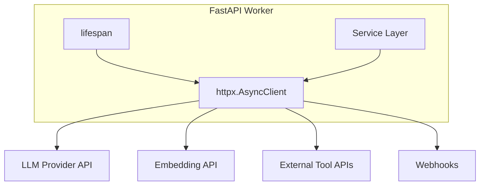
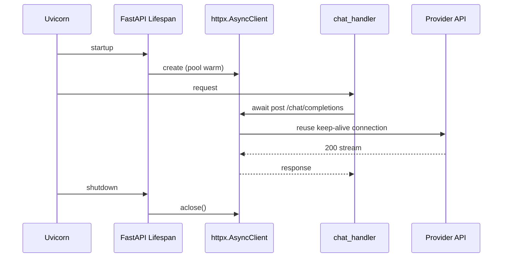
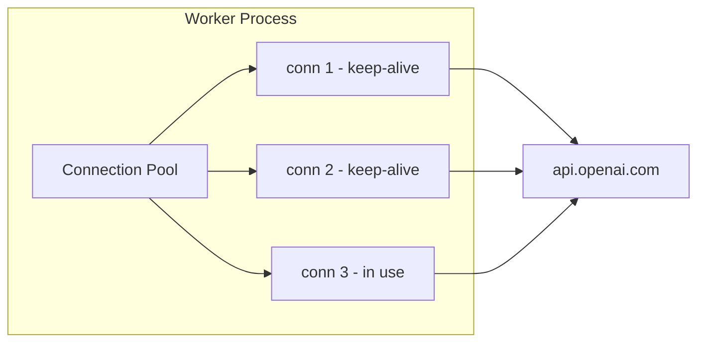

# HTTP Clients for AI Backends

> reference for production HTTP clients in AI backends — shared `httpx.AsyncClient` instances, tuned timeouts, connection pools, streaming LLM responses, and resilient calls to external APIs.

## Table of Contents

- [Overview](#overview)
- [Why HTTP Clients Matter for AI](#why-http-clients-matter-for-ai)
- [httpx vs requests](#httpx-vs-requests)
- [Shared Client Lifecycle](#shared-client-lifecycle)
- [Timeouts](#timeouts)
- [Connection Pooling](#connection-pooling)
- [Retries and Backoff](#retries-and-backoff)
- [Authentication Patterns](#authentication-patterns)
- [Calling LLM APIs](#calling-llm-apis)
- [Streaming Responses](#streaming-responses)
- [External API Integration](#external-api-integration)
- [FastAPI Integration](#fastapi-integration)
- [Observability and Logging](#observability-and-logging)
- [Production Considerations](#production-considerations)
- [Common Mistakes](#common-mistakes)
- [Interview Preparation](#interview-preparation)
- [Navigation](#navigation)

---

## Overview

Every AI backend is a **composition of HTTP calls**: LLM completions, embedding APIs, vector database REST gateways, web search tools, CRM lookups, and webhook notifications. How you configure the HTTP client layer determines whether your service survives 500 concurrent chat users or collapses under connection exhaustion and unbounded retries.

This document is a **deep dive**. It assumes you have read:

- [Async Programming for AI Backends](async-programming-for-ai-backends.md) — event loop, non-blocking I/O
- [HTTP Fundamentals for AI](../apis/http-fundamentals-for-ai.md) — status codes, headers, streaming
- [FastAPI Complete Guide](../fastapi/fastapi-complete-guide.md) — lifespan, dependency injection

Foundation covered the basics. Here we cover **production-grade HTTP client patterns** end to end.



---

## Why HTTP Clients Matter for AI

| AI Workload | HTTP Client Concern |
|-------------|---------------------|
| Chat completion | Long read timeout (30–120s), streaming |
| Embedding batches | Moderate timeout, connection reuse |
| Agent tool calls | Short timeout, strict retry policy |
| RAG reranker API | Bounded concurrency, circuit breaker |
| Provider webhooks | Idempotent POST, signature verification |

A single chat request may trigger **three to ten outbound HTTP calls**. Under load, per-request client creation multiplies TCP handshakes, TLS negotiations, and memory usage. Misconfigured timeouts leave workers hung; aggressive retries amplify provider outages into self-inflicted DDoS.

> **Production Standard:** One shared `httpx.AsyncClient` per worker process, created in lifespan, injected via dependencies. Tune timeouts per operation type. Retry only transient failures with backoff and jitter.

See [Logging and Error Handling](../logging/logging-and-error-handling.md) for retry logging, exception boundaries, and graceful degradation when providers fail.

---

## httpx vs requests

| | `requests` | `httpx` |
|--|------------|---------|
| Async support | No (blocks event loop) | `AsyncClient` native |
| HTTP/2 | No | Optional (`http2=True`) |
| Timeout API | Single float | Granular `httpx.Timeout` |
| Connection limits | Session pool, sync only | `httpx.Limits` on async client |
| Streaming | Sync iterators | `async for` over response lines |
| FastAPI fit | Wrong for `async def` | Correct default |

```python
# ❌ Blocks the event loop in async handlers
import requests

def bad_fetch(url: str) -> dict:
    return requests.get(url, timeout=30).json()


# ✅ Non-blocking with shared async client
import httpx

async def good_fetch(client: httpx.AsyncClient, url: str) -> dict:
    response = await client.get(url)
    response.raise_for_status()
    return response.json()
```

Use `requests` only in **sync workers** (Celery tasks) or CLI scripts. FastAPI AI backends should standardize on `httpx.AsyncClient`.

---

## Shared Client Lifecycle

Create the client once at process startup; close it on shutdown. Never instantiate per request.

```python
# app/http/client.py
from collections.abc import AsyncIterator
from contextlib import asynccontextmanager

import httpx
from fastapi import FastAPI

from app.config import Settings


def build_http_client(settings: Settings) -> httpx.AsyncClient:
    return httpx.AsyncClient(
        timeout=httpx.Timeout(
            connect=settings.http_connect_timeout,
            read=settings.http_read_timeout,
            write=30.0,
            pool=5.0,
        ),
        limits=httpx.Limits(
            max_connections=settings.http_max_connections,
            max_keepalive_connections=settings.http_max_keepalive,
        ),
        headers={"User-Agent": f"{settings.app_name}/{settings.app_version}"},
        follow_redirects=True,
    )


@asynccontextmanager
async def lifespan(app: FastAPI) -> AsyncIterator[None]:
    settings = Settings()
    client = build_http_client(settings)
    app.state.http_client = client
    app.state.settings = settings
    yield
    await client.aclose()
```

Inject via FastAPI dependency:

```python
# app/dependencies.py
from fastapi import Request
import httpx


def get_http_client(request: Request) -> httpx.AsyncClient:
    return request.app.state.http_client
```



---

## Timeouts

AI backends need **different timeouts per operation**. A 5-second read timeout is fine for a CRM lookup; an LLM completion may legitimately take 90 seconds.

### Granular Timeout Configuration

```python
import httpx

# Default client timeouts (moderate)
DEFAULT_TIMEOUT = httpx.Timeout(connect=5.0, read=60.0, write=30.0, pool=5.0)

# Per-request override for long LLM calls
LLM_TIMEOUT = httpx.Timeout(connect=5.0, read=120.0, write=30.0, pool=5.0)

# Short timeout for health checks and metadata
FAST_TIMEOUT = httpx.Timeout(connect=2.0, read=5.0, write=5.0, pool=2.0)


async def ping_provider(client: httpx.AsyncClient, base_url: str) -> bool:
    try:
        response = await client.get(f"{base_url}/health", timeout=FAST_TIMEOUT)
        return response.status_code == 200
    except httpx.TimeoutException:
        return False
```

### Timeout Layers

| Layer | Purpose | Example |
|-------|---------|---------|
| `connect` | TCP + TLS handshake | 5s |
| `read` | Waiting for response bytes | 60–120s for LLM |
| `write` | Sending request body | 30s for large uploads |
| `pool` | Waiting for pool connection | 5s |
| `asyncio.timeout` | Overall operation budget | Wrap multi-step agent flows |

```python
import asyncio

async def agent_turn_with_budget(coro):
    async with asyncio.timeout(180):  # hard ceiling for entire turn
        return await coro
```

> **Production Standard:** Set client-level defaults, override per call for LLM streaming. Always have a timeout — unbounded awaits are production incidents waiting to happen.

---

## Connection Pooling

`httpx.Limits` controls how many connections the client maintains:

```python
limits = httpx.Limits(
    max_connections=100,           # total concurrent connections
    max_keepalive_connections=20,  # idle connections kept open
)
```

### Sizing Guidelines

| Workers | `max_connections` | `max_keepalive_connections` | Notes |
|---------|--------------------|-----------------------------|-------|
| 4 Uvicorn workers | 25–50 per worker | 10–20 | Multiply by worker count for provider view |
| High concurrency chat | 100 per worker | 20 | Watch provider connection limits |
| Mostly sequential jobs | 20 per worker | 5 | Celery workers, lower fan-out |



### Symptoms of Pool Misconfiguration

| Symptom | Likely Cause |
|---------|--------------|
| `PoolTimeout` errors | `max_connections` too low vs concurrency |
| Slow first request, fast after | Cold pool — normal; warm on startup if needed |
| Provider 429 storm | Too many connections × too many workers |
| `RemoteProtocolError` | Stale keep-alive — reduce `max_keepalive` or enable `pool_pre_ping` patterns |

Release connections promptly: await the full response body or call `response.aclose()` when discarding early (e.g., client disconnect during streaming).

---

## Retries and Backoff

Retry **transient** failures only. Permanent client errors (400, 401, 404) must fail fast.

### What to Retry

| Status / Error | Retry? | Notes |
|----------------|--------|-------|
| `httpx.TimeoutException` | Yes | With backoff |
| `httpx.ConnectError` | Yes | Network blip |
| HTTP 429 | Yes | Respect `Retry-After` header |
| HTTP 502, 503, 504 | Yes | Provider overload |
| HTTP 400, 401, 403, 404 | No | Fix request or credentials |
| HTTP 422 | No | Validation error at provider |

### tenacity Wrapper

```python
# app/http/retry.py
import logging

import httpx
from tenacity import (
    retry,
    retry_if_exception_type,
    stop_after_attempt,
    wait_exponential_jitter,
)

logger = logging.getLogger(__name__)

RETRYABLE_STATUS = {429, 502, 503, 504}


class RetryableHTTPError(Exception):
    def __init__(self, response: httpx.Response):
        self.response = response
        super().__init__(f"HTTP {response.status_code}")


def _should_retry_response(response: httpx.Response) -> None:
    if response.status_code in RETRYABLE_STATUS:
        raise RetryableHTTPError(response)


@retry(
    retry=retry_if_exception_type(
        (httpx.TimeoutException, httpx.ConnectError, RetryableHTTPError)
    ),
    wait=wait_exponential_jitter(initial=1, max=30),
    stop=stop_after_attempt(4),
    reraise=True,
    before_sleep=lambda retry_state: logger.warning(
        "http_retry",
        extra={
            "attempt": retry_state.attempt_number,
            "exception": str(retry_state.outcome.exception()),
        },
    ),
)
async def request_with_retry(
    client: httpx.AsyncClient,
    method: str,
    url: str,
    **kwargs,
) -> httpx.Response:
    response = await client.request(method, url, **kwargs)
    _should_retry_response(response)
    response.raise_for_status()
    return response
```

### Retry-After Header

```python
import httpx


async def handle_rate_limit(response: httpx.Response) -> float | None:
    if response.status_code != 429:
        return None
    retry_after = response.headers.get("Retry-After")
    if retry_after and retry_after.isdigit():
        return float(retry_after)
    return None
```

See [Logging and Error Handling](../logging/logging-and-error-handling.md#retries-and-backoff) for retry logging standards and idempotency guidance.

---

## Authentication Patterns

### Bearer Token (LLM Providers)

```python
from pydantic import SecretStr

import httpx


def auth_headers(api_key: SecretStr) -> dict[str, str]:
    return {"Authorization": f"Bearer {api_key.get_secret_value()}"}


async def call_with_bearer(
    client: httpx.AsyncClient,
    url: str,
    api_key: SecretStr,
    json: dict,
) -> httpx.Response:
    return await client.post(url, json=json, headers=auth_headers(api_key))
```

Prefer provider SDKs (`AsyncOpenAI`, `AsyncAnthropic`) — they handle auth, serialization, and streaming. Use raw `httpx` when integrating custom gateways, self-hosted models, or non-OpenAI-compatible APIs.

### API Key Header

```python
def api_key_header(key: SecretStr, header_name: str = "X-API-Key") -> dict[str, str]:
    return {header_name: key.get_secret_value()}
```

### OAuth2 Client Credentials (Service-to-Service)

```python
# app/http/oauth.py
import time

import httpx
from pydantic import SecretStr


class OAuth2TokenCache:
    def __init__(self) -> None:
        self._token: str | None = None
        self._expires_at: float = 0.0

    async def get_token(
        self,
        client: httpx.AsyncClient,
        token_url: str,
        client_id: str,
        client_secret: SecretStr,
    ) -> str:
        if self._token and time.monotonic() < self._expires_at - 60:
            return self._token

        response = await client.post(
            token_url,
            data={
                "grant_type": "client_credentials",
                "client_id": client_id,
                "client_secret": client_secret.get_secret_value(),
            },
        )
        response.raise_for_status()
        payload = response.json()
        self._token = payload["access_token"]
        self._expires_at = time.monotonic() + payload.get("expires_in", 3600)
        return self._token
```

### mTLS and Custom Gateways

For enterprise deployments, configure SSL context on the client:

```python
import ssl

import httpx

ctx = ssl.create_default_context(cafile="/etc/certs/ca.pem")
client = httpx.AsyncClient(verify=ctx, cert=("/etc/certs/client.pem", "/etc/certs/client-key.pem"))
```

Never log headers containing secrets. Load keys from [Configuration and Secrets](../foundations/configuration-and-secrets.md).

---

## Calling LLM APIs

### Provider SDK (Recommended)

```python
# app/services/llm_client.py
from openai import AsyncOpenAI
from openai import APIConnectionError, RateLimitError, APIStatusError

from app.config import Settings


class LLMClient:
    def __init__(self, settings: Settings):
        self._client = AsyncOpenAI(
            api_key=settings.openai_api_key.get_secret_value(),
            timeout=settings.llm_timeout_seconds,
            max_retries=3,  # SDK built-in retry
        )
        self._default_model = settings.default_llm_model

    async def complete(self, messages: list[dict], model: str | None = None) -> str:
        response = await self._client.chat.completions.create(
            model=model or self._default_model,
            messages=messages,
            temperature=0.7,
        )
        return response.choices[0].message.content or ""

    def classify_error(self, exc: Exception) -> str:
        if isinstance(exc, RateLimitError):
            return "rate_limit"
        if isinstance(exc, APIConnectionError):
            return "connection"
        if isinstance(exc, APIStatusError) and exc.status_code >= 500:
            return "provider_error"
        return "client_error"
```

### Raw httpx (OpenAI-Compatible Gateway)

```python
import httpx


async def chat_completion_raw(
    client: httpx.AsyncClient,
    base_url: str,
    api_key: str,
    messages: list[dict],
    model: str,
) -> dict:
    response = await client.post(
        f"{base_url}/v1/chat/completions",
        headers={"Authorization": f"Bearer {api_key}"},
        json={"model": model, "messages": messages},
        timeout=httpx.Timeout(connect=5.0, read=120.0, write=30.0, pool=5.0),
    )
    response.raise_for_status()
    return response.json()
```

### Embedding API

```python
async def embed_texts(
    client: httpx.AsyncClient,
    base_url: str,
    api_key: str,
    texts: list[str],
    model: str = "text-embedding-3-small",
) -> list[list[float]]:
    response = await client.post(
        f"{base_url}/v1/embeddings",
        headers={"Authorization": f"Bearer {api_key}"},
        json={"model": model, "input": texts},
        timeout=httpx.Timeout(connect=5.0, read=60.0, write=30.0, pool=5.0),
    )
    response.raise_for_status()
    data = response.json()
    return [item["embedding"] for item in data["data"]]
```

### Concurrency Control

```python
import asyncio

_llm_semaphore = asyncio.Semaphore(20)


async def bounded_complete(client_fn, *args, **kwargs):
    async with _llm_semaphore:
        return await client_fn(*args, **kwargs)
```

---

## Streaming Responses

LLM streaming returns **Server-Sent Events** or newline-delimited JSON chunks over a long-lived HTTP connection.

### Consuming Provider Stream with httpx

```python
import json

import httpx


async def stream_chat_completion(
    client: httpx.AsyncClient,
    base_url: str,
    api_key: str,
    messages: list[dict],
    model: str,
):
    async with client.stream(
        "POST",
        f"{base_url}/v1/chat/completions",
        headers={"Authorization": f"Bearer {api_key}"},
        json={"model": model, "messages": messages, "stream": True},
        timeout=httpx.Timeout(connect=5.0, read=300.0, write=30.0, pool=5.0),
    ) as response:
        response.raise_for_status()
        async for line in response.aiter_lines():
            if not line or line.startswith(":"):
                continue
            if line.startswith("data: "):
                payload = line[6:]
                if payload.strip() == "[DONE]":
                    break
                chunk = json.loads(payload)
                delta = chunk["choices"][0]["delta"].get("content", "")
                if delta:
                    yield delta
```

### Proxy Stream to FastAPI Client

```python
from collections.abc import AsyncIterator

from fastapi.responses import StreamingResponse
import httpx


async def sse_proxy(generator: AsyncIterator[str]) -> AsyncIterator[str]:
    async for token in generator:
        yield f"data: {json.dumps({'token': token})}\n\n"
    yield "data: [DONE]\n\n"


@router.post("/chat/stream")
async def stream_chat(
    body: ChatRequest,
    client: httpx.AsyncClient = Depends(get_http_client),
) -> StreamingResponse:
    stream = stream_chat_completion(
        client, settings.llm_base_url, settings.api_key, body.messages, body.model
    )
    return StreamingResponse(sse_proxy(stream), media_type="text/event-stream")
```

### Streaming Best Practices

| Practice | Why |
|----------|-----|
| Long `read` timeout on stream | Tokens arrive over minutes |
| Handle client disconnect | `request.is_disconnected()` — cancel upstream |
| `async with client.stream()` | Ensures connection released |
| Buffer small chunks for efficiency | Balance latency vs syscall count |
| Parse line-by-line, not full body | Memory stays bounded |

See [FastAPI Complete Guide — Streaming and SSE](../fastapi/fastapi-complete-guide.md#streaming-and-sse) for endpoint patterns.

---

## External API Integration

AI agents call arbitrary external APIs — search, weather, CRM, ticketing. Treat each as an **adapter** with its own timeout and retry policy.

```python
# app/adapters/search.py
import httpx

from app.http.retry import request_with_retry


class SearchAdapter:
    def __init__(self, client: httpx.AsyncClient, api_key: str, base_url: str):
        self._client = client
        self._api_key = api_key
        self._base_url = base_url

    async def search(self, query: str, limit: int = 5) -> list[dict]:
        response = await request_with_retry(
            self._client,
            "GET",
            f"{self._base_url}/search",
            params={"q": query, "limit": limit},
            headers={"X-API-Key": self._api_key},
            timeout=httpx.Timeout(connect=3.0, read=10.0, write=5.0, pool=3.0),
        )
        return response.json()["results"]
```

### Webhook Delivery

```python
async def deliver_webhook(
    client: httpx.AsyncClient,
    url: str,
    payload: dict,
    secret: str,
) -> bool:
    import hashlib
    import hmac
    import json

    body = json.dumps(payload).encode()
    signature = hmac.new(secret.encode(), body, hashlib.sha256).hexdigest()
    try:
        response = await client.post(
            url,
            content=body,
            headers={
                "Content-Type": "application/json",
                "X-Signature": signature,
            },
            timeout=httpx.Timeout(connect=5.0, read=15.0, write=10.0, pool=5.0),
        )
        return 200 <= response.status_code < 300
    except httpx.HTTPError:
        return False
```

### Response Validation

Always validate external JSON before using it in prompts — see [Validation for AI APIs](validation-for-ai-apis.md).

---

## FastAPI Integration

Wire HTTP clients through lifespan and dependencies — never as module-level globals without lifecycle management.

```python
# app/main.py
from fastapi import FastAPI

from app.http.client import lifespan
from app.api.v1.router import api_v1_router

app = FastAPI(lifespan=lifespan)
app.include_router(api_v1_router, prefix="/v1")


# app/services/chat_service.py
import httpx

from app.adapters.llm import LLMClient
from app.schemas.chat import ChatRequest, ChatResponse


class ChatService:
    def __init__(self, http_client: httpx.AsyncClient, llm: LLMClient):
        self._http = http_client
        self._llm = llm

    async def reply(self, request: ChatRequest) -> ChatResponse:
        content = await self._llm.complete(request.messages)
        return ChatResponse(id="...", content=content, model=request.model)
```

```python
# app/dependencies.py
from fastapi import Depends, Request

from app.services.chat_service import ChatService
from app.services.llm_client import LLMClient


def get_llm_client(request: Request) -> LLMClient:
    settings = request.app.state.settings
    return LLMClient(settings)


def get_chat_service(
    request: Request,
    llm: LLMClient = Depends(get_llm_client),
) -> ChatService:
    return ChatService(request.app.state.http_client, llm)
```

For testing, override dependencies with a mock client — see [FastAPI Complete Guide — Dependency Overrides](../fastapi/fastapi-complete-guide.md#dependency-overrides-and-testing).

---

## Observability and Logging

Log HTTP operations at the **adapter boundary**, not on every low-level call.

```python
import logging
import time

import httpx

logger = logging.getLogger(__name__)


async def instrumented_request(
    client: httpx.AsyncClient,
    method: str,
    url: str,
    operation: str,
    **kwargs,
) -> httpx.Response:
    start = time.perf_counter()
    try:
        response = await client.request(method, url, **kwargs)
        logger.info(
            "http_request",
            extra={
                "operation": operation,
                "method": method,
                "url_host": httpx.URL(url).host,
                "status_code": response.status_code,
                "latency_ms": round((time.perf_counter() - start) * 1000, 2),
            },
        )
        return response
    except httpx.HTTPError as exc:
        logger.warning(
            "http_request_failed",
            extra={
                "operation": operation,
                "method": method,
                "url_host": httpx.URL(url).host,
                "latency_ms": round((time.perf_counter() - start) * 1000, 2),
                "error_type": type(exc).__name__,
            },
        )
        raise
```

| Log Field | Purpose |
|-----------|---------|
| `operation` | Stable name: `llm.complete`, `search.query` |
| `latency_ms` | Per-call timing |
| `status_code` | Success/failure classification |
| `retry_count` | Retry loop visibility |
| `url_host` | Provider identification without full URL secrets |

Set `httpx` and `httpcore` loggers to `WARNING` in production — see [Logging and Error Handling](../logging/logging-and-error-handling.md#centralized-configuration).

---

## Production Considerations

- **Worker math** — `max_connections × num_workers` must stay under provider limits; coordinate with platform team.
- **Separate clients** — Consider distinct clients for LLM (long timeout) vs tools (short timeout) to avoid one slow call blocking the pool.
- **HTTP/2** — Enable with `http2=True` where supported; can reduce connection count.
- **DNS caching** — Frequent reconnects to new hosts benefit from proper resolver caching at OS level.
- **Graceful shutdown** — `await client.aclose()` in lifespan teardown; in-flight streams need cancellation handling.
- **Circuit breaker** — After sustained 503s, stop retrying for a cooldown window; return degraded responses.
- **Idempotency** — POST retries need `Idempotency-Key` headers where providers support them.
- **Egress proxy** — Corporate environments may require `httpx.Proxy`; configure in client factory.
- **Cost awareness** — Retrying expensive LLM calls multiplies token bills; cap attempts.

---

## Common Mistakes

| Mistake | Impact | Fix |
|---------|--------|-----|
| New `AsyncClient` per request | Connection exhaustion, latency | Shared client in lifespan |
| `requests` in `async def` | Event loop blocked | `httpx.AsyncClient` |
| Single global timeout for all APIs | Tool calls hang or LLM times out early | Per-operation timeouts |
| Retrying 400 errors | Wasted quota, slower failures | Retry only transient codes |
| No concurrency limit on LLM calls | 429 rate limits | Semaphore across service |
| Logging full request/response bodies | Secrets in logs, huge volume | Log metadata only |
| Ignoring stream cleanup | Pool leaks | `async with client.stream()` |
| Unbounded retry loops | Amplifies outages | `stop_after_attempt` + jitter |
| Sync SDK in async handler | Blocks workers | Async SDK or executor bridge |

---

## Interview Preparation

### Frequently Asked Questions

**Q1: Why use a shared httpx client instead of creating one per request?**

> **Strong answer:** TCP + TLS handshakes are expensive. A shared `AsyncClient` maintains a connection pool with keep-alive, reusing connections across requests. Per-request clients exhaust file descriptors and increase latency. Create in FastAPI lifespan, inject via `Depends`, close on shutdown.

**Q2: How do you configure timeouts for an AI backend with both LLM and fast tool calls?**

> **Strong answer:** Use granular `httpx.Timeout` with separate connect/read/write/pool values. Default client with moderate read timeout; override per call — 120s read for LLM streaming, 10s for search tools. Wrap multi-step agent flows in `asyncio.timeout` for overall budget.

**Q3: What HTTP errors should you retry when calling an LLM provider?**

> **Strong answer:** Retry timeouts, connection errors, 429, 502, 503, 504 with exponential backoff and jitter. Respect `Retry-After` on 429. Do not retry 4xx except 429. Log each attempt. Cap attempts. Ensure idempotency for operations with side effects. SDKs like OpenAI have built-in retry — understand their defaults.

**Q4: How do you stream LLM tokens through FastAPI to the browser?**

> **Strong answer:** Use `client.stream()` with long read timeout, parse SSE lines with `aiter_lines()`, yield tokens through an async generator, return `StreamingResponse` with `text/event-stream`. Handle client disconnect to cancel upstream. See FastAPI SSE patterns.

### Real-World Scenario

**Scenario:** After deploying a new agent feature, p99 latency spikes and you see `PoolTimeout` errors in logs. LLM provider status is green.

> **Discussion points:** Check if new tool adapters create per-request clients. Verify `max_connections` vs concurrent agent turns. Look for unbounded `asyncio.gather` on HTTP calls. Check if DB connections are held during HTTP waits. Profile whether retries triple outbound call volume. Consider separate clients for long vs short operations.

---

## Navigation

### Prerequisites

- [Async Programming for AI Backends](async-programming-for-ai-backends.md) — event loop, async HTTP overview
- [HTTP Fundamentals for AI](../apis/http-fundamentals-for-ai.md) — status codes, headers, streaming protocols
- [FastAPI Complete Guide](../fastapi/fastapi-complete-guide.md) — lifespan, DI, streaming endpoints

### Related Topics

- [Error Handling for AI Backends](error-handling-for-ai-backends.md) — exception mapping, retries, fallbacks
- [Validation for AI APIs](validation-for-ai-apis.md) — validate external API responses
- [Logging and Error Handling](../logging/logging-and-error-handling.md) — structured logging, retry observability

### Next Topics

- [Error Handling for AI Backends](error-handling-for-ai-backends.md) — resilient failure handling
- [Background Processing for AI](background-processing-for-ai.md) — durable webhook and ingestion jobs

### Future Reading

- [LLM Engineering](../llm-engineering/README.md) — model integration patterns
- [Performance Optimization](../performance-optimization/README.md) — latency tuning

---

## See Also

- [httpx Documentation](https://www.python-httpx.org/)
- [httpx Async Client Guide](https://www.python-httpx.org/async/)
- [tenacity Documentation](https://tenacity.readthedocs.io/)
- [FastAPI Complete Guide](../fastapi/fastapi-complete-guide.md)
- [Logging and Error Handling](../logging/logging-and-error-handling.md)

## Changelog

| Version | Date | Changes |
|---------|------|---------|
| 1.0 | 2026-07-13 | Initial release |
