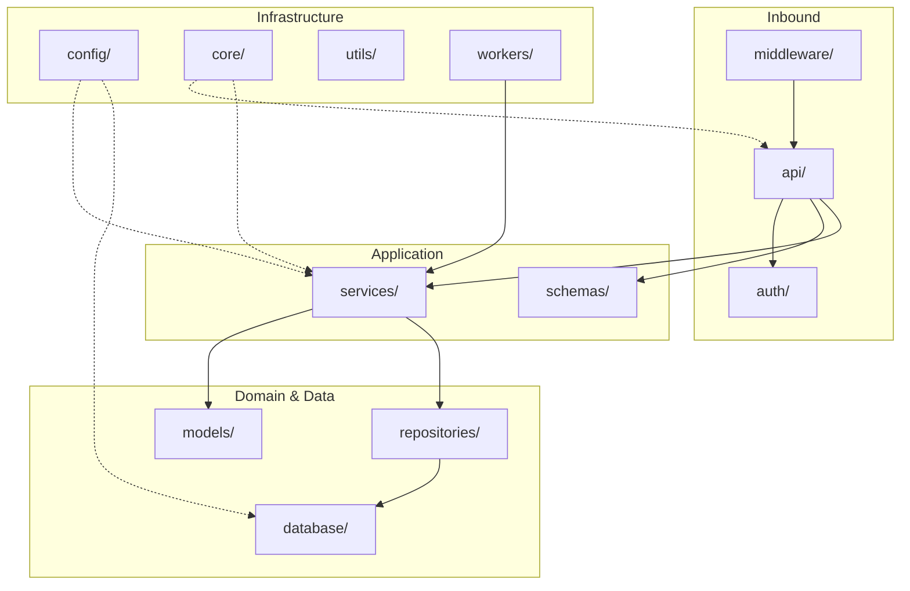
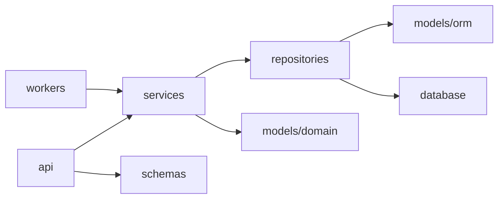

# Production Project Structure for AI

> Phase 3 reference for organizing production AI backends — every folder's responsibility, import direction, and how the layout scales from chat MVP to multi-tenant SaaS.

## Table of Contents

- [Overview](#overview)
- [Why Structure Matters for AI Backends](#why-structure-matters-for-ai-backends)
- [Recommended Layout](#recommended-layout)
- [Folder Responsibilities](#folder-responsibilities)
- [Import Rules and Layer Boundaries](#import-rules-and-layer-boundaries)
- [Composition Root and Wiring](#composition-root-and-wiring)
- [Scaling the Layout](#scaling-the-layout)
- [AI-Specific Conventions](#ai-specific-conventions)
- [Production Considerations](#production-considerations)
- [Common Mistakes](#common-mistakes)
- [Interview Preparation](#interview-preparation)
- [Navigation](#navigation)

---

## Overview

A production AI backend outgrows a single `main.py` within days. Prompts, embeddings, ingestion jobs, streaming endpoints, and tenant isolation each add files — and without a consistent layout, every engineer invents their own.

This document defines the **canonical folder structure** for Python/FastAPI AI backends. It complements:

- [Backend Architecture for AI](backend-architecture-for-ai.md) — *why* layers exist
- [AI Backend Reference Architecture](ai-backend-reference-architecture.md) — *how* components connect at runtime
- [FastAPI Complete Guide](../fastapi/fastapi-complete-guide.md) — framework-level implementation

> **Production Standard:** Folder names are contracts. When `services/` always holds use-case logic and `api/` never touches the database directly, onboarding, code review, and incident response all get faster.

---

## Why Structure Matters for AI Backends

| AI Product Pressure | Structural Consequence |
|---------------------|------------------------|
| Multiple LLM providers | `core/ports/` or `services/` with adapter implementations in `repositories/` or `database/` |
| RAG ingestion pipelines | `workers/` for durable jobs; `services/ingestion_service.py` for orchestration |
| Streaming chat | Thin `api/` routes; streaming logic in `services/` |
| Multi-tenant SaaS | `auth/` + tenant-scoped `repositories/` |
| Rapid feature addition | Versioned `api/v1/`, `api/v2/` without moving business logic |

Without structure, teams converge on **god files** — `main.py` with 800 lines of prompts, SQL, and OpenAI calls. See [Backend Engineering Mistakes](backend-engineering-mistakes.md#8-bad-folder-structure) for symptoms and fixes.

---

## Recommended Layout

```
ai-backend/
├── app/
│   ├── __init__.py
│   ├── main.py                     # Application factory — create_app()
│   │
│   ├── api/                        # HTTP transport layer
│   │   ├── __init__.py
│   │   ├── deps.py                 # Route-level Depends (auth, pagination)
│   │   └── v1/
│   │       ├── __init__.py
│   │       ├── router.py           # Aggregates v1 sub-routers
│   │       ├── chat.py
│   │       ├── documents.py
│   │       ├── agents.py
│   │       └── health.py
│   │
│   ├── core/                       # Cross-cutting application primitives
│   │   ├── __init__.py
│   │   ├── exceptions.py           # Domain and HTTP exception hierarchy
│   │   ├── logging.py              # Structured logging setup
│   │   ├── security.py             # Password hashing, token utilities
│   │   └── openapi.py              # OpenAPI customization
│   │
│   ├── config/                     # Configuration and settings
│   │   ├── __init__.py
│   │   └── settings.py             # Pydantic Settings — single source of truth
│   │
│   ├── models/                     # Domain entities and ORM models
│   │   ├── __init__.py
│   │   ├── domain/                 # Pure domain entities (no SQLAlchemy)
│   │   │   ├── conversation.py
│   │   │   ├── document.py
│   │   │   └── user.py
│   │   └── orm/                    # SQLAlchemy ORM table definitions
│   │       ├── base.py
│   │       ├── conversation.py
│   │       └── document.py
│   │
│   ├── schemas/                    # Pydantic request/response DTOs
│   │   ├── __init__.py
│   │   ├── chat.py
│   │   ├── documents.py
│   │   ├── agents.py
│   │   └── errors.py
│   │
│   ├── services/                   # Business logic and use cases
│   │   ├── __init__.py
│   │   ├── chat_service.py
│   │   ├── rag_service.py
│   │   ├── ingestion_service.py
│   │   └── agent_service.py
│   │
│   ├── repositories/               # Data access implementations
│   │   ├── __init__.py
│   │   ├── base.py
│   │   ├── conversation_repo.py
│   │   ├── document_repo.py
│   │   └── vector_repo.py
│   │
│   ├── database/                   # Database engine, sessions, migrations glue
│   │   ├── __init__.py
│   │   ├── engine.py               # create_async_engine, sessionmaker
│   │   └── session.py              # get_session dependency, context managers
│   │
│   ├── middleware/                 # ASGI middleware
│   │   ├── __init__.py
│   │   ├── request_id.py
│   │   ├── timing.py
│   │   └── rate_limit.py
│   │
│   ├── auth/                       # Authentication and authorization
│   │   ├── __init__.py
│   │   ├── jwt.py
│   │   ├── dependencies.py         # get_current_user, require_role
│   │   └── policies.py             # RBAC, tenant scoping rules
│   │
│   ├── utils/                      # Pure helpers — no business logic
│   │   ├── __init__.py
│   │   ├── text.py                 # Chunking, token counting
│   │   ├── datetime.py
│   │   └── ids.py                  # UUID generation, slug helpers
│   │
│   └── workers/                    # Background job definitions
│       ├── __init__.py
│       ├── celery_app.py           # Or ARQ worker configuration
│       ├── ingestion_tasks.py
│       └── embedding_tasks.py
│
├── tests/
│   ├── conftest.py                 # Fixtures, dependency overrides
│   ├── unit/
│   │   ├── services/
│   │   └── repositories/
│   └── integration/
│       ├── api/
│       └── workers/
│
├── scripts/
│   ├── seed_db.py
│   ├── reindex_vectors.py
│   └── backfill_embeddings.py
│
├── alembic/                        # Database migrations (project root)
├── pyproject.toml
├── Dockerfile
├── docker-compose.yml
└── .env.example
```



---

## Folder Responsibilities

### `api/` — HTTP Transport Layer

**Owns:** Route definitions, request parsing, response serialization, HTTP status codes, API versioning.

**Does not own:** Business logic, direct database queries, LLM calls, prompt assembly.

```python
# api/v1/chat.py — thin handler
@router.post("/chat", response_model=ChatResponse)
async def chat(
    body: ChatRequest,
    user: User = Depends(get_current_user),
    service: ChatService = Depends(get_chat_service),
) -> ChatResponse:
    reply = await service.reply(user.id, body.message, body.session_id)
    return ChatResponse.from_domain(reply)
```

| Subfolder / File | Responsibility |
|------------------|----------------|
| `api/v1/router.py` | Aggregates versioned routers under a single prefix |
| `api/v1/chat.py` | Chat endpoints — delegates to `ChatService` |
| `api/deps.py` | Shared route dependencies (pagination, optional auth) |

Cross-reference: [Backend Fundamentals for AI](backend-fundamentals-for-ai.md#request-lifecycle), [API Design for AI](../apis/api-design-for-ai.md).

---

### `core/` — Cross-Cutting Primitives

**Owns:** Exception hierarchy, logging configuration, OpenAPI customization, shared security utilities that are not auth policies.

**Does not own:** Business rules, database access, route handlers.

```python
# core/exceptions.py
class AppError(Exception):
    """Base for all application errors."""

class NotFoundError(AppError):
    def __init__(self, resource: str, id: str) -> None:
        super().__init__(f"{resource} {id} not found")
```

| Module | Responsibility |
|--------|----------------|
| `exceptions.py` | Typed errors mapped to HTTP responses in exception handlers |
| `logging.py` | JSON structured logging, correlation ID binding |
| `openapi.py` | Tags, security schemes, example payloads |
| `security.py` | Hashing, constant-time comparison — not JWT issuance |

Cross-reference: [Logging and Error Handling](../logging/logging-and-error-handling.md).

---

### `config/` — Configuration Management

**Owns:** Environment variable loading, typed settings, feature flags, provider API keys (by reference, never values).

**Does not own:** Reading `os.environ` scattered across the codebase.

```python
# config/settings.py
from functools import lru_cache
from pydantic_settings import BaseSettings, SettingsConfigDict


class Settings(BaseSettings):
    model_config = SettingsConfigDict(env_file=".env", extra="ignore")

    app_name: str = "AI Backend"
    database_url: str
    redis_url: str
    openai_api_key: str
    environment: str = "development"
    cors_origins: list[str] = ["http://localhost:3000"]


@lru_cache
def get_settings() -> Settings:
    return Settings()
```

Cross-reference: [Configuration and Secrets](../foundations/configuration-and-secrets.md), [Backend Engineering Mistakes](backend-engineering-mistakes.md#9-hardcoded-config).

---

### `models/` — Domain Entities and ORM Definitions

**Owns:** Data shapes — both pure domain entities and SQLAlchemy ORM table mappings.

**Does not own:** HTTP serialization (that's `schemas/`), query logic (that's `repositories/`).

| Subfolder | Responsibility |
|-----------|----------------|
| `models/domain/` | Pure Python dataclasses or Pydantic models representing business concepts |
| `models/orm/` | SQLAlchemy `Mapped` column definitions, relationships, table names |

```python
# models/domain/document.py
from dataclasses import dataclass
from datetime import datetime


@dataclass(frozen=True)
class Document:
    id: str
    tenant_id: str
    filename: str
    status: str
    created_at: datetime
```

```python
# models/orm/document.py
from sqlalchemy.orm import Mapped, mapped_column
from .base import Base


class DocumentORM(Base):
    __tablename__ = "documents"

    id: Mapped[str] = mapped_column(primary_key=True)
    tenant_id: Mapped[str] = mapped_column(index=True)
    filename: Mapped[str]
    status: Mapped[str] = mapped_column(default="pending")
```

**Rule:** Repositories map `ORM → domain` at the boundary. Services never import SQLAlchemy models directly.

Cross-reference: [SQLAlchemy for AI Applications](../databases/postgresql/sqlalchemy-for-ai-applications.md).

---

### `schemas/` — API Request and Response DTOs

**Owns:** Pydantic models for HTTP boundaries — validation, serialization, OpenAPI generation.

**Does not own:** Database persistence logic, business rules.

```python
# schemas/chat.py
from pydantic import BaseModel, Field


class ChatRequest(BaseModel):
    message: str = Field(..., min_length=1, max_length=8000)
    session_id: str | None = None


class ChatResponse(BaseModel):
    reply: str
    session_id: str
    model: str

    @classmethod
    def from_domain(cls, result: "ChatResult") -> "ChatResponse":
        return cls(reply=result.content, session_id=result.session_id, model=result.model)
```

Cross-reference: [Backend Engineering Mistakes](backend-engineering-mistakes.md#10-missing-validation).

---

### `services/` — Business Logic and Use Cases

**Owns:** Orchestration — RAG pipelines, conversation turns, agent loops, cost budgets, retry policies.

**Does not own:** HTTP concerns, raw SQL, framework imports.

```python
# services/rag_service.py
class RAGService:
    def __init__(
        self,
        document_repo: DocumentRepository,
        vector_repo: VectorRepository,
        llm: LLMClient,
    ) -> None:
        self._documents = document_repo
        self._vectors = vector_repo
        self._llm = llm

    async def answer(self, tenant_id: str, query: str, top_k: int = 5) -> RAGResult:
        chunks = await self._vectors.similarity_search(tenant_id, query, top_k)
        context = self._build_context(chunks)
        response = await self._llm.complete(query, system=context)
        return RAGResult(content=response.content, citations=chunks)
```

This is the **heart** of the AI backend. See [Backend Architecture for AI](backend-architecture-for-ai.md#service-layer).

---

### `repositories/` — Data Access Layer

**Owns:** CRUD operations, query construction, mapping ORM rows to domain entities, vector store queries.

**Does not own:** Business decisions (filtering by tenant is data scoping; authorization policy lives in `auth/`).

```python
# repositories/document_repo.py
class DocumentRepository:
    def __init__(self, session: AsyncSession) -> None:
        self._session = session

    async def get_by_id(self, tenant_id: str, doc_id: str) -> Document | None:
        stmt = select(DocumentORM).where(
            DocumentORM.id == doc_id,
            DocumentORM.tenant_id == tenant_id,
        )
        row = (await self._session.execute(stmt)).scalar_one_or_none()
        return self._to_domain(row) if row else None
```

Cross-reference: [Backend Architecture for AI](backend-architecture-for-ai.md#repository-pattern).

---

### `database/` — Connection Lifecycle

**Owns:** Engine creation, session factory, connection pool configuration, lifespan hooks for startup/shutdown.

**Does not own:** Business queries (repositories), migration files (Alembic at project root).

```python
# database/session.py
from collections.abc import AsyncIterator
from sqlalchemy.ext.asyncio import AsyncSession, async_sessionmaker


async def get_session(
    factory: async_sessionmaker[AsyncSession] = Depends(get_session_factory),
) -> AsyncIterator[AsyncSession]:
    async with factory() as session:
        try:
            yield session
            await session.commit()
        except Exception:
            await session.rollback()
            raise
```

Cross-reference: [Backend Engineering Mistakes](backend-engineering-mistakes.md#2-session-leaks), [PostgreSQL for AI](../databases/postgresql/postgresql-for-ai.md).

---

### `middleware/` — ASGI Middleware Stack

**Owns:** Request ID injection, timing headers, CORS (if not at reverse proxy), global rate limiting.

**Does not own:** Per-route authorization (that's `auth/dependencies.py`).

| Middleware | Purpose |
|------------|---------|
| `request_id.py` | Propagate `X-Request-ID` for distributed tracing |
| `timing.py` | `X-Process-Time` header, slow-request warnings |
| `rate_limit.py` | Global or per-IP throttling before handlers run |

Cross-reference: [Backend Fundamentals for AI](backend-fundamentals-for-ai.md#middleware).

---

### `auth/` — Authentication and Authorization

**Owns:** JWT creation/validation, OAuth flows, `get_current_user` dependencies, RBAC policies, API key verification.

**Does not own:** User CRUD (that's a service + repository), password reset email sending (service + worker).

```python
# auth/dependencies.py
async def get_current_user(
    token: str = Depends(oauth2_scheme),
    user_repo: UserRepository = Depends(get_user_repo),
) -> User:
    payload = decode_access_token(token)
    user = await user_repo.get_by_id(payload["sub"])
    if user is None:
        raise UnauthorizedError("Invalid token")
    return user
```

Cross-reference: [Authentication and Authorization for AI](../security/authentication-authorization-for-ai.md), [Backend Engineering Mistakes](backend-engineering-mistakes.md#11-weak-auth).

---

### `utils/` — Pure Helper Functions

**Owns:** Stateless utilities — text chunking, token counting, ID generation, datetime formatting.

**Does not own:** Anything that needs database access, configuration, or side effects.

```python
# utils/text.py
def chunk_text(text: str, chunk_size: int = 512, overlap: int = 64) -> list[str]:
    """Split text into overlapping chunks for embedding."""
    ...
```

**Warning:** `utils/` becomes a junk drawer without discipline. If a function needs a repository, it belongs in `services/`.

---

### `workers/` — Background Job Definitions

**Owns:** Celery/ARQ task definitions, job retry configuration, worker entry points for ingestion and embedding.

**Does not own:** HTTP endpoints (except triggering jobs via API).

```python
# workers/ingestion_tasks.py
@celery_app.task(bind=True, max_retries=3)
def ingest_document(self, tenant_id: str, document_id: str) -> None:
    asyncio.run(_ingest_async(tenant_id, document_id))
```

Cross-reference: [Background Processing for AI](background-processing-for-ai.md), [File Handling for AI](file-handling-for-ai.md).

---

### `tests/` — Test Suite

**Owns:** Unit tests (services with fakes), integration tests (API with test DB), worker tests.

**Mirrors production structure:**

```
tests/
├── unit/services/test_rag_service.py
├── unit/repositories/test_document_repo.py
├── integration/api/test_chat.py
└── conftest.py
```

Cross-reference: [Testing Fundamentals](../foundations/testing-fundamentals.md).

---

### `scripts/` — Operational and Development Scripts

**Owns:** One-off maintenance — seed data, reindex vectors, backfill embeddings, local dev helpers.

**Does not own:** Production request handling. Scripts import from `app/` but are never imported by `app/`.

```bash
# Run from project root
python -m scripts.reindex_vectors --tenant-id abc123
```

---

## Import Rules and Layer Boundaries

Enforce dependency direction to prevent circular imports and architectural decay:

| Layer | May Import From | Must Not Import |
|-------|-----------------|-----------------|
| `api/` | `schemas/`, `services/`, `auth/`, `core/` | `models/orm/`, `repositories/` directly |
| `services/` | `models/domain/`, `repositories/` (via interfaces), `utils/`, `config/` | `api/`, FastAPI |
| `repositories/` | `models/`, `database/` | `api/`, `services/` |
| `models/domain/` | `utils/` only | Everything else |
| `workers/` | `services/`, `config/` | `api/` |
| `utils/` | Standard library only | Any app layer |



See [Backend Engineering Mistakes](backend-engineering-mistakes.md#7-circular-imports) when these rules break.

---

## Composition Root and Wiring

All dependency wiring lives in one place — typically `app/dependencies.py` or `app/api/deps.py`:

```python
# dependencies.py — composition root
def get_chat_service(
    session: AsyncSession = Depends(get_session),
    settings: Settings = Depends(get_settings),
) -> ChatService:
    message_repo = MessageRepository(session)
    llm = OpenAIClient(api_key=settings.openai_api_key)
    return ChatService(message_repo=message_repo, llm=llm)
```

Routes never construct services manually. Tests override via `app.dependency_overrides`.

Cross-reference: [Backend Architecture for AI](backend-architecture-for-ai.md#dependency-injection).

---

## Scaling the Layout

### Small Project (MVP)

Merge `models/domain/` and `models/orm/` if the team is one person. Keep `services/` and `repositories/` separate from day one.

### Medium Project (RAG + Chat)

Add feature modules under `services/` and `api/v1/`. Introduce `workers/` when ingestion exceeds background task capacity.

### Large Project (Multi-Tenant SaaS)

```
app/
├── api/v1/ ... v2/
├── services/
│   ├── chat/
│   ├── rag/
│   ├── billing/
│   └── agents/
├── repositories/
└── workers/
```

Consider a `src/` layout and package name matching PyPI distribution. See [Python for AI Engineering](../python-engineering/python-for-ai-engineering.md).

---

## AI-Specific Conventions

| Concern | Location | Not Here |
|---------|----------|----------|
| Prompt templates | `services/` or dedicated `prompts/` under services | `api/` route handlers |
| LLM client adapters | `repositories/` or `infrastructure/llm/` | Inline in services (acceptable at small scale) |
| Embedding logic | `services/embedding_service.py` | `utils/` |
| Vector search | `repositories/vector_repo.py` | Direct pgvector SQL in routes |
| Tool definitions for agents | `schemas/agents.py` + `services/agent_service.py` | WebSocket handler |
| Streaming generators | `services/` yield tokens; `api/` wraps in `StreamingResponse` | LLM SDK in route |

Cross-reference: [AI Backend Reference Architecture](ai-backend-reference-architecture.md) for runtime component diagrams.

---

## Production Considerations

| Concern | Structural Mitigation |
|---------|----------------------|
| Secret leakage | `config/settings.py` only; `.env.example` without values |
| Deploy rollbacks | `alembic/` at root; versioned `api/v1/` |
| Horizontal scaling | Stateless `api/` pods; state in PostgreSQL/Redis |
| Observability | `core/logging.py` + `middleware/request_id.py` |
| Onboarding | README with folder map linking to this document |

---

## Common Mistakes

| Mistake | Symptom | Fix |
|---------|---------|-----|
| LLM calls in `api/` | Untestable routes | Move to `services/` |
| ORM models in `schemas/` | Leaky API contracts | Separate domain, ORM, and DTO |
| `utils/` god module | Circular imports | Promote to `services/` |
| No `workers/` for ingestion | API timeouts on upload | [Background Processing for AI](background-processing-for-ai.md) |
| Flat `models.py` | 2000-line file | Split `domain/` and `orm/` |
| Config in route files | Untestable, insecure | `config/settings.py` + DI |

Full troubleshooting: [Backend Engineering Mistakes](backend-engineering-mistakes.md).

---

## Interview Preparation

**Q1: Walk through your production FastAPI folder structure for a RAG app.**

> **Strong answer:** Describe `api/v1/` for routes, `schemas/` for Pydantic DTOs, `services/rag_service.py` for orchestration, `repositories/` for PostgreSQL and vector store access, `workers/` for ingestion, `config/` for settings. Explain import direction and why LLM calls never live in routes.

**Q2: Where do prompt templates live?**

> **Strong answer:** Version-controlled files or modules colocated with the service that assembles them — `services/prompts/` or inside `rag_service.py` helpers. Never inline in `api/`. Test assembly separately from LLM output quality.

**Q3: How do you prevent circular imports?**

> **Strong answer:** Enforce layer boundaries. Domain entities have no upward imports. Use interfaces/ports if services and repositories need shared types. Composition root in `dependencies.py` wires concrete implementations.

---

## Navigation

### Prerequisites

- [Backend Fundamentals for AI](backend-fundamentals-for-ai.md) — request lifecycle, middleware, DI overview
- [Software Engineering for AI](../foundations/software-engineering-for-ai.md) — layered architecture concepts
- [Backend Architecture for AI](backend-architecture-for-ai.md) — clean architecture and repository pattern

### Related Topics

- [AI Backend Reference Architecture](ai-backend-reference-architecture.md) — runtime component diagrams for chat, RAG, agents, SaaS
- [FastAPI Complete Guide](../fastapi/fastapi-complete-guide.md) — framework implementation of this layout
- [Backend Engineering Mistakes](backend-engineering-mistakes.md) — troubleshooting structural and runtime failures

### Next Topics

- [AI Backend Reference Architecture](ai-backend-reference-architecture.md) — end-to-end architecture patterns
- [Background Processing for AI](background-processing-for-ai.md) — `workers/` depth
- [Async Programming for AI Backends](async-programming-for-ai-backends.md) — non-blocking patterns across layers

### Future Reading

- [Authentication and Authorization for AI](../security/authentication-authorization-for-ai.md) — `auth/` implementation
- [File Handling for AI](file-handling-for-ai.md) — upload flows through `api/` and `workers/`
- [Observability](../observability/README.md) — tracing across layers

---

## See Also

- [Backend Architecture for AI](backend-architecture-for-ai.md)
- [AI Backend Reference Architecture](ai-backend-reference-architecture.md)
- [Backend Engineering Mistakes](backend-engineering-mistakes.md)

## Changelog

| Version | Date | Changes |
|---------|------|---------|
| 1.0 | 2026-07-13 | Initial Phase 3 release |
