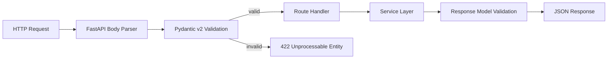
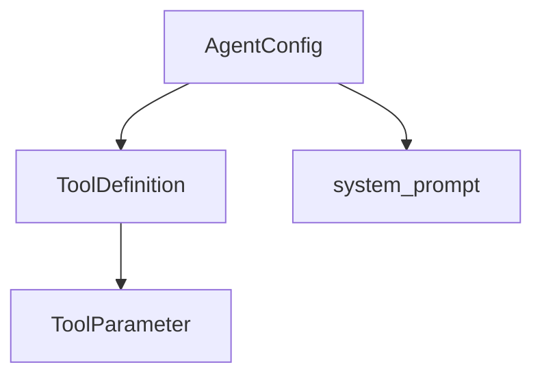

# Validation for AI APIs

> reference for production validation in AI APIs — Pydantic v2 schemas as contracts, nested message models, reusable components, response enforcement, and strict typing for chat, RAG, and agent endpoints.

## Table of Contents

- [Overview](#overview)
- [Why Validation Matters for AI APIs](#why-validation-matters-for-ai-apis)
- [Pydantic v2 Fundamentals](#pydantic-v2-fundamentals)
- [Request Models for AI Endpoints](#request-models-for-ai-endpoints)
- [Custom Validators](#custom-validators)
- [Nested and Composed Models](#nested-and-composed-models)
- [Reusable Schema Patterns](#reusable-schema-patterns)
- [Response Validation](#response-validation)
- [Strict Typing and Coercion](#strict-typing-and-coercion)
- [Validating External and LLM Output](#validating-external-and-llm-output)
- [FastAPI Integration](#fastapi-integration)
- [OpenAPI and Client Generation](#openapi-and-client-generation)
- [Production Considerations](#production-considerations)
- [Common Mistakes](#common-mistakes)
- [Interview Preparation](#interview-preparation)
- [Navigation](#navigation)

---

## Overview

AI APIs accept complex, high-risk input — long message histories, tool definitions, file metadata, retrieval parameters — and return structured output that downstream clients, eval harnesses, and agents depend on. **Pydantic v2** is the validation engine behind FastAPI; it runs before your handler executes, rejecting malformed requests with precise 422 responses and enforcing output contracts via `response_model`.

This document is a **deep dive**. It assumes you have read:

- [Backend Fundamentals for AI](backend-fundamentals-for-ai.md) — FastAPI request lifecycle
- [FastAPI Complete Guide](../fastapi/fastapi-complete-guide.md) — Pydantic v2 overview and routing
- [API Design for AI](../apis/api-design-for-ai.md) — contract design principles

Foundation covered the basics. Here we cover **production-grade validation patterns** for AI-specific schemas.



---

## Why Validation Matters for AI APIs

| Risk Without Validation | Validation Prevents |
|-------------------------|---------------------|
| 100-message history blows context window | `max_length` on `messages` |
| Negative `top_k` breaks retrieval | `Field(ge=1, le=50)` |
| Tool schema injection in agent API | Pattern constraints on tool names |
| LLM returns malformed JSON to client | Response model enforcement |
| Temperature 99 causes provider error | `Field(ge=0.0, le=2.0)` |
| Cross-tenant ID in document reference | Custom validator + auth check |

Validation is your **first line of defense** — cheaper than an LLM call with garbage input. It also generates OpenAPI schemas that frontend teams and eval pipelines consume as contracts.

> **Production Standard:** Validate at the HTTP boundary with Pydantic. Re-validate untrusted external API and LLM structured output before using it in business logic. Map validation failures to stable error responses — see [Error Handling for AI Backends](error-handling-for-ai-backends.md).

---

## Pydantic v2 Fundamentals

### v1 → v2 Migration Cheatsheet

| Pydantic v1 | Pydantic v2 |
|-------------|-------------|
| `@validator` | `@field_validator` |
| `@root_validator` | `@model_validator` |
| `class Config` | `model_config = {...}` |
| `.dict()` | `.model_dump()` |
| `.json()` | `.model_dump_json()` |
| `orm_mode = True` | `from_attributes = True` |
| `validate_all` | Validators run on defaults |

### Base Model Configuration

```python
from pydantic import BaseModel, ConfigDict


class APIModel(BaseModel):
    """Base for all API schemas — consistent config."""

    model_config = ConfigDict(
        str_strip_whitespace=True,
        validate_assignment=True,
        extra="forbid",           # reject unknown fields
        populate_by_name=True,    # allow alias + field name
        ser_json_timedelta="iso8601",
    )
```

### Field Annotations

```python
from typing import Annotated

from pydantic import BaseModel, Field


class PaginationParams(BaseModel):
    offset: Annotated[int, Field(ge=0, description="Zero-based offset")] = 0
    limit: Annotated[int, Field(ge=1, le=100, description="Page size")] = 20
```

Use `Annotated` for reusable constraints — FastAPI reads `Field` metadata for OpenAPI.

---

## Request Models for AI Endpoints

### Chat Completion Request

```python
from enum import Enum

from pydantic import BaseModel, Field, field_validator, model_validator


class Role(str, Enum):
    SYSTEM = "system"
    USER = "user"
    ASSISTANT = "assistant"
    TOOL = "tool"


class ChatMessage(BaseModel):
    role: Role
    content: str = Field(..., min_length=1, max_length=32_000)
    name: str | None = Field(None, max_length=64, pattern=r"^[a-zA-Z0-9_-]+$")

    model_config = {"extra": "forbid"}


class ChatRequest(BaseModel):
    messages: list[ChatMessage] = Field(..., min_length=1, max_length=100)
    model: str = Field("gpt-4o-mini", max_length=64)
    temperature: float = Field(0.7, ge=0.0, le=2.0)
    max_tokens: int | None = Field(None, ge=1, le=16_384)
    stream: bool = False

    @field_validator("messages")
    @classmethod
    def last_message_from_user(cls, messages: list[ChatMessage]) -> list[ChatMessage]:
        if messages[-1].role != Role.USER:
            raise ValueError("Last message must be from user")
        return messages

    @model_validator(mode="after")
    def check_context_budget(self) -> "ChatRequest":
        total_chars = sum(len(m.content) for m in self.messages)
        if total_chars > 120_000:
            raise ValueError("Estimated context exceeds maximum allowed size")
        return self
```

### RAG Query Request

```python
class RAGQueryRequest(BaseModel):
    query: str = Field(..., min_length=1, max_length=2_000)
    collection_id: str = Field(..., pattern=r"^[a-z0-9-]{8,64}$")
    top_k: int = Field(5, ge=1, le=50)
    score_threshold: float = Field(0.0, ge=0.0, le=1.0)
    include_metadata: bool = True
    rerank: bool = False
```

### Document Ingestion Request

```python
from pydantic import HttpUrl


class DocumentIngestRequest(BaseModel):
    source_url: HttpUrl | None = None
    title: str = Field(..., min_length=1, max_length=256)
    tags: list[str] = Field(default_factory=list, max_length=20)
    chunk_size: int = Field(512, ge=128, le=4096)
    chunk_overlap: int = Field(64, ge=0, le=512)

    @model_validator(mode="after")
    def overlap_less_than_size(self) -> "DocumentIngestRequest":
        if self.chunk_overlap >= self.chunk_size:
            raise ValueError("chunk_overlap must be less than chunk_size")
        return self
```

---

## Custom Validators

Pydantic v2 offers **field validators** (single field) and **model validators** (cross-field logic).

### field_validator

```python
from pydantic import BaseModel, Field, field_validator


class AgentToolCall(BaseModel):
    tool_name: str = Field(..., pattern=r"^[a-z][a-z0-9_]*$")
    arguments: dict

    @field_validator("arguments")
    @classmethod
    def arguments_not_empty(cls, v: dict) -> dict:
        if not v:
            raise ValueError("Tool arguments cannot be empty")
        return v

    @field_validator("tool_name")
    @classmethod
    def reserved_names(cls, v: str) -> str:
        reserved = {"system", "admin", "internal"}
        if v in reserved:
            raise ValueError(f"Tool name '{v}' is reserved")
        return v
```

### model_validator

```python
class DateRangeFilter(BaseModel):
    start_date: str  # ISO date
    end_date: str

    @model_validator(mode="after")
    def end_after_start(self) -> "DateRangeFilter":
        if self.end_date < self.start_date:
            raise ValueError("end_date must be on or after start_date")
        return self
```

### Before vs After Mode

| Mode | When to Use |
|------|-------------|
| `mode="before"` | Normalize raw input (strip, lowercase) before type coercion |
| `mode="after"` | Cross-field validation on typed model instance |
| `mode="wrap"` | Full control over validation pipeline |

```python
from pydantic import field_validator


class NormalizedQuery(BaseModel):
    query: str

    @field_validator("query", mode="before")
    @classmethod
    def strip_and_collapse_whitespace(cls, v: str) -> str:
        return " ".join(v.split())
```

### Validation Context (Multi-Tenant Checks)

Pass runtime context for validators that need DB or auth state:

```python
from pydantic import BaseModel, ValidationInfo, field_validator


class DocumentReference(BaseModel):
    document_id: str

    @field_validator("document_id")
    @classmethod
    def document_belongs_to_tenant(cls, v: str, info: ValidationInfo) -> str:
        allowed_ids: set[str] | None = info.context.get("allowed_document_ids") if info.context else None
        if allowed_ids is not None and v not in allowed_ids:
            raise ValueError("Document not accessible")
        return v


# Usage in service layer
doc = DocumentReference.model_validate(
    {"document_id": "abc"},
    context={"allowed_document_ids": {"abc", "def"}},
)
```

---

## Nested and Composed Models

AI APIs are inherently nested — messages contain parts, agents contain tools, RAG responses contain citations.

### Multimodal Message Content

```python
from typing import Literal

from pydantic import BaseModel, Field, Discriminator
from typing_extensions import Annotated


class TextPart(BaseModel):
    type: Literal["text"] = "text"
    text: str = Field(..., min_length=1)


class ImagePart(BaseModel):
    type: Literal["image_url"] = "image_url"
    url: str = Field(..., max_length=2048)
    detail: Literal["auto", "low", "high"] = "auto"


ContentPart = Annotated[TextPart | ImagePart, Discriminator("type")]


class MultimodalMessage(BaseModel):
    role: Role
    content: list[ContentPart] = Field(..., min_length=1)
```

### Agent Configuration

```python
class ToolParameter(BaseModel):
    name: str = Field(..., pattern=r"^[a-z][a-z0-9_]*$")
    type: Literal["string", "number", "boolean", "object", "array"]
    description: str = Field(..., min_length=5, max_length=500)
    required: bool = True


class ToolDefinition(BaseModel):
    name: str = Field(..., pattern=r"^[a-z][a-z0-9_]*$")
    description: str = Field(..., min_length=10, max_length=500)
    parameters: list[ToolParameter] = Field(..., min_length=1)


class AgentConfig(BaseModel):
    name: str = Field(..., max_length=64)
    system_prompt: str = Field(..., max_length=8_000)
    tools: list[ToolDefinition] = Field(default_factory=list, max_length=20)
    max_iterations: int = Field(10, ge=1, le=50)
```



---

## Reusable Schema Patterns

### Shared Base and Mixins

```python
# app/schemas/base.py
from datetime import datetime
from uuid import UUID

from pydantic import BaseModel, Field


class TimestampMixin(BaseModel):
    created_at: datetime
    updated_at: datetime


class TenantScopedMixin(BaseModel):
    tenant_id: UUID


class ResourceMeta(TimestampMixin, TenantScopedMixin):
    id: UUID
    version: int = Field(..., ge=1)
```

### Pagination Response Wrapper

```python
from typing import Generic, TypeVar

T = TypeVar("T")


class PaginatedResponse(BaseModel, Generic[T]):
    items: list[T]
    total: int = Field(..., ge=0)
    offset: int = Field(..., ge=0)
    limit: int = Field(..., ge=1)


# Concrete usage
class DocumentSummary(BaseModel):
    id: str
    title: str


DocumentListResponse = PaginatedResponse[DocumentSummary]
```

### Standard Error Schema

```python
class ErrorDetail(BaseModel):
    field: str | None = None
    message: str
    type: str | None = None


class ErrorResponse(BaseModel):
    error: str
    message: str
    details: list[ErrorDetail] = []
    request_id: str | None = None
```

Reuse across routers — declare in OpenAPI `responses` dict. See [Error Handling for AI Backends](error-handling-for-ai-backends.md) for handler integration.

### TypeAdapter for Non-Model Validation

```python
from pydantic import TypeAdapter

EmbeddingVector = TypeAdapter(list[float])

def parse_embedding(raw: list) -> list[float]:
    return EmbeddingVector.validate_python(raw)
```

Useful for validating LLM JSON output arrays without wrapping in a full model.

---

## Response Validation

FastAPI's `response_model` validates and serializes handler output **after** execution.

```python
from pydantic import BaseModel, Field


class Citation(BaseModel):
    document_id: str
    title: str
    snippet: str = Field(..., max_length=300)
    score: float = Field(..., ge=0.0, le=1.0)


class TokenUsage(BaseModel):
    input_tokens: int = Field(..., ge=0)
    output_tokens: int = Field(..., ge=0)
    total_tokens: int = Field(..., ge=0)


class ChatResponse(BaseModel):
    id: str
    content: str
    model: str
    citations: list[Citation] = []
    usage: TokenUsage

    model_config = {"from_attributes": True}


@router.post("/chat", response_model=ChatResponse)
async def create_chat(body: ChatRequest, service: ChatService = Depends()) -> ChatResponse:
    return await service.reply(body)
```

### response_model Benefits

| Benefit | Description |
|---------|-------------|
| Output contract | Clients know exact response shape |
| Field filtering | Undeclared fields stripped from response |
| OpenAPI generation | Auto-documented response schemas |
| Type safety | Catches service bugs before they reach clients |

### response_model_exclude and Serialization

```python
class InternalChatResponse(ChatResponse):
  internal_debug: dict | None = None


@router.post("/chat", response_model=ChatResponse, response_model_exclude_none=True)
async def create_chat(...) -> InternalChatResponse:
    ...
```

### Validating ORM / Dataclass Output

```python
class UserOut(BaseModel):
    id: str
    email: str

    model_config = {"from_attributes": True}


# SQLAlchemy model → Pydantic
user_out = UserOut.model_validate(db_user)
```

---

## Strict Typing and Coercion

### Strict Mode

Reject coercion — `"42"` will not become `42`:

```python
class StrictChatParams(BaseModel):
    model_config = {"strict": True}

    top_k: int
    temperature: float
```

Use strict mode for **agent tool arguments** and **eval pipeline inputs** where type precision matters.

### Constrained Types

```python
from pydantic import PositiveInt, NonNegativeFloat
from typing import Annotated

Score = Annotated[float, Field(ge=0.0, le=1.0)]
PositiveTopK = Annotated[PositiveInt, Field(le=50)]
```

### Optional vs Required Discipline

```python
# Explicit optional with default None
max_tokens: int | None = None

# Required field — no default
query: str = Field(...)

# Empty list default — use default_factory
tags: list[str] = Field(default_factory=list)
```

### JSON Schema Generation for LLM Structured Output

```python
schema = ChatResponse.model_json_schema()
# Pass schema to provider for structured output / function calling
```

---

## Validating External and LLM Output

Never trust provider JSON without validation — models hallucinate fields, return partial data, or change shape across API versions.

```python
# app/schemas/llm_output.py
from pydantic import BaseModel, Field, field_validator


class ExtractedEntity(BaseModel):
    name: str = Field(..., min_length=1)
    entity_type: str
    confidence: float = Field(..., ge=0.0, le=1.0)


class ExtractionResult(BaseModel):
    entities: list[ExtractedEntity] = Field(default_factory=list)

    @field_validator("entities")
    @classmethod
    def cap_entity_count(cls, v: list[ExtractedEntity]) -> list[ExtractedEntity]:
        return v[:50]


def parse_llm_json(raw: str) -> ExtractionResult:
    import json

    try:
        data = json.loads(raw)
    except json.JSONDecodeError as exc:
        raise ValueError("LLM returned invalid JSON") from exc
    return ExtractionResult.model_validate(data)
```

### Validating HTTP Client Responses

After [HTTP Clients for AI Backends](http-clients-for-ai-backends.md) fetches external data:

```python
from pydantic import TypeAdapter

SearchResults = TypeAdapter(list[dict])  # or a proper model


async def search_and_validate(client, query: str) -> list[SearchResult]:
    response = await client.get("/search", params={"q": query})
    response.raise_for_status()
    return [SearchResult.model_validate(item) for item in response.json()["results"]]
```

---

## FastAPI Integration

### Route with Documented Error Responses

```python
from fastapi import APIRouter, Depends

router = APIRouter(prefix="/rag", tags=["rag"])


@router.post(
    "/query",
    response_model=RAGQueryResponse,
    responses={
        422: {"model": ErrorResponse, "description": "Validation error"},
        404: {"model": ErrorResponse, "description": "Collection not found"},
    },
)
async def query_rag(
    body: RAGQueryRequest,
    service: RAGService = Depends(get_rag_service),
) -> RAGQueryResponse:
    return await service.query(body)
```

### Query and Path Parameter Validation

```python
from typing import Annotated

from fastapi import Path, Query


@router.get("/collections/{collection_id}/documents")
async def list_documents(
    collection_id: Annotated[str, Path(pattern=r"^[a-z0-9-]{8,64}$")],
    offset: Annotated[int, Query(ge=0)] = 0,
    limit: Annotated[int, Query(ge=1, le=100)] = 20,
) -> PaginatedResponse[DocumentSummary]:
    ...
```

### Dependency-Injected Validation

```python
from fastapi import Depends


def get_pagination(
    offset: Annotated[int, Query(ge=0)] = 0,
    limit: Annotated[int, Query(ge=1, le=100)] = 20,
) -> PaginationParams:
    return PaginationParams(offset=offset, limit=limit)


@router.get("/documents")
async def list_docs(pagination: PaginationParams = Depends(get_pagination)):
    ...
```

See [FastAPI Complete Guide — Pydantic v2 Models and Validation](../fastapi/fastapi-complete-guide.md#pydantic-v2-models-and-validation) for full routing patterns.

---

## OpenAPI and Client Generation

Pydantic models drive OpenAPI 3.1 schemas. Quality validation metadata improves generated TypeScript and Python clients.

```python
class ChatRequest(BaseModel):
    model_config = {
        "json_schema_extra": {
            "examples": [
                {
                    "messages": [{"role": "user", "content": "Summarize RAG."}],
                    "temperature": 0.3,
                }
            ]
        }
    }
```

| OpenAPI Quality Tip | Effect |
|---------------------|--------|
| `Field(description=...)` | Client docs and IDE hints |
| `examples` in `json_schema_extra` | Swagger UI try-it-out |
| Enums for fixed choices | Type-safe client enums |
| `responses` dict on routes | Documented error shapes |

---

## Production Considerations

- **extra="forbid"** on public APIs — reject unknown fields early; prevents parameter smuggling.
- **Version schemas** — when breaking changes ship, use `/v2` routes or `schema_version` field.
- **Size limits** — `max_length` on strings and lists prevents memory exhaustion from huge payloads.
- **Validate LLM output** — always parse structured responses through Pydantic before DB writes.
- **Performance** — Pydantic v2 is fast (Rust core); avoid re-validating unchanged objects in hot loops.
- **Separate request/response models** — `ChatRequest` ≠ `ChatResponse` ≠ `ChatRecord` (DB).
- **Test validation** — unit test validators independently of routes; see [Testing Fundamentals](../foundations/testing-fundamentals.md).
- **Eval harness alignment** — share schemas between API and offline eval scripts for consistency.

---

## Common Mistakes

| Mistake | Impact | Fix |
|---------|--------|-----|
| Using Pydantic v1 syntax | Subtle bugs, deprecation warnings | Migrate to v2 decorators |
| `extra="ignore"` on public API | Silent field drops | `extra="forbid"` |
| Validating in handler, not schema | Duplicated logic, late failures | `@field_validator` on model |
| Same model for request and DB entity | Leaks internal fields | Separate schemas |
| No response_model | Undocumented output, leaked fields | Always set on routes |
| Trusting LLM JSON without validation | Runtime KeyErrors | `model_validate` with try/except |
| Mutable default `tags: list = []` | Shared state bug | `default_factory=list` |
| Overly permissive `dict` fields | Injection via nested payloads | Typed nested models |

---

## Interview Preparation

### Frequently Asked Questions

**Q1: How does Pydantic validation integrate with FastAPI?**

> **Strong answer:** FastAPI uses Pydantic models as type annotations for request bodies, query params, and path params. Pydantic v2 validates and coerces input before the handler runs. Invalid input returns 422 with detailed error locations. `response_model` validates output after the handler. Validation is declarative — constraints live on the schema, not scattered in route code.

**Q2: When do you use field_validator vs model_validator?**

> **Strong answer:** `field_validator` for single-field rules — format, range, reserved names. `model_validator` for cross-field logic — date ranges, chunk_overlap < chunk_size, last message must be from user. Use `mode="before"` to normalize raw input before type coercion. Pass `ValidationInfo.context` for tenant-scoped checks.

**Q3: How do you validate structured output from an LLM?**

> **Strong answer:** Define a Pydantic model for expected shape. Parse JSON from LLM response, call `model_validate`. Handle `ValidationError` gracefully — retry with correction prompt, fall back to unstructured response, or return error. Cap list lengths and string sizes. Never pass raw LLM dicts to DB or downstream APIs.

**Q4: Why separate request, response, and database models?**

> **Strong answer:** Each layer has different concerns. Request models enforce client input constraints. Response models control what clients see — strip internal fields. DB models map to ORM with relationships and nullable columns. Coupling them causes field leaks, breaking changes on internal refactors, and validation rules that don't belong at the boundary.

### Real-World Scenario

**Scenario:** Frontend reports intermittent 422 errors on the chat endpoint after adding image upload support. Backend logs show validation failures on `content` field.

> **Discussion points:** Check if multimodal messages need discriminated union (`TextPart | ImagePart`) instead of plain `str`. Verify `extra="forbid"` isn't rejecting new client fields. Review whether `content` changed from string to list. Add OpenAPI examples for multimodal payloads. Test with `TestClient` using exact frontend payloads.

---

## Navigation

### Prerequisites

- [Backend Fundamentals for AI](backend-fundamentals-for-ai.md) — FastAPI basics
- [FastAPI Complete Guide](../fastapi/fastapi-complete-guide.md) — Pydantic v2 and response models
- [API Design for AI](../apis/api-design-for-ai.md) — API contract design

### Related Topics

- [Error Handling for AI Backends](error-handling-for-ai-backends.md) — validation error responses
- [HTTP Clients for AI Backends](http-clients-for-ai-backends.md) — validating external API responses
- [FastAPI Complete Guide](../fastapi/fastapi-complete-guide.md) — full framework reference

### Next Topics

- [Error Handling for AI Backends](error-handling-for-ai-backends.md) — map 422 and domain errors
- [Backend Architecture for AI](backend-architecture-for-ai.md) — where schemas live in layered design

### Future Reading

- [AI Evaluation](../ai-evaluation/README.md) — eval harness schema alignment
- [Testing Fundamentals](../foundations/testing-fundamentals.md) — testing validators

---

## See Also

- [Pydantic v2 Documentation](https://docs.pydantic.dev/)
- [FastAPI Request Body Documentation](https://fastapi.tiangolo.com/tutorial/body/)
- [FastAPI Complete Guide](../fastapi/fastapi-complete-guide.md)
- [API Design for AI](../apis/api-design-for-ai.md)

## Changelog

| Version | Date | Changes |
|---------|------|---------|
| 1.0 | 2026-07-13 | Initial release |
