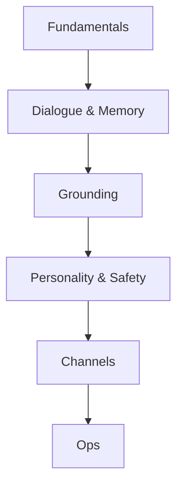

# Chatbots

> Production handbook for conversational products — dialogue, memory, grounding, safety, channels, and operations — restructured into the same nested Handbooks hierarchy.

**Prerequisites:** [LLM Application Development](../llm-application-development/README.md) · [Prompt Engineering](../prompt-engineering/README.md)  
**Unlocks:** [RAG](../rag/README.md) · [AI Agents](../ai-agents/README.md)

Start with a section hub below (or expand **12. Chatbots** in the left sidebar). Existing deep-dive primers are preserved and expanded — only the folder/nav structure changed for the curriculum nest.

---

## Sections

| # | Section | What you will learn | Hub |
|---|---------|---------------------|-----|
| 1 | **Fundamentals** | Bot types, components, success metrics | [fundamentals/](fundamentals/README.md) |
| 2 | **Dialogue & Memory** | Turns, summarization, long-term memory | [dialogue-and-memory/](dialogue-and-memory/README.md) |
| 3 | **Grounding** | Support bots, RAG-in-chat, citations UX | [grounding/](grounding/README.md) |
| 4 | **Personality & Safety** | Tone, refusal/escalation, PII | [personality-and-safety/](personality-and-safety/README.md) |
| 5 | **Channels** | Web, Slack/Teams, messaging, voice | [channels/](channels/README.md) |
| 6 | **Ops** | Evaluation, prompt A/B tests, human handoff | [ops/](ops/README.md) |

---

## Hierarchy

### 1. Fundamentals

| # | Topic |
|---|-------|
| 1 | [Chatbot Fundamentals](fundamentals/01-chatbot-fundamentals.md) |
| 2 | [Bot Types and Use Cases](fundamentals/02-bot-types-and-use-cases.md) |
| 3 | [Success Metrics](fundamentals/03-success-metrics.md) |

### 2. Dialogue & Memory

| # | Topic |
|---|-------|
| 1 | [Dialogue and Memory](dialogue-and-memory/01-dialogue-and-memory.md) |
| 2 | [Turn Management](dialogue-and-memory/02-turn-management.md) |
| 3 | [Conversation Summarization](dialogue-and-memory/03-conversation-summarization.md) |
| 4 | [Long-Term Memory](dialogue-and-memory/04-long-term-memory.md) |

### 3. Grounding

| # | Topic |
|---|-------|
| 1 | [Grounded Support Bots](grounding/01-grounded-support-bots.md) |
| 2 | [RAG in Chat](grounding/02-rag-in-chat.md) |
| 3 | [Citations UX](grounding/03-citations-ux.md) |

### 4. Personality & Safety

| # | Topic |
|---|-------|
| 1 | [Tone and Persona](personality-and-safety/01-tone-and-persona.md) |
| 2 | [Refusal and Escalation](personality-and-safety/02-refusal-and-escalation.md) |
| 3 | [PII and Privacy](personality-and-safety/03-pii-and-privacy.md) |

### 5. Channels

| # | Topic |
|---|-------|
| 1 | [Web Chat](channels/01-web-chat.md) |
| 2 | [Slack and Teams](channels/02-slack-and-teams.md) |
| 3 | [WhatsApp and Messaging](channels/03-whatsapp-and-messaging.md) |
| 4 | [Voice Handoff](channels/04-voice-handoff.md) |

### 6. Ops

| # | Topic |
|---|-------|
| 1 | [Chatbot Evaluation](ops/01-chatbot-evaluation.md) |
| 2 | [A/B Testing Prompts](ops/02-ab-testing-prompts.md) |
| 3 | [Human Handoff](ops/03-human-handoff.md) |

---

## Definition

A **chatbot** is a conversational interface that maintains a dialogue with a user to answer questions, complete tasks, or guide workflows. Modern chatbots are usually LLM-backed, optionally grounded with RAG/tools, and constrained by persona, policy, and memory design.

---

## Learning path

| Stage | Sections | Focus |
|-------|----------|-------|
| Foundations | 1 | Job scope, types, KPIs |
| Continuity | 2 | Turns, summaries, memory |
| Truthfulness | 3 | Retrieval, citations, refuse-when-unsure |
| Trust | 4 | Persona, refusal, privacy |
| Distribution | 5 | Channel adapters and constraints |
| Operate | 6 | Eval, experiments, handoff |

**Milestone:** Grounded support bot with citations, session memory/summary, channel adapter, eval suite, and warm human handoff.

---

## See also

- [Context Engineering](../context-engineering/README.md)
- [RAG](../rag/README.md)
- [AI Security & Guardrails](../ai-security-guardrails/README.md)
- [AI System Design](../ai-system-design/README.md)
- [Domains overview](../README.md)
- [Master Index](../../meta/indexes/MASTER-INDEX.md)
