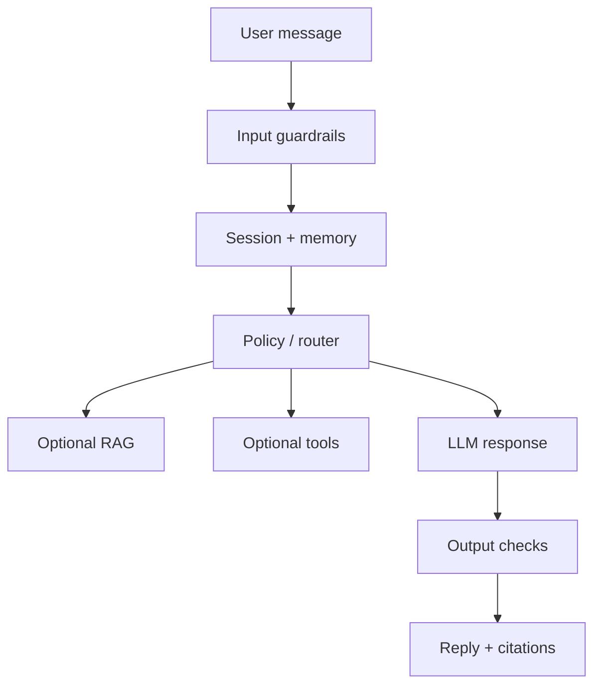

# Chatbots

> Conversational products — dialogue design, memory, grounding, and the engineering behind reliable chat experiences.

**Prerequisites:** [LLM Application Development](../llm-application-development/README.md) · [Prompt Engineering](../prompt-engineering/README.md)  
**Unlocks:** [RAG](../rag/README.md) · [AI Agents](../ai-agents/README.md)

---

## Definition

A **chatbot** is a conversational interface that maintains a dialogue with a user to answer questions, complete tasks, or guide workflows. Modern chatbots are usually LLM-backed, optionally grounded with RAG/tools, and constrained by persona, policy, and memory design.

---

## Learning path

---

## Documents

| # | Topic | Document |
|---|-------|----------|
| 1 | Chatbot fundamentals | [chatbot-fundamentals.md](chatbot-fundamentals.md) |
| 2 | Dialogue & memory | [dialogue-and-memory.md](dialogue-and-memory.md) |
| 3 | Grounded support bots | [grounded-support-bots.md](grounded-support-bots.md) |

---

## Related topics

- [Context Engineering](../context-engineering/README.md)
- [RAG](../rag/README.md)
- [AI System Design](../ai-system-design/README.md)

---

## See also

- [Domains overview](../README.md)
- [Learning Roadmap](../../meta/roadmap.md)
- [Master Index](../../meta/indexes/MASTER-INDEX.md)
