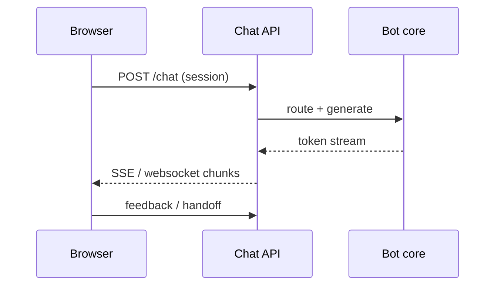

# Web Chat

> The web channel is your richest canvas — streaming, citations, and auth — and your biggest XSS/CSRF surface.

## Table of Contents

- [Definition](#definition)
- [Why It Matters](#why-it-matters)
- [Common Uses](#common-uses)
- [How It Works](#how-it-works)
- [UX Building Blocks](#ux-building-blocks)
- [Python Examples](#python-examples)
- [Production Considerations](#production-considerations)
- [Cost Considerations](#cost-considerations)
- [Security Considerations](#security-considerations)
- [Best Practices](#best-practices)
- [Common Mistakes](#common-mistakes)
- [Navigation](#navigation)

---

## Definition

**Web chat** delivers conversational UI in browsers: embedded widgets, in-app panels, or full-page assistants. It typically supports streaming tokens, markdown, source cards, file upload, and authenticated user context.

---

## Why It Matters

Most product teams prototype here first. Web sets expectations for other channels, but patterns that work on desktop (side panels, hover citations) fail on mobile. Engineering choices (SSE vs websockets, cookie auth) affect reliability and security.

---

## Common Uses

| Surface | Notes |
|---------|-------|
| Marketing site widget | Often anonymous; rate-limit hard |
| Logged-in app assistant | Rich context + tools |
| Docs copilot | Strong RAG + citations |
| Admin consoles | High privilege — strict authz |

---

## How It Works



Session continuity: durable `session_id` bound to auth user when available; anonymous sessions need abuse controls and short TTL.

---

## UX Building Blocks

- Composer with attachments and quick replies
- Streaming with stop button
- Citation panel / inline markers
- Typing / tool-progress indicators
- Handoff CTA
- Message actions: copy, regenerate (careful), feedback

Accessibility: keyboard focus, ARIA live regions for new messages, contrast, reduced-motion respect.

---

## Python Examples

### SSE-style chunking (sketch)

```python
import json
from typing import Iterator

def sse(events: Iterator[dict]) -> Iterator[str]:
    for ev in events:
        yield f"data: {json.dumps(ev)}\n\n"
    yield "data: {\"type\": \"done\"}\n\n"
```

### Session cookie binding

```python
def bind_session(user_id: str | None, session_id: str) -> dict:
    return {
        "session_id": session_id,
        "user_id": user_id,
        "channel": "web",
        "auth_level": "user" if user_id else "anon",
    }
```

---

## Production Considerations

- Idempotency keys for retries
- Message size and attachment malware scanning
- CDN for widget assets; version the widget
- Feature flags for prompt versions
- Mobile-first layout testing

---

## Cost Considerations

Streaming does not reduce token cost — it improves perceived latency. Anonymous viral traffic can bankrupt an open widget; require auth or strict quotas. Cache FAQ answers at the edge when safe.

---

## Security Considerations

- CSRF on cookie-authenticated POST
- Sanitize markdown/HTML to prevent XSS
- CSP for embedded widgets on third-party sites
- Do not put API keys in the frontend
- Attachment content is untrusted input (injection + malware)

---

## Best Practices

1. Stream tokens; show tool progress
2. Bind sessions to auth when possible
3. Design citation UX for mobile
4. Offer human handoff visibly
5. Instrument widget errors separately from API errors

---

## Common Mistakes

- Blocking UI until full completion
- Unauthenticated open proxies to expensive models
- Rendering raw model HTML
- No stop/cancel for runaway generations
- Ignoring accessibility live updates

---

## Streaming UX Details

- Show **stop** and disable send while streaming (or allow queueing deliberately)
- Render markdown incrementally with care (unclosed code fences)
- Keep citation cards collapsed until the turn completes if IDs may change
- On reconnect, resume via `session_id` + last `event_id`
- Surface tool progress: “Searching help center…”, “Checking order…”

### Auth context injection

Pass only **authorized** claims into the bot (plan, locale, account id). Never trust client-supplied “I am admin” flags — derive from server session.

---

## Navigation

| | |
|--|--|
| **Previous** | [PII and Privacy](../personality-and-safety/03-pii-and-privacy.md) |
| **Next** | [Slack and Teams](02-slack-and-teams.md) |
| **Section** | [Channels](README.md) |
| **Handbook** | [Chatbots](../README.md) |
