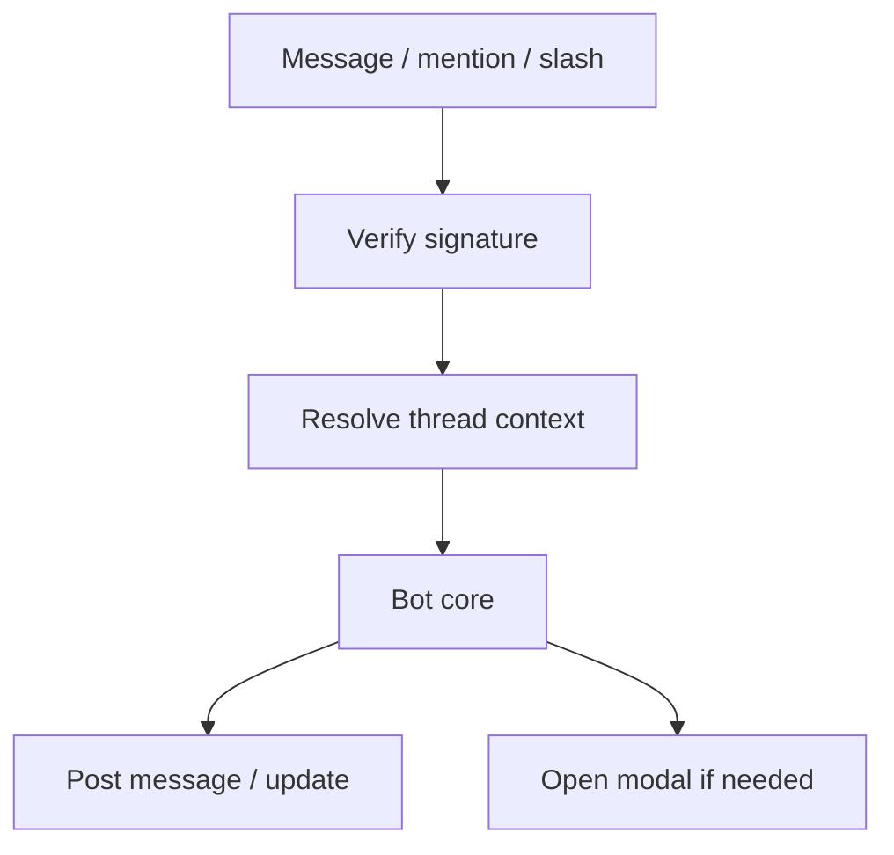

# Slack and Teams

> Workplace chatbots live in threads, permissions, and corporate identity — not in unbounded consumer DM UX.

## Table of Contents

- [Definition](#definition)
- [Why It Matters](#why-it-matters)
- [Common Uses](#common-uses)
- [How It Works](#how-it-works)
- [Platform Constraints](#platform-constraints)
- [Python Examples](#python-examples)
- [Production Considerations](#production-considerations)
- [Cost Considerations](#cost-considerations)
- [Security Considerations](#security-considerations)
- [Best Practices](#best-practices)
- [Common Mistakes](#common-mistakes)
- [Navigation](#navigation)

---

## Definition

**Slack and Teams bots** integrate conversational assistants into workplace messaging platforms via Events APIs, slash commands, message extensions, and interactive components (buttons, modals).

---

## Why It Matters

Employees already work in these tools. Distribution is easy; security review is hard. Threading models differ; rate limits and Block Kit / Adaptive Cards constrain formatting. Identity is usually SSO-backed — use it.

---

## Common Uses

| Use | Fit |
|-----|-----|
| Internal helpdesk | High — ticketing integrations |
| Code / docs Q&A | High — grounded RAG |
| Approvals workflows | Buttons + modals beat free text |
| HR policy | Needs careful privacy |

---

## How It Works



Prefer **thread replies** to avoid channel spam. Map `thread_ts` / Teams conversation ID to your `session_id`.

---

## Platform Constraints

| Concern | Slack | Teams |
|---------|-------|-------|
| Formatting | mrkdwn, Block Kit | Adaptive Cards |
| Mentions | Required in channels often | Depends on installation |
| Files | Upload APIs | Attachment APIs |
| Auth | Workspace + user tokens | Bot + delegated Graph |

---

## Python Examples

### Thread session key

```python
def slack_session_key(team_id: str, channel: str, thread_ts: str) -> str:
    return f"slack:{team_id}:{channel}:{thread_ts}"
```

### Ephemeral vs in-channel

```python
def visibility(is_sensitive: bool) -> str:
    return "ephemeral" if is_sensitive else "in_thread"
```

---

## Production Considerations

- Verify request signatures on every event
- Handle retries / duplicate deliveries idempotently
- Respect workspace rate limits; queue outbound posts
- Store least-privilege tokens; rotate
- Provide an allowlist of channels if needed

---

## Cost Considerations

Noisy `@bot` in large channels creates cost spikes — require slash commands or restricted channels for expensive skills. Cache frequent internal FAQ answers.

---

## Security Considerations

- Enterprise Grid / multi-workspace isolation
- Do not exfiltrate channel history beyond need
- DLP: prevent pasting secrets into bot DMs (detect + warn)
- Admin install scopes: request minimal OAuth scopes
- Tenant data boundaries for Teams + Graph

---

## Best Practices

1. Default to threaded replies
2. Use buttons for structured choices
3. Bind actions to SSO identity
4. Separate eng-assist bots from HR bots
5. Document install scopes for security review

---

## Common Mistakes

- Replying in channel for every message
- Over-scoped OAuth (“read all messages”)
- Ignoring interactive payload timeouts
- Treating Slack markdown like CommonMark
- No admin off-switch during incidents

---

## Interaction Patterns

| Pattern | When to use |
|---------|-------------|
| Slash command | Explicit invoke; good for expensive skills |
| @mention in channel | Team-visible Q&A; always thread |
| App DM | Private troubleshooting |
| Modal / dialog | Multi-field intake (better than 8 chat turns) |
| Button actions | Approvals, FAQ choices, handoff |

### Incident mode

Provide an admin kill switch that:

1. Disables generative replies
2. Posts a static status message
3. Routes to human on-call

Document this in your runbook before the first outage.

---

## Navigation

| | |
|--|--|
| **Previous** | [Web Chat](01-web-chat.md) |
| **Next** | [WhatsApp and Messaging](03-whatsapp-and-messaging.md) |
| **Section** | [Channels](README.md) |
| **Handbook** | [Chatbots](../README.md) |
