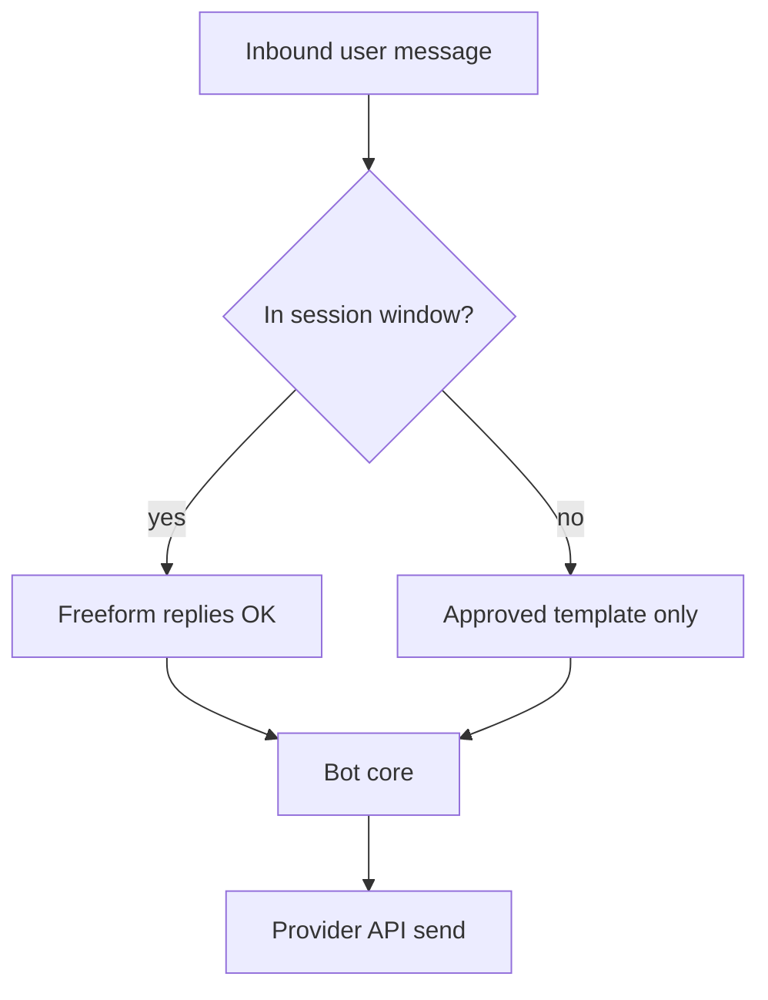

# WhatsApp and Messaging

> Messaging channels are high-intent and highly regulated — template rules and character limits shape architecture more than model choice.

## Table of Contents

- [Definition](#definition)
- [Why It Matters](#why-it-matters)
- [Common Uses](#common-uses)
- [How It Works](#how-it-works)
- [Channel Constraints](#channel-constraints)
- [Python Examples](#python-examples)
- [Production Considerations](#production-considerations)
- [Cost Considerations](#cost-considerations)
- [Security Considerations](#security-considerations)
- [Best Practices](#best-practices)
- [Common Mistakes](#common-mistakes)
- [Navigation](#navigation)

---

## Definition

**Messaging chatbots** operate over WhatsApp Business, SMS/RCS, iMessage Business, and similar transports. They emphasize short turns, template/outbound rules, media messages, and strong opt-in/opt-out compliance.

---

## Why It Matters

Users expect fast, personal replies on messaging apps. Platforms enforce session windows (e.g., 24-hour customer care windows), message templates for outbound, and throughput limits. Ignoring these turns a “working LLM demo” into a blocked WABA.

---

## Common Uses

| Use | Notes |
|-----|-------|
| Order status | Template + session Q&A |
| Appointment reminders | Opt-in critical |
| Support triage | Handoff to human agents in-app |
| OTP delivery | Prefer dedicated SMS providers; avoid LLM |

---

## How It Works



Normalize provider webhooks into your turn envelope; map phone numbers to users carefully (account linking).

---

## Channel Constraints

| Constraint | Implication |
|------------|-------------|
| Length | Split long answers; lead with the answer |
| Formatting | Limited markdown; prefer plain text + links |
| Media | Compress images; caption carefully |
| Quick replies | Use lists/buttons when available |
| Opt-out | Honor STOP / language-local keywords |

---

## Python Examples

### Chunk long replies

```python
def chunk_message(text: str, limit: int = 1500) -> list[str]:
    if len(text) <= limit:
        return [text]
    parts, buf = [], []
    for word in text.split():
        trial = (" ".join(buf + [word])).strip()
        if len(trial) > limit and buf:
            parts.append(" ".join(buf))
            buf = [word]
        else:
            buf.append(word)
    if buf:
        parts.append(" ".join(buf))
    return parts
```

### Session window check

```python
from datetime import datetime, timezone

def in_window(last_user_ts: datetime, hours: int = 24) -> bool:
    age = datetime.now(timezone.utc) - last_user_ts.astimezone(timezone.utc)
    return age.total_seconds() <= hours * 3600
```

---

## Production Considerations

- Template approval workflows with marketing/legal
- Idempotent webhook processing
- Localization of opt-out phrases
- Agent handoff inside the same thread
- Link shorteners vs trust (prefer first-party domains)

---

## Cost Considerations

Per-message pricing dominates vs LLM cost on some providers. Avoid multi-bubble spam. Cache FAQs. Use templates efficiently for campaigns without opening expensive freeform sessions unnecessarily.

---

## Security Considerations

- Verify webhook signatures
- Account takeover via SIM swap — step-up for sensitive actions
- Do not send secrets in plain SMS if avoidable
- Minimize PII in notification templates
- Rate-limit outbound to prevent abuse of your WABA

---

## Best Practices

1. Lead with the answer in the first bubble
2. Use buttons/lists for choices
3. Design for intermittent connectivity
4. Keep a clear human escape hatch
5. Separate transactional vs marketing traffic

---

## Common Mistakes

- Pasting web-chat markdown into WhatsApp
- Breaking template/session rules
- Multi-paragraph essays as one message
- Ignoring STOP handling
- Using the LLM to generate OTPs

---

## Opt-In and Compliance Basics

- Capture **how/when** the user opted in
- Honor STOP / UNSUBSCRIBE quickly (automated)
- Separate transactional messages from marketing templates
- Keep audit logs for template sends
- Localize mandatory phrases where required

### Media and rich content

Prefer one image + short caption over galleries. Transcribe voice notes via STT before RAG if your product accepts them — and apply the same PII controls as text.

---

## Navigation

| | |
|--|--|
| **Previous** | [Slack and Teams](02-slack-and-teams.md) |
| **Next** | [Voice Handoff](04-voice-handoff.md) |
| **Section** | [Channels](README.md) |
| **Handbook** | [Chatbots](../README.md) |
