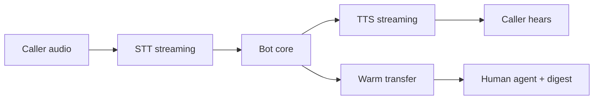

# Voice Handoff

> Voice is turn management under a stopwatch — latency, barge-in, and handoff quality dominate model cleverness.

## Table of Contents

- [Definition](#definition)
- [Why It Matters](#why-it-matters)
- [Common Uses](#common-uses)
- [How It Works](#how-it-works)
- [Latency Budget](#latency-budget)
- [Python Examples](#python-examples)
- [Production Considerations](#production-considerations)
- [Cost Considerations](#cost-considerations)
- [Security Considerations](#security-considerations)
- [Best Practices](#best-practices)
- [Common Mistakes](#common-mistakes)
- [Navigation](#navigation)

---

## Definition

**Voice handoff** covers (1) voice-native bots using speech-to-text (STT) and text-to-speech (TTS), and (2) transferring a chat or call to a human voice agent with preserved context. Both require tight latency and careful confirmation patterns.

---

## Why It Matters

Users tolerate higher latency in text than on a phone call. Overlapping speech (barge-in), accents, and background noise create NLU errors. Failed handoffs force callers to restart — the fastest path to a 1-star experience.

---

## Common Uses

| Scenario | Pattern |
|----------|---------|
| IVR replacement | Directed dialogue + tools |
| After-hours chat → next-day call | Async callback scheduling |
| Chat escalate to phone | Warm transfer + digest |
| Voice escalate to specialist | Cold/warm transfer with CRM screen-pop |

---

## How It Works



Warm transfer checklist: reason code, summary, slots, auth status, customer language, sentiment.

---

## Latency Budget

Target conversational feel:

| Stage | Budget (rough) |
|-------|----------------|
| Endpointing | low hundreds of ms |
| STT partials | streaming |
| Model TTFT | prefer small/fast models |
| TTS first audio | streaming |

Use fillers sparingly (“One moment…”) while tools run — too many feel robotic.

---

## Python Examples

### Handoff digest

```python
def voice_handoff_digest(summary: str, slots: dict, reason: str) -> str:
    slot_line = ", ".join(f"{k}={v}" for k, v in slots.items())
    return f"Reason: {reason}\nSummary: {summary}\nSlots: {slot_line}"
```

### Barge-in flag

```python
def on_barge_in(state: dict) -> dict:
    state = dict(state)
    state["tts_cancel"] = True
    state["listen"] = True
    return state
```

---

## Production Considerations

- Test with real telephony noise and accents
- Confirm critical slots verbally (read-back)
- Dual-channel recording compliance / consent
- Fallback to DTMF menus when STT fails
- Align chat and voice personas lightly — channel norms differ

---

## Cost Considerations

STT+TTS can exceed LLM cost. Use barge-in cancellation to avoid paying for unused audio. Prefer shorter prompts. Cache TTS for repeated IVR prompts.

---

## Security Considerations

- Voice biometrics and KYC are high-risk — do not DIY casually
- Mask card data; use secure PCI workflows, not freeform speech capture
- Encrypt call recordings; strict retention
- Authenticate before account changes even if chat already did (channel step-up)

---

## Best Practices

1. Stream STT and TTS end-to-end
2. Design explicit barge-in behavior
3. Keep replies short; offer details on request
4. Pass rich digests on human transfer
5. Measure time-to-first-audio and containment separately for voice

---

## Common Mistakes

- Reading long web articles aloud
- No cancel on barge-in
- Losing context on PSTN transfer
- Using the same verbose prompt as web chat
- Ignoring consent for recording

---

## Chat ↔ Voice Continuity

When a web/WhatsApp user upgrades to a call:

1. Create a callback or dial-in token bound to `session_id`
2. Generate a fresh digest at transfer time (not a stale summary)
3. Authenticate on the call even if chat was logged-in (policy-dependent)
4. Write call outcome back to the same CRM timeline

### Evaluation for voice

Track containment, time-to-first-audio, barge-in success, ASR word error on critical slots (order IDs), and warm-transfer completion rate — separately from text chat KPIs.

---

## Navigation

| | |
|--|--|
| **Previous** | [WhatsApp and Messaging](03-whatsapp-and-messaging.md) |
| **Next** | [Chatbot Evaluation](../ops/01-chatbot-evaluation.md) |
| **Section** | [Channels](README.md) |
| **Handbook** | [Chatbots](../README.md) |
