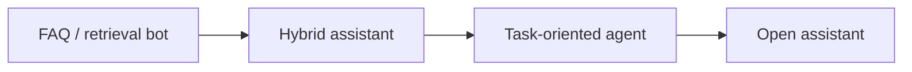

# Chatbot Fundamentals

> Types of chatbots and the components every serious chat product needs.

## Definition

Chatbots range from FAQ trees to open-domain assistants to task-oriented agents. Core components: NLU/routing, dialogue state, response generation, integrations, and analytics.

## Why it matters

Chat is a UX, not an architecture. Many products should be forms-with-AI, not endless chat.

## How it works

## Key principles

1. **Scope the job** — Support deflection ≠ general AGI chat.
2. **Design escape hatches** — Handoff to humans.
3. **Measure outcomes** — Resolution, not just CSAT of fluff.

## Common applications

| Application | Description |
|-------------|-------------|
| Customer support | Grounded answers |
| Internal helpdesk | Permissioned tools |
| Onboarding | Guided workflows |

## Common mistakes

- No handoff path when the bot fails
- Unbounded chit-chat that burns tokens

## Further reading

- [Dialogue & memory](dialogue-and-memory.md)
- [LLM Application Development](../llm-application-development/README.md)
