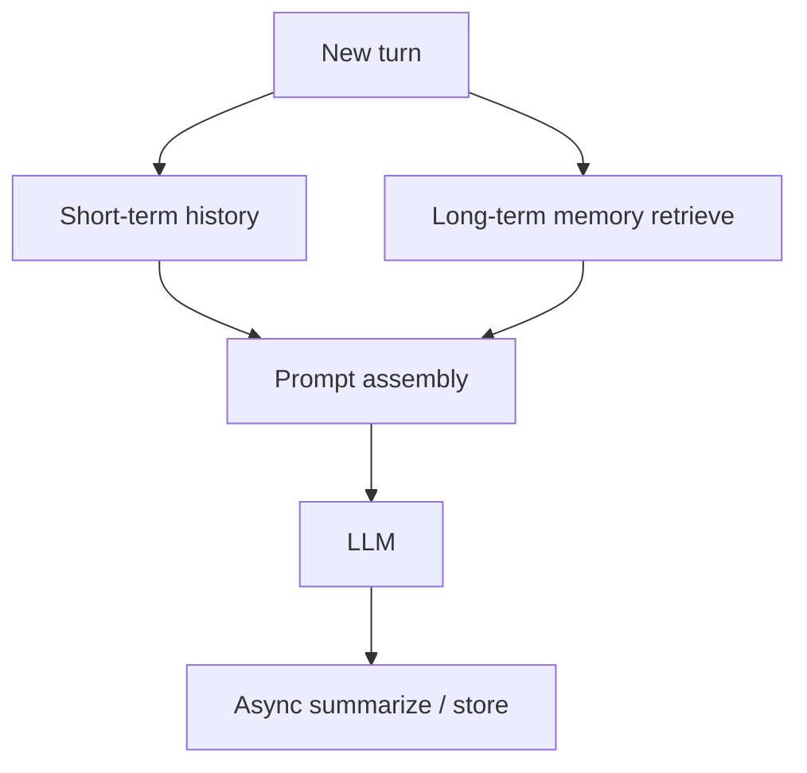

# Dialogue and Memory

> How to keep conversations coherent without overflowing the context window.

## Definition

Dialogue management tracks goals, slots, and turn history. Memory may be short-term (session), long-term (user profile/vector memory), or working memory (scratchpads). Effective systems summarize and retrieve rather than paste full history forever.

## Why it matters

Context window limits and cost make naive full-history replay fail at scale.

## How it works

## Key principles

1. **Summarize aggressively** — Keep decisions, not transcripts forever.
2. **Retrieve relevant memory** — Don't inject all user facts every turn.
3. **Separate preferences vs secrets** — Hard privacy boundaries.

## Common applications

| Application | Description |
|-------------|-------------|
| Personal assistants | Preferences + history |
| Support | Ticket context + CRM |
| Multi-session tutors | Learning progress |

## Common mistakes

- Storing raw sensitive chats indefinitely without policy
- Relying on the model alone as memory

## Further reading

- [Context Engineering](../context-engineering/README.md)
- [Grounded support bots](grounded-support-bots.md)
