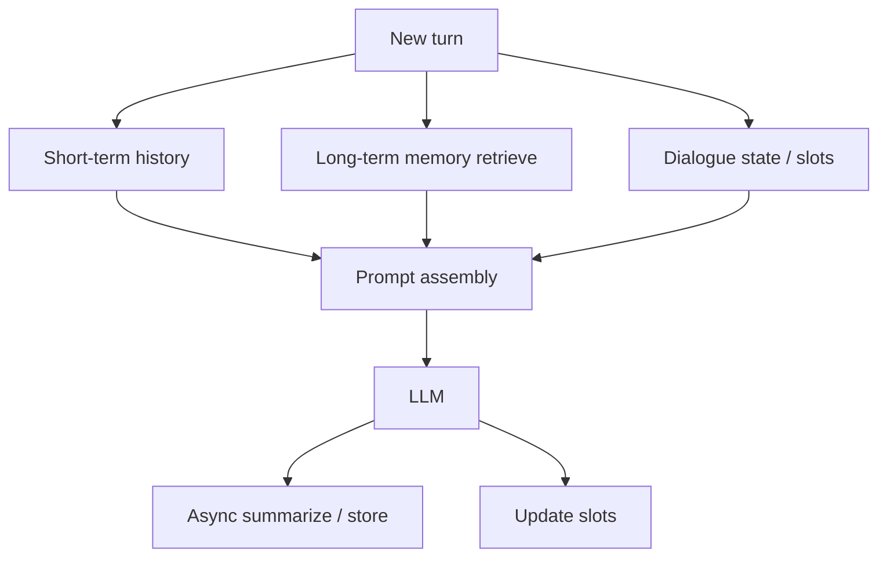

# Dialogue and Memory

> How to keep conversations coherent without overflowing the context window — summarize and retrieve rather than paste full history forever.

## Table of Contents

- [Definition](#definition)
- [Why It Matters](#why-it-matters)
- [Common Uses](#common-uses)
- [How It Works](#how-it-works)
- [Memory Layers](#memory-layers)
- [Dialogue State](#dialogue-state)
- [Python Examples](#python-examples)
- [Production Considerations](#production-considerations)
- [Cost Considerations](#cost-considerations)
- [Security Considerations](#security-considerations)
- [Best Practices](#best-practices)
- [Common Mistakes](#common-mistakes)
- [Navigation](#navigation)

---

## Definition

**Dialogue management** tracks goals, slots, and turn history so each reply advances the conversation. **Memory** is how prior information is stored and re-injected: short-term (session), long-term (user profile / vector memory), and working memory (scratchpads for the current task).

Effective systems **summarize and retrieve** rather than replaying unbounded transcripts.

| Term | Definition |
|------|------------|
| Short-term memory | Recent turns in the prompt |
| Working memory | Scratch notes / tool results for this task |
| Long-term memory | Cross-session facts, preferences, tickets |
| Dialogue state | Structured slots and flags |
| Summary | Compressed narrative of older turns |

---

## Why It Matters

Context window limits and cost make naive full-history replay fail at scale. Worse: stuffing everything increases distraction and leakage risk. Memory design is both a **UX** and a **systems** problem.

---

## Common Uses

| Application | Memory pattern |
|-------------|----------------|
| Personal assistants | Preferences + episodic retrieval |
| Support | Ticket context + CRM facts |
| Multi-session tutors | Progress summaries + weak topics |
| Commerce | Cart slots + order history retrieval |

---

## How It Works



Prompt assembly order (typical):

1. System policy + persona
2. Retrieved long-term memories (top-k, ACL-filtered)
3. Running summary of older turns
4. Recent raw turns (last N)
5. Current user message
6. Tool results / citations block

---

## Memory Layers

| Layer | Freshness | Size | Failure mode if abused |
|-------|-----------|------|------------------------|
| Raw recent turns | Highest | Small N | Token blowup |
| Rolling summary | Medium | 1–3 paragraphs | Lost details |
| Structured slots | High | Tiny | Stale slots |
| Vector long-term | Variable | Top-k | Wrong memories injected |
| External systems | Source of truth | On demand | Over-trusting chat memory |

Prefer **external systems of record** (CRM, tickets) over chat-derived “facts” when correctness matters.

---

## Dialogue State

Keep state as data, not vibes:

```text
goal: refund_status
slots:
  order_id: "A-1024"
  email_verified: true
flags:
  awaiting_confirmation: false
  escalate: false
```

Update slots with deterministic extractors or constrained structured outputs — then let the LLM narrate.

---

## Python Examples

### Prompt assembly

```python
def assemble_messages(
    system: str,
    summary: str,
    recent: list[dict],
    memories: list[str],
    user: str,
) -> list[dict]:
    blocks = [system]
    if memories:
        blocks.append("Known user facts:\n- " + "\n- ".join(memories))
    if summary:
        blocks.append(f"Conversation summary so far:\n{summary}")
    msgs = [{"role": "system", "content": "\n\n".join(blocks)}]
    msgs.extend(recent)
    msgs.append({"role": "user", "content": user})
    return msgs
```

### Slot merge

```python
def merge_slots(state: dict, extracted: dict) -> dict:
    out = dict(state)
    for k, v in extracted.items():
        if v is None or v == "":
            continue
        out[k] = v
    return out
```

---

## Production Considerations

- Cap recent turns (e.g., 8–20) and always keep a summary
- Version memory schemas
- Recompute summaries asynchronously to avoid TTFT spikes
- Separate “preferences” from “secrets” in storage classes
- Observe token share: system vs summary vs retrieval vs history

---

## Cost Considerations

Full history is the silent budget killer. Summarization costs a call but saves many future turns. Cache stable system prompts. Retrieve fewer, better memories (rerank).

---

## Security Considerations

- Do not store raw payment data or passwords in memory stores
- Encrypt long-term memory at rest; tenant-isolate vectors
- Redact before writing summaries used in prompts or evals
- Prevent prompt injection from “memories” by treating them as untrusted data

---

## Best Practices

1. Summarize aggressively — keep decisions, not transcripts forever
2. Retrieve relevant memory — do not inject all user facts every turn
3. Separate preferences vs secrets — hard privacy boundaries
4. Prefer structured slots for task bots
5. Make memory editable/forgettable for users (privacy UX)

---

## Common Mistakes

- Storing raw sensitive chats indefinitely without policy
- Relying on the model alone as memory
- Summaries that drop commitments (“I promised a refund”)
- Injecting stale CRM fields without freshness checks
- One undifferentiated memory blob per user

---

## Navigation

| | |
|--|--|
| **Previous** | [Success Metrics](../fundamentals/03-success-metrics.md) |
| **Next** | [Turn Management](02-turn-management.md) |
| **Section** | [Dialogue & Memory](README.md) |
| **Handbook** | [Chatbots](../README.md) |
