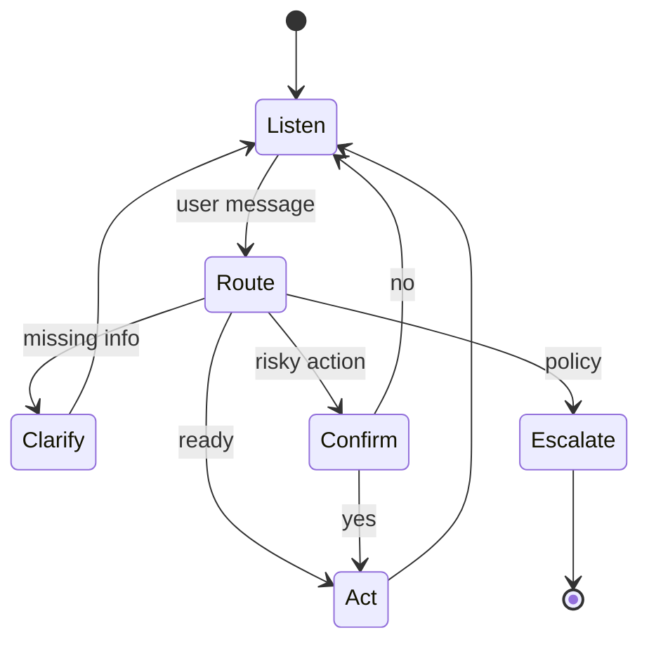

# Turn Management

> Each turn should advance state, clarify uncertainty, or exit cleanly — not ramble.

## Table of Contents

- [Definition](#definition)
- [Why It Matters](#why-it-matters)
- [Common Uses](#common-uses)
- [How It Works](#how-it-works)
- [Turn Policies](#turn-policies)
- [Repair Strategies](#repair-strategies)
- [Python Examples](#python-examples)
- [Production Considerations](#production-considerations)
- [Cost Considerations](#cost-considerations)
- [Security Considerations](#security-considerations)
- [Best Practices](#best-practices)
- [Common Mistakes](#common-mistakes)
- [Navigation](#navigation)

---

## Definition

**Turn management** is the policy that decides what the bot does on each user message: answer, ask a clarifying question, confirm an action, wait, or escalate. It covers turn-taking norms (especially voice), timeouts, and conversational repair.

---

## Why It Matters

Poor turn policy creates loops (“Sorry, I didn’t get that” × 10), double questions, or silent tool delays. Users abandon; costs spike; support load increases.

---

## Common Uses

| Scenario | Turn policy |
|----------|-------------|
| Missing slot | Ask one clarifying question |
| Destructive action | Explicit confirmation turn |
| Low retrieval confidence | Clarify or escalate — do not invent |
| Voice barge-in | Cancel TTS, re-listen |
| Idle session | Soft timeout + summary |

---

## How It Works



### Turn budget

Cap clarification attempts (e.g., 2) then escalate or offer options. Cap total turns per session for cost control.

---

## Turn Policies

| Policy | Behavior |
|--------|----------|
| **One question at a time** | Avoid stacked interrogatives |
| **Acknowledge then act** | “Got it — checking order A-1024…” |
| **Confirm high risk** | Refunds, deletes, sends |
| **Offer choices** | Buttons / quick replies when ambiguous |
| **Progressive disclosure** | Short answer + “Want details?” |

---

## Repair Strategies

1. **Rephrase** — user restates; bot mirrors understanding
2. **Constrain** — offer 2–3 options
3. **Fallback** — search help center link
4. **Escalate** — human with transcript summary
5. **Reset skill** — clear local slots, keep session

---

## Python Examples

### Dialogue policy skeleton

```python
def next_action(slots: dict, confidence: float, user_wants_human: bool) -> str:
    if user_wants_human:
        return "escalate"
    if confidence < 0.35:
        return "clarify"
    if slots.get("action") == "refund" and not slots.get("confirmed"):
        return "confirm"
    missing = [k for k in ("order_id",) if not slots.get(k)]
    if missing:
        return "clarify"
    return "answer"
```

### Clarification counter

```python
def should_escalate_clarifications(state: dict, max_tries: int = 2) -> bool:
    return int(state.get("clarify_count", 0)) >= max_tries
```

---

## Production Considerations

- Log policy decisions (`clarify`, `confirm`, `escalate`) for eval
- Channel-specific UX: buttons on web/WhatsApp; terse on SMS
- Voice: endpointing, barge-in, and filler audio matter
- Idempotency for tool calls if users double-send

---

## Cost Considerations

Clarification turns cost money but prevent expensive wrong tool calls. Measure **turns-to-resolution**. Aggressive confirmations on low-risk actions waste tokens — tier by risk.

---

## Security Considerations

- Confirmation text must restate the action clearly (anti-clickjacking via chat)
- Do not confirm based solely on model paraphrase of user intent for money movement — bind to structured intent
- Timeouts should end sessions securely (clear auth tokens)

---

## Best Practices

1. Ask one thing per turn
2. Restate critical slots before acting
3. Cap repair loops; escalate early
4. Show progress during slow tools
5. Preserve user effort across handoff

---

## Common Mistakes

- Endless “I don’t understand” loops
- Multiple questions in one bubble
- Acting without confirmation on irreversible steps
- Ignoring double-submit / flaky networks
- Resetting the whole session on one bad turn

---

## Navigation

| | |
|--|--|
| **Previous** | [Dialogue and Memory](01-dialogue-and-memory.md) |
| **Next** | [Conversation Summarization](03-conversation-summarization.md) |
| **Section** | [Dialogue & Memory](README.md) |
| **Handbook** | [Chatbots](../README.md) |
