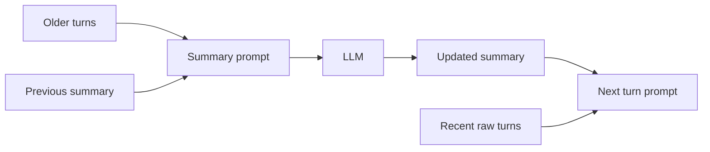

# Conversation Summarization

> Summaries are the working memory of long chats — lose a commitment in a summary and the bot will contradict itself.

## Table of Contents

- [Definition](#definition)
- [Why It Matters](#why-it-matters)
- [Common Uses](#common-uses)
- [How It Works](#how-it-works)
- [Summary Schemas](#summary-schemas)
- [Python Examples](#python-examples)
- [Production Considerations](#production-considerations)
- [Cost Considerations](#cost-considerations)
- [Security Considerations](#security-considerations)
- [Best Practices](#best-practices)
- [Common Mistakes](#common-mistakes)
- [Navigation](#navigation)

---

## Definition

**Conversation summarization** compresses older turns into a shorter representation that remains useful for future replies. Patterns include rolling summaries, hierarchical (map-reduce) summaries, and structured digests (goals, slots, open questions).

---

## Why It Matters

Without summarization, long sessions exceed context limits or become too expensive. Naive truncation drops the very facts users expect the bot to remember.

---

## Common Uses

| Use | Approach |
|-----|----------|
| Support sessions | Rolling summary every N turns |
| Agent handoff | Structured digest for humans |
| Multi-hour tutors | Hierarchical chapter summaries |
| Eval datasets | Redacted digests instead of raw PII |

---

## How It Works



Trigger strategies:

- Every *N* turns (e.g., 6)
- When token estimate exceeds budget
- On session idle / handoff
- After major state changes (order found, refund confirmed)

---

## Summary Schemas

Prefer structured summaries:

```yaml
goal: Check refund status
resolved:
  - Verified order A-1024
open:
  - Waiting on bank timing explanation
commitments:
  - Promised email update within 24h
slots:
  order_id: A-1024
sentiment: frustrated
```

Unstructured prose is fine as a supplement; structure prevents silent loss of commitments.

---

## Python Examples

### Rolling update

```python
SUMMARY_INSTRUCTION = """Update the running summary.
Preserve: user goal, commitments, slots, unresolved questions.
Omit: chit-chat, repeated greetings, raw secrets.
Previous summary:
{prev}
New turns:
{turns}
Return concise bullet summary."""

def should_summarize(turn_count: int, every: int = 6) -> bool:
    return turn_count > 0 and turn_count % every == 0
```

### Token-aware trigger

```python
def needs_summary(estimate_tokens: int, budget: int = 3000) -> bool:
    return estimate_tokens > budget
```

---

## Production Considerations

- Run summarization **async** when possible; serve the turn with the last good summary
- Version summary prompts; eval on “commitment preservation”
- Keep last raw turns even when summarizing
- On handoff, generate a human-readable digest + machine slots

---

## Cost Considerations

Summarize with a cheap/fast model when quality allows. Hierarchical summaries help very long threads. Avoid summarizing every single turn — batch.

---

## Security Considerations

- Strip PII before writing summaries to long-lived stores when feasible
- Treat summary text as potentially poisoned (injection in user turns)
- Access-control summaries the same as transcripts

---

## Best Practices

1. Schema-first summaries for task bots
2. Explicitly require “commitments” and “open questions”
3. Eval with adversarial dialogues that hide important facts early
4. Show users a short “what I remember” on request
5. Rebuild summaries if schema versions change

---

## Common Mistakes

- Truncating history with no summary
- Summaries that invent resolutions
- Dropping numbers (order IDs, amounts)
- Blocking the user-visible turn on a slow summary call
- One giant summary that never gets re-compressed

---

## Navigation

| | |
|--|--|
| **Previous** | [Turn Management](02-turn-management.md) |
| **Next** | [Long-Term Memory](04-long-term-memory.md) |
| **Section** | [Dialogue & Memory](README.md) |
| **Handbook** | [Chatbots](../README.md) |
