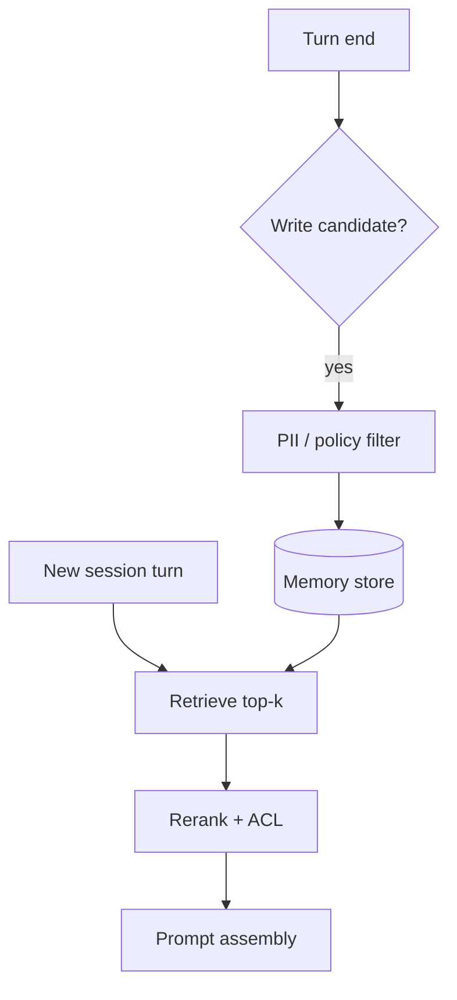

# Long-Term Memory

> Remember what helps; forget what endangers — long-term memory is a product feature with a privacy contract.

## Table of Contents

- [Definition](#definition)
- [Why It Matters](#why-it-matters)
- [Common Uses](#common-uses)
- [How It Works](#how-it-works)
- [Write Policies](#write-policies)
- [Python Examples](#python-examples)
- [Production Considerations](#production-considerations)
- [Cost Considerations](#cost-considerations)
- [Security Considerations](#security-considerations)
- [Best Practices](#best-practices)
- [Common Mistakes](#common-mistakes)
- [Navigation](#navigation)

---

## Definition

**Long-term memory (LTM)** persists information across sessions: durable profile attributes, preferences, and episodic memories retrieved by similarity or keys. It complements short-term dialogue history and systems of record (CRM).

| Store | Example |
|-------|---------|
| Profile KV | `preferred_language=en`, `plan=pro` |
| Episodic vectors | “User struggled with SSO last month” |
| Pointers | `last_ticket_id=T-99` (fetch live) |

---

## Why It Matters

Cross-session continuity feels magical when correct and creepy when wrong. Bad LTM injects stale or sensitive facts into prompts, causing privacy incidents and trust loss.

---

## Common Uses

| Product | LTM content |
|---------|-------------|
| Consumer assistant | Preferences, routines |
| Support | Prior issues (via ticket IDs) |
| Education | Mastery estimates |
| Health/finance | Prefer **not** to store — use EHR/bank APIs |

---

## How It Works



Retrieval must be **permission-aware**. Multi-tenant bots without ACL filters are data leaks waiting to happen.

---

## Write Policies

Only write memories that are:

1. **User-salient** — preferences, durable facts
2. **Non-secret** — or stored in vault-class systems
3. **Consented** — where regulation requires
4. **Attributed** — source turn ID + timestamp
5. **Revocable** — user can delete

Avoid writing: passwords, full PANs, auth codes, one-time OTPs, another person’s data.

---

## Python Examples

### Memory record

```python
from dataclasses import dataclass
from typing import Optional

@dataclass
class MemoryItem:
    user_id: str
    text: str
    kind: str  # preference | episode | pointer
    source_turn: str
    score: float = 0.0
    expires_at: Optional[str] = None
```

### Simple write gate

```python
BLOCKLIST = ("password", "ssn", "cvv", "otp")

def can_write(text: str) -> bool:
    lower = text.lower()
    return not any(b in lower for b in BLOCKLIST) and len(text) < 500
```

### Retrieve + format

```python
def format_memories(items: list[MemoryItem], k: int = 5) -> str:
    top = sorted(items, key=lambda m: m.score, reverse=True)[:k]
    return "\n".join(f"- ({m.kind}) {m.text}" for m in top)
```

---

## Production Considerations

- Prefer pointers to systems of record over duplicated facts
- TTL episodic memories; keep preferences longer
- Expose “memory viewer / delete” in product settings
- Eval memory helpfulness vs leakage on held-out users
- Namespace by `tenant_id` + `user_id`

---

## Cost Considerations

Embeddings + vector DB storage grow with write volume. Deduplicate near-identical memories. Cap top-k injected tokens. Periodic compaction jobs merge episodes.

---

## Security Considerations

- Encryption at rest and in transit
- Strict tenant isolation in indexes
- Treat retrieved memory as untrusted content in the prompt
- Audit access to memory admin tools
- Align retention with GDPR/CCPA deletion requests

---

## Best Practices

1. Separate preferences, episodes, and secrets
2. Write less than you think — high precision beats recall
3. Always attach provenance
4. Let users inspect and erase
5. Re-fetch live entities instead of caching sensitive status

---

## Common Mistakes

- Dumping entire transcripts into a vector DB
- No delete path for user data
- Cross-tenant retrieval bugs
- Remembering medical/financial details in chat LTM
- Injecting too many memories → distracted answers

---

## Navigation

| | |
|--|--|
| **Previous** | [Conversation Summarization](03-conversation-summarization.md) |
| **Next** | [Grounded Support Bots](../grounding/01-grounded-support-bots.md) |
| **Section** | [Dialogue & Memory](README.md) |
| **Handbook** | [Chatbots](../README.md) |
